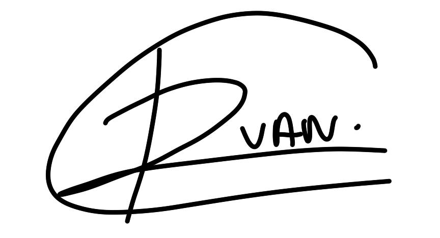
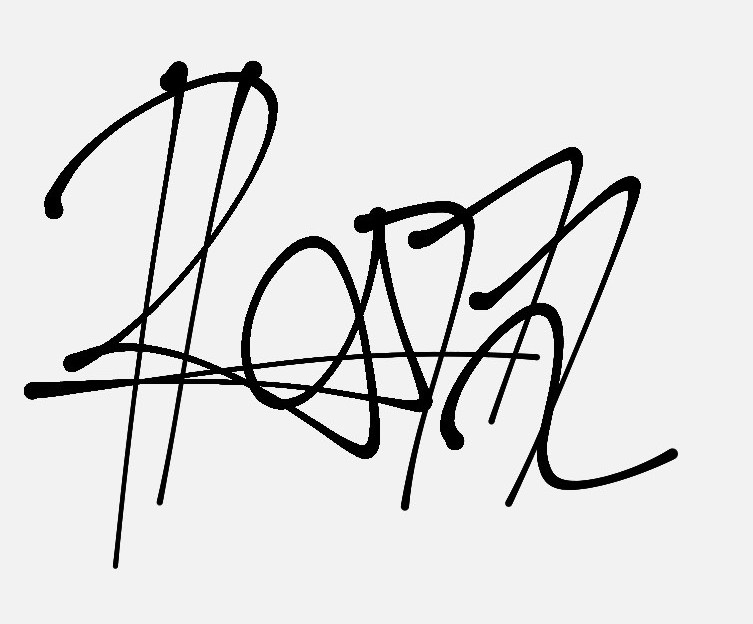
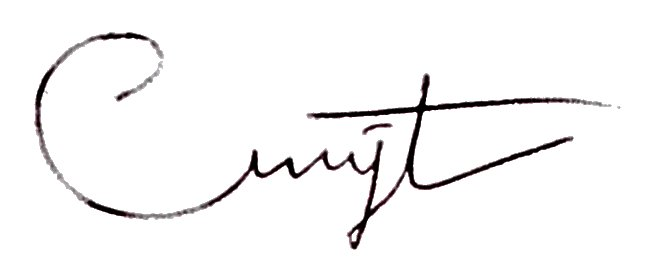

# Deklarasi Penggunaan AI

## Tugas Besar IF2150 - Rekayasa Perangkat Lunak

| Informasi | Keterangan |
|---|---|
| Kelas | K01 |
| Nomor Kelompok | 7 |
| Nama Kelompok | #PenjagaNilai |
| Nama Perangkat Lunak | PahamHukum |

**Anggota Kelompok:**

| NIM | Nama |
| --- | --- |
| 13525007 | Rivan Cahyadi |
| 13525019 | Raditya Wibian Sastaka |
| 13525064 | Matthew Evan Kurniawan |
| 13525100 | Wesley Lianto |
| 13525109 | Christopherus Michael Jafeth Tobing |

---

### Daftar Isi
* [Milestone 1](#milestone-1)
* [Milestone 2](#milestone-2)
* Notes: Copy bagian Daftar Isi seperti Milestone 1 untuk Milestone berikutnya, contoh ``* [Milestone 2](#milestone-2)``. Ketika Daftar isi diklik maka akan langsung diarahkan ke bagian bawah sesuai dengan Milestone tujuan.

---

### Log Penggunaan AI per Milestone

Silakan catat penggunaan AI yang berdampak signifikan pada pengerjaan tugas (misal: *generate* fungsi algoritma yang kompleks, *generate* draf dokumen SKPL/DPPL, atau *debugging* error utama). 
*Penggunaan sepele seperti memperbaiki *typo* atau auto-complete satu baris kode tidak perlu dicatat.*

### Milestone 1
| Tool AI | Tujuan Penggunaan | Contoh Prompt Utama | Modifikasi & Validasi Manusia |
| :--- | :--- | :--- | :--- |
| Claude Opus 5 | Ideasi awal, eliminasi alternatif ide, dan pencarian celah dari tiap ide (Raditya, Matthew) | "Kami ingin membangun perangkat lunak yang menjawab persoalan sosial di Indonesia. Bantu jabarkan beberapa alternatif ide, lalu tunjukkan kelemahan dan celah dari masing-masing ide tersebut." | Alternatif yang diberikan AI tidak dipakai apa adanya. Tim menyaring sendiri hingga tersisa arah ide literasi hukum, lalu mengubah cakupannya agar realistis untuk satu semester. Celah yang disebut AI kami verifikasi ulang dengan penelusuran mandiri sebelum dijadikan dasar argumen. |
| Google Gemini 3.1 Pro | Analisis kondisi saat ini dan pemetaan solusi yang sudah ada (Matthew, Raditya) | "Apakah sudah ada platform di Indonesia yang menyediakan panduan hukum bagi masyarakat awam? Apa saja keterbatasannya dan bagian mana yang belum tercakup?" | Nama platform yang disebut AI kami cek langsung ke situs resminya. Beberapa klaim mengenai fitur ternyata tidak sesuai dengan kondisi aktual sehingga tidak dipakai. Deskripsi keterbatasan pada subbab 1.2 ditulis ulang oleh tim berdasarkan pengamatan langsung dan syarat penggunaan platform terkait. |
| Claude Opus 5 | Menyusun kerangka awal (*sketch*) dokumen proposal agar tim memiliki bayangan struktur (Raditya) | "Buatkan kerangka awal dokumen proposal dengan struktur bab dan poin bahasan yang umum dipakai, sebagai gambaran sebelum kami menulis isinya sendiri." | Kerangka hanya digunakan sebagai rangka kasar. Seluruh isi paragraf, data, dan rujukan ditulis ulang sepenuhnya oleh tim. Beberapa bagian bawaan kerangka yang tidak relevan dengan konteks tugas kami hapus. |
| Google Gemini 3.1 Pro | Mengecek kesesuaian solusi dengan permasalahan yang diangkat serta merumuskan batasan (Wesley, Christopherus, Rivan) | "Berikut permasalahan dan solusi yang kami rancang. Apakah solusinya benar-benar menjawab akar masalahnya? Batasan apa yang perlu ditetapkan agar lingkupnya tetap wajar dikerjakan tim mahasiswa dalam satu semester?" | Sebagian batasan yang diusulkan kami adopsi setelah disesuaikan redaksinya, misalnya sistem tidak menangani kasus darurat dan tidak melakukan pengajuan dokumen ke instansi. Usulan lain yang terlalu umum atau tidak berkaitan dengan lingkup tugas kami buang. Penomoran dan pengelompokan batasan disusun sendiri oleh tim. |
| Google Gemini 3.1 Pro | Membantu menurunkan deskripsi sistem menjadi daftar aktor dan *user story* pada BAB 3 (Wesley, Christopherus) | "Dari deskripsi sistem berikut, aktor apa saja yang terlibat dan *user story* apa yang masuk akal untuk masing-masing aktor?" | Daftar hasil AI masih memuat *user story* yang tumpang tindih dan beberapa di luar batasan yang sudah kami tetapkan. Tim memangkas, menggabungkan yang duplikat, dan menambahkan beberapa kebutuhan yang belum tercakup. Penomoran akhir US-01 hingga US-16 disusun manual. |
| Claude Opus 5 | Memberikan gambaran awal model proses bisnis dan *flowchart* pada subbab 3.4 (Raditya, Rivan) | "Berdasarkan daftar aktivitas dan *user story* berikut, bantu susun gambaran awal alur proses bisnis beserta pembagian *swimlane*-nya." | Draf alur dari AI kami koreksi cukup banyak. Pembagian *swimlane*, penempatan titik percabangan, serta aktivitas sisi sistem yang belum tercakup kami perbaiki secara manual. Diagram final digambar ulang oleh tim dan disesuaikan dengan tabel aktivitas A01 sampai A19. |

### Milestone 2
| Tool AI | Tujuan Penggunaan | Contoh Prompt Utama | Modifikasi & Validasi Manusia |
| :--- | :--- | :--- | :--- |
| Claude Opus 5 | Untuk membantu meperdalam pemahaman mengenai bagian pemetaan kebutuhan dan memberikan studi kasus(Raditya,Matthew,Wesley) | "Tolong dong jelaskan mengenai pemetaan kebutuhan, terutama pada bagian P/L nya, berarti nanti itu kalau P/L nya ya itu baru kita lanjut ke bagian KF dan NKF?"| Kami menanyakan lagi mengenai bagian yang kami belum paham dan konfirmasinya kepada asisten dosen terakit.|
| Claude Opus 5 | Untuk membantu memberikan studi kasus pada konsep KNF dan KF serta memvalidasi pemahaman team (Raditya, Matthew, Wesley) | "Tolong dong ini bener ga ya kalau misal dari activity ada P/L ya baru lanjut kan buat KNF dan KF, berarti KF itu lebih kek ngapain kegiatanya dan KNF itu lebih ke teknsinya gitu kan?" |Kami membaca lagi di website seperti medium dan juga resourse luar untuk mevalidasi jawaban dari Ai|

---
### Pernyataan Integritas dan Persetujuan

Kami yang bertanda tangan di bawah ini menyatakan bahwa seluruh log penggunaan AI di atas adalah benar. Kami telah memvalidasi seluruh hasil AI dan bertanggung jawab penuh atas orisinalitas, keamanan, dan kebenaran hasil akhir dari tugas ini.

| Tanda Tangan | Nama Anggota |
| :---: | :--- |
|  | 13525007 - Rivan Cahyadi |
|  | 13525019 - Raditya Wibian Sastaka |
|  | 13525064 - Matthew Evan Kurniawan |
|  | 13525100 - Wesley Lianto |
|  | 13525109 - Christopherus Michael Jafeth Tobing |