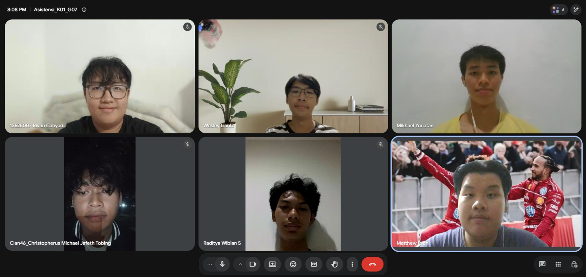

# Form Asistensi

## Tugas Besar IF2150 - Rekayasa Perangkat Lunak

| Informasi | Keterangan |
| --- | --- |
| **Hari** | Selasa |
| **Tanggal** | 1 September 2026 |
| **Kelas** | K01 |
| **Nomor Kelompok** | G07  |
| **Nama Kelompok** | #PenjagaNilai  |
| **Nama Perangkat Lunak** | PahamHukum  |
| **Dokumen** | K01_G07_Template1_TB.md  |

### Anggota Kelompok

| NIM | Nama |
| --- | --- |
| 13525007 | Rivan Cahyadi |
| 13525019 | Raditya Wibian Sastaka |
| 13525064 | Matthew Evan Kurniawan |
| 13525100 | Wesley Lianto |
| 13525109 | Christopherus Michael Jafeth Tobing |

### Catatan

| Catatan |
| --- |
| 1. Penjelasan mengenai SDG dipindahkan ke Bab 1 (awalnya ada di Bab 2) untuk dijelaskan hubungannya dengan perangkat lunak yang dibuat. Alasan yang berkaitan dengan SDG juga harus ditambahkan untuk memperkuat argumen dari latar belakang |
| 2. Urgensi masalah harus di-highlight dengan jelas pada Bab 1, contohnya dengan memberikan kesimpulan atau closing statement mengenai kenapa masalah tersebut harus diselesaikan |
| 3. Untuk revisi template, ada 3 bagian utama yang berhubungan yaitu 3.2. Kebutuhan Pengguna Awal yang berisi 1 user story per kebutuhan. Lalu, user story akan didekomposisikan menjadi urutan dari beberapa kegiatan/aktivitas yang termasuk dalam bagian 3.3 Deskripsi Aktivitas. Terakhir, memvisualisasikan flow penggunaan perangkat lunak pada bagian 3.4. Diagram Proses Bisnis (diperbolehkan memiliki lebih dari 1 diagram jika flow antar pengguna memang berbeda) |
| 4. Memvalidasi lagi fitur dan flow dari system untuk memudahkan progress dan pengambilan keputusan di milestone selanjutnya. Contohnya: memastikan jumlah administrator dan fungsinya dalam perangkat lunak ini. |

**Notes for this section:**  
*Catatan dapat dituliskan dalam bentuk paragraf atau poin-poin, disesuaikan saja.* 

## Dokumentasi

<!--  -->

  

  <i>Gambar 1. Dokumentasi kegiatan asistensi.</i>

