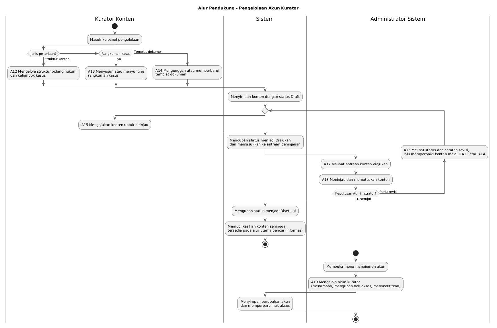
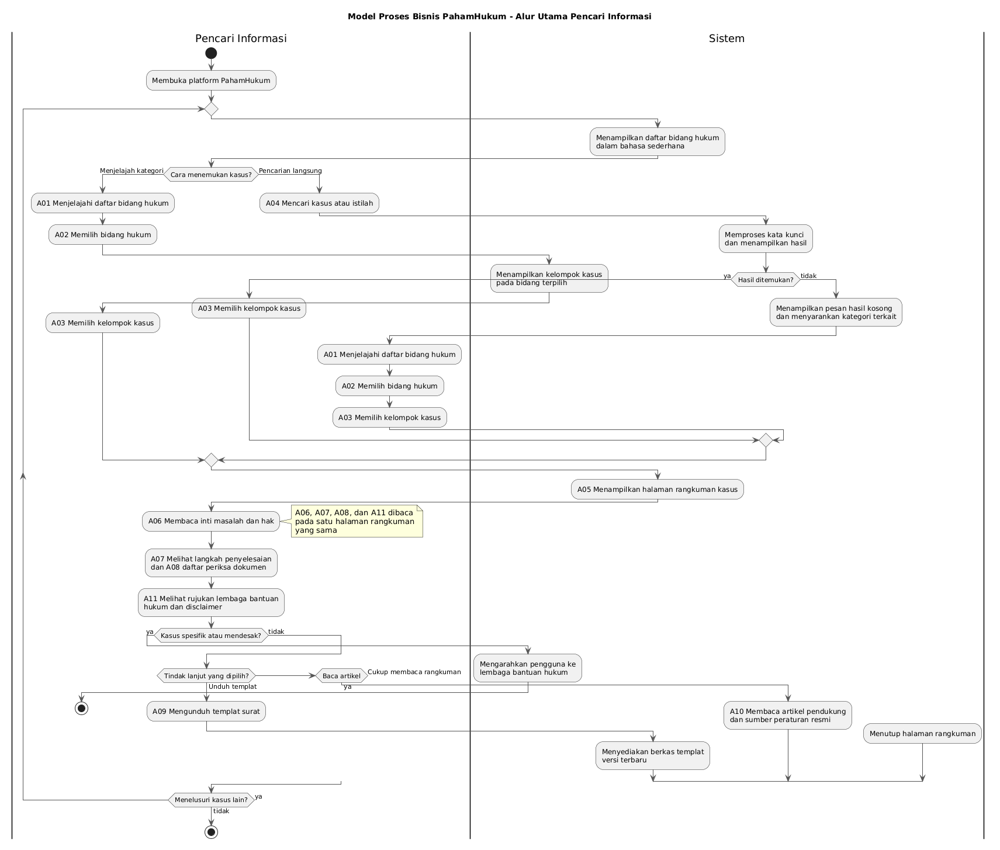

<h1>
IF2150 REKAYASA PERANGKAT LUNAK
 
TUGAS 1
 
TOPIC BRAINSTORMING
</h1>
 

## PahamHukum

### Untuk: Mikhael Andrian Yonatan

Dipersiapkan oleh:
| Informasi | Keterangan |
| --- | --- |
| Kelas | K01 |
| Kelompok | 7  |

| NIM | Nama |
|---|---|
| 13525007 | Rivan Cahyadi |
| 13525019 | Raditya Wibian Sastaka |
| 13525064 | Matthew Evan Kurniawan |
| 13525100 | Wesley Lianto |
| 13525109 | Christopherus Michael Jafeth Tobing |
---

 
 

# BAB 1: Analisis Permasalahan

## 1.1 Latar Belakang Masalah
Setiap hari, masyarakat Indonesia berhadapan dengan berbagai persoalan yang berkaitan erat dengan hukum tanpa menyadari dan menyikapinya secara langsung. Berbagai kasus tersebut meliputi PHK sepihak, penipuan daring, dan berbagai perselisihan lainnya. Banyak dari masyarakat ragu untuk bertindak dan membiarkan masalah tersebut begitu saja karena informasi yang tidak mudah dijangkau dan rendahnya literasi hukum di tengah masyarakat. Akar permasalahannya bukan sekadar pada bahasa hukum yang kaku dan penuh istilah teknis, melainkan juga pada manajemen informasi hukum itu sendiri. Hukum-hukum itu tersebar dalam berbagai perundang-undangan, artikel, dokumen resmi, hingga sumber eksternal yang tidak terbuka untuk diakses oleh masyarakat awam. Masyarakat justru kehilangan arah bahkan sebelum memahami kasusnya secara utuh, karena mereka dituntut untuk mengetahui kondisi/skenario spesifik mengenai kasus mereka. Sehingga, terdapat kesenjangan yang nyata antara ketersediaan informasi hukum dan kemampuan masyarakat untuk memanfaatkannya.

Realita tersebut dibuktikan dalam laporan penelitian yang dilakukan oleh HiiL (The Hague Institute for Innovation of Law). Dari 2.400 responden ditemukan bahwa 71 persen dari masyarakat yang mengalami masalah hukum memilih untuk diam dan tidak melakukan tindakan untuk menyelesaikannya. Kondisi tersebut didorong oleh beberapa faktor, yaitu sulitnya memperoleh informasi dan nasihat hukum, ketidaktahuan ke mana harus mencari bantuan, kebingungan mengenai langkah prosedural yang harus diambil, serta rendahnya kesadaran hukum secara umum. Bukti lain yang mendukung adalah publikasi oleh Badan Pembinaan Ideologi Pancasila (BPIP) yang menyoroti rendahnya literasi hukum yang berakibat pada ketimpangan akses keadilan. Kondisi ini diperburuk dengan minimnya jumlah profesional dalam bidang hukum, dengan perkiraan hanya satu pengacara untuk setiap 4.325 penduduk (1:4.325).

Ketimpangan inilah yang ingin diselesaikan oleh SDG (*Sustainable Development Goals*) yang ke-16 mengenai Perdamaian, Keadilan, dan Kelembagaan yang Tangguh. Secara lebih spesifik, Target 16.3 menjunjung tinggi akses keadilan yang sama bagi semua dan Target 16.10 menuntut akses publik terhadap informasi dan melindungi kebebasan mendasar. Terpenuhinya kedua target ini mustahil terjadi jika regulasi secara teknis tersedia, namun tidak terjangkau oleh masyarakat awam. Menata ulang dan menyederhanakan informasi hukum agar lebih mudah dipahami masyarakat awam merupakan langkah krusial untuk memenuhi komitmen SDG tersebut. Diperlukan sebuah solusi berbasis perangkat lunak yang mampu menjembatani kesenjangan informasi dengan menerjemahkan kompleksitas hukum menjadi panduan agar keadilan tidak lagi menjadi hak eksklusif, melainkan bisa dijangkau oleh semua kalangan.

## 1.2 Analisis Kondisi Saat Ini
Ketika menghadapi masalah hukum, masyarakat awam umumnya menempuh beberapa cara yang masing-masing memiliki keterbatasan. Sebagian bertanya kepada keluarga, tetangga, atau kenalan secara informal, sehingga jawaban yang diperoleh belum tentu akurat secara hukum. Sebagian mencari sendiri di internet secara acak, tapi tersesat antara sumber yang tidak terverifikasi atau artikel yang bahasanya terlalu "hukum".

Secara kelembagaan, negara telah menyediakan mekanisme bantuan resmi melalui Undang-Undang Nomor 16 Tahun 2011 tentang Bantuan Hukum. Aturan ini menjamin pendampingan hukum secara cuma-cuma melalui Organisasi Bantuan Hukum (OBH) atau Lembaga Bantuan Hukum (LBH) yang telah terakreditasi oleh Kementerian Hukum. Namun, layanan ini diprioritaskan bagi masyarakat miskin untuk perkara tertentu, penyebarannya belum merata, dan mereka tetap harus mengetahui cara mengaksesnya.

Secara digital, telah hadir platform seperti hukumonline.com yang menyediakan rubrik tanya jawab (Klinik Hukum), kamus istilah hukum, serta pusat data peraturan dan putusan. Platform ini bermanfaat dan terpercaya, namun targetnya adalah kalangan profesional seperti perusahaan, firma hukum, dan institusi. Bagi orang awam, kontennya masih menghadirkan beberapa hambatan, yaitu informasinya disajikan sebagai arsip artikel yang harus ditelusuri satu per satu, sebagian jawaban dan layanan bersifat berbayar, dan bahasanya masih relatif formal. Hal serupa juga ditemui pada layanan konsultasi berbayar seperti Justika. Keseluruhan solusi yang ada saat ini masih berfungsi layaknya referensi atau "ensiklopedia" hukum pasif, bukan sebagai penuntun yang membimbing pengguna langkah demi langkah. Kesenjangan inti yang belum terjawab saat ini adalah cara informasi tersebut ditata dan disajikan bagi orang awam. Model arsip artikel hanya nyaman bagi pengguna yang sudah mengetahui istilah pencarian yang tepat dan spesifik, tapi justru menyulitkan orang awam yang tidak tahu harus mencari apa. Selain itu, solusi yang ada berhenti pada penjelasan aturan tanpa membantu sisi administratifnya, seperti langkah konkret yang harus ditempuh, dokumen yang perlu disiapkan, lembaga yang harus didatangi, dan lainnya.

Berdasarkan analisis kondisi ini, terlihat ada kekosongan pada ketersediaan layanan hukum digital yang berfokus pada penyelesaian masalah nyata dari masyarakat awam. Rancangan perangkat lunak ini difokuskan untuk mengisi celah tersebut dengan memandu pengguna dari tahap identifikasi masalah hingga tindakan konkret seperti urusan administratif.

---

# BAB 2: Analisis Solusi

## 2.1 Deskripsi Perangkat Lunak

**PahamHukum** adalah platform literasi dan bantuan hukum yang ditujukan untuk masyarakat umum. Platform ini menyusun informasi hukum berdasarkan **kelompok kasus nyata**, bukan berdasarkan arsip artikel atau nomor peraturan. Dari sisi pengguna, sistem ini berperan sebagai penuntun. Seseorang yang sedang menghadapi masalah hukum, misalnya di-PHK secara sepihak atau menerima barang yang tidak sesuai, cukup memilih situasi yang paling dekat dengan kondisinya. Setelah itu, sistem menampilkan satu **halaman rangkuman kasus** yang berisi inti permasalahan, hak yang dimiliki pengguna, langkah-langkah yang perlu ditempuh, daftar dokumen yang harus disiapkan, serta templat surat yang bisa diunduh. Pengguna tidak perlu memahami istilah hukum untuk mulai menggunakan sistem. Sistemlah yang menerjemahkan situasi sehari-hari ke dalam kerangka hukum yang bisa ditindaklanjuti.

Selain pengguna awam, sistem ini juga melayani **kurator konten** yang bertugas menyusun taksonomi bidang hukum dan kelompok kasus, menulis rangkuman, serta mengelola artikel dan templat dokumen agar isi platform tetap akurat dan tertata.

**Target platform: aplikasi berbasis web.** Pemilihan ini didasarkan pada beberapa pertimbangan berikut:

1. **Aksesibilitas.** Pengguna sasaran adalah masyarakat umum dari berbagai latar belakang. Aplikasi web bisa diakses langsung melalui browser tanpa perlu instalasi, tanpa memerlukan ruang penyimpanan yang besar, dan tanpa bergantung pada satu sistem operasi tertentu. Hal ini selaras dengan semangat SDG 16.10 tentang akses publik terhadap informasi.
2. **Sifat konten yang dinamis.** Materi hukum berubah mengikuti perkembangan peraturan. Dengan aplikasi web, pembaruan konten cukup dilakukan di sisi server dan langsung dapat dinikmati semua pengguna tanpa harus meminta mereka memperbarui aplikasi.
3. **Perangkat dengan spesifikasi rendah.** Antarmuka berbasis web yang ringan tetap bisa dibuka di ponsel atau komputer lama, sehingga akses tidak tertutup bagi kelompok yang paling membutuhkan bantuan hukum.
4. **Kemudahan distribusi dan penemuan.** Konten berbasis web dapat ditemukan melalui mesin pencari dan dibagikan hanya dengan satu tautan. Ini merupakan jalur penyebaran yang paling wajar untuk informasi publik.

**Nilai unik atau inovasi utama.** Pembeda utama perangkat lunak ini bukan pada *isi* informasinya, tetapi pada **cara informasi disusun dan pada dukungan administrasinya**.

1. **Penataan berdasarkan situasi, bukan arsip.** Solusi yang ada saat ini menuntut pengguna sudah mengetahui kata kunci yang tepat sebelum mencari. Sistem ini membalik alurnya. Pengguna menjelajah berdasarkan situasi yang mereka alami, bukan berdasarkan istilah yang belum mereka pahami.
2. **Halaman rangkuman kasus sebagai pintu masuk.** Satu halaman yang merangkum masalah, hak, langkah, dan dokumen dalam struktur yang konsisten. Pengguna dapat memahami posisi mereka dalam satu kali baca sebelum memutuskan untuk melihat detail lebih lanjut.
3. **Dukungan administrasi, bukan sekadar penjelasan.** Sistem menyediakan daftar periksa dokumen dan templat surat yang bisa diunduh, seperti somasi dan surat pengaduan. Tujuannya bukan hanya menambah bacaan, tetapi membantu pengguna menyelesaikan urusan mereka.
4. **Gratis, terbuka, dan berbahasa sangat sederhana.** Tidak ada penghalang berbayar atau kebutuhan langganan. Hal ini sejalan dengan tujuan memperluas akses keadilan.

## 2.2 Asumsi dan Batasan

### 2.2.1 Asumsi

**Asumsi dari sisi pengguna:**

| Kode | Asumsi |
| :--- | :--- |
| A-01 | Pengguna memiliki perangkat dengan browser modern dan koneksi internet, meskipun tidak selalu stabil dan tidak selalu cepat. |
| A-02 | Pengguna mampu membaca teks dalam bahasa Indonesia, tetapi **tidak** memiliki latar belakang pendidikan hukum dan tidak menguasai istilah teknis hukum. |
| A-03 | Pengguna mampu mendeskripsikan situasi yang mereka alami dalam bahasa sehari-hari, sehingga mereka dapat mengenali kelompok kasus yang sesuai jika situasi tersebut disajikan dengan bahasa yang sederhana. |
| A-04 | Pengguna umum hanya membutuhkan akses baca dan unduh. Tidak diasumsikan bahwa mereka perlu membuat akun untuk memperoleh manfaat utama dari sistem. |
| A-05 | Kurator konten memiliki pemahaman dasar tentang hukum dan bersedia meninjau isi secara berkala agar tetap relevan dengan peraturan yang berlaku. |

**Asumsi teknis:**

| Kode | Asumsi |
| :--- | :--- |
| A-06 | Sumber hukum primer tersedia secara terbuka dan dapat dirujuk, misalnya JDIH dan peraturan.bpk.go.id, sehingga konten dapat disusun ulang secara mandiri tanpa menyalin konten pihak ketiga. |
| A-07 | Volume konten dalam lingkup tugas ini masih tergolong kecil, sehingga kebutuhan basis data dan pencarian dapat dipenuhi tanpa infrastruktur berskala besar. |
| A-08 | Konten bersifat relatif statis dalam satu sesi pengguna. Tidak diperlukan pemrosesan secara real time maupun sinkronisasi antar pengguna. |
| A-09 | Templat dokumen dapat disediakan sebagai berkas siap unduh tanpa perlu integrasi tanda tangan digital atau pengiriman otomatis ke instansi. |

### 2.2.2 Batasan

**Batasan regulasi dan hukum:**

| Kode | Batasan |
| :--- | :--- |
| B-01 | Sistem berperan sebagai penyedia **informasi umum dan panduan**, bukan pemberi nasihat hukum yang mengikat. Setiap halaman wajib memuat *disclaimer* yang jelas dan mengarahkan pengguna dengan kasus spesifik ke advokat atau Lembaga Bantuan Hukum. |
| B-02 | Konten tidak boleh disalin dari platform hukum komersial. Ketentuan penggunaan hukumonline.com, misalnya, melarang praktik *scraping* dan *deep-linking*. Semua konten disusun ulang dari sumber primer terbuka dengan redaksi tim sendiri. |
| B-03 | Pengumpulan data pribadi diminimalkan. Sistem tidak menyimpan detail kasus pengguna yang bersifat sensitif dan tidak menyediakan kanal konsultasi pribadi. |

**Batasan sumber daya:**

| Kode | Batasan |
| :--- | :--- |
| B-04 | Pengembangan dilakukan oleh tim mahasiswa dalam rentang satu semester, sehingga kedalaman fitur dan volume konten dibatasi agar tetap realistis. |
| B-05 | Tim tidak memiliki praktisi hukum bersertifikat sebagai anggota tetap. Validasi konten dilakukan berdasarkan sumber peraturan resmi, bukan melalui otorisasi profesi. |
| B-06 | Tidak tersedia anggaran untuk infrastruktur berbayar, sehingga rancangan diarahkan pada solusi yang ringan dan hemat sumber daya. |

**Batasan ruang lingkup:**

| Kode | Batasan |
| :--- | :--- |
| B-07 | Cakupan dibatasi pada **2 sampai 3 bidang hukum** yang paling sering dihadapi masyarakat awam, misalnya ketenagakerjaan, perlindungan konsumen, dan sengketa sehari-hari. Prinsipnya adalah lebih baik sedikit tetapi matang. |
| B-08 | Sistem **tidak** menangani situasi darurat, kekerasan, atau kasus yang membutuhkan respons segera. Untuk kondisi seperti itu, pengguna diarahkan ke kanal resmi yang relevan. |
| B-09 | Sistem tidak melakukan pengajuan atau pengiriman dokumen ke instansi mana pun. Hasilnya hanya berhenti pada templat dan panduan yang harus ditindaklanjuti sendiri oleh pengguna. |
| B-10 | Antarmuka hanya tersedia dalam bahasa Indonesia. |

---

# BAB 3: Spesifikasi Kebutuhan dan Proses Bisnis

## 3.1 Identifikasi Aktor

| Aktor | Deskripsi |
| :--- | :--- |
| **Pencari Informasi (Masyarakat Awam)** | Aktor utama sistem ini adalah warga yang sedang menghadapi atau ingin memahami persoalan hukum, misalnya perselisihan hubungan kerja atau sengketa dengan penjual. Aktor ini tidak memiliki latar belakang hukum dan biasanya tidak mengetahui istilah teknis maupun peraturan yang berlaku. Karakteristik utamanya adalah kebutuhan akan kejelasan, bahasa yang sederhana, dan langkah tindak lanjut yang konkret. Mereka menggunakan sistem tanpa perlu mendaftar. |
| **Kurator Konten** | Pengelola isi platform yang bertanggung jawab menyusun taksonomi bidang hukum dan kelompok kasus, menulis halaman rangkuman, mengunggah artikel pendukung, serta mengelola templat dokumen. Karakteristiknya adalah memiliki pemahaman dasar hukum, teliti terhadap keakuratan rujukan, dan mengutamakan konsistensi struktur agar konten tetap mudah ditelusuri. |
| **Administrator Sistem** | Pemegang kewenangan tertinggi pada sistem ini. Tugasnya adalah meninjau keakuratan konten yang diajukan kurator sebelum dipublikasikan serta mengelola akun kurator dan hak aksesnya. Aktor ini memiliki pemahaman hukum yang lebih baik dibanding kurator, misalnya praktisi atau mahasiswa tingkat akhir bidang hukum. Karakteristiknya adalah menjaga ketepatan rujukan peraturan, berhati-hati dalam menyetujui informasi hukum yang masuk ke publik, dan berinteraksi dengan sistem secara berkala. |

## 3.2 Kebutuhan Pengguna Awal

| ID | Aktor | Kebutuhan / Aktivitas | Tujuan / Nilai |
| :--- | :--- | :--- | :--- |
| US-01 | Pencari Informasi | Menjelajahi daftar bidang hukum dan kelompok kasus yang disajikan dalam bahasa sehari-hari | Dapat menemukan masalah yang sesuai dengan situasinya tanpa perlu mengetahui istilah hukum |
| US-02 | Pencari Informasi | Membaca halaman rangkuman kasus yang memuat inti masalah dan hak yang dimiliki | Memahami posisi dan haknya secara cepat dalam satu halaman |
| US-03 | Pencari Informasi | Melihat langkah-langkah penyelesaian secara berurutan | Mengetahui tindakan konkret yang harus dilakukan selanjutnya |
| US-04 | Pencari Informasi | Melihat daftar periksa dokumen yang perlu disiapkan | Dapat menyiapkan berkas secara lengkap sebelum menempuh proses formal |
| US-05 | Pencari Informasi | Mengunduh templat surat, seperti somasi atau surat pengaduan | Tidak perlu menyusun dokumen resmi dari awal |
| US-06 | Pencari Informasi | Mencari kasus atau istilah tertentu melalui kolom pencarian | Langsung menuju informasi yang dibutuhkan tanpa harus menelusuri seluruh kategori |
| US-07 | Pencari Informasi | Membaca artikel pendukung serta tautan ke sumber peraturan resmi | Dapat memverifikasi dasar hukum dari informasi yang dibacanya |
| US-08 | Pencari Informasi | Melihat rujukan ke lembaga bantuan hukum dan disclaimer di setiap halaman | Mengetahui batas informasi yang diberikan dan ke mana harus melanjutkan untuk kasus spesifik |
| US-09 | Kurator Konten | Mengelola struktur (taksonomi) bidang hukum dan kelompok kasus | Informasi tetap tertata dan mudah ditelusuri pengguna awam |
| US-10 | Kurator Konten | Menyusun dan menyunting halaman rangkuman kasus melalui panel pengelolaan | Konten dapat diperbarui mengikuti perubahan peraturan tanpa mengubah kode program |
| US-11 | Kurator Konten | Mengunggah dan memperbarui berkas templat dokumen | Pengguna selalu memperoleh templat versi terbaru |
| US-12 | Kurator Konten | Mengajukan konten (mengubah status dari *Draft* menjadi *Diajukan*) untuk ditinjau Administrator | Konten yang tayang ke publik sudah melalui proses pemeriksaan |
| US-13 | Kurator Konten | Melihat status pengajuan konten miliknya (*Draft* / Diajukan / Disetujui / *Perlu Revisi*) beserta catatan revisi jika ada | Mengetahui progres pengajuan dan apa yang perlu diperbaiki |
| US-14 | Administrator Sistem | Melihat daftar konten berstatus Diajukan yang menunggu peninjauan | Dapat memprioritaskan peninjauan dan memastikan tidak ada yang terlewat |
| US-15 | Administrator Sistem | Meninjau isi konten yang diajukan Kurator satu per satu, lalu memberi keputusan Setujui atau Kembalikan dengan catatan revisi | Informasi hukum yang sampai ke masyarakat tetap akurat sebelum dipublikasikan |
| US-16 | Administrator Sistem | Mengelola akun Kurator beserta hak aksesnya | Hanya pihak berwenang yang dapat mengubah isi platform |

## 3.3 Deskripsi Aktivitas

| ID | Aktivitas | Penjelasan | ID User Story |
| :--- | :--- | :--- | :--- |
| A01 | Menjelajahi Daftar Bidang Hukum | Pengguna membuka platform dan melihat daftar bidang hukum yang disajikan dalam bahasa sederhana. | US-01 |
| A02 | Memilih Bidang Hukum | Pengguna memilih salah satu bidang hukum untuk melihat kelompok kasus di bawahnya. | US-01 |
| A03 | Memilih Kelompok Kasus | Pengguna memilih kelompok kasus yang paling sesuai dengan situasi yang dialaminya. | US-01 |
| A04 | Mencari Kasus atau Istilah | Pengguna memasukkan kata kunci pada kolom pencarian untuk langsung menuju kasus yang dibutuhkan. | US-06 |
| A05 | Menampilkan Halaman Rangkuman Kasus | Sistem menyusun dan menampilkan satu halaman berisi inti masalah, hak, langkah, dokumen, templat, artikel, dan disclaimer. | US-02 |
| A06 | Membaca Inti Masalah dan Hak | Pengguna membaca bagian rangkuman yang menjelaskan inti persoalan serta hak yang dimilikinya. | US-02 |
| A07 | Melihat Langkah Penyelesaian | Pengguna melihat urutan langkah konkret yang perlu ditempuh untuk menyelesaikan kasusnya. | US-03 |
| A08 | Melihat Daftar Periksa Dokumen | Pengguna melihat daftar dokumen yang perlu disiapkan sebelum menempuh proses formal. | US-04 |
| A09 | Mengunduh Templat Surat | Pengguna mengunduh berkas templat surat, misalnya somasi atau surat pengaduan. | US-05 |
| A10 | Membaca Artikel Pendukung | Pengguna membaca artikel serta tautan ke sumber peraturan resmi untuk memverifikasi dasar hukum. | US-07 |
| A11 | Melihat Rujukan dan Disclaimer | Pengguna melihat rujukan ke lembaga bantuan hukum beserta disclaimer batasan informasi pada halaman. | US-08 |
| A12 | Mengelola Struktur Konten | Kurator menyusun dan mengelola taksonomi bidang hukum serta kelompok kasus. | US-09 |
| A13 | Menyusun/Menyunting Rangkuman Kasus | Kurator menulis atau menyunting halaman rangkuman kasus melalui panel pengelolaan. | US-10 |
| A14 | Mengunggah/Memperbarui Templat Dokumen | Kurator mengunggah atau memperbarui berkas templat dokumen agar pengguna memperoleh versi terbaru. | US-11 |
| A15 | Mengajukan Konten untuk Ditinjau | Kurator mengubah status konten dari Draft menjadi Diajukan agar masuk antrean peninjauan Administrator. | US-12 |
| A16 | Melihat Status Pengajuan Konten | Kurator melihat status konten miliknya (*Draft*/*Diajukan*/*Disetujui*/*Perlu Revisi*) beserta catatan revisi jika ada. | US-13 |
| A17 | Melihat Antrean Konten Diajukan | Administrator melihat daftar konten berstatus Diajukan yang menunggu peninjauan. | US-14 |
| A18 | Meninjau dan Memutuskan Konten | Administrator memeriksa isi konten satu per satu lalu memberi keputusan Setujui atau *Kembalikan dengan catatan revisi*. | US-15 |
| A19 | Mengelola Akun Kurator | Administrator mengelola akun Kurator beserta hak aksesnya. | US-16 |

## 3.4 Model Proses Bisnis
Diagram berikut menggambarkan alur proses bisnis utama sistem, yaitu saat seorang pencari informasi menelusuri kasus yang dialaminya sampai memperoleh langkah tindak lanjut dan templat dokumen. Di balik itu, terdapat juga jalur penyediaan konten oleh kurator dan administrator.

<i>Gambar 1. Activity Diagram Penyediaan Konten untuk Kurator dan Administrator</i>

 

<i>Gambar 2. Activity Diagram untuk Pencari Informasi</i>

 # Referensi
- *Justice Needs in Indonesia 2014: Problems, Processes and Fairness* - The Hague Institute for Innovation of Law (2014): https://www.hiil.org/wp-content/uploads/2018/09/Justice-needs-in-Indonesia.pdf
- *Analisis Ketimpangan Keadilan di Indonesia: Potret Buram Akses Keadilan bagi Masyarakat Marginal* - Pancasila: Jurnal Keindonesiaan (2025): https://ejurnalpancasila.bpip.go.id/index.php/PJK/article/view/728
