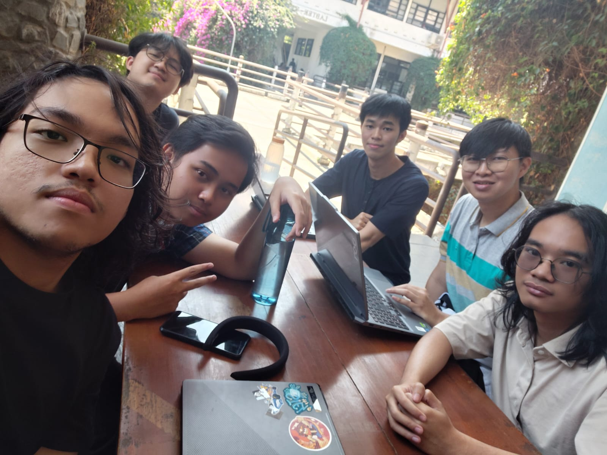

# Form Asistensi

## Tugas Besar IF2150 - Rekayasa Perangkat Lunak

| Informasi | Keterangan |
| --- | --- |
| **Hari** | *\[Hari\]* |
| **Tanggal** | *\[DD/MM/YYYY\]* |
| **Kelas** | K03 |
| **Nomor Kelompok** | 09  |
| **Nama Kelompok** | 9naga  |
| **Nama Perangkat Lunak** | *\[Nama P/L\]*  |
| **Dokumen** | *\[Nama Dokumen yang diasistensikan\]*  |

### Anggota Kelompok

| NIM | Nama |
| --- | --- |
| 13525120 | Naufal Hasbialhaq |
| 13525009 | Wimar Widiarto |
| 13525093 | Vinsensius Juan Setiady |
| 13525126 | Raymond Edson Sabajan |
| 13525048 | Yohanes Nicholas Setiawan |

### Catatan

| Catatan |
| --- |
| 1. *\[Berikan catatan hasil asistensi\]*  |
| 2. ... |
| 3. ... |
| 4. ... |

**Notes for this section:**  
*Catatan dapat dituliskan dalam bentuk paragraf atau poin-poin, disesuaikan saja.* 

## Dokumentasi

<!--  -->

  

  <i>Gambar 1. Dokumentasi kegiatan asistensi.</i>

