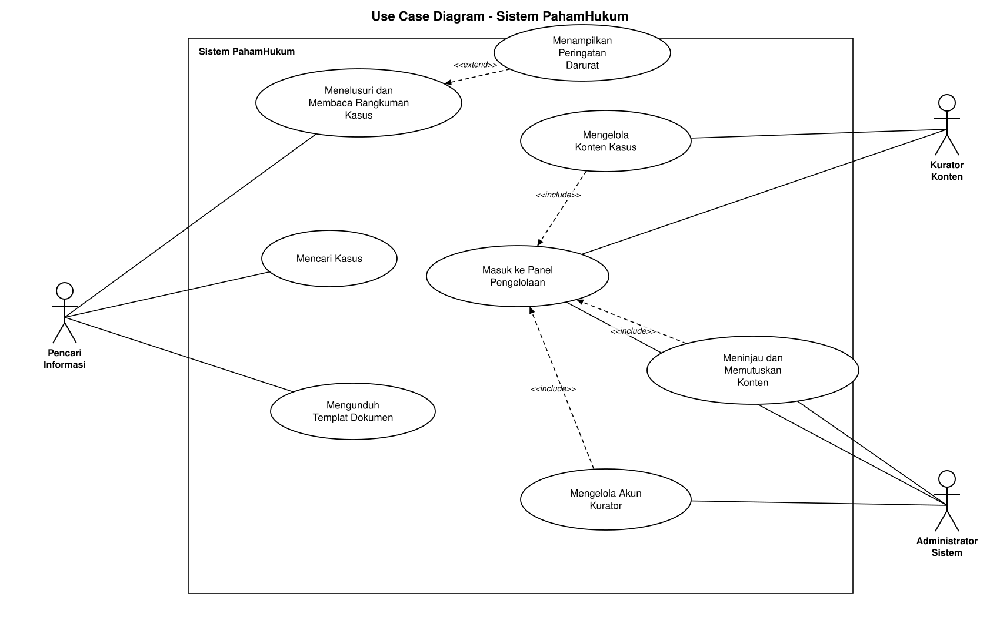

<h1>
IF2150 REKAYASA PERANGKAT LUNAK
 
TUGAS 3
 
USE CASE & SCENARIO USE CASE
</h1>
 

## PahamHukum

### Untuk: Mikhael Andrian Yonatan

Dipersiapkan oleh:
| Informasi | Keterangan |
| --- | --- |
| Kelas | K01 |
| Kelompok | 7 |

| NIM | Nama |
|---|---|
| 13525007 | Rivan Cahyadi |
| 13525019 | Raditya Wibian Sastaka |
| 13525064 | Matthew Evan Kurniawan |
| 13525100 | Wesley Lianto |
| 13525109 | Christopherus Michael Jafeth Tobing |
---

## Daftar Perubahan

| Revisi | Deskripsi |
| :--- | :--- |
| *A* | *Deskripsikan perubahan yang dilakukan dari dokumen sebelumnya pada dokumen ini. Jika tidak terdapat perubahan, harap kosongkan tabel.* |
| *B* |  |
| *C* |  |
| ... |  |

 
 

# BAB 1: Deskripsi Perangkat Lunak
Bagian ini boleh disalin dari 1.1 Deskripsi Umum Sistem pada dokumen *Requirement Gathering*. Pastikan isinya memang membahas deskripsi perangkat lunak kalian, seperti fitur, fungsi utama, dan cakupan sistem.

PahamHukum hadir sebagai aplikasi berbasis web yang menjembatani masyarakat awam dengan informasi hukum. Selama ini, informasi hukum seringkali disajikan dengan bahasa yang teknis dan lebih diutamakan bagi kalangan profesional. PahamHukum bertujuan untuk menyelesaikan permasalahan tersebut dengan menyediakan wawasan, panduan untuk menyelesaikan perkara, serta *template* atau *draft* surat yang relevan sebagai dokumen pendukung. Namun, sistem kami tidak menangani perkara secara langsung, tidak mewakili pengguna secara hukum, dan tidak dirancang untuk menggantikan peran advokat atau Lembaga Bantuan Hukum (LBH). Batasan ini diperlukan, mengingat tim kami bukan lembaga bantuan hukum yang berizin atau ahli hukum.

**Ekspektasi Pencari Informasi:** Pengguna ingin mendapatkan kemudahan untuk memahami istilah hukum yang rumit dalam berbagai kasus yang mereka alami. Mereka ingin tahu apakah ada solusi realistis dari perkara tersebut, langkah pertama apa yang harus diambil, serta persiapan apa saja yang diperlukan. Sebelum bertindak lebih lanjut ke lembaga hukum, pengguna ingin mengetahui perkiraan waktu, dokumen yang wajib disiapkan, dan kapan sebaiknya meminta pendampingan profesional di bidang hukum.

**Ekspektasi Kurator Konten:** Kurator butuh kemudahan untuk menuangkan hasil analisisnya ke dalam sistem melalui satu formulir yang terstruktur, tanpa terhambat oleh tampilan antarmuka yang membingungkan. Mereka juga ingin agar karyanya dihargai, dimana nama penulis harus tercantum jelas pada setiap konten yang terbit untuk memastikan akuntabilitasnya sebagai referensi atau sumber hukum.

**Ekspektasi Administrator Sistem:** Administrator memerlukan antarmuka yang mudah digunakan dan efisien untuk memverifikasi kelayakan konten. Ia ingin membaca isi konten sekaligus memberikan keputusan (menyetujui atau mengembalikan) pada laman yang sama. Tugas utamanya adalah untuk memastikan keaslian dan keakuratan konten yang dibuat dengan kondisi hukum di Indonesia, sehingga fitur tersebut sangat krusial bagi mereka.

Alur kerja aplikasi ini terbagi menjadi dua bagian yang saling berinteraksi. Bagi publik, Pencari Informasi akan membuka halaman utama, menelusuri bidang hukum atau mengetik kata kunci permasalahannya, lalu memilih kasus yang paling cocok. Pada situs web, nama kasus akan ditulis dalam bahasa sehari-hari yang mudah dipahami, misalnya "saya diberhentikan tanpa surat", bukan merujuk pada nomor pasal perundang-undangan. Sistem lalu menampilkan satu halaman berisi inti masalah, hak pengguna, langkah penyelesaian, hal-hal yang perlu dipertimbangkan, daftar dokumen, template surat yang bisa diunduh, artikel atau sumber hukum, dan *disclaimer*. 
Bagi pengelola, Kurator akan masuk ke panel untuk menyusun rangkuman kasus, mengunggah *template*, dan mengajukan *draft* konten. Status konten berubah dari `Draft` menjadi `Diajukan`, lalu masuk ke antrean untuk pengecekan lebih lanjut. Administrator kemudian memeriksa ketepatan informasi hukumnya dan mengambil keputusan. Jika disetujui, konten langsung terbit dengan nama penulis dan tanggal peninjauan. Bila dikembalikan, statusnya menjadi `Perlu Revisi` disertai catatan perbaikan untuk Kurator. Hasil dari kedua bagian inilah yang tayang sebagai halaman rangkuman kasus yang bisa dibaca publik.

Harapan dari *platform* PahamHukum sebenarnya sederhana. Saat menghadapi masalah hukum, seseorang bisa tahu harus melangkah ke mana lebih dulu, alih-alih berhenti pada kebingungan dan berujung diam saja. Produk akhir yang diharapkan adalah situs web berisi direktori kasus dalam bahasa sehari-hari. Setiap kasus akan dilengkapi dengan satu halaman rangkuman yang utuh, mulai dari penjelasan masalah, hak, langkah, hingga *template* surat yang bisa digunakan. Semuanya bersifat gratis, terbuka, dan bersumber dari materi yang sudah terverifikasi dengan penulis yang jelas. Dengan begitu, informasi hukum tidak lagi dianggap menakutkan tetapi bisa dipahami dan ditindaklanjuti orang biasa.

Solusi ini juga berkaitan dengan tujuan pembangunan yang lebih besar. Pada skala global, PahamHukum mendukung Tujuan Pembangunan Berkelanjutan (SDG) nomor 16 mengenai akses keadilan dan informasi yang merata, khususnya Target 16.3 dan 16.10. Ketersediaan regulasi sering kurang bermakna bila masyarakat tidak bisa memahami bahasanya. Pada skala nasional, situs ini bertujuan untuk mendukung visi Indonesia Emas 2045 di bidang supremasi hukum. Menyederhanakan informasi hukum agar mudah dicerna masyarakat umum adalah langkah paling dasar untuk ikut mewujudkan agenda tersebut.

---

# BAB 2: Kebutuhan Fungsional (KF)
Salin ulang **seluruh Kebutuhan Fungsional (KF)** yang telah didefinisikan pada dokumen *Requirement Gathering*. Tabel ini menjadi acuan *traceability*, dimana setiap Use Case pada BAB 3 wajib ditelusuri ke satu atau lebih ID KF di tabel ini, dan sebaliknya setiap KF idealnya tercakup oleh minimal satu Use Case. Pastikan juga sudah menggunakan **format EARS** dalam penulisan KF.

| ID KF | ID Kebutuhan | Penjelasan |
| :--- | :--- | :--- |
| KF01 | R01 | Sistem harus menampilkan seluruh bidang hukum yang aktif di beranda utama beserta jumlah kelompok kasus pada masing-masing bidang. |
| KF02 | R02, R13 | Selama sebuah konten berstatus selain Disetujui, atau kategori hukumnya sedang dinonaktifkan, sistem harus menyembunyikannya dari antarmuka publik dan dari pencarian internal. |
| KF03 | R05 | Ketika Pencari Informasi mengeklik salah satu bidang hukum, sistem harus menampilkan kelompok kasus yang termasuk dalam bidang tersebut. |
| KF04 | R06 | Sistem harus menampilkan judul kasus dalam bahasa keluhan sehari-hari sebagai judul utama, dan menaruh istilah hukum resminya sebagai keterangan pelengkap. |
| KF05 | R07 | Ketika Pencari Informasi memilih sebuah kelompok kasus, sistem harus membuka halaman rangkuman untuk kasus tersebut. |
| KF06 | R08 | Ketika Pencari Informasi memasukkan kata kunci pencarian, sistem harus mencocokkannya dengan judul kasus, kalimat gejala, isi rangkuman, dan istilah hukum resmi, lalu menampilkan hasil yang relevan. |
| KF07 | R09 | Jika pencarian tidak menemukan hasil, sistem harus menampilkan pesan yang sopan bahwa kasus belum tersedia, disertai saran bidang hukum lain dan tautan lembaga bantuan hukum. |
| KF08 | R11, R12 | Sistem harus menyusun halaman rangkuman kasus dalam satu tampilan berurutan, meliputi inti masalah, hak, langkah penyelesaian, poin pertimbangan, daftar periksa dokumen, templat, artikel pendukung, dan *disclaimer*. |
| KF09 | R46 | Sistem harus menampilkan bagian "hal yang perlu dipertimbangkan" yang berisi perkiraan waktu pengerjaan dan saran kapan pengguna sebaiknya mencari pendampingan profesional. |
| KF10 | R47 | Sistem harus mencantumkan nama Kurator penulis dan tanggal peninjauan oleh Administrator pada setiap rangkuman kasus yang terbit ke publik. |
| KF11 | R14 | Sistem harus menyajikan langkah penyelesaian secara bernomor dan berurutan, lengkap dengan tujuan tiap langkah dan dokumen yang diperlukan pada tahap tersebut. |
| KF12 | R14 | Jika sebuah langkah penyelesaian memiliki tenggat waktu administratif, sistem harus menampilkan penanda batas waktu pada langkah tersebut. |
| KF13 | R15 | Ketika Pencari Informasi mencentang sebuah item pada daftar periksa, sistem harus memperbarui tampilan item itu dan menghitung berapa banyak dokumen yang sudah disiapkan. |
| KF14 | R16 | Sistem harus menyimpan status centang daftar periksa hanya secara sementara di peramban pengguna (local session), dan memberi tahu bahwa data centang akan hilang jika halaman dimuat ulang. |
| KF15 | R17 | Jika sebuah kasus memiliki berkas templat dokumen, sistem harus menampilkan tombol unduh beserta ukuran berkas dan tanggal pembaruan terakhirnya. |
| KF16 | R17 | Ketika Pencari Informasi menekan tombol unduh templat, sistem harus mengirimkan berkas versi terbaru tanpa meminta pengguna mendaftar. |
| KF17 | R18 | Sistem harus menampilkan *disclaimer* bahwa templat hanya berupa kerangka awal, ditempatkan tepat di atas tombol unduh. |
| KF18 | R19 | Sistem harus menampilkan daftar artikel pendukung beserta tautan ke sumber hukum resmi pada bagian akhir halaman rangkuman. |
| KF19 | R21 | Sistem harus menampilkan *disclaimer* pelepasan tanggung jawab profesi pada *footer* di setiap halaman publik. |
| KF20 | R22 | Sistem harus menampilkan direktori Lembaga Bantuan Hukum (LBH) terdekat beserta area layanannya. |
| KF21 | R23 | Ketika Pencari Informasi membuka kelompok kasus yang ditandai sebagai situasi darurat, sistem harus menampilkan peringatan prioritas untuk segera melapor ke kepolisian atau unit perlindungan khusus. |
| KF22 | R24 | Sistem harus menyediakan formulir dinamis bagi Kurator yang urutan isiannya mengikuti susunan baku halaman rangkuman pada KF08. |
| KF23 | R25 | Ketika Kurator membuat draf tulisan baru, sistem harus otomatis menetapkan statusnya sebagai *Draft*. |
| KF24 | R26 | Ketika Administrator menyetujui sebuah tulisan, sistem harus menayangkannya ke antarmuka publik tanpa perlu menerapkan ulang (re-deploy) aplikasi. |
| KF25 | R27 | Ketika Kurator melampirkan berkas templat ke sebuah kelompok kasus, sistem harus menyimpannya dan memperbarui cap waktu versi sebagai templat terbaru. |
| KF26 | R28 | Jika berkas templat yang diunggah bukan PDF atau DOCX, atau melebihi 5 MB, sistem harus menolak unggahan dan menampilkan pesan penjelasan yang benar. |
| KF27 | R30 | Ketika Kurator mengajukan sebuah tulisan, sistem harus mengubah statusnya dari *Draft* menjadi *Diajukan* dan memasukkannya ke antrean peninjauan Administrator. |
| KF28 | R31 | Jika Kurator mengajukan tulisan sementara masih ada isian wajib yang kosong, sistem harus mencegah pengajuan dan menandai isian mana saja yang belum lengkap. |
| KF29 | R32 | Sistem harus menampilkan daftar tulisan milik tiap Kurator beserta statusnya (*Draft*, *Diajukan*, *Disetujui*, atau *Perlu Revisi*). |
| KF30 | R32 | Jika sebuah tulisan ditetapkan sebagai *Perlu Revisi*, sistem harus menampilkan catatan perbaikan dari Administrator pada menu penyuntingan Kurator terkait. |
| KF31 | R33 | Sistem harus menampilkan antrean tulisan berstatus *Diajukan* bagi Administrator, diurutkan dari yang paling lama menunggu, beserta nama pengunggahnya. |
| KF32 | R34 | Ketika Administrator memilih Setujui, sistem harus mengubah status tulisan menjadi "Disetujui". |
| KF33 | R34 | Ketika Administrator memilih Kembalikan, sistem harus mengubah status tulisan menjadi "Perlu Revisi" dan mengirimkan catatan revisi dari Administrator kepada Kurator. |
| KF34 | R35 | Jika Administrator mengembalikan tulisan tetapi kolom alasan revisi dibiarkan kosong, sistem harus menahan perubahan status dan mewajibkan alasan revisi diisi lebih dulu. |
| KF35 | R36 | Jika seorang Kurator mencoba menayangkan sendiri tulisannya, sistem harus menolak permintaan tersebut. |
| KF36 | R37 | Ketika status sebuah konten berubah, sistem harus mencatat riwayatnya secara lengkap, memuat nama pelaku, waktu, dan status barunya. |
| KF37 | R38 | Ketika Administrator menonaktifkan akun seorang Kurator, sistem harus segera memutus sesinya jika sedang login dan mencegahnya login kembali. |
| KF38 | R39 | Sistem harus menyediakan pendaftaran akun hanya melalui panel Administrator, dan tidak menyediakan menu *Sign Up* di antarmuka publik. |
| KF39 | R40 | Ketika Administrator atau Kurator memasukkan email dan kata sandi yang benar, sistem harus memberi akses dan mengarahkan mereka ke antarmuka kerja sesuai perannya. |
| KF40 | R40 | Jika email atau kata sandi yang dimasukkan salah, sistem harus menolak akses dengan pesan galat umum yang tidak menyebutkan bagian mana yang keliru. |
| KF41 | R42 | Jika ada upaya membuka halaman pengelola tanpa sesi login yang sah, sistem harus mengalihkannya ke halaman login atau menampilkan halaman akses ditolak. |
| KF42 | R45 | Sistem harus menggunakan Bahasa Indonesia yang sopan dan formal secara konsisten pada label tombol, pesan kesalahan, dan isi antarmuka. |
| KF43 | R38 | Ketika Administrator menyimpan perubahan data akun Kurator, sistem harus memperbarui detail akun tersebut dan memberlakukannya pada sesi login Kurator berikutnya. |

 ***Catatan***: *Jika ada KF dari ML2 yang berubah/bertambah/dihapus setelah asistensi, pastikan tabel ini konsisten dengan versi KF terbaru sebelum dikumpulkan.*

---

# BAB 3: Model Use Case

## 3.1 Identifikasi Aktor
Daftarkan seluruh aktor yang terlibat dalam use case yang akan dimodelkan. Aktor berupa pengguna manusia yang berinteraksi dengan solusi. Perlu diperhatikan bahwa Admin/Developer/ Pihak Eksternal lain yang bisa diotomisasi, tidak perlu dijadikan aktor.

| Aktor | Deskripsi |
| :--- | :--- |
| **Pencari Informasi (Masyarakat Awam)** | Masyarakat umum yang sedang menghadapi persoalan hukum, atau sekadar ingin memahaminya, misalnya sengketa ketenagakerjaan dan perselisihan transaksi. Kebanyakan tidak berlatar hukum dan kurang familier dengan istilah teknis maupun nomor peraturan. Yang mereka butuhkan kejelasan, bahasa yang sederhana, dan panduan langkah yang praktis. Umumnya, situs diakses lewat perangkat seluler dengan kualitas koneksi yang bervariasi, dan mereka memakai sistem tanpa perlu mendaftar dan membuat akun. |
| **Kurator Konten** | Tim pengelola yang menyusun kategori hukum, menulis rangkuman kasus, mengunggah materi pendukung, dan menyiapkan *template* dokumen. Mereka memiliki pemahaman dasar tentang hukum, teliti saat merujuk peraturan, serta konsisten menjaga informasi tetap mudah dicerna orang awam. Kurator bekerja melalui panel pengelolaan dan tidak berwenang menerbitkan konten langsung ke publik. |
| **Administrator Sistem** | Pemegang otoritas tertinggi dalam sistem. Tugas utamanya meninjau akurasi konten dari Kurator sebelum terbit, sekaligus mengelola akun dan hak akses mereka. Pemahaman hukumnya umumnya lebih dalam daripada Kurator dengan tingkat kehati-hatian yang tinggi untuk meloloskan informasi hukum bagi konsumsi publik, contohnya praktisi hukum atau mahasiswa tingkat akhir di bidang hukum.|

## 3.2 Identifikasi Use Case
Identifikasi seluruh use case yang mencakup Kebutuhan Fungsional pada BAB 2. Satu use case boleh mencakup lebih dari satu KF, dan sebaliknya satu KF boleh muncul di lebih dari satu use case bila memang relevan.

| ID UC | Nama Use Case | Deskripsi Singkat | Aktor Terlibat | ID KF Terkait |
| :--- | :--- | :--- | :--- | :--- |
| UC01 | Menelusuri dan Membaca Rangkuman Kasus | Pencari Informasi menjelajahi bidang hukum dan kelompok kasus dalam bahasa sehari-hari, lalu membaca satu halaman rangkuman yang memuat inti masalah, hak, langkah penyelesaian, hal yang perlu dipertimbangkan, daftar periksa dokumen, artikel pendukung, penulis/tanggal tinjauan, rujukan LBH, dan *disclaimer*. | Pencari Informasi | KF01, KF02, KF03, KF04, KF05, KF08, KF09, KF10, KF11, KF12, KF13, KF14, KF18, KF19, KF20 |
| UC02 | Mencari Kasus | Pencari Informasi memasukkan kata kunci pada kolom pencarian untuk langsung menemukan kasus atau istilah yang relevan; jika tidak ditemukan, sistem menyarankan bidang lain dan rujukan LBH. | Pencari Informasi | KF06, KF07 |
| UC03 | Mengunduh Templat Dokumen | Pencari Informasi mengunduh berkas templat surat (mis. somasi/surat pengaduan) versi terbaru dari sebuah kasus, tanpa perlu mendaftar akun. | Pencari Informasi | KF15, KF16, KF17 |
| UC04 | Menampilkan Peringatan Darurat | Sistem menampilkan peringatan prioritas agar segera melapor ke pihak berwajib ketika kelompok kasus yang sedang dibaca ditandai sebagai situasi darurat. *(meng-*extend* UC01, hanya berjalan pada kondisi tertentu)* | Pencari Informasi | KF21 |
| UC05 | Mengelola Konten Kasus | Kurator menyusun/menyunting rangkuman kasus melalui formulir terstruktur, melampirkan berkas templat, mengajukan konten agar masuk antrean peninjauan, serta memantau status pengajuan dan catatan revisinya. | Kurator Konten | KF22, KF23, KF25, KF26, KF27, KF28, KF29, KF30 |
| UC06 | Meninjau dan Memutuskan Konten | Administrator membuka antrean konten berstatus *Diajukan*, meninjau isinya, lalu menyetujui (sehingga otomatis tayang ke publik) atau mengembalikannya dengan catatan revisi wajib; setiap perubahan status tercatat sebagai riwayat permanen. | Administrator Sistem | KF24, KF31, KF32, KF33, KF34, KF35, KF36 |
| UC07 | Mengelola Akun Kurator | Administrator mendaftarkan, memperbarui detail, atau menonaktifkan akun Kurator beserta hak aksesnya; pendaftaran akun hanya dapat dilakukan lewat panel ini, bukan lewat antarmuka publik. | Administrator Sistem | KF37, KF38, KF43 |
| UC08 | Masuk ke Panel Pengelolaan | Kurator maupun Administrator masuk (login) ke panel pengelolaan menggunakan kredensial masing-masing sebelum dapat mengakses fitur pengelolaan mana pun; akses ke halaman pengelola tanpa sesi yang sah akan dicegah. *(di-*include* oleh UC05, UC06, dan UC07)* | Kurator Konten, Administrator Sistem | KF39, KF40, KF41 |

## 3.3 Use Case Diagram

Diagram berikut memuat ketiga aktor (Pencari Informasi, Kurator Konten, Administrator Sistem) beserta delapan use case yang diidentifikasi pada 3.2.

 

<i>Gambar 1. Use Case Diagram Sistem PahamHukum</i>

 

**Relasi *include*:** UC05 (Mengelola Konten Kasus), UC06 (Meninjau dan Memutuskan Konten), dan UC07 (Mengelola Akun Kurator) masing-masing meng-*include* UC08 (Masuk ke Panel Pengelolaan), karena ketiganya selalu menuntut sesi login pengelola yang sah sebelum dapat dijalankan — perilaku wajib yang dipakai ulang di tiap use case pengelolaan.

**Relasi *extend*:** UC04 (Menampilkan Peringatan Darurat) meng-*extend* UC01 (Menelusuri dan Membaca Rangkuman Kasus), karena peringatan ini hanya muncul secara kondisional, yaitu ketika kelompok kasus yang sedang dibuka ditandai sebagai situasi darurat — bukan bagian dari alur baca rangkuman kasus pada umumnya.

## 3.4 Skenario Use Case
Buat skenario untuk **setiap** use case yang telah diidentifikasi pada 3.2. Setiap skenario dapat terdiri dari dua jenis alur:
- **Skenario Normal**: alur utama (*happy path*) di mana interaksi aktor-sistem berjalan lancar tanpa kendala hingga tujuan use case tercapai.
- **Skenario Alternatif**: alur percabangan dari skenario normal, misalnya kondisi gagal, input tidak valid, atau pilihan lain yang tersedia bagi aktor. Boleh ada lebih dari satu skenario alternatif per use case jika ada beberapa titik percabangan berbeda.

Format tabel skenario: kolom **Aksi Aktor** berisi apa yang dilakukan/diinput aktor, kolom **Reaksi Perangkat Lunak** berisi respons sistem terhadap aksi tersebut secara **berurutan** (nomor langkah harus berpasangan/selaras antar dua kolom).

### 3.4.1 Skenario UC01

**Nama Use Case:** *Melakukan Pembayaran Digital*

**Skenario Normal**

| No | Aksi Aktor | Reaksi Perangkat Lunak |
| :--- | :--- | :--- |
| 1 | *Pelanggan memilih menu checkout* | *Sistem menampilkan ringkasan pesanan dan pilihan metode pembayaran* |
| 2 | *Pelanggan memilih metode pembayaran (misal: e-wallet)* | *Sistem mengarahkan pelanggan ke halaman konfirmasi e-wallet* |
| 3 | *Pelanggan mengonfirmasi pembayaran* | *Sistem menerima respons pembayaran berhasil, memperbarui status pesanan menjadi "Lunas", dan menampilkan notifikasi pembayaran berhasil* |

 

**Skenario Alternatif 1: Otorisasi Pembayaran Gagal**

| No | Aksi Aktor | Reaksi Perangkat Lunak |
| :--- | :--- | :--- |
| 1 | *Pelanggan memilih menu checkout* | *Sistem menampilkan ringkasan pesanan dan pilihan metode pembayaran* |
| 2 | *Pelanggan memilih metode pembayaran (misal: e-wallet)* | *Sistem mengarahkan pelanggan ke halaman konfirmasi e-wallet* |
| 3 | *Pelanggan mengonfirmasi pembayaran* | *Sistem menerima respons pembayaran gagal (misal: saldo tidak cukup). Sistem menampilkan pesan error dan meminta pelanggan memilih metode pembayaran lain* |
| 4 | *Pelanggan memilih metode pembayaran lain* | *Sistem kembali ke langkah 2 skenario normal* |

### 3.4.2 Skenario UC02

**Nama Use Case:** *Memverifikasi Status Pembayaran*

**Skenario Normal**

| No | Aksi Aktor | Reaksi Perangkat Lunak |
| :--- | :--- | :--- |
| 1 | *Kasir memasukkan ID Pesanan pelanggan* | *Sistem menampilkan status pembayaran ("Lunas") beserta detail transaksi* |

 

**Skenario Alternatif 1: ID Pesanan Tidak Ditemukan**

| No | Aksi Aktor | Reaksi Perangkat Lunak |
| :--- | :--- | :--- |
| 1 | *Kasir memasukkan ID Pesanan yang salah/tidak ada* | *Sistem menampilkan pesan "ID Pesanan tidak ditemukan" dan meminta kasir memasukkan ulang* |

*Lanjutkanlah pola 3.4.x ini untuk setiap ID UC yang telah diidentifikasi pada 3.2, sampai seluruh use case memiliki skenario normal dan skenario alternatif (tidak usah dibuat jika use case tersebut memang tidak memiliki skenario alternatif).*