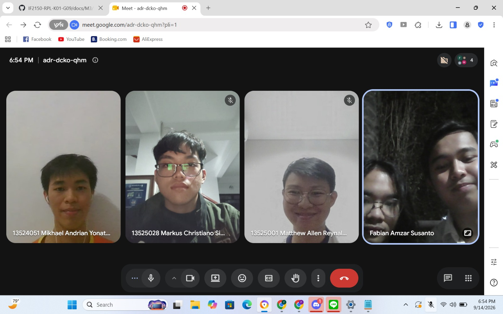

# Form Asistensi

## Tugas Besar IF2150 - Rekayasa Perangkat Lunak

| Informasi                | Keterangan  |
| ------------------------ | ----------- |
| **Hari**                 | Senin       |
| **Tanggal**              | 07/09/2026  |
| **Kelas**                | K-1         |
| **Nomor Kelompok**       | 9           |
| **Nama Kelompok**        | PindahCSUI  |
| **Nama Perangkat Lunak** | PeerUp      |
| **Dokumen**              | Milestone 2 |

### Anggota Kelompok

| NIM      | Nama                            |
| -------- | ------------------------------- |
| 13525049 | Hugo Daniel Johansen Napitupulu |
| 13525028 | Markus Christiano Simanjutak    |
| 13525025 | David Christian                 |
| 13525001 | Matthew Allen Reynaldo          |
| 13525010 | Fabian Amzar Susanto            |

### Catatan

| Catatan |
| --- |
| 1. Evaluasi Keterlacakkan (Traceability) R ke KF: Pastikan seluruh ID Kebutuhan (R) benar-benar terpetakan dan tercakup ke dalam Kebutuhan Fungsional (KF). Jangan ada kebutuhan yang "gaib" atau tertinggal (misal: pastikan R20 secara eksplisit dituliskan masuk ke KF07 agar asisten mudah melacaknya). |
| 2. Penggabungan Kebutuhan (R01-R04): Kebutuhan yang mirip dan mengacu pada satu Aktivitas (A) yang sama, seperti R01 hingga R04 (seputar login/register), sangat boleh digabungkan ke dalam satu KF jika kondisi pemicunya sama.
| 3. Implementasi dan Flow Sistem: Dari sekarang, mulai bayangkan bagaimana implementasi teknis dan flow aplikasinya akan berjalan. |
| 4. Hierarki Penyusunan Use Case (Milestone 3): Jangan menyusun Use Case berdasarkan Aktivitas, melainkan turunkan dari Kebutuhan Fungsional (KF). Aktivitas adalah apa yang ingin dilakukan pengguna, KF adalah apa yang harus disiapkan oleh sistem, dan Use Case adalah fitur nyata yang bisa dilakukan pengguna di dalam sistem. |
| 5. Penulisan Deskripsi Use Case (Tabel 3.2): Penamaan Use Case harus berupa kata kerja aktif dari fitur yang tersedia (contoh: UC01 diarahkan menjadi "Melakukan Registrasi"). Deskripsi di dalamnya tidak perlu terlalu teknis. |
| 6. Use Case Diagram (Include vs Extend): Gunakan standar notasi yang diajarkan di kelas. Include: Sesuatu yang wajib terjadi sebagai satu paket. Extend: Skenario opsional atau kondisi khusus. |
| 7. Sifat Tugas dan Persiapan UTS: Dalam mendesain arsitektur perangkat lunak, banyak hal bergantung pada best practice (tidak ada benar/salah yang mutlak). Namun untuk UTS nanti, pastikan benar-benar paham cara mendeduksi suatu cerita/studi kasus menjadi KF dan Use Case, dan teliti dalam menggunakan notasi diagram. |

## Dokumentasi

<!--  -->

  

  <i>Gambar 1. Dokumentasi kegiatan asistensi.</i>

