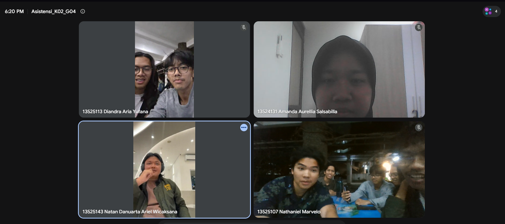

# Form Asistensi

## Tugas Besar IF2150 - Rekayasa Perangkat Lunak

| Informasi | Keterangan |
| --- | --- |
| **Hari** | *Selasa* |
| **Tanggal** | *15/09/2026* |
| **Kelas** | 02 |
| **Nomor Kelompok** | 04 |
| **Nama Kelompok** | 0sks |
| **Nama Perangkat Lunak** | Ngaksara |
| **Dokumen** | *UC*  |

### Anggota Kelompok

| NIM | Nama |
| --- | --- |
| 13525026 | Ryuza Nadif Aldebaran |
| 13525029 | Muhammad Naufal Hilmi |
| 13525077 | Muhammad Abduh |
| 13525107 | Nathaniel Marvelo |
| 13525113 | Diandra Aria Yufana |
| 13525143 | Natan Danuarta Ariel Wicaksana |

### Catatan

| Catatan |
| --- |
| 1. *Form feed back sebaiknya diimplementasikan secara langsung di perangkat lunak yang dibuat.*  |
| 2. *Dalam perangkat lunak tidak wajib ada aspek bisnis (yang berhubungan dengan pendapatan moneter)* |
| 3. *Aktor administrator boleh dihapus, disesuaikan saja apakah merasa benar-benar diperlukan atau tidak* |
| 4. *Wajib ada alternatif untuk setiap skenario, jika diperlukan dapat membuat lebih dari satu alternatif untuk tiap skenario* |

## Dokumentasi

<!--  -->

  

  <i>Gambar 1. Dokumentasi kegiatan asistensi.</i>

