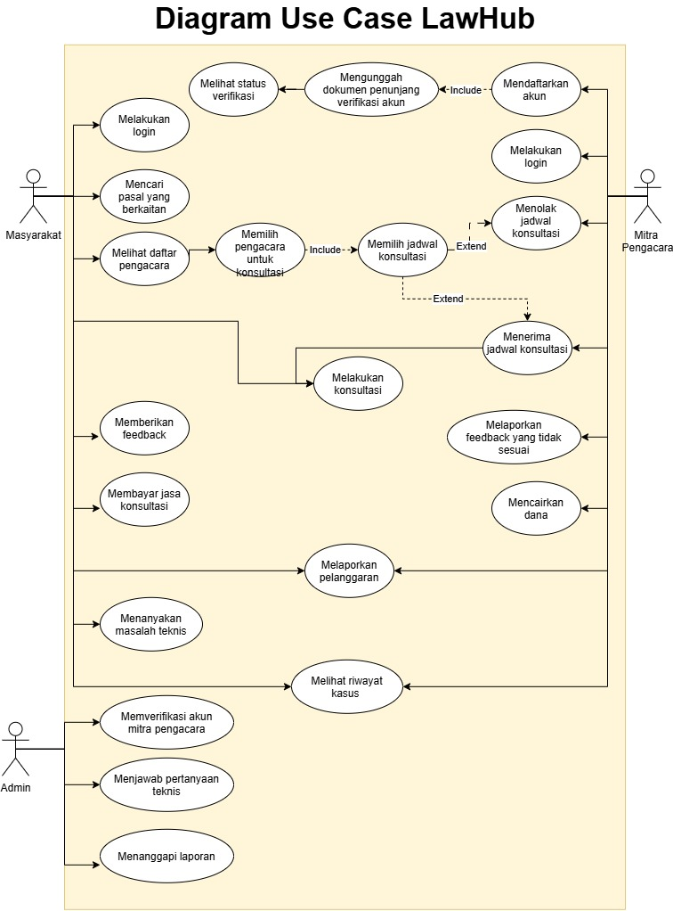

<h1>
IF2150 REKAYASA PERANGKAT LUNAK
 
TUGAS 3
 
USE CASE & SCENARIO USE CASE
</h1>
 

## LawHub

### Untuk: Mikhael Andrian Yonatan

Dipersiapkan oleh:
| Informasi | Keterangan |
| --- | --- |
| Kelas | K03 |
| Kelompok | G05  |

| NIM | Nama |
|---|---|
| 13525057 | Raya Medina Farrelin |
| 13525003 | Cherinette Corsane Khassyah Purceria |
| 13525108 | Khasya Nurul Amini |
| 13525150 | Livy Chandra |
| 13525138 | Cathrine Angel Siburian |
---

## Daftar Perubahan

| Revisi | Deskripsi |
| :--- | :--- |
| A | Penambahan 2 kebutuhan fungsional, KF19 dan KF20, yang tertera di Bab 2. |
| A | Perubahan 3 kebutuhan fungsional, KF01, KF03, dan KF17 , yang tertera di Bab 2. |

 
 

# BAB 1: Deskripsi Perangkat Lunak
Bagian ini boleh disalin dari 1.1 Deskripsi Umum Sistem pada dokumen *Requirement Gathering*. Pastikan isinya memang membahas deskripsi perangkat lunak kalian, seperti fitur, fungsi utama, dan cakupan sistem.

---

# BAB 2: Kebutuhan Fungsional (KF)

| ID KF | ID Kebutuhan | Penjelasan |
| :--- | :--- | :--- |
| KF01 | R01 | Perangkat lunak dapat menampilkan halaman login/registrasi akun bagi masyarakat. |
| KF02 | R01 | Perangkat lunak dapat menampilkan pilihan antarmuka SearchLaw dan HaloLaw setelah pengguna melakukan login. |
| KF03 | R02 | Perangkat lunak dapat menampilkan halaman login/registrasi akun mitra pengacara untuk diverifikasi. |
| KF04 | R02 | Perangkat lunak dapat menampilkan status verifikasi registrasi akun mitra pengacara. |
| KF05 | R03 | Perangkat lunak dapat menampilkan halaman verifikasi mitra pengacara untuk admin. |
| KF06 | R05 | Perangkat lunak dapat mewadahi edit profil bagi mitra pengacara. |
| KF07 | R06 | Perangkat lunak dapat menampilkan halaman edit dokumen legalitas mitra pengacara. |
| KF08 | R08 | Perangkat lunak dapat menampilkan mitra pengacara yang sesuai oleh pengguna dengan menggunakan filter atau memasukkan kata kunci dengan menggunakan search bar. |
| KF09 | R09 | Perangkat lunak dapat menampilkan halaman bagi pengguna untuk memilih dan menghubungi mitra pengacara menangani kasus yang dialami. |
| KF10 | R10 | Perangkat lunak dapat mewadahi mitra pengacara untuk menanggapi dan menerima kasus yang diadukan oleh pengguna. |
| KF11 | R11 | Perangkat lunak dapat mewadahi komunikasi dari pengguna ke mitra pengacara untuk menangani kasus lebih lanjut. |
| KF12 | R12 dan R13 | Perangkat lunak dapat mewadahi ulasan, feedback, dan/atau rating yang diberikan oleh pengguna kepada mitra pengacara. |
| KF13 | R14 | Perangkat lunak dapat mewadahi pelaporan akun bagi pengguna ataupun mitra pengacara yang melakukan pelanggaran saat/setelah sesi konsultasi berlangsung. |
| KF14 | R15 | Perangkat lunak dapat mewadahi pelaporan ulasan bagi pengguna dan/atau profil mitra pengacara secara umum. |
| KF15 | R16 | Perangkat lunak dapat mewadahi verifikasi pelaporan akun untuk admin. |
| KF16 | R17 | Perangkat lunak dapat mewadahi admin untuk melakukan ban terhadap akun yang telah melanggar kebijakan sistem. |
| KF17 | R18 | Perangkat lunak dapat menampilkan riwayat kasus yang dilakukan mitra pengacara dan masyarakat secara keseluruhan. |
| KF18 | R019 | Perangkat lunak dapat mewadahi live chat antara admin dan pengguna untuk membantu penanganan kendala. |
| KF19 | R031 | Perangkat lunak dapat memproses pembayaran melalui payment gateway pihak ketiga. |
| KF20 | R032 | Perangkat lunak memproses pencairan dana mitra pengacara. |

 ***Catatan***: *Jika ada KF dari ML2 yang berubah/bertambah/dihapus setelah asistensi, pastikan tabel ini konsisten dengan versi KF terbaru sebelum dikumpulkan.*

---

# BAB 3: Model Use Case

## 3.1 Identifikasi Aktor

| Aktor | Deskripsi |
| :--- | :--- |
| Mitra Pengacara | Praktisi hukum yang mendaftar sebagai pengacara HaloLaw untuk menerima dan menanggapi permintaan konsultasi dari klien. |
| Masyarakat | Pengguna umum yang secara aktif menggunakan fitur SearchLaw untuk mencari dasar hukum dan fitur HaloLaw untuk berkonsultasi langsung dengan pengacara. |
| Admin | Mengakses sistem untuk mengelola dan melayani pengguna. |

## 3.2 Identifikasi Use Case

| ID UC | Nama Use Case | Deskripsi Singkat | Aktor Terlibat | ID KF Terkait |
| :--- | :--- | :--- | :--- | :--- |
| UC01 | Melakukan Registrasi Akun bagi Masyarakat | Masyarakat melakukan registrasi akun untuk membuat akun dan mengakses semua fitur LawHub. | Masyarakat | KF01 |
| UC02 | Melakukan Login bagi Masyarakat | Masyarakat melakukan login untuk mengakses semua fitur LawHub serta melihat histori kegiatan akun. | Masyarakat | KF01, KF02 |
| UC03 | Melakukan Registrasi Akun bagi Mitra Pengacara | Mitra pengacara dapat melakukan registrasi akun dengan mengunggah file yang diperlukan. | Mitra pengacara | KF03 |
| UC04 | Melakukan Login bagi Mitra Pengacara | Mitra pengacara dapat melakukan login dengan akun yang sudah diverifikasi. | Mitra pengacara | KF03 |
| UC05 | Melihat Status Registrasi Akun Mitra Pengacara | Mitra pengacara dapat melihat status registrasi akun yang baru dibuat. | Mitra pengacara | KF04 |
| UC06 | Memverifikasi Pendaftar Mitra Pengacara | Admin memeriksa dokumen dan menentukan legalitas mitra pengacara. | Admin | KF05 |
| UC07 | Verifikasi Akun Pengacara | Mitra pengacara mengunggah dokumen legalitas dan mengisi/mengedit identitas firma. | Mitra pengacara | KF06, KF07 |
| UC08 | Melakukan Pencarian Pasal | Masyarakat mencari pasal yang berkaitan dengan kasus yang sedang dialami menggunakan minimal satu kata kunci. | Masyarakat | KF08 |
| UC09 | Melihat Daftar Pengacara | Masyarakat mencari mitra pengacara sesuai masalah yang dihadapi dengan menggunakan filter. | Masyarakat | KF09 |
| UC10 | Memilih Mitra Pengacara untuk Sesi Konsultasi | Masyarakat memilih jadwal tersedia untuk sesi konsultasi dengan mitra pengacara yang dipilih.  | Masyarakat | KF09 |
| UC11 | Menanggapi Sesi Konsultasi | Mitra pengacara menerima dan melakukan konsultasi untuk masyarakat. | Mitra pengacara | KF10 |
| UC12 | Melakukan Sesi Konsultasi | Masyarakat melakukan sesi konsultasi dengan mitra pengacara via *chat*. | Masyarakat dan Mitra Pengacara | KF11 |
| UC13 | Memberi Ulasan, Feedback, dan/atau Rating | Masyarakat mengirim teks dan/atau foto sebagai bentuk ulasan, *feedback*, dan/saran setelah melakukan sesi konsultasi. | Masyarakat | KF12 |
| UC14 | Melaporkan Pelanggaran | Masyarakat melaporkan akun mitra pengacara yang melakukan pelanggaran saat/setelah sesi konsultasi berlangsung. | Masyarakat | KF13 |
| UC15 | Melaporkan Pelanggaran | Mitra pengacara melaporkan akun masyarakat yang melakukan pelanggaran saat/setelah sesi konsultasi berlangsung. | Mitra Pengacara | KF13 |
| UC16 | Melaporkan Ulasan | Mitra pengacara melaporkan ulasan yang tidak relevan. | Mitra Pengacara | KF14 |
| UC17 | Memblokir Akun | Admin melakukan ban kepada akun yang melanggar kebijakan sistem. | Admin | KF15, KF16 |
| UC18 | Melihat Riwayat Penanganan | Mitra pengacara dan masyarakat melihat riwayat kasus yang telah dilakukan masing-masing secara keseluruhan. | Mitra Pengacara dan Masyarakat | KF17 |
| UC19 | Menanyakan Masalah Teknis | Masyarakat bertanya kepada admin melalui fitur *live chat*. | Masyarakat dan Admin | KF18 |
| UC20 | Menjawab Pertanyaan | Admin menjawab pertanyaan masyarakat melalui *live chat*. | Admin | KF18 |
| UC21 | Membayar Biaya Sesi Konsultasi | Masyarakat melakukan transaksi pembayaran sesuai dengan pilihan metode pembayaran digital. | Masyarakat | KF19 |
| UC22 | Mencairkan Dana | Mitra pengacara mendapatkan pencairan dana ke rekening yang telah didaftarkan di profil akun. | Mitra pengacara | KF20 |

## 3.3 Use Case Diagram
Buatlah **satu** use case diagram yang mencakup seluruh aktor dan use case. Sertakan relasi *include*/*extend* apabila ada use case yang saling bergantung.
 

<i>Gambar 1. Contoh Use Case Diagram</i>

 

Hal-hal yang perlu diperhatikan dalam pembuatan use case diagram:
- Pastikan notasi UML use case (aktor, oval use case, garis asosiasi, *include/extend*) digambar dengan benar.
- Seluruh aktor dan use case yang telah didefinisikan harus muncul di diagram, tidak ada yang terlewat maupun berlebih.
- Hindari garis yang saling bersilangan tanpa alasan jelas, susun diagram agar mudah dibaca.
- Hindari istilah solusi teknis (misalnya nama tabel database, nama endpoint API) muncul di dalam diagram use case karena use case menjelaskan *interaksi fungsional*, bukan detail implementasi.

## 3.4 Skenario Use Case
Buat skenario untuk **setiap** use case yang telah diidentifikasi pada 3.2. Setiap skenario dapat terdiri dari dua jenis alur:
- **Skenario Normal**: alur utama (*happy path*) di mana interaksi aktor-sistem berjalan lancar tanpa kendala hingga tujuan use case tercapai.
- **Skenario Alternatif**: alur percabangan dari skenario normal, misalnya kondisi gagal, input tidak valid, atau pilihan lain yang tersedia bagi aktor. Boleh ada lebih dari satu skenario alternatif per use case jika ada beberapa titik percabangan berbeda.

Format tabel skenario: kolom **Aksi Aktor** berisi apa yang dilakukan/diinput aktor, kolom **Reaksi Perangkat Lunak** berisi respons sistem terhadap aksi tersebut secara **berurutan** (nomor langkah harus berpasangan/selaras antar dua kolom).

### 3.4.1 Skenario UC01

**Nama Use Case:** *Login Akun*

**Skenario Normal**

| No | Aksi Aktor | Reaksi Perangkat Lunak |
| :--- | :--- | :--- |
| 1 | Pengguna membuka laman login dan memasukkan username/email serta password, lalu menekan login | Sistem memvalidasi kredensial; jika cocok (dan untuk mitra pengacara, akun berstatus *approved*), sistem mengarahkan pengguna ke halaman utama sesuai role |

 

**Skenario Alternatif 1: Kredensial salah**

| No | Aksi Aktor | Reaksi Perangkat Lunak |
| :--- | :--- | :--- |
| 1 | Pengguna memasukkan username/email yang terdaftar tetapi password salah | Sistem menampilkan pesan "kombinasi username/password salah" dan mengizinkan pengguna mengedit ulang input pada form yang sama |

 

**Skenario Alternatif 2: Akun tidak terdaftar**

| No | Aksi Aktor | Reaksi Perangkat Lunak |
| :--- | :--- | :--- |
| 1 | Pengguna memasukkan username/email yang belum pernah terdaftar | Sistem tidak menemukan akun dengan kredensial tersebut, menampilkan pesan "akun tidak ditemukan" beserta dua opsi: mengedit ulang input, atau menuju laman registrasi |
| 2 | Pengguna memilih salah satu opsi: edit ulang input, atau ke laman registrasi | Jika edit ulang: sistem kembali ke langkah 1 skenario normal. Jika ke registrasi: sistem mengarahkan ke UC02 (mitra) atau UC03 (masyarakat) sesuai role yang dipilih pengguna |

 

**Skenario Alternatif 3: Akun mitra belum/gagal terverifikasi**

| No | Aksi Aktor | Reaksi Perangkat Lunak |
| :--- | :--- | :--- |
| 1 | Mitra pengacara memasukkan kredensial yang benar, namun status akun masih *pending* atau *rejected* | Sistem menolak akses, menampilkan pesan bahwa akun belum/tidak terverifikasi, dan mengarahkan kembali ke laman login (dengan opsi menuju UC04 untuk cek status) |

### 3.4.2 Skenario UC02

**Nama Use Case:** *Daftar Akun Mitra Pengacara*

**Skenario Normal**

| No | Aksi Aktor | Reaksi Perangkat Lunak |
| :--- | :--- | :--- |
| 1 | Mitra pengacara membuka laman registrasi mitra dan mengisi data diri/firma serta mengunggah dokumen legalitas yang diperlukan | Sistem menampilkan form registrasi mitra |
| 2 | Mitra pengacara menekan submit | Sistem memvalidasi kelengkapan dan format input; jika valid, sistem menyimpan data, membuat akun berstatus *pending*, dan menampilkan notifikasi bahwa pengajuan sedang menunggu approval admin |

 

**Skenario Alternatif 1: Gagal submit**

| No | Aksi Aktor | Reaksi Perangkat Lunak |
| :--- | :--- | :--- |
| 1 | Mitra pengacara menekan submit dengan field wajib kosong atau format input regis tidak sesuai, dan/atau dokumen berformat tidak didukung | Sistem menampilkan pesan error yang menunjukkan field/dokumen bermasalah dan meminta mitra pengacara memperbaiki input sebelum submit ulang |

### 3.4.3 Skenario UC03

**Nama Use Case:** *Daftar Akun Masyarakat*

**Skenario Normal**

| No | Aksi Aktor | Reaksi Perangkat Lunak |
| :--- | :--- | :--- |
| 1 | Masyarakat membuka laman registrasi dan mengisi data diri (email, password, dsb) | Sistem menampilkan form registrasi |
| 2 | Masyarakat menekan submit | Sistem memvalidasi input; jika valid, sistem membuat akun dan menampilkan notifikasi registrasi berhasil |

 

**Skenario Alternatif 1: Registrasi gagal**

| No | Aksi Aktor | Reaksi Perangkat Lunak |
| :--- | :--- | :--- |
| 1 | Masyarakat menekan submit dengan email yang sudah terdaftar, atau password tidak memenuhi kriteria keamanan (kurang kuat) | Sistem menampilkan pesan error sesuai kondisi ("email sudah terdaftar" / "password terlalu lemah") dan meminta masyarakat memperbaiki input |

### 3.4.4 Skenario UC04

**Nama Use Case:** *Melihat status verifikasi akun*

**Skenario Normal**

| No | Aksi Aktor | Reaksi Perangkat Lunak |
| :--- | :--- | :--- |
| 1 | Mitra pengacara membuka laman status verifikasi untuk melihat status verifikasi pendaftaran akun mitra | Sistem menampilkan status verifikasi mitra yaitu pending (belum dicek, admin mengajukan edit atau tambah dokumen), approved, atau rejected |

 

**Skenario Alternatif 1: Belum pernah mengajukan pendaftaran**

| No | Aksi Aktor | Reaksi Perangkat Lunak |
| :--- | :--- | :--- |
| 1 | Mitra pengacara membuka laman status verifikasi tanpa pernah melakukan registrasi akun mitra | Sistem menampilkan pesan bahwa belum ada pengajuan registrasi, dan mengarahkan pengguna ke laman daftar akun mitra |

### 3.4.5 Skenario UC05

**Nama Use Case:** *Verifikasi akun mitra*

**Skenario Normal**

| No | Aksi Aktor | Reaksi Perangkat Lunak |
| :--- | :--- | :--- |
| 1 | Admin membuka daftar pengajuan registrasi mitra pengacara yang berstatus pending | Sistem menampilkan detail data dan dokumen yang diunggah mitra pengacara |
| 2 | Admin memeriksa dokumen dan menyatakan dokumen memenuhi syarat (aktif, lengkap, sesuai ketentuan) | Sistem mengubah status akun mitra menjadi *approved* dan mengirimkan notifikasi ke mitra pengacara |

 

**Skenario Alternatif 1: Admin meminta penambahan/revisi dokumen**

| No | Aksi Aktor | Reaksi Perangkat Lunak |
| :--- | :--- | :--- |
| 1 | Admin membuka daftar pengajuan registrasi mitra pengacara yang berstatus pending | Sistem menampilkan detail data dan dokumen yang diunggah mitra pengacara |
| 2 | Admin menilai dokumen kurang lengkap dan mengajukan permintaan revisi/tambahan dokumen disertai catatan | Sistem mengubah status akun mitra menjadi *pending (revisi diminta)* dan mengirimkan notifikasi berisi catatan revisi ke mitra pengacara |

 

**Skenario Alternatif 2: Dokumen tidak memenuhi syarat atau terindikasi pelanggaran**

| No | Aksi Aktor | Reaksi Perangkat Lunak |
| :--- | :--- | :--- |
| 1 | Admin membuka daftar pengajuan registrasi mitra pengacara yang berstatus pending | Sistem menampilkan detail data dan dokumen yang diunggah mitra pengacara |
| 2 | Admin menemukan dokumen tidak sah, kedaluwarsa, atau terindikasi diedit/dipalsukan, lalu menolak pengajuan | Sistem mengubah status akun mitra menjadi *rejected* disertai alasan penolakan dan mengirimkan notifikasi ke mitra pengacara |

 

**Skenario Alternatif 3: Mitra pengacara menambahkan/memperbarui dokumen setelah diminta revisi**

| No | Aksi Aktor | Reaksi Perangkat Lunak |
| :--- | :--- | :--- |
| 1 | Mitra pengacara menerima notifikasi permintaan revisi dan mengunggah dokumen baru/perbaikan | Sistem menyimpan dokumen yang diperbarui dan mengubah status pengajuan kembali menjadi *pending* |
| 2 | — | Sistem menempatkan pengajuan kembali ke antrean pemeriksaan admin (kembali ke langkah 1 Skenario Normal) |

### 3.4.6 Skenario UC06

**Nama Use Case:** *Verifikasi Akun Pengacara (Edit Profil)*

**Skenario Normal**

| No | Aksi Aktor | Reaksi Perangkat Lunak |
| :--- | :--- | :--- |
| 1 | Mitra pengacara membuka laman edit profil firma | Sistem menampilkan formulir profil berisi data saat ini (tag, deskripsi, dokumen, dsb) |
| 2 | Mitra pengacara mengubah data profil (tag, deskripsi) dan/atau mengunggah dokumen baru, lalu menyimpan | Sistem memvalidasi input; jika hanya profil non-dokumen yang diubah, sistem langsung menyimpan dan menampilkan notifikasi berhasil. Jika ada dokumen yang ditambah/diperbarui, sistem menyimpan perubahan, mengubah status verifikasi dokumen menjadi *pending*, dan mengirim pengajuan ke admin untuk diverifikasi ulang |

### 3.4.7 Skenario UC07

**Nama Use Case:** *Melakukan Pencarian Pasal*

**Skenario Normal**

| No | Aksi Aktor | Reaksi Perangkat Lunak |
| :--- | :--- | :--- |
| 1 | Masyarakat membuka fitur pencarian pasal | Sistem menampilkan kolom pencarian |
| 2 | Masyarakat memasukkan minimal satu kata kunci terkait kasus yang dialami dan menekan cari | Sistem menampilkan daftar pasal yang relevan dengan kata kunci tersebut |

 

**Skenario Alternatif 1: Tidak ada pasal yang sesuai**

| No | Aksi Aktor | Reaksi Perangkat Lunak |
| :--- | :--- | :--- |
| 1 | Masyarakat membuka fitur pencarian pasal | Sistem menampilkan kolom pencarian |
| 2 | Masyarakat memasukkan kata kunci yang tidak cocok dengan pasal manapun dan menekan cari | Sistem menampilkan pesan "Tidak ditemukan pasal yang sesuai" dan menyarankan kata kunci lain |

### 3.4.8 Skenario UC08

**Nama Use Case:** *Mencari Mitra Pengacara*

**Skenario Normal**

| No | Aksi Aktor | Reaksi Perangkat Lunak |
| :--- | :--- | :--- |
| 1 | Masyarakat membuka laman daftar mitra pengacara | Sistem menampilkan daftar mitra pengacara yang tersedia |
| 2 | Masyarakat menerapkan filter (misal: bidang hukum, lokasi, rating) sesuai masalah yang dihadapi atau menggunakan filter search sesuai identitas mitra | Sistem menampilkan daftar mitra pengacara yang sesuai dengan filter atau keyword |

 

**Skenario Alternatif 1: Tidak ada mitra yang sesuai filter dan/atau keyword**

| No | Aksi Aktor | Reaksi Perangkat Lunak |
| :--- | :--- | :--- |
| 1 | Masyarakat membuka laman daftar mitra pengacara | Sistem menampilkan daftar mitra pengacara yang tersedia |
| 2 | Masyarakat menerapkan filter dan/atau mencari keyword yang yang tidak dipenuhi oleh mitra manapun | Sistem menampilkan pesan "Tidak ada mitra pengacara yang sesuai" dan menyarankan mengubah/menghapus filter atau menyarankan keyword lain |

### 3.4.9 Skenario UC09

**Nama Use Case:** *Memilih Mitra Pengacara untuk Sesi Konsultasi*

**Skenario Normal**

| No | Aksi Aktor | Reaksi Perangkat Lunak |
| :--- | :--- | :--- |
| 1 | Masyarakat memilih salah satu mitra pengacara dari daftar | Sistem menampilkan jadwal ketersediaan mitra pengacara tersebut |
| 2 | Masyarakat memilih jadwal yang kosong dan mengonfirmasi permintaan konsultasi | Sistem mengunci slot jadwal tersebut sementara, membuat permintaan sesi konsultasi berstatus *menunggu tanggapan mitra*, dan mengirim notifikasi ke mitra pengacara |

 

**Skenario Alternatif 1: Semua jadwal penuh atau tidak sesuai kebutuhan masyarakat**

| No | Aksi Aktor | Reaksi Perangkat Lunak |
| :--- | :--- | :--- |
| 1 | Masyarakat memilih salah satu mitra pengacara dari daftar | Sistem menampilkan jadwal ketersediaan mitra pengacara tersebut |
| 2 | Masyarakat mendapati seluruh jadwal mitra penuh atau tidak sesuai dengan waktu yang dibutuhkan | Sistem menampilkan pesan bahwa tidak ada jadwal tersedia dan menyarankan masyarakat memilih mitra lain |

### 3.4.10 Skenario UC10

**Nama Use Case:** *Menanggapi Sesi Konsultasi*

**Skenario Normal**

| No | Aksi Aktor | Reaksi Perangkat Lunak |
| :--- | :--- | :--- |
| 1 | Mitra pengacara membuka notifikasi permintaan sesi konsultasi | Sistem menampilkan detail permintaan (identitas masyarakat, jadwal, ringkasan masalah) |
| 2 | Mitra pengacara menerima (accept) permintaan konsultasi | Sistem mengubah status sesi menjadi *terjadwal*, mengunci slot jadwal secara permanen, dan mengirim notifikasi konfirmasi ke masyarakat |

 

**Skenario Alternatif 1: Mitra menolak permintaan konsultasi**

| No | Aksi Aktor | Reaksi Perangkat Lunak |
| :--- | :--- | :--- |
| 1 | Mitra pengacara membuka notifikasi permintaan sesi konsultasi | Sistem menampilkan detail permintaan |
| 2 | Mitra pengacara menolak (reject) permintaan konsultasi | Sistem membatalkan permintaan, melepas kembali slot jadwal, dan mengirim notifikasi penolakan ke masyarakat agar memilih mitra/jadwal lain (kembali ke UC08) |

 

**Skenario Alternatif 2: Mitra tidak merespon dalam waktu tertentu**

| No | Aksi Aktor | Reaksi Perangkat Lunak |
| :--- | :--- | :--- |
| 1 | Mitra pengacara tidak membuka/menanggapi notifikasi permintaan konsultasi hingga batas waktu terlampaui | Sistem otomatis membatalkan permintaan (auto-cancel) atau mengalihkan ke mitra lain yang tersedia (auto-reassign), melepas slot jadwal, dan mengirim notifikasi ke masyarakat |

### 3.4.11 Skenario UC11

**Nama Use Case:** *Melakukan Sesi Konsultasi*

**Skenario Normal**

| No | Aksi Aktor | Reaksi Perangkat Lunak |
| :--- | :--- | :--- |
| 1 | Masyarakat dan mitra pengacara membuka ruang chat pada jadwal yang telah disepakati | Sistem membuka sesi chat dan mencatat waktu mulai sesi |
| 2 | Masyarakat dan mitra pengacara saling bertukar pesan selama sesi berlangsung | Sistem mengirim dan menyimpan setiap pesan secara real-time |
| 3 | Salah satu pihak mengakhiri sesi konsultasi | Sistem menutup sesi, mencatat waktu selesai, dan mengubah status konsultasi menjadi *selesai* |

 

**Skenario Alternatif 1: Sesi terputus/salah satu pihak tidak merespon**

| No | Aksi Aktor | Reaksi Perangkat Lunak |
| :--- | :--- | :--- |
| 1 | Masyarakat dan mitra pengacara membuka ruang chat pada jadwal yang telah disepakati | Sistem membuka sesi chat dan mencatat waktu mulai sesi |
| 2 | Salah satu pihak mengalami gangguan koneksi atau tidak merespon hingga melewati batas waktu tertentu | Sistem menampilkan status sesi *tertunda/terputus* kepada pihak yang masih aktif, dan menutup otomatis sesi jika tidak ada aktivitas hingga batas waktu maksimum tercapai |

### 3.4.12 Skenario UC12

**Nama Use Case:** *Membayar Biaya Sesi Konsultasi*

**Skenario Normal**

| No | Aksi Aktor | Reaksi Perangkat Lunak |
| :--- | :--- | :--- |
| 1 | Masyarakat membuka ringkasan tagihan sesi konsultasi dan memilih metode pembayaran digital | Sistem mengarahkan masyarakat ke halaman konfirmasi pembayaran sesuai metode yang dipilih |
| 2 | Masyarakat mengkonfirmasi pembayaran | Sistem menerima respons pembayaran berhasil, mengubah status tagihan menjadi *lunas*, dan menampilkan notifikasi pembayaran berhasil |

 

**Skenario Alternatif 1: Pembayaran ditolak**

| No | Aksi Aktor | Reaksi Perangkat Lunak |
| :--- | :--- | :--- |
| 1 | Masyarakat membuka ringkasan tagihan sesi konsultasi dan memilih metode pembayaran digital | Sistem mengarahkan masyarakat ke halaman konfirmasi pembayaran sesuai metode yang dipilih |
| 2 | Masyarakat mengkonfirmasi pembayaran | Sistem menerima respons pembayaran gagal (misal: saldo tidak cukup, kartu ditolak, atau batas waktu transaksi habis). Sistem menampilkan pesan error dan meminta masyarakat kembali memilih metode pembayaran |
| 3 | Masyarakat memilih metode pembayaran lain | Sistem kembali ke langkah 1 Skenario Normal |

### 3.4.13 Skenario UC13

**Nama Use Case:** *Memberi Ulasan, Feedback, dan/atau Rating*

**Skenario Normal**

| No | Aksi Aktor | Reaksi Perangkat Lunak |
| :--- | :--- | :--- |
| 1 | Masyarakat membuka halaman ulasan setelah sesi konsultasi selesai | Sistem menampilkan formulir ulasan (rating, teks, dan unggah foto opsional) |
| 2 | Masyarakat mengisi rating, menulis ulasan/feedback, dan/atau melampirkan foto, lalu mengirim | Sistem menyimpan ulasan, menampilkannya pada profil mitra pengacara, dan menampilkan notifikasi berhasil dikirim |

 

**Skenario Alternatif 1: Gagal mengirim ulasan**

| No | Aksi Aktor | Reaksi Perangkat Lunak |
| :--- | :--- | :--- |
| 1 | Masyarakat membuka halaman ulasan setelah sesi konsultasi selesai | Sistem menampilkan formulir ulasan |
| 2 | Masyarakat mengirim formulir dengan rating kosong atau foto dengan format yang tidak sesuai | Sistem menampilkan pesan error yang menunjukkan field yang bermasalah dan meminta masyarakat memperbaiki input |

### 3.4.14 Skenario UC12 & UC13

**Nama Use Case:** *Melaporkan Pelanggaran*

**Skenario Normal**

| No | Aksi Aktor | Reaksi Perangkat Lunak |
| :--- | :--- | :--- |
| 1 | Masyarakat atau mitra pengacara membuka fitur lapor pelanggaran pada sesi konsultasi terkait | Sistem menampilkan formulir laporan (kategori pelanggaran, deskripsi, dan bukti pendukung) |
| 2 | Pelapor melengkapi formulir beserta bukti pelanggaran selama/setelah sesi konsultasi, lalu mengirim | Sistem menyimpan laporan dengan status *menunggu tinjauan admin*, dan menampilkan notifikasi laporan berhasil dikirim |

 

**Skenario Alternatif 1: Formulir laporan tidak lengkap**

| No | Aksi Aktor | Reaksi Perangkat Lunak |
| :--- | :--- | :--- |
| 1 | Masyarakat atau mitra pengacara membuka fitur lapor pelanggaran pada sesi konsultasi terkait | Sistem menampilkan formulir laporan |
| 2 | Pelapor mengirim formulir tanpa mengisi field wajib (misal: kategori atau deskripsi kosong) | Sistem menampilkan pesan error yang menunjukkan field yang belum terisi dan meminta pelapor melengkapi formulir |

### 3.4.15 Skenario UC14

**Nama Use Case:** *Melaporkan Ulasan*

**Skenario Normal**

| No | Aksi Aktor | Reaksi Perangkat Lunak |
| :--- | :--- | :--- |
| 1 | Mitra pengacara membuka ulasan yang dirasa tidak relevan/merugikan pada profilnya | Sistem menampilkan formulir laporan ulasan (alasan pelaporan dan keterangan tambahan) |
| 2 | Mitra pengacara melengkapi formulir dan mengirim laporan | Sistem menyimpan laporan dengan status *menunggu tinjauan admin* dan menampilkan notifikasi laporan berhasil dikirim |

 

**Skenario Alternatif 1: Formulir laporan tidak lengkap**

| No | Aksi Aktor | Reaksi Perangkat Lunak |
| :--- | :--- | :--- |
| 1 | Mitra pengacara membuka ulasan yang dirasa tidak relevan/merugikan pada profilnya | Sistem menampilkan formulir laporan ulasan |
| 2 | Mitra pengacara tidak mengisi formulir pelaporan dengan lengkap | Sistem menampilkan pesan error dan meminta mitra pengacara melengkapi formulir |

### 3.4.16 Skenario UC15

**Nama Use Case:** *Memblokir Akun*

**Skenario Normal**

| No | Aksi Aktor | Reaksi Perangkat Lunak |
| :--- | :--- | :--- |
| 1 | Admin membuka daftar laporan pelanggaran/ulasan yang masuk | Sistem menampilkan detail laporan beserta bukti yang disertakan |
| 2 | Admin meninjau laporan dan menyatakan laporan valid serta akun pelapor terlapor melanggar kebijakan sistem | Sistem memblokir (ban) akun yang dilaporkan, mengubah statusnya menjadi *diblokir*, dan mengirim notifikasi ke akun terkait |

 

**Skenario Alternatif 1: Laporan tidak disetujui admin**

| No | Aksi Aktor | Reaksi Perangkat Lunak |
| :--- | :--- | :--- |
| 1 | Admin membuka daftar laporan pelanggaran/ulasan yang masuk | Sistem menampilkan detail laporan beserta bukti yang disertakan |
| 2 | Admin meninjau laporan dan menyatakan laporan tidak cukup bukti atau tidak melanggar kebijakan sistem | Sistem menutup laporan dengan status *ditolak*, tidak memblokir akun terlapor, dan mengirim notifikasi hasil tinjauan ke pelapor |

### 3.4.17 Skenario UC16

**Nama Use Case:** *Melihat Riwayat Penanganan*

**Skenario Normal**

| No | Aksi Aktor | Reaksi Perangkat Lunak |
| :--- | :--- | :--- |
| 1 | Mitra pengacara membuka laman riwayat penanganan kasus | Sistem menampilkan daftar riwayat kasus yang telah ditangani secara keseluruhan |

 

**Skenario Alternatif 1: Riwayat kosong**

| No | Aksi Aktor | Reaksi Perangkat Lunak |
| :--- | :--- | :--- |
| 1 | Mitra pengacara membuka laman riwayat penanganan kasus tanpa pernah menangani kasus sebelumnya | Sistem menampilkan pesan bahwa belum ada riwayat penanganan kasus |

### 3.4.18 Skenario UC17 & UC18

**Nama Use Case:** *Live Chat dengan Admin*

**Skenario Normal**

| No | Aksi Aktor | Reaksi Perangkat Lunak |
| :--- | :--- | :--- |
| 1 | Masyarakat membuka fitur live chat dan mengirim pertanyaan terkait masalah teknis | Sistem meneruskan pertanyaan ke admin yang sedang standby |
| 2 | Admin membaca pertanyaan dan mengirim jawaban | Sistem menampilkan jawaban admin kepada masyarakat secara real-time |

 

**Skenario Alternatif 1: Tidak ada admin yang standby**

| No | Aksi Aktor | Reaksi Perangkat Lunak |
| :--- | :--- | :--- |
| 1 | Masyarakat membuka fitur live chat dan mengirim pertanyaan terkait masalah teknis | Sistem meneruskan pertanyaan ke antrean, namun tidak ada admin yang standby |
| 2 | Masyarakat menunggu tanpa respons hingga batas waktu tertentu | Sistem menampilkan pesan bahwa admin belum tersedia dan mengalihkan masyarakat ke halaman FAQ sebagai alternatif |

*Lanjutkanlah pola 3.4.x ini untuk setiap ID UC yang telah diidentifikasi pada 3.2, sampai seluruh use case memiliki skenario normal dan skenario alternatif (tidak usah dibuat jika use case tersebut memang tidak memiliki skenario alternatif).*
