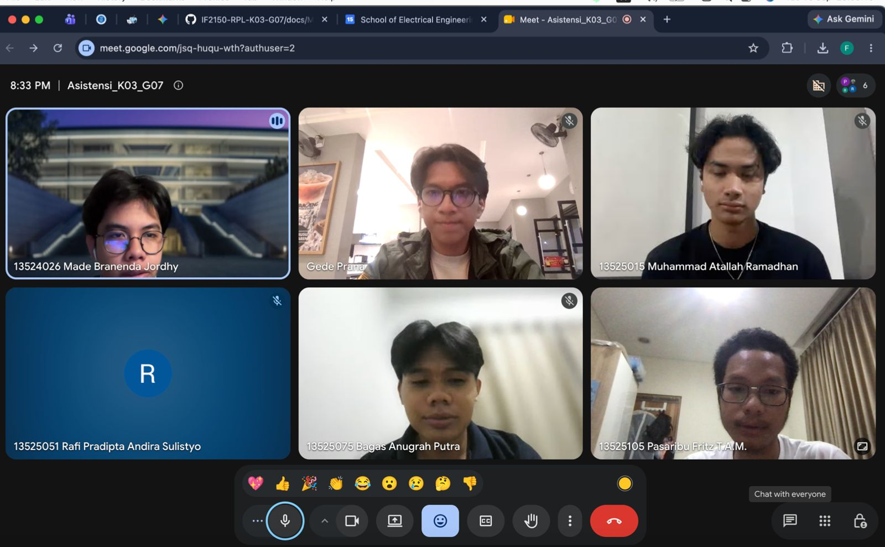

# Form Asistensi

## Tugas Besar IF2150 - Rekayasa Perangkat Lunak

| Informasi | Keterangan |
| --- | --- |
| **Hari** | *Selasa* |
| **Tanggal** | *15/09/2026* |
| **Kelas** | *K-03* |
| **Nomor Kelompok** | *G07*  |
| **Nama Kelompok** | *Siulan*  |
| **Nama Perangkat Lunak** | *LaporKota*  |
| **Dokumen** | *K03_G07_UC*  |

### Anggota Kelompok

| NIM | Nama |
| --- | --- |
| *13525051* | *Rafi Pradipta Andira Sulistyo* |
| *13525105* | *Pasaribu Fritz T.A.M.* |
| *13525075* | *Bagas Anugrah Putra* |
| *13525099* | *Gede Pranajayanta Suputra* |
| *13525015* | *Muhammad Atallah Ramadhan* |

### Catatan

| Catatan |
| --- |
| 1. *Tidak perlu mencantumkan ID pada Kebutuhan Fungsional (KF).* |
| 2. *Dalam menentukan use case, perlu diperhatikan apakah terdapat goal yang sama pada beberapa use case. Jika terdapat goal yang sama, use case dapat digabungkan, dan sebaliknya. Evaluasi kembali apakah terdapat use case yang dapat dicomposed atau digabungkan. Pastikan seluruh KF telah terakomodasi dalam use case.* |
| 3. *Diagram use case masih perlu diperbaiki. Oval pada diagram merupakan use case, bukan nama KF. Pastikan seluruh case/KF yang relevan dimasukkan ke dalam use case. Satu use case dapat melibatkan lebih dari satu aktor.* |
| 4. *Gunakan relasi include dan extend jika sesuai. Contoh include: use case Login include Validasi Kredensial karena validasi bersifat wajib. Contoh extend: use case Checkout extend Menggunakan Voucher karena penggunaan voucher bersifat opsional.* |
| 5. *Diagram use case sudah menggunakan oval sebagai simbol use case, tetapi masih perlu disempurnakan dengan penggunaan relasi include atau extend apabila terdapat hubungan tersebut.* |
| 6. *Pada skenario, tambahkan nama aktor pada kolom. Untuk reaksi PL, letakkan pada baris kedua sehingga aksi aktor dan reaksi PL tersusun secara selang-seling.* |
| 7. *Tidak ada batasan jumlah skenario alternatif. Semakin lengkap skenario alternatif yang dicantumkan, semakin baik. Pertimbangkan kondisi seperti adanya rejection dari aktor lain.* |
| 8. *Format skenario dibuat mengikuti alur swimlane diagram. Aktor yang tidak terlibat dalam suatu alur tidak perlu dicantumkan dalam skenario.* |

## Dokumentasi

<!--  -->

  

  <i>Gambar 1. Dokumentasi kegiatan asistensi.</i>

