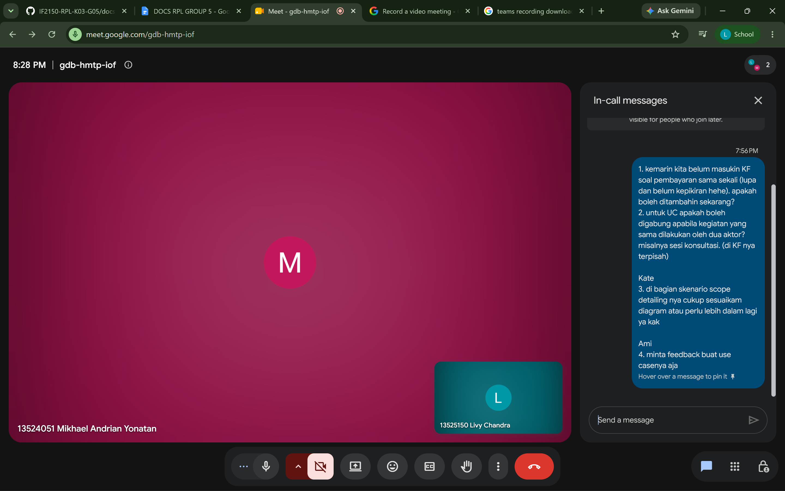

# Form Asistensi

## Tugas Besar IF2150 - Rekayasa Perangkat Lunak

| Informasi | Keterangan |
| --- | --- |
| **Hari** | Senin |
| **Tanggal** | 07/09/2026 |
| **Kelas** | K03 |
| **Nomor Kelompok** | 5  |
| **Nama Kelompok** | HEYSRIUSLAH  |
| **Nama Perangkat Lunak** | LawHub  |
| **Dokumen** | K03_G05_RG  |

### Anggota Kelompok

| NIM | Nama |
| --- | --- |
| 13525003 | Cherinette Corsane Khassyah Purceria |
| 13525057 | Raya Medina Farrelin |
| 13525108 | Khasya Nurul Amini |
| 13525138 | Cathrine Angel Siburian |
| 13525150 | Livy Chandra |

### Catatan

| Catatan |
| --- |
| 1. Kalo ada tambahan atau ada yang mau diubah langsung ubah aja karena ternyata milestone baru final di M5. |
| 2. Kalo kegiatan sama dilakukan dua aktor, UC boleh digabung. Jadi 1 node use case, dengan panah masuk dari kedua aktor (masyarakat & mitra pengacara) ke node yang sama itu. |
| 3. Skenario itu action. Di trigger sama aksi aktor dan direspon software. Skenario normal kalo berhasil biasa, skenario alternatif yg diluar normal kaya salah atau miss (gausah cari yg detail2 bgt ky salah pw dan salah usn dibedain tabelnya itu gausah). Buat dari aksi awal sampai selesai, sampai semua UC terpenuhi. Kalo respon software beda, tabel dibedain. |
| 4. Feedback use case: Grouping KF-KF yang mirip, urutin dari KF01 ke bawah biar rapi. Use case harus cover semua KF, sekarang masih ada yang bolong (KF01 belum ke-cover). Pakai kata kerja aktif buat use case (mirip aktivitas, intinya "apa yang bisa dilakuin user di web"). Pendekatan yang benar: dari KF → turunkan jadi use case (bukan sebaliknya). |
| 5. KF diubah ke format EARS(?), batasnya sampe M5. |
| 6. R ada 30 tapi gak semua dipetakan ke KF? Semua R idealnya tetap punya trace. Relasi KF↔R bisa many-to-many (1 KF cover beberapa R, dan sebaliknya). Preferensi gak dinilai benar/salah, yang penting logis dan bisa dibayangkan. |
| 7. KNF (non-fungsional) mungkin bisa disesuaiin lagi constraintnya karena nanti bisa jadi di demo diminta buat buktiin KNF tercapai. Kalo sedetail ini bagus sebenarnya, tapi pastiin harus terukur. Gak ada batas minimum jumlah KNF dan ga ada standar baku (biasanya yang umum/wajar aja) jadi santai dikit gapapa. |
| 8. Alur berpikir M3: goal → task → action. Task bisa di dekomposisi jadi action; action = skenario yang udah gak bisa dipecah lagi. |
| 9. Kunci nyusun use case: mulai dari aktivitas yang pengen dilakuin user → turunkan jadi kebutuhan fungsional → simpulkan sebagai use case. Use case pada dasarnya "memenuhi" aktivitas, cuma dikembangkan lebih spesifik dari KF (ini cara berpikir/preferensi, bukan rumus baku). |
| 10. Bikin diagram yang rapi, semua use case masuk jadi node jangan ada yang ilang. |
| 11. Traceability itu preferensi/best practice, bukan kewajiban mutlak, tapi ditekankan banget di RPL, definisikan dulu sebelum implementasi karena makin jelas desain makin gampang eksekusinya. |
| 12. UC gak perlu banyak karena sebenernya ga dicek ada berapa banyak etc, yg dicek dan penting itu cara ngembangin UC dari KF bener atau ngga, skenario bisa menggambarkan atau ngga, etc. Jadi definisi detail itu ngga nambah nilai tapi kalo didefinisikan lebih detail nanti implementasinya lebih gampang. Bisa mulai mikirin dari sekarang karena kata kakaknya kemarin mereka chaos bgt karena ga detail TT. |
| 13. Diagram itu keluar pas ujian tahun lalu, kaya include extend itu penting banget dipahami. |

**Notes for this section:**  
*Catatan dapat dituliskan dalam bentuk paragraf atau poin-poin, disesuaikan saja.* 

## Dokumentasi

<!--  -->

  

  <i>Gambar 1. Dokumentasi kegiatan asistensi.</i>

