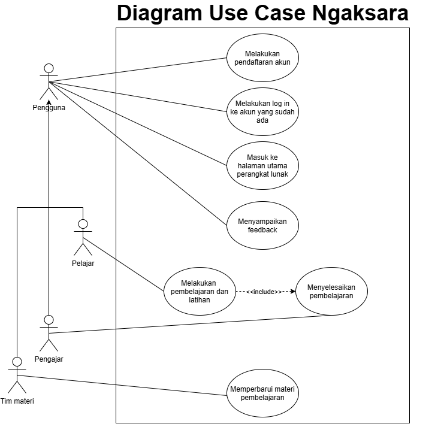
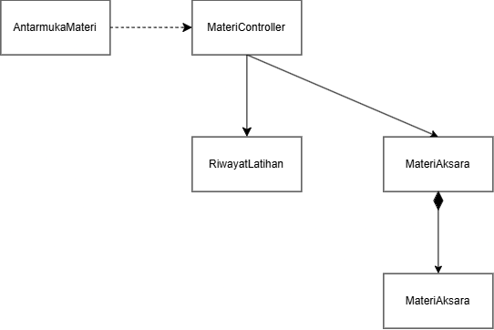
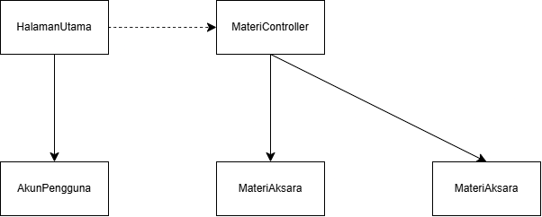

<h1>
IF2150 REKAYASA PERANGKAT LUNAK
 
TUGAS 4
 
CLASS DIAGRAM
</h1>
 

## Ngaksara

### Untuk: Amanda Aurellia Salsabilla

Dipersiapkan oleh:
| Informasi | Keterangan |
| --- | --- |
| Kelas | K2 |
| Kelompok | 4 |

| NIM      | Nama                           |
| -------- | ------------------------------ |
| 13525026 | Ryuza Nadif Aldebaran          |
| 13525029 | Muhammad Naufal Hilmi          |
| 13525077 | Muhammad Abduh                 |
| 13525107 | Nathaniel Marvelo              |
| 13525113 | Diandra Aria Yufana            |
| 13525143 | Natan Danuarta Ariel Wicaksana |

---

## Daftar Perubahan

| Revisi | Deskripsi                             |
| :----- | :------------------------------------ |
| _A_    | Memperjelas deskripsi perangkat lunak |
| _B_    |                                       |
| _C_    |                                       |
| ...    |                                       |

 
 

# BAB 1: Deskripsi Perangkat Lunak

Ngaksara merupakan solusi perangkat lunak berbasis web yang kami usulkan sebagai upaya pemenuhan SDGs 4 (Quality Education). Format web ini dipilih untuk meningkatkan aksesibilitas sehingga pengguna dapat langsung mengakses platform tanpa perlu mengunduh aplikasi terlebih dahulu. Ngaksara dirancang khusus untuk menunjang proses pembelajaran aksara yang kompleks, dengan fokus awal pada aksara Jawa dan Sunda. Melalui platform ini, kami berharap dapat berkontribusi dalam pelestarian dan pembelajaran berbagai bahasa daerah.

Platform ini dirancang untuk dua target pengguna utama yaitu pelajar dan pengajar. Pelajar memiliki fleksibilitas untuk belajar secara mandiri atau bergabung ke dalam kelas menggunakan kode yang dibagikan oleh pengajar. Di dalam kelas tersebut, pengajar dapat mendistribusikan latihan, menentukan tenggat waktu, memantau perkembangan siswa, mengidentifikasi bagian yang sering salah, serta memberikan umpan balik dan rekomendasi materi lanjutan.

Untuk metode pembelajarannya, salah satu mode latihan yang ditawarkan Ngaksara adalah menggambar aksara mengikuti garis panduan (outline), dengan opsi tanpa garis panduan bagi pengguna yang sudah mahir. Sistem akan menilai tingkat keakuratan hasil gambar pengguna dibandingkan dengan karakter aslinya. Evaluasi ini berfungsi sebagai tolak ukur sejauh mana goresan mereka sudah presisi sekaligus menjadi acuan untuk mengulang latihan pada karakter tertentu jika hasilnya belum maksimal.

Selain itu, Ngaksara juga menyediakan tiga mode latihan tambahan. Pertama, mode mencocokkan aksara dengan bunyi di mana pengguna memilih aksara atau rangkaian yang tepat berdasarkan audio yang diputar sistem. Kedua, mode merangkai aksara yang melatih pengguna menyusun aksara dan tanda baca menjadi suku kata atau kata sesuai aturan yang berlaku. Ketiga, mode transliterasi yaitu mengubah tulisan latin menjadi aksara Jawa/Sunda atau sebaliknya tanpa menerjemahkan makna kalimat. Ketiga metode latihan di atas merupakan solusi kami untuk meningkatkan penguasaan pelafalan dan pemahaman bahasa tersebut secara menyeluruh. Fitur-fitur ini dirancang agar pengguna tidak sekadar mampu menulis aksara dengan baik, tetapi juga tepat dalam melafalkannya, mengingat bentuk tulisan pada aksara yang kompleks sering kali tidak mencerminkan cara bacanya secara langsung.

Guna mendukung proses belajar yang berkelanjutan, Ngaksara menyediakan materi pembelajaran yang disusun secara bertahap. Materi dimulai dari pengenalan karakter dasar hingga penggabungan karakter menjadi kata dan kalimat sederhana. Melalui susunan yang terstruktur ini, kami berharap pengguna dapat mengikuti proses belajar sesuai dengan kecepatan dan kemampuan masing-masing, tanpa perlu merasa tertinggal atau terlalu terbebani oleh materi.

Untuk menjaga motivasi, Ngaksara menyimpan seluruh hasil latihan untuk membentuk rekam jejak progres belajar. Sistem ini menerapkan fitur streak harian, yang akan bertambah apabila pelajar menyelesaikan setidaknya satu aktivitas belajar yang sah (aktivitas yang hanya dibuka tanpa diselesaikan tidak akan menambah streak atau poin).

Sebagai pelengkap, terdapat fitur papan peringkat yang diterapkan secara eksklusif pada tingkat kelas (bukan global) dan dapat diaktifkan atau dinonaktifkan oleh pengajar. Poin pada papan peringkat diberikan berdasarkan penyelesaian dan ketepatan latihan. Sistem juga membatasi perolehan poin agar pengulangan soal yang sama tidak bisa digunakan untuk mengumpulkan poin tanpa batas. Privasi pelajar juga tetap terjaga karena identitas yang ditampilkan di papan peringkat menggunakan nama tampilan yang bebas mereka pilih.

---

# BAB 2: Kebutuhan Fungsional

## 2.1 Kebutuhan Fungsional

| ID KF | ID Kebutuhan | Penjelasan                                                                                                                                                   |
| ----- | ------------ | ------------------------------------------------------------------------------------------------------------------------------------------------------------ |
| KF01  | R01          | Sistem harus menampilkan pilihan antarmuka pendaftaran akun untuk setiap opsi pengguna (pelajar, pengajar, maupun tim materi)                                |
| KF02  | R01          | Sistem harus memberikan akses kontrol/privilege berbeda untuk setiap jenis pengguna                                                                          |
| KF03  | R02          | Sistem harus menampilkan pilihan antarmuka log-in untuk setiap opsi pengguna (pelajar, pengajar, maupun tim materi)                                          |
| KF04  | R02          | Ketika pengguna melakukan pendaftaran akun, log in, atau logout, sistem harus memproses permintaan tersebut melalui pengecekan validitas kredensial          |
| KF05  | R03          | Setelah pengguna membuat kata sandi, sistem harus mengenkripsi kata sandi tersebut sebelum disimpan di database                                              |
| KF06  | R04          | Sistem harus menampilkan dokumen Terms & Conditions kepada pengguna saat membuat akun                                                                        |
| KF07  | R04          | Bila pengguna belum mencapai akhir dokumen Terms & Conditions, maka sistem harus menolak melanjutkan pembuatan akun                                          |
| KF08  | R05          | Sistem harus menampilkan tampilan antarmuka untuk setiap fitur pengajaran yang ditawarkan                                                                    |
| KF09  | R06          | Ketika pengguna berada di halaman utama, sistem harus menampilkan daftar materi secara terurut berdasarkan jenis aksara atau tingkat kesulitan               |
| KF10  | R08          | Jika tersedia opsi menampilkan outline, sistem harus menampilkan tampilan antarmuka fitur menggambar aksara sesuai dengan opsi outline yang dipilih pengguna |
| KF11  | R08          | Ketika pengguna berinteraksi dengan sistem dalam penggambaran aksara, sistem harus memproses interaksi tersebut                                              |
| KF12  | R09          | Ketika pengguna menggoreskan aksara di layar, sistem harus menilai akurasi goresan tersebut terhadap template dengan algoritma yang sesuai                   |
| KF13  | R11          | Sistem harus menampilkan tampilan antarmuka riwayat pengerjaan latihan pelajar bagi pengajar                                                                 |
| KF14  | R12          | Setelah pelajar melakukan aktivitas pembelajaran, sistem harus mencatat dan menyimpan riwayat aktivitas tersebut agar dapat diakses pengajar                 |
| KF15  | R13          | Ketika diperlukan pembaharuan materi, sistem harus mensinkronisasi data-data konten dari tim materi ke dalam database terpusat                               |
| KF16  | R14          | Ketika diperlukan pembaharuan materi, sistem harus memodifikasi konten pembelajaran sesuai dengan pilihan dan tingkat akses tim materi                       |
| KF17  | R16          | Dalam interval waktu yang rutin, sistem harus mencatat dan menyimpan log aktivitas dan error yang terjadi                                                    |
| KF18  | R18          | Saat pelajar memiliki keluhan atau feedback, sistem harus menerima keluhan tersebut melalui form yang tersedia                                               |
| KF19  | R18          | Ketika sistem menerima keluhan atau feedback dari pelajar, sistem harus mengirimkannya ke server                                                             |
| KF20  | R18          | Ketika server menerima keluhan atau feedback dari pelajar, sistem harus menampilkan keluhan tersebut di tampilan antarmuka admin                             |

---

# BAB 3: Model Use Case

## 3.1 Identifikasi Aktor

| Aktor         | Deskripsi                                                                                                                                                                                                                                                        |
| :------------ | :--------------------------------------------------------------------------------------------------------------------------------------------------------------------------------------------------------------------------------------------------------------- |
| Pelajar       | Pengguna yang login ke aplikasi untuk belajar dan berlatih aksara Jawa dan Sunda. Pengguna ini dapat menggunakan fitur komunikasi untuk bertanya langsung kepada pengajar jika mengalami kesulitan dalam menjalankan aplikasi maupun kebingungan terkait materi. |
| Pengajar      | Pengguna yang login sebagai fasilitator pembelajaran. Pengguna ini memiliki akses untuk melihat rekam jejak latihan pelajar, menganalisis kelemahan yang mereka hadapi berdasarkan data latihan, serta membalas pertanyaan yang diajukan oleh pelajar.           |
| Tim Materi    | Pengguna yang bertindak sebagai pengelola konten materi. Tim materi membutuhkan akses untuk mengelola modul.                                                                                                                                                     |
| Administrator | Pengguna yang bertindak sebagai teknisi pemelihara sistem aplikasi. Pengguna ini memantau kelancaran fitur fitur agar aplikasi berjalan lancar.                                                                                                                  |

## 3.2 Identifikasi Use Case

| ID UC | Nama Use Case                                          | Deskripsi Singkat                                                                                    | Aktor Terlibat                   | ID KF Terkait                            |
| :---- | :----------------------------------------------------- | :--------------------------------------------------------------------------------------------------- | :------------------------------- | :--------------------------------------- |
| UC01  | Melakukan pendaftaran akun                             | Pelajar, pengajar, atau tim materi melakukan pembuatan akun untuk dapat menggunakan perangkat lunak  | Pelajar, pengajar, tim materi    | KF01, KF02, KF03, KF04, KF05, KF06, KF07 |
| UC02  | Melakukan log in ke akun yang telah ada                | Pelajar, pengajar, atau tim materi melakukan log in ke akun yang telah dibuat                        | Pelajar, pengajar, tim materi    | KF01, KF02, KF03, KF04                   |
| UC03  | Masuk ke halaman utama perangkat lunak                 | Pelajar, pengajar, atau tim materi masuk ke halaman utama perangkat lunak setelah melakukan log in   | Pelajar, pengajar, tim materi    | KF08, KF09                               |
| UC04  | Menulis aksara saat melakukan pembelajaran             | Pelajar menulis aksara saat melakukan pembelajaran pada perangkat lunak                              | Pelajar                          | KF10, KF11, KF12                         |
| UC05  | Menyelesaikan pembelajaran                             | Pelajar menyelesaikan aktivitas pembelajaran di perangkat lunak                                      | Pelajar, pengajar                | KF13, KF14                               |
| UC06  | Memperbaharui materi pembelajaran pada perangkat lunak | Tim materi melakukan pembaharuan atau perbaikan pada materi pembelajaran yang ada di perangkat lunak | Tim materi                       | KF15, KF16                               |
| UC07  | Menyampaikan feedback                                  | Pelajar menyampaikan feedback yang dimiliki melalui form yang tersedia di perangkat lunak            | Pelajar, pengajar, administrator | KF18, KF19, KF20                         |

## 3.3 Use Case Diagram

 

<i>Gambar 1. Diagram Use Case Ngaksara</i>

 

## 3.4 Skenario Use Case

### 3.4.1 Skenario UC01

**Nama Use Case:** Melakukan Pendaftaran Akun

**Skenario Normal**

| No  | Aksi Aktor                                                      | Reaksi Perangkat Lunak                                                                    |
| :-- | :-------------------------------------------------------------- | :---------------------------------------------------------------------------------------- |
| 1   | Pengguna memilih opsi pendaftaran akun (pelajar, pengajar)      | Sistem menampilkan antarmuka opsi pemilihan jenis akun yang didaftarkan                   |
| 2   | Pengguna memasukkan kredensial akun (email, password, username) | Sistem menampilkan antarmuka pendaftaran akun dan memverifikasi kredensial yang digunakan |
| 3   | Pengguna membaca Terms & Conditions aplikasi                    | Sistem menerima afirmasi bahwa pengguna sudah membaca Terms & Conditions yang berlaku     |

 

**Skenario Alternatif 1: Otorisasi Pembayaran Gagal**

| No  | Aksi Aktor                                                      | Reaksi Perangkat Lunak                                                                    |
| :-- | :-------------------------------------------------------------- | :---------------------------------------------------------------------------------------- |
| 1   | Pengguna memilih opsi pendaftaran akun (pelajar, pengajar)      | Sistem menampilkan antarmuka opsi pemilihan jenis akun yang didaftarkan                   |
| 2   | Pengguna memasukkan kredensial akun (email, password, username) | Sistem menampilkan antarmuka pendaftaran akun dan memverifikasi kredensial yang digunakan |
| 3   | Pengguna memastikan kredensial yang digunakan sesuai.           | Kembali ke langkah 2 Skenario Normal                                                      |

### 3.4.2 Skenario UC02

**Nama Use Case:** _Memverifikasi Status Pembayaran_

**Skenario Normal**

| No  | Aksi Aktor                               | Reaksi Perangkat Lunak                                                                       |
| :-- | :--------------------------------------- | :------------------------------------------------------------------------------------------- |
| 1   | Pelanggan memilih menu login             | Sistem menampilkan antarmuka opsi pemilihan jenis akun yang sudah didaftarkan                |
| 2   | Pengguna memilih jenis akun              | Sistem mengarahkan pengguna ke halaman verifikasi akses pengguna                             |
| 3   | Pengguna memasukkan kredensial akun      | Sistem mengautentikasi kredensial yang dimasukkan pengguna berdasarkan informasi di database |
| 4   | Pengguna berhasil masuk ke halaman utama | Sistem mengarahkan pengguna ke halaman utama website                                         |

 

**Skenario Alternatif 1: Kredensial Login Tidak Sesuai**

| No  | Aksi Aktor                                           | Reaksi Perangkat Lunak                                                                       |
| :-- | :--------------------------------------------------- | :------------------------------------------------------------------------------------------- |
| 1   | Pelanggan memilih menu login                         | Sistem menampilkan antarmuka opsi pemilihan jenis akun yang sudah didaftarkan                |
| 2   | Pengguna memilih jenis akun                          | Sistem mengarahkan pengguna ke halaman verifikasi akses pengguna                             |
| 3   | Pengguna memasukkan kredensial akun                  | Sistem mengautentikasi kredensial yang dimasukkan pengguna berdasarkan informasi di database |
| 4   | Pengguna memastikan kredensial yang digunakan sesuai | Kredensial yang digunakan pengguna tidak sesuai. Kembali ke langkah 3 Skenario Normal        |

**Skenario Alternatif 2: Kredensial Pengguna Lupa**

| No  | Aksi Aktor                                     | Reaksi Perangkat Lunak                                                                       |
| :-- | :--------------------------------------------- | :------------------------------------------------------------------------------------------- |
| 1   | Pelanggan memilih menu login                   | Sistem menampilkan antarmuka opsi pemilihan jenis akun yang sudah didaftarkan                |
| 2   | Pengguna memilih jenis akun                    | Sistem mengarahkan pengguna ke halaman verifikasi akses pengguna                             |
| 3   | Pengguna memasukkan kredensial akun            | Sistem mengautentikasi kredensial yang dimasukkan pengguna berdasarkan informasi di database |
| 4   | Pengguna memilih opsi untuk mengganti password | Sistem mengarahkan pengguna ke halaman penggantian password                                  |
| 5   | Pengguna memasukkan password pengganti         | Sistem menerima password pengganti dan mensinkronisasi perubahan dengan database             |

### 3.4.1 Skenario UC03

**Nama Use Case:** Masuk ke halaman utama perangkat lunak

**Skenario Normal**

| No  | Aksi Aktor                                                                                                                     | Reaksi Perangkat Lunak                                                                                                                |
| :-- | :----------------------------------------------------------------------------------------------------------------------------- | :------------------------------------------------------------------------------------------------------------------------------------ |
| 1   | Pelajar masuk ke menu utama perangkat lunak setelah melakukan log in                                                           | Sistem menampilkan halaman utama yang mana terdapat bahasa-bahasa yang dapat dipelajari beserta tiap fitur pengajaran yang ditawarkan |
| 2   | Pelajar memilih salah satu pilihan bahasa yang tersedia                                                                        | Sistem menampilkan daftar materi pembelajaran untuk bahasa tersebut beserta fitur pengajaran yang tersedia                            |
| 3   | Pelajar melakukan mengurutkan materi pembelajaran berdasarkan tingkat kesulitan, jenis pembelajaran, atau sesuai urutan babnya | Sistem menampilkan materi pembelajaran untuk bahasa yang dipilih yang telah terurut sesuai opsi yang dipilih                          |
| 4   | Pengajar masuk ke menu utama perangkat lunak setelah melakukan log in                                                          | Sistem menampilkan daftar kelas atau grup dimana ia mengajar                                                                          |
| 5   | Pengajar memilih salah satu kelas yang tersedia                                                                                | Sistem menampilkan daftar peserta kelas/murid dari kelas yang dipilih                                                                 |
| 6   | Pengajar memilih salah satu murid yang ada di kelasnya                                                                         | Sistem menampilkan progress belajar dan nilai dari siswa yang dipilih                                                                 |
| 7   | Tim materi masuk ke menu utama perangkat lunak setelah melakukan log in                                                        | Sistem menampilkan antarmuka dimana tim materi dapat melakukan perubahan atau pembaharuan terhadap materi pembelajaran yang tersedia  |

 

**Skenario Alternatif 1: Halaman utama gagal terload**

| No  | Aksi Aktor                                                                                                                     | Reaksi Perangkat Lunak                                                                                                                     |
| :-- | :----------------------------------------------------------------------------------------------------------------------------- | :----------------------------------------------------------------------------------------------------------------------------------------- |
| 1   | Pelajar masuk ke menu utama perangkat lunak setelah melakukan log in                                                           | Sistem menampilkan halaman utama yang mana terdapat bahasa-bahasa yang dapat dipelajari beserta tiap fitur pengajaran yang ditawarkan      |
| 2   | Pelajar memilih salah satu pilihan bahasa yang tersedia                                                                        | Sistem menampilkan daftar materi pembelajaran untuk bahasa tersebut beserta fitur pengajaran yang tersedia                                 |
| 3   | Pelajar melakukan mengurutkan materi pembelajaran berdasarkan tingkat kesulitan, jenis pembelajaran, atau sesuai urutan babnya | Sistem gagal menampilkan materi pembelajaran untuk bahasa yang dipilih yang telah terurut sesuai opsi yang dipilih                         |
| 4   | Pelajar me-refresh halaman                                                                                                     | Sistem mencoba untuk menampilkan ulang halaman yang di-refresh                                                                             |
| 5   | Pengajar masuk ke menu utama perangkat lunak setelah melakukan log in                                                          | Sistem gagal menampilkan daftar kelas atau grup dimana ia mengajar                                                                         |
| 6   | Pengajar me-refresh halaman                                                                                                    | Sistem mencoba untuk menampilkan ulang halaman yang di-refresh                                                                             |
| 7   | Pengajar memilih salah satu kelas yang tersedia                                                                                | Sistem menampilkan daftar peserta kelas/murid dari kelas yang dipilih                                                                      |
| 8   | Pengajar memilih salah satu murid yang ada di kelasnya                                                                         | Sistem menampilkan progress belajar dan nilai dari siswa yang dipilih                                                                      |
| 9   | Tim materi masuk ke menu utama perangkat lunak setelah melakukan log in                                                        | Sistem gagal menampilkan antarmuka dimana tim materi dapat melakukan perubahan atau pembaharuan terhadap materi pembelajaran yang tersedia |
| 10  | Tim materi me-refresh halaman                                                                                                  | Sistem mencoba untuk menampilkan ulang halaman yang di-refresh                                                                             |

### 3.4.1 Skenario UC04

**Nama Use Case:** Menulis aksara saat melakukan pembelajaran

**Skenario Normal**

| No  | Aksi Aktor                                                           | Reaksi Perangkat Lunak                                                                                         |
| :-- | :------------------------------------------------------------------- | :------------------------------------------------------------------------------------------------------------- |
| 1   | Pelajar memilih fitur pembelajaran menulis aksara                    | Sistem menampilkan outline aksara sesuai materi yang sebelumnya dipilih                                        |
| 2   | Pelajar menggambarkan aksara sesuai outline yang tampil di perangkat | Sistem menggambarkan di layar sesuai dengan goresan yang dilakukan oleh pelajar                                |
| 3   | Pelajar menyelesaikan penggambaran aksara                            | Sistem menilai keakuratan penulisan aksara berdasarkan data yang ada di sistem dan lanjut ke aksara berikutnya |

 

**Skenario Alternatif 1: Pelajar kurang akurat dalam penulisan aksara**

| No  | Aksi Aktor                                                           | Reaksi Perangkat Lunak                                                                                                                       |
| :-- | :------------------------------------------------------------------- | :------------------------------------------------------------------------------------------------------------------------------------------- |
| 1   | Pelajar memilih fitur pembelajaran menulis aksara                    | Sistem menampilkan outline aksara sesuai materi yang sebelumnya dipilih                                                                      |
| 2   | Pelajar menggambarkan aksara sesuai outline yang tampil di perangkat | Sistem menggambarkan di layar sesuai dengan goresan yang dilakukan oleh pelajar                                                              |
| 3   | Pelajar menyelesaikan penggambaran aksara                            | Sistem menilai keakuratan penulisan aksara berdasarkan data yang ada di sistem                                                               |
| 4   | Pelajar mengulangi penggambaran aksara                               | Sistem menilai bahwa keakuratan aksara yang telah digambar oleh pelajar terlalu rendah sehingga outline aksara yang sama akan muncul kembali |

### 3.4.1 Skenario UC05

**Nama Use Case:** Menyelesaikan pembelajaran

**Skenario Normal**

| No  | Aksi Aktor                                                   | Reaksi Perangkat Lunak                                                                                               |
| :-- | :----------------------------------------------------------- | :------------------------------------------------------------------------------------------------------------------- |
| 1   | Pelajar mengonfirmasi bahwa ia menyelesaikan pembelajaran    | Sistem menambahkan hasil pembelajaran ke riwayat pelajar dan menampilkan notifikasi riwayat pelajar telah diperbarui |
| 2   | Pelajar memilih melihat riwayat pembelajaran                 | Sistem mengarahkan pelajar ke halaman riwayat dan menampilkan riwayat yang telah diperbarui                          |
| 3   | Pengajar memilih menu riwayat pelajar pada kelas yang diajar | Sistem menampilkan daftar pelajar beserta status penyelesaian pembelajaran terbaru                                   |
| 4   | Pengajar memilih salah satu pelajar untuk melihat detail     | Sistem menampilkan detail riwayat dan progres pembelajaran pelajar yang dipilih                                      |

 

**Skenario Alternatif 1: Konfirmasi penyelesaian pembelajaran gagal**

| No  | Aksi Aktor                                                      | Reaksi Perangkat Lunak                                                  |
| :-- | :-------------------------------------------------------------- | :---------------------------------------------------------------------- |
| 1   | Pelajar mengonfirmasi bahwa ia menyelesaikan pembelajaran       | Sistem menampilkan pesan error "gagal mengonfirmasi hasil pembelajaran" |
| 2   | Pelajar memilih melihat riwayat pembelajaran                    | Sistem menampilkan riwayat, hasil pembelajaran baru tidak terlihat      |
| 3   | Pelajar mengonfirmasi ulang bahwa ia menyelesaikan pembelajaran | Sistem kembali ke langkah 1 skenario normal                             |

 

**Skenario Alternatif 2: Riwayat pelajar belum tersedia**

| No  | Aksi Aktor                                                                    | Reaksi Perangkat Lunak                                                                                                                  |
| :-- | :---------------------------------------------------------------------------- | :-------------------------------------------------------------------------------------------------------------------------------------- |
| 1   | Pengajar memilih menu riwayat pelajar pada kelas yang diajar                  | Sistem menampilkan daftar pelajar beserta status penyelesaian pembelajaran terbaru                                                      |
| 2   | Pengajar memilih pelajar yang belum pernah menyelesaikan pembelajaran apa pun | pelajar yang belum pernah menyelesaikan pembelajaran apa punSistem menampilkan pesan "belum ada riwayat pembelajaran untuk pelajar ini" |
| 3   | Pengajar memilih salah satu pelajar lain untuk melihat detail                 | Sistem kembali ke langkah 4 skenario normal                                                                                             |

### 3.4.1 Skenario UC06

**Nama Use Case:** Memperbaharui materi pembelajaran

**Skenario Normal**

| No  | Aksi Aktor                                                                               | Reaksi Perangkat Lunak                                            |
| :-- | :--------------------------------------------------------------------------------------- | :---------------------------------------------------------------- |
| 1   | Tim materi memilih menu pengelolaan materi                                               | Sistem menampilkan daftar materi yang dapat diedit.               |
| 2   | Tim materi memilih opsi menambahkan materi baru                                          | Sistem mengarahkan pelanggan ke halaman menambahkan materi        |
| 3   | Tim materi mengunggah file materi dan mengisi detail (nama, kategori, tingkat kesulitan) | Sistem memvalidasi dan menyimpan materi baru ke database terpusat |
| 4   | Tim materi menyimpan hasil perbaruan materi.                                             | Sistem menampilkan pesan "materi berhasil ditambahkan".           |

 

**Skenario Alternatif 1: Penambahan materi gagal**

| No  | Aksi Aktor                                 | Reaksi Perangkat Lunak                                                                                                                                                                                  |
| :-- | :----------------------------------------- | :------------------------------------------------------------------------------------------------------------------------------------------------------------------------------------------------------ |
| 1   | Tim materi memilih menu memperbarui materi | Sistem menampilkan ringkasan pesanan dan pilihan metode pembayaran                                                                                                                                      |
| 2   | Tim materi menambahkan materi baru         | Sistem menerima respons penambahan materi gagal (misal: jenis file tidak didukung website). Materi tidak berubah, sistem menampilkan pesan error dan meminta tim materi memilih ulang file materi baru. |
| 3   | Tim materi menambahkan materi ulang        | Sistem kembali ke langkah 2 skenario normal                                                                                                                                                             |

### 3.4.1 Skenario UC07

**Nama Use Case:** Menyampaikan feedback

**Skenario Normal**

| No  | Aksi Aktor                                                                          | Reaksi Perangkat Lunak                                                           |
| :-- | :---------------------------------------------------------------------------------- | :------------------------------------------------------------------------------- |
| 1   | User (pelajar dan pengajar) memilih menu feedback di bagian samping pada menu utama | Sistem menampilkan form feedback dengan beberapa pertanyaan terbuka dan tertutup |
| 2   | User memilih pilihan feedback (performa/tampilan/fitur/materi)                      | Sistem menampilkan pilihan-pilihan feedback yang dapat diisi oleh user           |
| 3   | User mengirim/submit feedback setelah mengisi                                       | Sistem menampilkan pesan bahwa feedback berhasil terkirim                        |

 

**Skenario Alternatif 1: Feedback gagal terkirim (karena server down/kendala jaringan)**

| No  | Aksi Aktor                                                                          | Reaksi Perangkat Lunak                                                           |
| :-- | :---------------------------------------------------------------------------------- | :------------------------------------------------------------------------------- |
| 1   | User (pelajar dan pengajar) memilih menu feedback di bagian samping pada menu utama | Sistem menampilkan form feedback dengan beberapa pertanyaan terbuka dan tertutup |
| 2   | User memilih pilihan feedback (performa/tampilan/fitur/materi)                      | Sistem menampilkan pilihan-pilihan feedback yang dapat diisi oleh user           |
| 3   | User mengirim/submit feedback setelah mengisi                                       | Sistem menampilkan pesan bahwa feedback gagal terkirim                           |

---

# BAB 4: Diagram Kelas

Bagian ini berisi identifikasi kelas dan pemodelan struktur kelas yang diperlukan untuk merealisasikan use case pada BAB 3. Gunakan skenario use case (3.4) sebagai dasar untuk menentukan kelas, atribut, metode, dan hubungan antarkelas.

## 4.1 Identifikasi Kelas

Identifikasi seluruh kelas yang diperlukan berdasarkan use case dan skenarionya. Satu kelas boleh terkait dengan lebih dari satu use case. Pada perancangan ini, kelas dibagi menjadi tiga jenis sesuai dengan arsitektur aplikasi berbasis web: _Entity_ (representasi data), _Boundary_ (antarmuka pengguna), dan _Controller_ (pengelola logika bisnis).

| ID Kelas | Nama Kelas             | Deskripsi Kelas                                                                                                        | ID Use Case      |
| :------- | :--------------------- | :--------------------------------------------------------------------------------------------------------------------- | :--------------- |
| C01      | `AkunPengguna`         | _(Entity)_ Menyimpan data kredensial, profil, dan peran pengguna (Pelajar, Pengajar, Tim Materi).                      | UC01, UC02, UC03 |
| C02      | `MateriAksara`         | _(Entity)_ Menyimpan data modul, outline aksara, dan tingkat kesulitan materi.                                         | UC03, UC04, UC06 |
| C03      | `RiwayatLatihan`       | _(Entity)_ Menyimpan catatan penyelesaian modul, nilai evaluasi goresan, dan rekam jejak progres pelajar.              | UC03, UC04, UC05 |
| C04      | `DataFeedback`         | _(Entity)_ Menyimpan laporan kendala atau masukan yang dikirimkan oleh pengguna beserta status penyelesaiannya.        | UC07             |
| C05      | `HalamanPendaftaran`   | _(Boundary)_ Antarmuka untuk memasukkan data diri dan persetujuan pembuatan akun baru.                                 | UC01             |
| C06      | `HalamanLogin`         | _(Boundary)_ Antarmuka untuk memasukkan kredensial akses masuk pengguna.                                               | UC02             |
| C07      | `HalamanUtama`         | _(Boundary)_ Dasbor utama yang menyesuaikan tampilan dengan peran pengguna setelah berhasil _log in_.                  | UC03             |
| C08      | `HalamanLatihan`       | _(Boundary)_ Antarmuka kanvas interaktif bagi pelajar untuk menggambar atau menebalkan aksara.                         | UC04, UC05       |
| C09      | `HalamanKelolaMateri`  | _(Boundary)_ Antarmuka bagi Tim Materi untuk melihat daftar, mengunggah, atau menyunting modul aksara.                 | UC06             |
| C10      | `HalamanFeedback`      | _(Boundary)_ Antarmuka formulir pengaduan kendala untuk diisi oleh pelajar atau pengajar.                              | UC07             |
| C11      | `OtentikasiController` | _(Controller)_ Menangani logika _backend_ enkripsi kata sandi, validasi sesi _login_, dan verifikasi pendaftaran akun. | UC01, UC02       |
| C12      | `LatihanController`    | _(Controller)_ Mengelola logika perbandingan akurasi goresan aksara dengan _template_ dan memperbarui riwayat belajar. | UC04, UC05       |
| C13      | `MateriController`     | _(Controller)_ Mengelola logika pengurutan, penarikan, penambahan, dan pembaruan data materi aksara di _database_.     | UC03, UC06       |
| C14      | `FeedbackController`   | _(Controller)_ Menerima, memvalidasi format, dan menyimpan kiriman _form feedback_ ke dalam _database_.                | UC07             |

## 4.2 Diagram Kelas per Use Case

Buat diagram kelas untuk setiap use case pada 3.2.

### 4.2.1 Use Case UC01

**Nama Use Case:** Melakukan pendaftaran akun

#### Identifikasi Kelas

| ID Kelas | Nama Kelas  | Deskripsi Kelas                                           |
| :------- | :---------- | :-------------------------------------------------------- |
| _C01_    | _Pelanggan_ | _Menyimpan data akun pelanggan yang membuat pesanan._     |
| _C02_    | _Pesanan_   | _Menyimpan data pesanan yang dibuat dari isi keranjang._  |
| _C03_    | _Keranjang_ | _Menyimpan sementara item yang dipilih sebelum checkout._ |
| _..._    | _..._       | _..._                                                     |

#### Diagram Kelas

<i>Gambar 2. Diagram Kelas Use Case UC01</i>

 

Pada diagram kelas, cukup tampilkan nama kelas saja. Atribut dan metode/operasi milik setiap kelas dapat dituliskan pada tabel di bawah ini. Pastikan hubungan antarkelas menggunakan jenis relasi yang sesuai (asosiasi, agregasi, komposisi, generalisasi, atau dependensi).

| ID Kelas | Nama Kelas  | Atribut                    | Metode/Operasi                 |
| :------- | :---------- | :------------------------- | :----------------------------- |
| _C02_    | _Pesanan_   | _idPesanan, total, status_ | _buatPesanan(), hitungTotal()_ |
| _C03_    | _Keranjang_ | _daftarItem_               | _tambahItem(), checkout()_     |
| _..._    | _..._       | _..._                      | _..._                          |

> Lanjutkan pola **4.2.x** untuk setiap use case pada 3.2.

### 4.2.2 Use Case UC02

**Nama Use Case:** Melakukan log in ke akun yang telah ada

#### Identifikasi Kelas

| ID Kelas | Nama Kelas             | Deskripsi Kelas                                                                                                            |
| :------- | :--------------------- | :------------------------------------------------------------------------------------------------------------------------- |
| C01      | `AkunPengguna`         | _(Entity)_ Menyimpan data kredensial, profil, dan peran pengguna yang digunakan untuk memverifikasi identitas saat log in. |
| C06      | `HalamanLogin`         | _(Boundary)_ Antarmuka bagi pengguna untuk memilih jenis akun dan memasukkan kredensial akses masuk.                       |
| C11      | `OtentikasiController` | _(Controller)_ Menangani logika autentikasi kredensial dan validasi sesi login pengguna.                                   |

#### Diagram Kelas

<i>Gambar X. Diagram Kelas Use Case UC02</i>

 

HalamanLogin bergantung (depedensi) pada OtentikasiController karena setiap kali pengguna mengisi form login, boundary ini memanggil logika autentikasi pada controller untuk diproses, tanpa menyimpan data kredensial secara langsung. OtentikasiController berasosiasi dengan AkunPengguna karena controller perlu mengakses dan mencocokkan data akun yang tersimpan (email, password ter-hash, peran) untuk menentukan apakah kredensial yang dimasukkan valid, sesuai KF03 dan KF04.

| ID Kelas | Nama Kelas             | Atribut                              | Metode/Operasi                           |
| :------- | :--------------------- | :----------------------------------- | :--------------------------------------- |
| C06      | `HalamanLogin`         | _-_                                  | _pilihJenisAkun(), tampilkanFormLogin()_ |
| C11      | `OtentikasiController` | _-_                                  | _autentikasiPengguna(), validasiSesi()_  |
| C01      | `AkunPengguna`         | _idAkun, email, passwordHash, peran_ | _cekKredensial()_                        |

### 4.2.3 Use Case UC03

**Nama Use Case:** Masuk ke halaman utama perangkat lunak

#### Identifikasi Kelas

| ID Kelas | Nama Kelas         | Deskripsi Kelas                                                                                                              |
| :------- | :----------------- | :--------------------------------------------------------------------------------------------------------------------------- |
| C01      | `AkunPengguna`     | _(Entity)_ Menyimpan peran pengguna (Pelajar, Pengajar, Tim Materi) yang menentukan tampilan halaman utama yang disesuaikan. |
| C02      | `MateriAksara`     | _(Entity)_ Menyimpan data modul dan tingkat kesulitan materi yang ditampilkan serta diurutkan di halaman utama.              |
| C03      | `RiwayatLatihan`   | _(Entity)_ Menyimpan rekam jejak progres pelajar yang ditampilkan kepada pengajar saat memilih murid di kelasnya.            |
| C07      | `HalamanUtama`     | _(Boundary)_ Dasbor utama yang menyesuaikan tampilan dan menu dengan peran pengguna setelah berhasil log in.                 |
| C13      | `MateriController` | _(Controller)_ Mengelola logika penarikan dan pengurutan data materi, serta pengambilan data progres pelajar.                |

#### Diagram Kelas

<i>Gambar X. Diagram Kelas Use Case UC03</i>

 

HalamanUtama bergantung (dependensi) pada MateriController untuk meminta daftar materi maupun data progres yang akan ditampilkan, sementara asosiasinya dengan AkunPengguna digunakan untuk membaca peran pengguna agar dasbor yang tampil sesuai (pelajar, pengajar, atau tim materi), sesuai KF08. MateriController berasosiasi dengan MateriAksara untuk mengambil dan mengurutkan materi berdasarkan tingkat kesulitan (KF09), serta dengan RiwayatLatihan untuk menyediakan data progres belajar pelajar kepada pengajar.

| ID Kelas | Nama Kelas         | Atribut                                      | Metode/Operasi                                  |
| :------- | :----------------- | :------------------------------------------- | :---------------------------------------------- |
| C07      | `HalamanUtama`     | _-_                                          | _tampilkanDashboard(), urutkanTampilanMateri()_ |
| C13      | `MateriController` | _-_                                          | _ambilDaftarMateri(), ambilProgresPelajar()_    |
| C02      | `MateriAksara`     | _idMateri, namaAksara, tingkatKesulitan_     | _-_                                             |
| C03      | `RiwayatLatihan`   | _idRiwayat, nilaiAkurasi, tanggalPengerjaan_ | _-_                                             |
| C01      | `AkunPengguna`     | _idAkun, peran_                              | _-_                                             |

### 4.2.4 Use Case UC04

**Nama Use Case:** Menulis aksara saat melakukan pembelajaran

### 4.2.5 Use Case UC05

**Nama Use Case:** Menyelesaikan pembelajaran

### 4.2.6 Use Case UC06

**Nama Use Case:** Memperbaharui materi pembelajaran pada perangkat lunak

#### Identifikasi Kelas

| ID Kelas | Nama Kelas | Deskripsi Kelas |
| :--- | :--- | :--- |
| C02 | `MateriAksara` | *(Entity)* Menyimpan data modul, outline aksara, dan tingkat kesulitan materi. |
| C09 | `HalamanKelolaMateri` | *(Boundary)* Antarmuka bagi Tim Materi untuk melihat daftar, mengunggah, atau menyunting modul aksara. |
| C13 | `MateriController` | *(Controller)* Mengelola logika pengurutan, penarikan, penambahan, dan pembaruan data materi aksara di *database*. |

#### Diagram Kelas

<i>Gambar X. Diagram Kelas Use Case UC06</i>

 

Pada diagram kelas, cukup tampilkan nama kelas saja. Atribut dan metode/operasi milik setiap kelas dapat dituliskan pada tabel di bawah ini. Pastikan hubungan antarkelas menggunakan jenis relasi yang sesuai (asosiasi, agregasi, komposisi, generalisasi, atau dependensi).

| ID Kelas | Nama Kelas | Atribut | Metode/Operasi |
| :--- | :--- | :--- | :--- |
| C09 | HalamanKelolaMateri | *daftarMateri, fileMateriInput, detailInput, pesanStatus* | *tampilkanDaftarMateri(), pilihTambahMateriBaru(), unggahFileMateri(), tampilkanPesanSukses(), tampilkanPesanError()* |
| C13 | MateriController | *materiSedangDiproses, statusValidasi* | *ambilDaftarMateri(), tambahMateri(), validasiFormatFile(), perbaruiMateri()* |
| C02 | MateriAksara | *idMateri, namaMateri, kategori, tingkatKesulitan, fileOutline* | *simpanMateri(), perbaruiData()* |

### 4.2.7 Use Case UC07

**Nama Use Case:** Menyampaikan feedback

#### Identifikasi Kelas

| ID Kelas | Nama Kelas         | Deskripsi Kelas                                                                                               |
| :------- | :----------------- | :------------------------------------------------------------------------------------------------------------ |
| C01      | AkunPengguna       | (Entity) Menyimpan data kredensial, profil, dan peran pengguna (Pelajar, Pengajar, Tim Materi).               |
| C04      | DataFeedback       | (Entity) Menyimpan laporan kendala atau masukan yang dikirimkan oleh pengguna beserta status penyelesaiannya. |
| C10      | HalamanFeedback    | (Boundary) Antarmuka formulir pengaduan kendala untuk diisi oleh pelajar atau pengajar.                       |
| C14      | FeedbackController | (Controller) Menerima, memvalidasi format, dan menyimpan kiriman form feedback ke dalam database.             |

#### Diagram Kelas

<i>Gambar X. Diagram Kelas Use Case UC07</i>

 

Pada diagram kelas, cukup tampilkan nama kelas saja. Atribut dan metode/operasi milik setiap kelas dapat dituliskan pada tabel di bawah ini. Pastikan hubungan antarkelas menggunakan jenis relasi yang sesuai (asosiasi, agregasi, komposisi, generalisasi, atau dependensi).

| ID Kelas | Nama Kelas         | Atribut                    | Metode/Operasi                 |
| :------- | :----------------- | :------------------------- | :----------------------------- |
| C01      | AkunPengguna       | _idPesanan, total, status_ | _buatPesanan(), hitungTotal()_ |
| C04      | DataFeedback       | _daftarItem_               | _tambahItem(), checkout()_     |
| C10      | HalamanFeedback    | _..._                      | _..._                          |
| C14      | FeedbackController | _..._                      | _..._                          |

## 4.3 Diagram Kelas Keseluruhan

Gabungkan seluruh kelas dan hubungan antarkelas dari diagram kelas setiap use case menjadi satu diagram kelas keseluruhan. Pastikan tidak ada kelas yang terduplikasi.

<i>Gambar X. Diagram Kelas Keseluruhan</i>

 

| ID Kelas | Nama Kelas         | Atribut                      | Metode/Operasi                             |
| :------- | :----------------- | :--------------------------- | :----------------------------------------- |
| _C01_    | _Pelanggan_        | _idPelanggan, nama, email_   | _lihatRiwayatPesanan()_                    |
| _C02_    | _Pesanan_          | _idPesanan, total, status_   | _hitungTotal(), perbaruiStatus()_          |
| _C03_    | _Keranjang_        | _daftarItem_                 | _tambahItem(), checkout()_                 |
| _C04_    | _MetodePembayaran_ | _-_                          | _kirimKePaymentGatewayDummy()_             |
| _C05_    | _Kartu_            | _nomorKartu, masaBerlaku_    | _kirimKePaymentGatewayDummy()_             |
| _C06_    | _EWallet_          | _saldo, idAkun_              | _cekSaldo(), kirimKePaymentGatewayDummy()_ |
| _C07_    | _RiwayatTransaksi_ | _idTransaksi, waktu, status_ | _catatTransaksi(), tampilkanNotifikasi()_  |
| _..._    | _..._              | _..._                        | _..._                                      |

---

# BAB 5: Traceability

Cocokkan setiap kebutuhan fungsional, use case, dengan diagram kelas yang mendukung atau mengimplementasikan kebutuhan tersebut.

| ID Kelas | ID Use Case        | ID KF                    |
| :------- | :----------------- | :----------------------- |
| _C01_    | _UC01, UC05_       | _KF01, KF06_             |
| _C02_    | _UC01, UC03, UC05_ | _KF01, KF02, KF05, KF06_ |
| _C03_    | _UC01, UC02_       | _KF01, KF02_             |
| _C04_    | _UC03, UC04_       | _KF03_                   |
| _C05_    | _UC03, UC04_       | _KF03_                   |
| _C06_    | _UC03, UC04_       | _KF03, KF04_             |
| _C07_    | _UC03, UC05_       | _KF04, KF05_             |
| _..._    | _..._              | _..._                    |

---

# Referensi

- Diagram UML: [https://www.drawio.com/](https://www.drawio.com/), [https://staruml.io/](https://staruml.io/)
