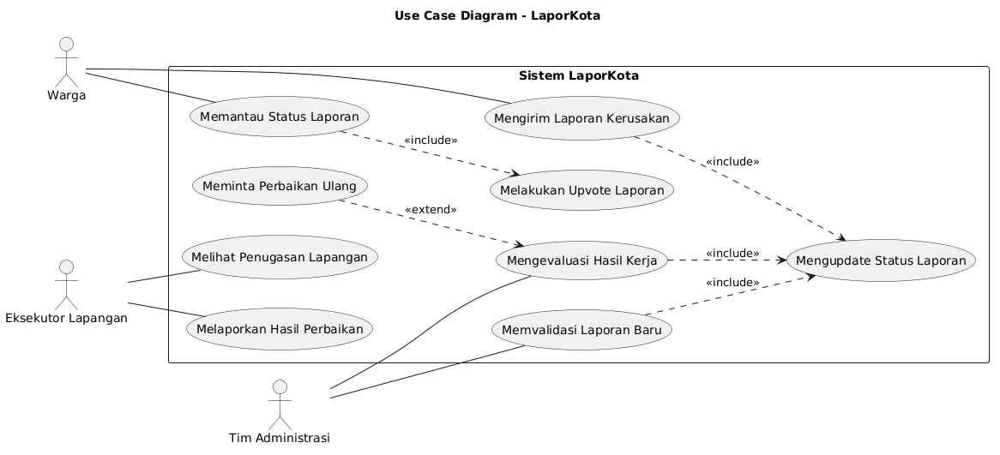
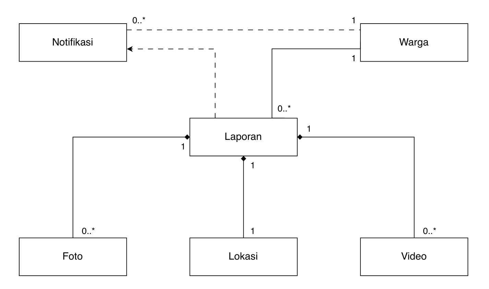
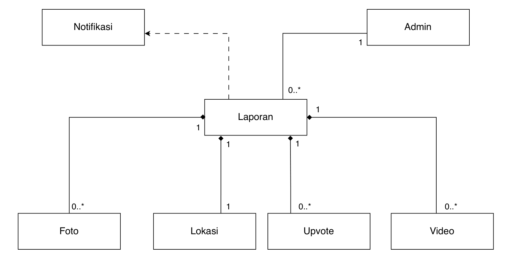
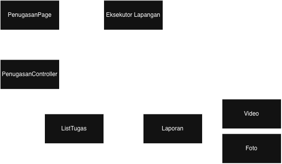
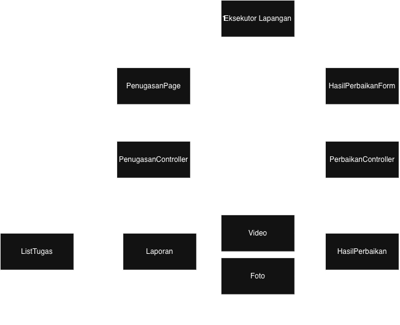
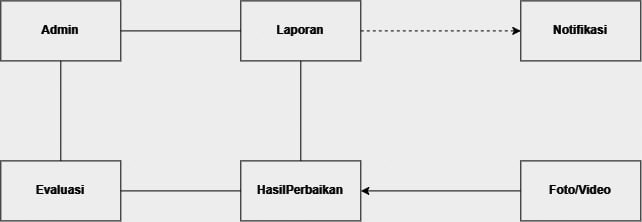
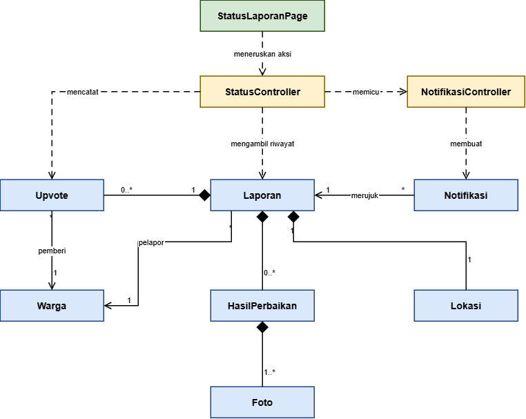
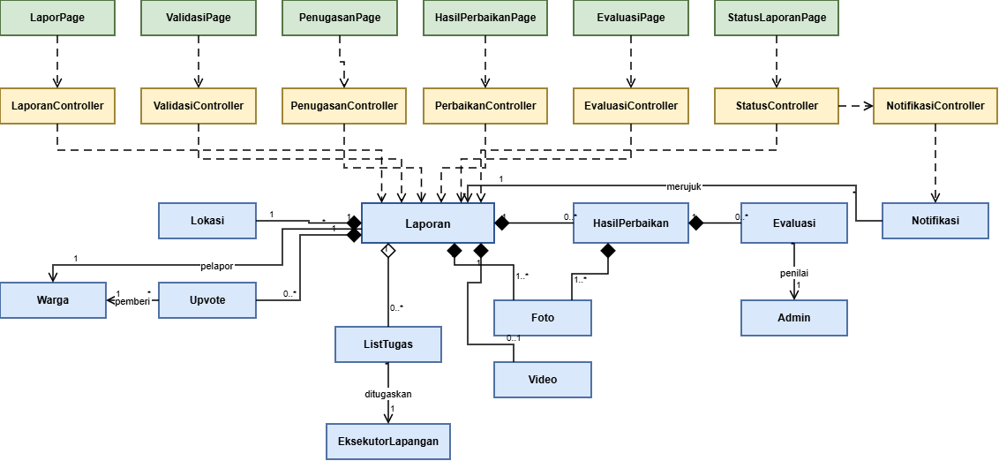

<h1>
IF2150 REKAYASA PERANGKAT LUNAK
 
TUGAS 4
 
CLASS DIAGRAM
</h1>
 

## *LaporKota*

### Untuk: *Jordhy*

Dipersiapkan oleh:
| Informasi | Keterangan |
| --- | --- |
| Kelas | *K - 03* |
| Kelompok | *G07* |

| NIM | Nama |
| --- | --- |
| *13525051* | *Rafi Pradipta Andira Sulistyo* |
| *13525105* | *Pasaribu Fritz T.A.M.* |
| *13525075* | *Bagas Anugrah Putra* |
| *13525099* | *Gede Pranajayanta Suputra* |
| *13525015* | *Muhammad Atallah Ramadhan* |
---

## Daftar Perubahan

| Revisi | Deskripsi |
| :--- | :--- |
| *A* | *Deskripsikan perubahan yang dilakukan dari dokumen sebelumnya pada dokumen ini. Jika tidak terdapat perubahan, harap kosongkan tabel.* |
| *B* |  |
| *C* |  |
| ... |  |

 
 

# BAB 1: Deskripsi Perangkat Lunak

Kondisi infrastruktur publik di perkotaan kerap mengalami laju kerusakan yang lebih cepat dibanding siklus inspeksi rutin yang dilakukan dinas terkait. Selama ini proses pelaporan masih terpecah ke dalam beberapa saluran yang belum terintegrasi, seperti Media Sosial, Kanal Pengaduan Umum Pemerintah, dan Patroli Manual. Oleh karena itu, warga membutuhkan saluran terpusat yang mudah diakses dan mampu memberi kepastian tindak lanjut laporan kerusakan secara transparan, sementara pihak dinas kota membutuhkan sistem yang mampu menyaring laporan-laporan dari warga tanpa beban administratif manual yang berulang. LaporKota hadir sebagai sistem perangkat lunak terintegrasi yang menjembatani masyarakat, koordinator dinas/instansi terkait, dan petugas teknis lapangan dalam penanganan infrastruktur perkotaan yang transparan, terstruktur, dan akuntabel.

Secara alur kerja, sistem ini dimulai dengan Tahap Pelaporan yang dilakukan oleh warga ketika mereka menemukan kerusakan infrastruktur di lingkungan, dan menggunakan kamera dan modul GPS pada gawai mereka untuk mendokumentasikan bukti visual dan lokasi secara presisi melalui sistem LaporKota. Selain melaporkan secara pribadi, warga juga dapat melakukan Upvote terhadap laporan-laporan yang telah disampaikan warga lain untuk meningkatkan urgensi dari suatu laporan. Data yang dikirimkan warga akan diterima oleh perangkat komputer dasbor pihak Administrasi dan masuk ke Tahap Validasi untuk memastikan laporan yang masuk adalah laporan sungguhan, juga melakukan deduplikasi terhadap laporan yang serupa dan berada pada area yang berdekatan. Kemudian, laporan-laporan sudah dianggap valid akan diurutkan skala prioritasnya berdasarkan jumlah pelapor, tingkat kerusakan, dan dampaknya terhadap publik. Laporan kerusakan yang berada pada tingkat prioritas tertinggi nantinya akan dikirimkan kepada pihak Eksekutor Lapangan untuk memasuki Tahap Penanganan untuk melakukan perbaikan teknis. Jika sudah selesai, pihak Eksekutor akan mendokumentasikan dan melaporkan hasil kerjanya kepada pihak Administrasi untuk diperiksa. Jika hasil penangannya sudah dianggap berhasil, maka sistem akan memvalidasi penyelesaian tugas dan secara otomatis memperbarui status laporan hingga dinyatakan "Selesai".

Implementasi LaporKota diharapkan mampu mempermudah birokrasi penanganan fasilitas publik, meminimalkan waktu respon, dan memberikan transparansi serta kepastian layanan bagi masyarakat melalui pelacakan status penanganan secara real-time. Bagi pihak mengelola infrastruktur, sistem ini menyediakan basis data kerusakan yang akurat untuk mendukung pengambilan keputusan dalam pemeliharaan fasilitas publik yang lebih tepat sasaran dan andal.

---

# BAB 2: Kebutuhan Fungsional

## 2.1 Kebutuhan Fungsional

Tabel 2.1. Daftar Kebutuhan Fungsional

| ID KF | ID Kebutuhan | Penjelasan |
| :--- | :--- | :--- |
| **KF01** | R02 | Ketika Warga membuka formulir pelaporan, sistem harus mendeteksi dan mengunci koordinat geospasial (*latitude* dan *longitude*) perangkat secara otomatis melalui layanan geolokasi perangkat. |
| **KF02** | R02 | Ketika Warga mengakses formulir pelaporan, sistem harus memfasilitasi pemilihan kategori kerusakan infrastruktur publik serta pengisian uraian deskripsi keluhan. |
| **KF03** | R04 | Bila Warga mengunggah berkas foto yang tidak didukung atau berukuran melebihi 10 MB, maka sistem harus menolak berkas tersebut dan menampilkan pesan peringatan validasi. |
| **KF04** | R04 | Ketika formulir pelaporan yang valid dikirimkan, sistem harus menerbitkan ID tiket unik, menyimpan data laporan ke basis data, dan secara otomatis menetapkan status awal laporan sebagai 'Diterima'. |
| **KF05** | R05 | Ketika laporan baru dikirimkan, sistem harus menghitung jarak radius spasial terhadap laporan-laporan aktif lain berkategori sama untuk mendeteksi potensi duplikasi. |
| **KF06** | R05 | Bila laporan baru berada dalam radius toleransi (maksimal 20 meter) dari laporan aktif berkategori serupa, maka sistem harus menampilkan konfirmasi duplikasi dan mengalihkan aksi pelapor menjadi dukungan (*upvote*). |
| **KF07** | R06 | Ketika status penanganan suatu laporan diperbarui, sistem harus mengirimkan notifikasi pembaruan status secara otomatis kepada akun Warga pelapor. |
| **KF08** | R07 | Bila pengiriman formulir terindikasi berasal dari *bot* otomatis, maka sistem harus memicu verifikasi keamanan dan menahan penyimpanan data hingga verifikasi tuntas. |
| **KF09** | R08 | Ketika Tim Administrasi membuka dasbor penanganan, sistem harus menyajikan antrean daftar laporan yang dapat diurutkan berdasarkan waktu masuk serta difilter menurut kategori kerusakan. |
| **KF10** | R08 | Ketika Tim Administrasi memilih suatu tiket laporan, sistem harus menampilkan rincian laporan (foto bukti, deskripsi keluhan, waktu masuk, dan peta lokasi) untuk evaluasi validitas. |
| **KF11** | R10 | Bila Tim Administrasi menyatakan laporan tidak valid atau *spam*, maka sistem harus mewajibkan input alasan penolakan dan memperbarui status laporan menjadi "Ditolak". |
| **KF12** | R10 | Ketika Tim Administrasi mengonfirmasi validitas laporan, sistem harus memperbarui status laporan menjadi "Dikerjakan". |
| **KF13** | R11 | Ketika suatu laporan menerima tambahan *upvote*, sistem harus menghitung ulang dan memperbarui urutan prioritas penanganan laporan secara otomatis. |
| **KF14** | R13 | Ketika Eksekutor Lapangan mengakses aplikasi, sistem harus menampilkan daftar penugasan aktif lengkap dengan titik koordinat dan deskripsi kerusakan. |
| **KF15** | R13 | Ketika penanganan fisik selesai, sistem harus memfasilitasi Eksekutor Lapangan untuk mengunggah foto bukti penyelesaian dan mencatat ringkasan teknis hasil kerja. |
| **KF16** | R14 | Ketika berkas hasil eksekusi dikirimkan, sistem harus menyajikan rangkuman komparasi foto bukti serta catatan hasil kerja kepada Tim Administrasi untuk dievaluasi. |
| **KF17** | R14, R16 | Bila Tim Administrasi menolak hasil eksekusi lapangan, maka sistem harus memfasilitasi pengembalian tiket ke Eksekutor Lapangan disertai catatan evaluasi dan mencatat siklusnya ke log audit. |
| **KF18** | R16 | Ketika Tim Administrasi menyetujui penyelesaian penanganan, sistem harus memperbarui status laporan menjadi "Berhasil" dan merekam stempel waktu penyelesaian. |
| **KF19** | R17 | Ketika Warga membuka halaman pelacakan, sistem harus menyajikan linimasa riwayat status laporan beserta dokumentasi foto hasil perbaikan penanganan secara transparan. |
| **KF20** | R17, R18 | Ketika publik membuka peta sebaran, sistem harus visualisasi peta sebaran seluruh laporan secara real-time dengan menyembunyikan identitas pribadi pelapor (anonymity). |

---

# BAB 3: Model Use Case

## 3.1 Identifikasi Aktor

| Aktor | Deskripsi |
| :--- | :--- |
| *Warga* | *Pengguna ini merupakan masyarakat umum yang bertindak sebagai pihak yang berhak melaporkan segala bentuk keluhan dan masalah yang ditemukan di lapangan. Pengguna ini juga dapat melihat informasi laporan dari pengguna lain (secara anonim) dan melakukan upvote terhadap laporan lain.* |
| *Tim Administrasi* | *Pengguna ini bertindak sebagai pihak yang bertanggung jawab untuk memverifikasi terlebih dahulu segala laporan yang diterima sistem (apakah valid/spam). Pihak ini juga bertanggung jawab untuk mengatur skala prioritas dari semua laporan berdasarkan berbagai faktor, dan nantinya meneruskan laporan dengan skala prioritas yang tinggi kepada petinggi dinas sembari melakukan update status secara berkala.* |
| *Eksekutor Lapangan* | *Pengguna ini bertindak sebagai pihak yang bertanggung jawab untuk turun langsung ke lapangan dalam menindak lanjuti instruksi dari Tim Administrasi . Pengguna ini juga bertanggung jawab untuk melakukan update progress kepada Tim Administrasi.* |

## 3.2 Identifikasi Use Case

| ID UC | Nama Use Case | Deskripsi Singkat | Aktor | ID KF |
| :--- | :--- | :--- | :--- | :--- |
| *UC01* | *Mengirim Laporan Kerusakan* | *Warga mengisi formulir pelaporan yang mencakup lokasi, foto bukti, dan keterangan lainnya sampai terkirim kepada sistem.* | *Warga* | *KF01, KF02, KF03, KF04, KF05, KF06, KF07, KF08* |
| *UC02* | *Memvalidasi Laporan Baru* | *Tim Administrasi melakukan validasi terhadap setiap laporan yang baru apakah laporan diterima/ditolak, serta mengolah skala prioritasnya, sampai mengirimkan daftar laporan yang diterima kepada Eksekutor Lapangan.* | *Tim Administrasi* | *KF07, KF09, KF10, KF11, KF12, KF13* |
| *UC03* | *Melihat Penugasan Lapangan* | *Eksekutor Lapangan melihat daftar penugasan di lapangan yang sudah terurut berdasarkan skala prioritas untuk dikerjakan.* | *Eksekutor Lapangan* | *KF14* |
| *UC04* | *Melaporkan Hasil Perbaikan* | *Eksekutor Lapangan mengunggah foto dan deskripsi bukti hasil kerja sampai dikirimkan kepada Tim Administrasi.* | *Eksekutor Lapangan* | *KF15* |
| *UC05* | *Mengevaluasi Hasil Kerja* | *Tim Administrasi menerima laporan hasil kerja dari Eksekutor Lapangan untuk dinilai apakah perbaikan sudah selesai atau masih diperlukan tindakan lanjutan untuk mengupdate status laporan.* | *Tim Administrasi* | *KF07, KF16, KF17, KF18* |
| *UC06* | *Memantau Status Laporan* | *Warga memantau status laporan yang diajukan pribadi maupun diajukan orang lain, termasuk melakukan upvote terhadap laporan orang lain.* | *Warga* | *KF06, KF07, KF11, KF12, KF13, KF19, KF20* |

## 3.3 Use Case Diagram

 

<i>Gambar 1. Use Case Diagram LaporKota</i>

 

## 3.4 Skenario Use Case

### 3.4.1 Skenario UC01

**Nama Use Case:** *Mengirim Laporan Kerusakan*

**Pra-kondisi:** *Warga sudah masuk ke dalam aplikasi dan izin akses lokasi sudah diberikan.*

**Pasca-kondisi:** *Laporan baru tersimpan dengan ID tiket unik dan status "Diterima"; Warga pelapor menerima notifikasi.*

**Skenario Normal**

| No | Warga | Eksekutor | Admin | Reaksi Perangkat Lunak |
| :--- | :--- | :--- | :--- | :--- |
| 1 | *Warga memilih menu "Buat Laporan"* | - | - | - |
| 2 | - | - | - | *Sistem menampilkan formulir pelaporan dan secara otomatis mendeteksi serta mengunci koordinat GPS perangkat* |
| 3 | *Warga memilih kategori kerusakan, mengisi deskripsi, dan mengunggah foto atau video kerusakan, kemudian memilih opsi deteksi lokasi atau tandai lokasi secara manual pada peta.* | - | - | - |
| 4 | - | - | - | *Sistem memvalidasi format (JPG/PNG untuk foto, MP4/MOV/MKV untuk video) dan ukuran foto/video (maksimal 10 MB), lalu menampilkan pratinjau foto dan titik lokasi pada peta* |
| 5 | *Warga menekan tombol "Kirim"* | - | - | - |
| 6 | - | - | - | *Sistem melakukan verifikasi anti bot, memeriksa duplikasi terhadap laporan aktif berkategori sama dalam radius 20 meter dan tidak menemukan kecocokan, menerbitkan ID tiket unik, menyimpan laporan dengan status "Diterima", menampilkan konfirmasi beserta ID tiket, dan mengirim notifikasi kepada Warga pelapor* |

 

**Skenario Alternatif 1: Foto/Video Tidak Valid**

| No | Warga | Eksekutor | Admin | Reaksi Perangkat Lunak |
| :--- | :--- | :--- | :--- | :--- |
| 1 | *Warga memilih menu "Buat Laporan"* | - | - | - |
| 2 | - | - | - | *Sistem menampilkan formulir pelaporan dan secara otomatis mendeteksi serta mengunci koordinat GPS perangkat* |
| 3 | *Warga memilih kategori kerusakan, mengisi deskripsi, dan mengunggah foto berformat selain JPG/PNG, video selain MP4/MKV/MOV atau berukuran lebih dari 10 MB* | - | - | - |
| 4 | - | - | - | *Sistem menolak berkas, menampilkan pesan peringatan validasi berupa format dan ukuran yang diterima, dan tidak menyimpan foto atau video tersebut* |
| 5 | *Warga mengunggah foto/video lain yang valid* | - | - | - |
| 6 | - | - | - | *Sistem kembali ke langkah 2 skenario normal* |

 

**Skenario Alternatif 2: Lokasi Diluar Daerah Penanganan**

| No | Warga | Eksekutor | Admin | Reaksi Perangkat Lunak |
| :--- | :--- | :--- | :--- | :--- |
| 1 | *Warga memilih menu "Buat Laporan" dan mengisi lokasi atau terdeteksi secara otomatis di luar lingkup penanganan* | - | - | - |
| 2 | - | - | - | *Sistem menolak secara otomatis dan menampilkan pesan "Lokasi di luar daerah penanganan.* |
| 3 | *Warga membatalkan laporan atau memperbaiki lokasi* | - | - | - |
| 4 | - | - | - | *Sistem mengulang validasi lokasi. Jika berhasil, sistem kembali ke langkah 1 skenario normal* |

### 3.4.2 Skenario UC02

**Nama Use Case:** *Memvalidasi Laporan Baru*

**Pra-kondisi:** *Tim Administrasi sudah masuk ke akun dan terdapat minimal satu laporan berstatus "Diterima".*

**Pasca-kondisi:** *Status laporan berubah menjadi "Dikerjakan" (masuk antrean penugasan sesuai urutan prioritas) atau "Ditolak" beserta alasannya. Warga pelapor menerima notifikasi perubahan status.*

**Skenario Normal**

| No | Warga | Eksekutor | Admin | Reaksi Perangkat Lunak |
| :--- | :--- | :--- | :--- | :--- |
| 1 | - | - | *Tim Administrasi membuka dasbor penanganan* | - |
| 2 | - | - | - | *Sistem menampilkan antrean laporan berstatus "Diterima" yang terurut berdasarkan waktu masuk, dilengkapi kontrol filter kategori kerusakan* |
| 3 | - | - | *Tim Administrasi memilih satu tiket laporan* | - |
| 4 | - | - | - | *Sistem menampilkan rincian laporan berupa foto/video bukti, deskripsi keluhan, kategori, waktu masuk, peta lokasi, dan jumlah upvote* |
| 5 | - | - | *Tim Administrasi menekan tombol "Valid"* | - |
| 6 | - | - | - | *Sistem memperbarui status laporan menjadi "Dikerjakan", menempatkan laporan pada urutan prioritas berdasarkan jumlah upvote, mengirim notifikasi kepada Warga pelapor, menampilkan konfirmasi, dan kembali ke antrean laporan* |

 

**Skenario Alternatif 1: Menyaring Antrean Sebelum Meninjau**

| No | Warga | Eksekutor | Admin | Reaksi Perangkat Lunak |
| :--- | :--- | :--- | :--- | :--- |
| 1 | - | - | *Tim Administrasi membuka dasbor penanganan* | - |
| 2 | - | - | - | *Sistem menampilkan antrean laporan berstatus "Diterima" yang terurut berdasarkan waktu masuk, dilengkapi kontrol filter kategori kerusakan* |
| 3 | - | - | *Tim Administrasi memilih filter kategori tertentu dan/atau mengubah urutan waktu masuk* | - |
| 4 | - | - | - | *Sistem menampilkan ulang antrean laporan sesuai filter dan urutan yang dipilih* |
| 5 | - | - | *Tim Administrasi memilih satu tiket laporan dari hasil saringan* | - |
| 6 | - | - | - | *Sistem kembali ke langkah 2 skenario normal* |

 

**Skenario Alternatif 2: Laporan Dinyatakan Tidak Valid**

| No | Warga | Eksekutor | Admin | Reaksi Perangkat Lunak |
| :--- | :--- | :--- | :--- | :--- |
| 1 | - | - | *Tim Administrasi membuka dasbor penanganan* | - |
| 2 | - | - | - | *Sistem menampilkan antrean laporan berstatus "Diterima" yang terurut berdasarkan waktu masuk, dilengkapi kontrol filter kategori kerusakan* |
| 3 | - | - | *Tim Administrasi memilih satu tiket laporan* | - |
| 4 | - | - | - | *Sistem menampilkan rincian laporan: foto/video bukti, deskripsi keluhan, kategori, waktu masuk, peta lokasi, dan jumlah upvote* |
| 5 | - | - | *Tim Administrasi menekan tombol "Tolak"* | - |
| 6 | - | - | - | *Sistem menampilkan kolom alasan penolakan yang wajib diisi* |
| 7 | - | - | *Tim Administrasi mengisi alasan penolakan lalu mengonfirmasi* | - |
| 8 | - | - | - | *Sistem memperbarui status laporan menjadi "Ditolak" beserta alasannya, mengirim notifikasi kepada Warga pelapor, menampilkan konfirmasi, dan kembali ke antrean laporan* |

### 3.4.3 Skenario UC03

**Nama Use Case:** *Melihat Penugasan Lapangan*

**Pra-kondisi:** *Eksekutor lapangan mendapat surat penugasan dan sudah masuk menggunakan akun Eksekutor Lapangan dan terdapat minimal satu laporan yang berstatus "dikerjakan".*

**Pasca-kondisi:** *Eksekutor Lapangan mengetahui daftar dan rincian penugasan yang harus dikerjakan berdasarkan skala prioritas.*

**Skenario Normal**

| No | Warga | Eksekutor | Admin | Reaksi Perangkat Lunak |
| :--- | :--- | :--- | :--- | :--- |
| 1 | - | *Eksekutor Lapangan membuka dashboard penugasan* | - | - |
| 2 | - | - | - | *Sistem menampilkan daftar laporan berstatus "Dikerjakan" yang sudah terurut berdasarkan prioritas serta memiliki fitur filter berdasarkan kategori dan lokasi* |
| 3 | - | *Eksekutor Lapangan memilih salah satu laporan* | - | - |
| 4 | - | - | - | *Sistem menampilkan rincian penugasan berupa foto bukti, deskripsi keluhan, kategori, waktu masuk, peta lokasi, dan jumlah upvote* |

**Skenario Alternatif 1: Menyaring Daftar Penugasan Berdasarkan Kategori**

| No | Warga | Eksekutor | Admin | Reaksi Perangkat Lunak |
| :--- | :--- | :--- | :--- | :--- |
| 1 | - | *Eksekutor Lapangan membuka dashboard penugasan* | - | - |
| 2 | - | - | - | *Sistem menampilkan daftar laporan berstatus "Dikerjakan" yang sudah terurut berdasarkan prioritas serta memiliki fitur filter berdasarkan kategori dan lokasi* |
| 3 | - | *Eksekutor Lapangan memilih filter berdasarkan kategori* | - | - |
| 4 | - | - | - | *Sistem menampilkan ulang daftar penugasan sesuai kategori yang dipilih, tetap terurut berdasarkan skala prioritas* |
| 5 | - | *Eksekutor Lapangan memilih salah satu laporan* | - | - |
| 6 | - | - | - | *Sistem kembali ke langkah 2 skenario normal* |

**Skenario Alternatif 2: Belum Ada Penugasan yang Tersedia**

| No | Warga | Eksekutor | Admin | Reaksi Perangkat Lunak |
| :--- | :--- | :--- | :--- | :--- |
| 1 | - | *Eksekutor Lapangan membuka dashboard penugasan* | - | - |
| 2 | - | - | - | *Sistem menampilkan keterangan bahwa belum ada penugasan yang perlu dikerjakan saat ini* |

### 3.4.4 Skenario UC04

**Nama Use Case:** *Melaporkan Hasil Penugasan*

**Pra-kondisi:** *Eksekutor lapangan mendapat surat penugasan dan sudah masuk menggunakan akun Eksekutor Lapangan dan sudah menyelesaikan penugasan yang diberikan berdasarkan laporan.*

**Pasca-kondisi:** *Hasil penanganan penugasan tertera dengan detail seperti foto hasil penanganan dan deskripsi hasil perbaikan, kemudian dilanjutkan ke Tim Administrasi untuk dievaluasi.*

**Skenario Normal**

| No | Warga | Eksekutor | Admin | Reaksi Perangkat Lunak |
| :--- | :--- | :--- | :--- | :--- |
| 1 | - | *Eksekutor Lapangan membuka dashboard penugasan* | - | - |
| 2 | - | - | - | *Sistem menampilkan daftar laporan berstatus "Dikerjakan" yang tersedia* |
| 3 | - | *Eksekutor Lapangan memilih salah satu laporan* | - | - |
| 4 | - | - | - | *Sistem menampilkan rincian laporan, serta tertera kolom untuk mengunggah foto bukti prnanganan dan kolom untuk mengisi deskripsi hasil kerja* |
| 5 | - | *Eksekutor Lapangan mengunggah foto hasil penanganan dan mengisi deskripsi hasil kerja* | - | - |
| 6 | - | - | - | *Sistem menampilkan foto yang diunggah dan deskripsi yang telah diisi* |
| 7 | - | *Eksekutor Lapangan menekan tombol "Kirim Laporan"* | - | - |
| 8 | - | - | - | *Sistem menvalidasi kelengkapan laporan dan mengirimkannya ke Tim Administrasi* |

**Skenario Alternatif 1: Data Laporan Belum Lengkap**

| No | Warga | Eksekutor | Admin | Reaksi Perangkat Lunak |
| :--- | :--- | :--- | :--- | :--- |
| 1 | - | *Eksekutor Lapangan membuka dashboard penugasan* | - | - |
| 2 | - | - | - | *Sistem menampilkan daftar laporan berstatus "Dikerjakan" yang tersedia* |
| 3 | - | *Eksekutor Lapangan memilih salah satu laporan* | - | - |
| 4 | - | - | - | *Sistem menampilkan rincian laporan, serta tertera kolom untuk mengunggah foto bukti penanganan dan kolom untuk mengisi deskripsi hasil kerja* |
| 5 | - | *Eksekutor Lapangan menekan tombol "Kirim Laporan" tanpa mengunggah foto bukti penanganan dan/atau deskripsi hasil kerja* | - | - |
| 6 | - | - | - | *Sistem menampilkan pesan kesalahan bahwa foto bukti dan deskripsi wajib diisi, serta tetap menampilkan kolom* |
| 7 | - | *Eksekutor Lapangan melengkapi foto hasil penanganan dan/atau deskripsi hasil kerja yang belum lengkap* | - | - |
| 8 | - | - | - | *Sistem kembali ke langkah 3 skenario normal* |

### 3.4.5 Skenario UC05

**Nama Use Case:** *Mengevaluasi Hasil Kerja*

**Pra-kondisi:** *Tim Administrasi sudah masuk ke akun dan terdapat minimal satu pekerjaan yang telah diselesaikan eksekutor lapangan*

**Pasca-kondisi:** *Eksekutor lapangan mendapat informasi mengenai selesai atau tidaknya pekerjaan yang telah dilakukan*

**Skenario Normal**

| No | Warga | Eksekutor | Admin | Reaksi Perangkat Lunak |
| :--- | :--- | :--- | :--- | :--- |
| 1 | - | - | *Admin melihat seluruh pekerjaan untuk ditijau* | - |
| 2 | - | - | - | *Sistem menampilkan seluruh list pekerjaan yang diurutkan berdasarkan waktu* |
| 3 | - | - | *Admin meninjau detail hasil salah satu pekerjaan* | - |
| 4 | - | - | - | *Sistem mengarahkan pelanggan ke halaman detail pekerjaan, hasil pekerjaan berupa foto/video, tanggal pekerjaan selesai, dan keterangan dapat dilihat* |
| 5 | - | - | *Admin mengonfirmasi bahwa pekerjaan telah selesai* | - |
| 6 | - | - | - | *Sistem mengubah informasi pekerjaan menjadi selesai* |

 

**Skenario Alternatif 1: Pekerjaan belum selesai**

| No | Warga | Eksekutor | Admin | Reaksi Perangkat Lunak |
| :--- | :--- | :--- | :--- | :--- |
| 1 | - | - | *Admin melihat seluruh pekerjaan untuk ditijau* | - |
| 2 | - | - | - | *Sistem menampilkan seluruh list pekerjaan yang diurutkan berdasarkan waktu* |
| 3 | - | - | *Admin meninjau detail hasil salah satu pekerjaan* | - |
| 4 | - | - | - | *Sistem mengarahkan pelanggan ke halaman detail pekerjaan, hasil pekerjaan berupa foto/video, tanggal pekerjaan selesai, dan keterangan dapat dilihat* |
| 5 | - | - | *Admin mengonfirmasi hasil pekerjaan* | - |
| 6 | - | - | - | *Sistem mengubah informasi pekerjaan menjadi belum selesai* |

**Skenario Alternatif 2: Foto/video pekerjaan tidak ada atau tidak jelas**

| No | Warga | Eksekutor | Admin | Reaksi Perangkat Lunak |
| :--- | :--- | :--- | :--- | :--- |
| 1 | - | - | *Admin melihat seluruh pekerjaan untuk ditijau* | - |
| 2 | - | - | - | *Sistem menampilkan seluruh list pekerjaan yang diurutkan berdasarkan waktu* |
| 3 | - | - | *Admin meninjau detail hasil salah satu pekerjaan* | - |
| 4 | - | - | - | *Sistem mengarahkan admin ke halaman detail pekerjaan, hasil pekerjaan berupa foto/video, tanggal pekerjaan selesai, dan keterangan dapat dilihat* |
| 5 | - | - | *Admin meminta ulang foto/video pekerjaan serta menuliskan keterangan dari kesalahan foto atau video* | - |
| 6 | - | - | - | *Sistem mengubah informasi pekerjaan menjadi selesai serta menyimpan keterangan dari admin* |

 

### 3.4.6 Skenario UC06

**Nama Use Case:** *Memantau Status Laporan*

**Pra-kondisi:** 
* *Warga telah membuka aplikasi LaporKota (baik telah masuk ke akun terdaftar maupun sebagai publik).*
* *Terdapat minimal satu data laporan yang telah tersimpan di dalam sistem.*

**Pasca-kondisi:** 
* *Warga memperoleh transparansi linimasa dan status penanganan laporan (termasuk dokumentasi foto hasil perbaikan fisik jika laporan berstatus "Berhasil", atau catatan alasan penolakan jika laporan berstatus "Ditolak").*
* *Dukungan (upvote) Warga tercatat dan sistem menghitung ulang urutan prioritas penanganan laporan secara otomatis (bila melakukan upvote).*

 

**Skenario Normal: Memantau Linimasa Riwayat Laporan Pribadi**

| No | Warga | Eksekutor | Admin | Reaksi Perangkat Lunak |
| :--- | :--- | :--- | :--- | :--- |
| 1 | *Warga memilih menu "Riwayat Laporan" (atau mengakses melalui tautan notifikasi pembaruan status)* | - | - | - |
| 2 | - | - | - | *Sistem menyajikan daftar seluruh laporan yang pernah diajukan oleh Warga, lengkap dengan ID tiket unik, kategori kerusakan, tanggal pengiriman, dan status terkini ("Diterima", "Dikerjakan", atau "Berhasil")* |
| 3 | *Warga memilih salah satu tiket laporan* | - | - | - |
| 4 | - | - | - | *Sistem menyajikan halaman pelacakan detail yang menampilkan linimasa riwayat status penanganan secara transparan, mencakup waktu pembaruan status serta dokumentasi foto hasil perbaikan fisik oleh Eksekutor Lapangan bila laporan telah berstatus "Berhasil"* |

 

**Skenario Alternatif 1: Memantau Laporan Publik via Peta Sebaran dan Memberikan Dukungan (Upvote)**

| No | Warga | Eksekutor | Admin | Reaksi Perangkat Lunak |
| :--- | :--- | :--- | :--- | :--- |
| 1 | *Warga memilih menu "Peta Sebaran Laporan"* | - | - | - |
| 2 | - | - | - | *Sistem memvisualisasikan peta sebaran seluruh laporan kerusakan secara real-time dengan menyembunyikan identitas pribadi pelapor (anonymity)* |
| 3 | *Warga memilih salah satu penanda (marker) laporan pada peta* | - | - | - |
| 4 | - | - | - | *Sistem menyajikan kartu rincian laporan publik berupa foto bukti kerusakan, kategori, deskripsi keluhan, peta lokasi, status penanganan saat ini, dan jumlah upvote tanpa menampilkan identitas pribadi pelapor* |
| 5 | *Warga menekan tombol "Upvote" (Dukung Laporan)* | - | - | - |
| 6 | - | - | - | *Sistem menambahkan 1 upvote pada laporan tersebut, menghitung ulang dan memperbarui urutan prioritas penanganan secara otomatis, serta memperbarui jumlah upvote terkini pada tampilan antarmuka* |

 

**Skenario Alternatif 2: Memantau Laporan yang Berstatus "Ditolak"**

| No | Warga | Eksekutor | Admin | Reaksi Perangkat Lunak |
| :--- | :--- | :--- | :--- | :--- |
| 1 | *Warga memilih menu "Riwayat Laporan"* | - | - | - |
| 2 | - | - | - | *Sistem menyajikan antrean laporan pribadi, termasuk laporan yang memiliki status "Ditolak"* |
| 3 | *Warga memilih tiket laporan yang berstatus "Ditolak"* | - | - | - |
| 4 | - | - | - | *Sistem menampilkan detail pelacakan tiket dengan status "Ditolak" beserta catatan evaluasi dan alasan penolakan yang diinput oleh Tim Administrasi* |

---

# BAB 4: Diagram Kelas
Bagian ini berisi identifikasi kelas dan pemodelan struktur kelas yang diperlukan untuk merealisasikan use case pada BAB 3. Gunakan skenario use case (3.4) sebagai dasar untuk menentukan kelas, atribut, metode, dan hubungan antarkelas.

## 4.1 Identifikasi Kelas
Identifikasi seluruh kelas yang diperlukan berdasarkan use case dan skenarionya. Satu kelas boleh terkait dengan lebih dari satu use case.

| ID Kelas | Nama Kelas | Deskripsi Kelas | ID Use Case |
| :--- | :--- | :--- | :--- |
| C01 | Warga | Menyimpan data akun warga beserta perannya sebagai pelapor kerusakan. | UC01, UC06 |
| C02 | Admin | Menyimpan data akun anggota Tim Administrasi beserta perannya sebagai pemvalidasi laporan dan penilai hasil perbaikan. | UC02, UC05 |
| C03 | EksekutorLapangan | Menyimpan data akun eksekutor beserta perannya sebagai penindak laporan di lapangan. | UC03, UC04 |
| C04 | Laporan | Menyimpan data laporan kerusakan (ID tiket, kategori, deskripsi, status, waktu masuk, alasan penolakan, skor prioritas) dengan status bernilai Diterima, Ditolak, Dikerjakan, atau Berhasil. | UC01, UC02, UC03, UC04, UC05, UC06 |
| C05 | Lokasi | Menyimpan koordinat GPS tempat laporan kerusakan dibuat. | UC01, UC02 |
| C06 | Foto | Menyimpan berkas foto beserta format dan ukurannya, dengan ketentuan JPG/PNG maksimal 10 MB. | UC01, UC02, UC03, UC04, UC05 |
| C07 | Upvote | Merepresentasikan sebuah upvote yang terbentuk, ketika laporan yang diajukan warga merupakan radius 20m dengan kategori yang sama dengan laporan lainnya. | UC01, UC02 |
| C08 | HasilPerbaikan | Menyimpan bukti penanganan dari Eksekutor Lapangan berupa foto, catatan, dan waktu unggah, di mana satu laporan dapat memiliki lebih dari satu hasil bila dikembalikan untuk eksekusi ulang. | UC04, UC05 |
| C09 | Evaluasi | Menyimpan keputusan verifikasi ulang Tim Administrasi atas suatu hasil perbaikan (diterima atau dikembalikan) beserta catatannya. | UC05 |
| C10 | Notifikasi | Menyimpan pesan perubahan status laporan beserta penerima dan waktu pengirimannya. | UC01, UC02, UC05, UC06 |
| C11 | Video | Menyimpan berkas video beserta format dan ukurannya, dengan ketentuan MP4/MOV/MKV maksimal 10 MB. | UC01, UC02, UC03, UC04, UC05 |
| C12 | ListTugas | Menyimpan daftar laporan yang harus ditangani seorang EksekutorLapangan beserta urutan prioritas dan kategori yang sedang diterapkan padanya. | UC03 |
| C13 | LaporPage | Antarmuka formulir pengiriman laporan kerusakan yang menampilkan isian kategori dan deskripsi, pratinjau foto dan video, penguncian lokasi otomatis, serta pesan validasi berkas. | UC01 |
| C14 | ValidasiPage | Antarmuka dasbor Tim Administrasi yang menampilkan antrean laporan berstatus Diterima yang dapat disaring per kategori, rincian tiket beserta foto, video, peta, dan jumlah upvote, serta isian alasan penolakan. | UC02 |
| C15 | PenugasanPage | Antarmuka daftar tugas Eksekutor Lapangan yang menampilkan laporan yang harus ditangani beserta lokasi dan kategorinya, dengan pilihan pengurutan dan penyaringan. | UC03 |
| C16 | HasilPerbaikanForm | Antarmuka unggah bukti perbaikan: menampilkan isian catatan, pratinjau foto dan video bukti, serta pesan validasi berkas. | UC04 |
| C17 | EvaluasiPage | Antarmuka peninjauan hasil kerja Eksekutor Lapangan: menampilkan bukti perbaikan beserta pilihan keputusan diterima atau dikembalikan. | UC05 |
| C18 | StatusLaporanPage | Antarmuka pemantauan laporan milik Warga: menampilkan daftar laporan beserta status terkini dan alasan penolakan bila ada. | UC06 |
| C19 | LaporanController | Memvalidasi format dan ukuran foto (JPG/PNG maks. 10 MB) serta video (MP4/MOV/MKV maks. 10 MB), memeriksa ketersediaan lokasi perangkat, mengecek duplikasi dalam radius 20 m dengan kategori sama, menerbitkan ID tiket, dan menyimpan laporan berstatus Diterima. | UC01 |
| C20 | ValidasiController | Menyusun dan menyaring antrean laporan berstatus Diterima, mengubah status menjadi Dikerjakan beserta urutan prioritasnya, serta menyimpan penolakan beserta alasannya. | UC02 |
| C21 | PenugasanController | Mengambil laporan berstatus Dikerjakan untuk menyusun ListTugas, serta menjalankan pengurutan berdasarkan prioritas dan penyaringan berdasarkan kategori atas daftar tersebut. | UC03 |
| C22 | PerbaikanController | Memvalidasi kelengkapan bukti beserta format dan ukuran berkas foto dan video, menyimpan hasil perbaikan, serta menandai laporan siap dievaluasi. | UC04 |
| C23 | EvaluasiController | Menyimpan keputusan verifikasi ulang, menetapkan status laporan menjadi Berhasil, atau mengembalikan laporan ke status Dikerjakan untuk eksekusi ulang. | UC05 |
| C24 | StatusController | Mengambil daftar laporan milik Warga beserta status dan riwayat perubahannya. | UC06 |
| C25 | NotifikasiController | Menyusun dan mengirimkan notifikasi perubahan status laporan kepada Warga pelapor pada setiap peralihan status. | UC01, UC02, UC05, UC06 |

Pastikan setiap kelas memiliki tanggung jawab yang jelas dan memang diperlukan untuk merealisasikan fungsi yang dimodelkan. Hindari kelas yang tidak memiliki keterkaitan dengan KF atau use case manapun.

## 4.2 Diagram Kelas per Use Case
Buat diagram kelas untuk setiap use case pada 3.2.

### 4.2.1 Use Case UC01

**Nama Use Case:** *Mengirim Laporan Kerusakan*

#### Identifikasi Kelas

| ID Kelas | Nama Kelas | Deskripsi Kelas |
| :--- | :--- | :--- |
| *C01* | *Warga* | *Menyimpan data akun warga; membuat laporan kerusakan, memberikan dukungan (upvote) pada laporan, dan memantau status laporannya* |
| *C04* | *Laporan* | *Menyimpan data laporan kerusakan (ID tiket, kategori, deskripsi, status, waktu masuk, alasan penolakan) dengan status bernilai Diterima, Ditolak, Dikerjakan, atau Berhasil; memutuskan apakah dirinya duplikat, menghitung skor prioritas, dan mengelola perubahan statusnya sendiri* |
| *C05* | *Lokasi* | *Menyimpan koordinat GPS laporan dan menghitung jarak ke lokasi lain untuk pengecekan duplikat dalam radius 20 m* |
| *C06* | *Foto* | *Menyimpan berkas foto beserta format dan ukurannya, serta memeriksa kevalidan dirinya (JPG/PNG, maksimal 10 MB)* |
| *C10* | *Notifikasi* | *Menyimpan dan mengirimkan pesan perubahan status laporan kepada Warga pelapor* |
| *C11* | *Video* | *Menyimpan berkas video beserta format dan ukurannya, serte memeriksa kevalidan dirinya. (MP4/MOV/.MKV)* |

#### Diagram Kelas

<i>Gambar 2. Diagram Kelas Use Case UC01</i>

 

| ID Kelas | Nama Kelas | Atribut | Metode/Operasi |
| :--- | :--- | :--- | :--- |
| *C01* | *Warga* | *nama, nomorHP* | *buatLaporan()* |
| *C04* | *Laporan* | *idTiket, kategori, deskripsi, waktuMasuk, status* | *cekDuplikasi(), buatTiket(), simpanLaporan()* |
| *C05* | *Lokasi* | *latitude, longitude, tipeDeteksi* | *kunciOtomatis(), tandaiManual(), hitungJarak()* |
| *C06* | *Foto* | *format, ukuran* | *isFotoValid()* |
| *C07* | *Video* | *format, ukuran* | *isVideoValid()* |
| *C08* | *Notifikasi* | *isiPesan, waktuKirim* | *kirimNotifikasi()* |

### 4.2.2 Use Case UC02

**Nama Use Case:** *Memvalidasi Laporan Baru*

#### Identifikasi Kelas

| ID Kelas | Nama Kelas | Deskripsi Kelas |
| :--- | :--- | :--- |
| *C02* | *Admin* | *Menyimpan data akun anggota Tim Administrasi; meninjau antrean laporan yang dapat disaring per kategori, memvalidasi atau menolak laporan, serta mengevaluasi hasil perbaikan* |
| *C04* | *Laporan* | *Menyimpan data laporan kerusakan (ID tiket, kategori, deskripsi, status, waktu masuk, alasan penolakan) dengan status bernilai Diterima, Ditolak, Dikerjakan, atau Berhasil; memutuskan apakah dirinya duplikat, menghitung skor prioritas, dan mengelola perubahan statusnya sendiri* |
| *C05* | *Lokasi* | *Menyimpan koordinat GPS laporan dan menghitung jarak ke lokasi lain untuk pengecekan duplikat dalam radius 20 m* |
| *C06* | *Foto* | *Menyimpan berkas foto beserta format dan ukurannya, serta memeriksa kevalidan dirinya (JPG/PNG, maksimal 10 MB)* |
| *C07* | *Upvote* | *Merepresentasikan dukungan seorang Warga terhadap suatu laporan sebagai dasar skor prioritas* |
| *C10* | *Notifikasi* | *Menyimpan dan mengirimkan pesan perubahan status laporan kepada Warga pelapor* |
| *C11* | *Video* | *Menyimpan berkas video beserta format dan ukurannya, serte memeriksa kevalidan dirinya. (MP4/MOV/.MKV)* |

#### Diagram Kelas

<i>Gambar 3. Diagram Kelas Use Case UC02</i>

 

| ID Kelas | Nama Kelas | Atribut | Metode/Operasi |
| :--- | :--- | :--- | :--- |
| *C02* | *Admin* | *nama* | *lihatAntrean(), filterAntrean(), validasiLaporan(), tolakLaporan()* |
| *C04* | *Laporan* | *idTiket, kategori, deskripsi, waktuMasuk, fotoBukti, videoBukti, lokasi, jumlahUpvote, status, skorPrioritas* | *getRincian(), hitungPrioritas(), ubahStatus(), simpanAlasanPenolakan()* |
| *C05* | *Lokasi* | *latitude, longitude* | *(ditampilkan pada peta rincian laporan, tidak ada operasi aktif)* |
| *C06* | *Foto* | *format, ukuran* | *(ditampilkan sebagai bukti pada rincian laporan, tidak ada operasi aktif)* |
| *C07* | *Upvote* | *waktuUpvote* | *jumlahUpvote* |
| *C10* | *Notifikasi* | *isiPesan, waktuKirim* | *kirimNotifikasi()* |
| *C11* | *Video* | *format, ukuran* | *(ditampilkan sebagai bukti pada rincian laporan, tidak ada operasi aktif)* |

### 4.2.3 Use Case UC03

**Nama Use Case:** *Melihat Penugasan Lapangan*

#### Identifikasi Kelas

| ID Kelas | Nama Kelas | Deskripsi Kelas |
| :--- | :--- | :--- |
| C03 | EksekutorLapangan | Menyimpan data akun eksekutor; melihat daftar laporan yang harus ditangani dan mengunggah hasil perbaikan. |
| C04 | Laporan | Menyimpan data laporan kerusakan (ID tiket, kategori, deskripsi, status, waktu masuk, alasan penolakan) dengan status bernilai Diterima, Ditolak, Dikerjakan, atau Berhasil; memutuskan apakah dirinya duplikat, menghitung skor prioritas, dan mengelola perubahan statusnya sendiri. |
| C06 | Foto | Menyimpan berkas foto beserta format dan ukurannya, serta memeriksa kevalidan dirinya (JPG/PNG, maksimal 10 MB). | UC01, UC02, UC03, UC04, UC05 |
| C06 | Video | Menyimpan berkas video beserta format dan ukurannya, dengan ketentuan MP4/MOV/MKV maksimal 10 MB. | UC01, UC02, UC03, UC04, UC05 |
| C12 | ListTugas | Menyimpan data daftar laporan yang harus ditangani seorang EksekutorLapangan, bisa diurutkan menurut prioritas & difilter berdasarkan kategori |
| C15 | PenugasanPage | Antarmuka daftar tugas Eksekutor Lapangan untuk melihat laporan, mengatur filter, dan membuka rincian. | UC03 |
| C21 | PenugasanController | Mengoordinasikan pengambilan data laporan berstatus “Dikerjakan”, serta mengoordinasi fitur sorting/filter untuk ListTugas. | UC03 |

#### Diagram Kelas

<i>Gambar 4. Diagram Kelas Use Case UC03</i>

 

| ID Kelas | Nama Kelas | Atribut | Metode/Operasi |
| :--- | :--- | :--- | :--- |
| C03 | EksekutorLapangan | nama | lihatTugas() |
| C04 | Laporan | idTiket, kategori, deskripsi, waktuMasuk, fotoBukti, lokasi, jumlahUpvote, status, alasanPenolakan, skorPrioritas | getRincian(), hitungPrioritas() |
| C06 | Foto | format, ukuran | isFotoValid() |
| C11 | Video | format, ukuran | isVideoValid() |
| C12 | ListTugas | jumlahLaporanAktif, daftarLaporan | urutPrioritas(), filterKategori() |
| C15 | PenugasanPage | pilihanKategori, statusTampilan | tampilkanPage(), pindahPage(), renderRincianLaporan() |
| C21 | PenugasanController |  | doFilter(), doSorting() |

### 4.2.4 Use Case UC04

**Nama Use Case:** *Melaporkan Hasil Penugasan*

#### Identifikasi Kelas

| ID Kelas | Nama Kelas | Deskripsi Kelas |
| :--- | :--- | :--- |
| C03 | EksekutorLapangan | Menyimpan data akun eksekutor; melihat daftar laporan yang harus ditangani dan mengunggah hasil perbaikan. |
| C04 | Laporan | Menyimpan data laporan kerusakan (ID tiket, kategori, deskripsi, status, waktu masuk, alasan penolakan) dengan status bernilai Diterima, Ditolak, Dikerjakan, atau Berhasil; memutuskan apakah dirinya duplikat, menghitung skor prioritas, dan mengelola perubahan statusnya sendiri. |
| C06 | Foto | Menyimpan berkas foto beserta format dan ukurannya, serta memeriksa kevalidan dirinya (JPG/PNG, maksimal 10 MB). | UC01, UC02, UC03, UC04, UC05 |
| C11 | Video | Menyimpan berkas video beserta format dan ukurannya, dengan ketentuan MP4/MOV/MKV maksimal 10 MB. | UC01, UC02, UC03, UC04, UC05 |
| C12 | ListTugas | Menyimpan data daftar laporan yang harus ditangani seorang EksekutorLapangan, bisa diurutkan menurut prioritas & difilter berdasarkan kategori |
| C15 | PenugasanPage | Antarmuka daftar tugas Eksekutor Lapangan untuk melihat laporan, mengatur filter, dan membuka rincian. | UC03 |
| C16 | HasilPerbaikanForm | Antarmuka unggah bukti perbaikan: menampilkan isian catatan, pratinjau foto dan video bukti, serta pesan validasi berkas. | UC04 |
| C21 | PenugasanController | Mengoordinasikan pengambilan data laporan berstatus “Dikerjakan”, serta mengoordinasi fitur sorting/filter untuk ListTugas. | UC03 |
| C22 | PerbaikanController | Memvalidasi kelengkapan bukti beserta format dan ukuran berkas foto dan video, menyimpan hasil perbaikan, serta menandai laporan siap dievaluasi. | UC04 |

#### Diagram Kelas

<i>Gambar 5. Diagram Kelas Use Case UC04</i>

 

| ID Kelas | Nama Kelas | Atribut | Metode/Operasi |
| :--- | :--- | :--- | :--- |
| C03 | EksekutorLapangan | nama | lihatTugas() |
| C04 | Laporan | idTiket, kategori, deskripsi, waktuMasuk, fotoBukti, lokasi, jumlahUpvote, status, alasanPenolakan, skorPrioritas | getRincian(), hitungPrioritas() |
| C06 | Foto | format, ukuran | isFotoValid() |
| C11 | Video | format, ukuran | isVideoValid() |
| C12 | ListTugas | jumlahLaporanAktif, daftarLaporan | urutPrioritas(), filterKategori() |
| C15 | PenugasanPage | pilihanKategori, statusTampilan | tampilkanForm(), pindahPage() |
| C16 | HasilPerbaikanForm | statusTampilan, inputDeskripsi, berkasFoto, berkasVideo | tampilkanForm(), renderBerkas(), getInputUser() |
| C21 | PenugasanController |  | doFilter(), doSorting() |
| C22 | PerbaikanController |  | doFilter(), doSorting() |

### 4.2.5 Use Case UC05

**Nama Use Case:** *Mengevaluasi Hasil Kerja*

#### Identifikasi Kelas

| ID Kelas | Nama Kelas | Deskripsi Kelas |
| :--- | :--- | :--- |
| *C02* | *Admin* | *Memvalidasi dan menentukan apakah hasil pekerjaan sudah dinilai selesai atau tidak.* |
| *C04* | *Laporan* | *Mengelola perubahan statusnya pekerjaan.* |
| *C06* | *Foto/Video* | *Menyimpan bukti hasil pekerjaan.* |
| *C08* | *HasilPerbaikan* | *Menyimpan bukti  serta keterangan penanganan dari Eksekutor Lapangan.* |
| *C09* | *Evaluasi* | *Menyimpan keputusan validasi ulang Tim Administrasi.* |
| *C10* | *Notifikasi* | *Mengirimkan peasn perubahan status laporan.* |
| *...* | *...* | *...* |

#### Diagram Kelas

<i>Gambar 2. Diagram Kelas Use Case UC05</i>

 

Pada diagram kelas, cukup tampilkan nama kelas saja. Atribut dan metode/operasi milik setiap kelas dapat dituliskan pada tabel di bawah ini. Pastikan hubungan antarkelas menggunakan jenis relasi yang sesuai (asosiasi, agregasi, komposisi, generalisasi, atau dependensi).

| ID Kelas | Nama Kelas | Atribut | Metode/Operasi |
| :--- | :--- | :--- | :--- |
| *C02* | *Admin* | *idAdmin* | *validasiLaporan(), laporanSelesai(), laporanTidakSelesai(), saringAntrean* |
| *C04* | *Laporan* | *idTiket, kategori, deskripsi, status, waktuMasuk, foto, video* | *ubahStatus()* |
| *C06* | *Foto/Video* | *idFoto, idVideo* | *bukaVideo(), bukaFoto()* |
| *C08* | *HasilPerbaikan* | *idHasil, idTiket, idEksekutor, catatan, waktuUnggah* | *tambahFoto(), tambahVideo(), tulisKeterangan(), simpanBukti()* |
| *C09* | *Evaluasi* | *idHasil, keputusan, catatan* | *simpanEvaluasi, laporanTidakSelesai(), laporanSelesai()* |
| *C010* | *Notifikasi* | *idNotifikasi, idTiket, idWarga, isiPesan, waktuKirim* | *kirimPesan()* |
| *...* | *...* | *...* | *...* |

> Lanjutkan pola **4.2.x** untuk setiap use case pada 3.2.

### 4.2.6 Use Case UC06

**Nama Use Case:** *Memantau Status Laporan*

#### Identifikasi Kelas

| ID Kelas | Nama Kelas | Deskripsi Kelas |
| :--- | :--- | :--- |
| C01 | Warga | Menyimpan data akun warga; membuat laporan kerusakan, memberikan dukungan (upvote) pada laporan, dan memantau status laporannya. |
| C04 | Laporan | Menyimpan data laporan kerusakan (ID tiket, kategori, deskripsi, status, waktu masuk, alasan penolakan) dengan status bernilai Diterima, Ditolak, Dikerjakan, atau Berhasil; memutuskan apakah dirinya duplikat, menghitung skor prioritas, dan mengelola perubahan statusnya sendiri. |
| C05 | Lokasi | Menyimpan koordinat GPS laporan dan menghitung jarak ke lokasi lain untuk pengecekan duplikat dalam radius 20 m. |
| C06 | Foto | Menyimpan berkas foto beserta format dan ukurannya, serta memeriksa kevalidan dirinya (JPG/PNG, maksimal 10 MB). |
| C07 | Upvote | Merepresentasikan dukungan seorang Warga terhadap suatu laporan sebagai dasar skor prioritas. |
| C08 | HasilPerbaikan | Menyimpan bukti penanganan dari Eksekutor Lapangan berupa foto, catatan, dan waktu unggah, di mana satu laporan dapat memiliki lebih dari satu hasil bila dikembalikan untuk eksekusi ulang. |
| C10 | Notifikasi | Menyimpan dan mengirimkan pesan perubahan status laporan kepada Warga pelapor. |

#### Diagram Kelas

<i>Gambar 7. Diagram Kelas Use Case UC06</i>

 

Pada diagram kelas, cukup tampilkan nama kelas saja. Atribut dan metode/operasi milik setiap kelas dapat dituliskan pada tabel di bawah ini. Pastikan hubungan antarkelas menggunakan jenis relasi yang sesuai (asosiasi, agregasi, komposisi, generalisasi, atau dependensi).

| ID Kelas | Nama Kelas | Atribut | Metode/Operasi |
| :--- | :--- | :--- | :--- |
| C01 | Warga | nama, nomorHP | lihatRiwayatLaporan(), lihatPetaSebaran(), pantauStatus(), berikanUpvote(), terimaNotifikasi() |
| C04 | Laporan | idTiket, kategori, deskripsi, waktuMasuk, status, alasanPenolakan, jumlahUpvote, skorPrioritas | getRincian(), getRincianPublik(), ubahStatus(), tambahUpvote(), hitungPrioritas() |
| C05 | Lokasi | latitude, longitude | getKoordinat() |
| C06 | Foto | format, ukuran | isFotoValid() |
| C07 | Upvote | idUpvote, waktuUpvote | catatUpvote() |
| C08 | HasilPerbaikan | catatan, waktuUnggah | isHasilValid(), getRincianHasil() |
| C10 | Notifikasi | isiPesan, waktuKirim, statusBaca | kirimNotifikasi(), tandaiDibaca() |
| *...* | *...* | *...* | *...* |

## 4.3 Diagram Kelas Keseluruhan

Gabungkan seluruh kelas dan hubungan antarkelas dari diagram kelas setiap use case menjadi satu diagram kelas keseluruhan. Pastikan tidak ada kelas yang terduplikasi.

<i>Gambar 8. Diagram Kelas Keseluruhan LaporKota</i>

 

| ID Kelas | Nama Kelas | Atribut | Metode/Operasi |
| :--- | :--- | :--- | :--- |
| C01 | Warga | nama, nomorHP | buatLaporan(), lihatRiwayatLaporan(), lihatPetaSebaran(), pantauStatus(), berikanUpvote(), terimaNotifikasi() |
| C02 | Admin | idAdmin, nama | lihatAntrean(), filterAntrean(), validasiLaporan(), tolakLaporan(), evaluasiHasilKerja() |
| C03 | EksekutorLapangan | nama, nomorHP | lihatTugas(), kirimHasil() |
| C04 | Laporan | idTiket, kategori, deskripsi, waktuMasuk, status, alasanPenolakan, jumlahUpvote, skorPrioritas | cekDuplikasi(), buatTiket(), simpanLaporan(), getRincian(), getRincianPublik(), hitungPrioritas(), ubahStatus(), simpanAlasanPenolakan() |
| C05 | Lokasi | latitude, longitude, tipeDeteksi | kunciOtomatis(), tandaiManual(), hitungJarak(), getKoordinat() |
| C06 | Foto | format, ukuran | isFotoValid(), bukaFoto() |
| C07 | Upvote | idUpvote, waktuUpvote | catatUpvote() |
| C08 | HasilPerbaikan | idHasil, catatan, waktuUnggah | isHasilValid(), getRincianHasil(), tambahFoto(), tambahVideo(), simpanBukti() |
| C09 | Evaluasi | idEvaluasi, keputusan, catatan, waktuEvaluasi | simpanEvaluasi(), laporanSelesai(), laporanTidakSelesai() |
| C10 | Notifikasi | idNotifikasi, isiPesan, waktuKirim, statusBaca | kirimNotifikasi(), tandaiDibaca() |
| C11 | Video | format, ukuran | isVideoValid(), bukaVideo() |
| C12 | ListTugas | jumlahLaporanAktif, daftarLaporan | urutPrioritas(), filterKategori() |
| *...* | *...* | *...* | *...* |

---

# BAB 5: Traceability
Cocokkan setiap kebutuhan fungsional, use case, dengan diagram kelas yang mendukung atau mengimplementasikan kebutuhan tersebut.

| ID Kelas | ID Use Case | ID KF |
| :--- | :--- | :--- |
| *C01* | *UC01, UC05* | *KF01, KF06* |
| *C02* | *UC01, UC03, UC05* | *KF01, KF02, KF05, KF06* |
| *C03* | *UC01, UC02* | *KF01, KF02* |
| *C04* | *UC03, UC04* | *KF03* |
| *C05* | *UC03, UC04* | *KF03* |
| *C06* | *UC03, UC04* | *KF03, KF04* |
| *C07* | *UC03, UC05* | *KF04, KF05* |
| *...* | *...* | *...* |

---

# Referensi

- Diagram UML: [https://www.drawio.com/](https://www.drawio.com/), [https://staruml.io/](https://staruml.io/)