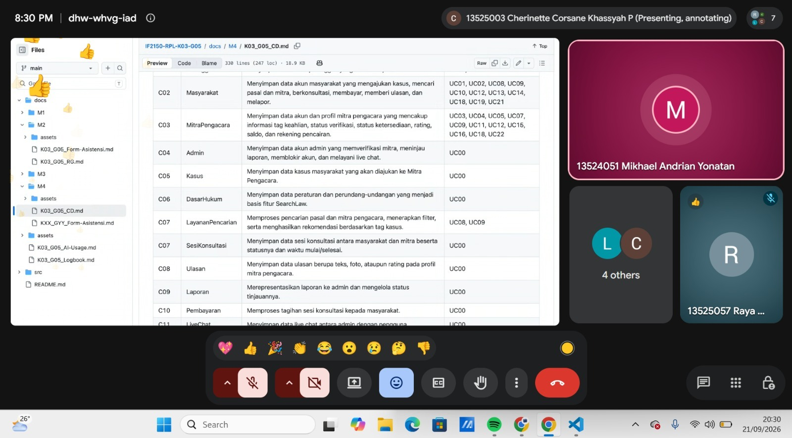

# Form Asistensi

## Tugas Besar IF2150 - Rekayasa Perangkat Lunak

| Informasi | Keterangan |
| --- | --- |
| **Hari** | *Jumat* |
| **Tanggal** | *18/09/2026* |
| **Kelas** | *K-03* |
| **Nomor Kelompok** | *G07*  |
| **Nama Kelompok** | *Siulan*  |
| **Nama Perangkat Lunak** | *LaporKota*  |
| **Dokumen** | *K03_G07_CD*  |

### Anggota Kelompok

| NIM | Nama |
| --- | --- |
| *13525051* | *Rafi Pradipta Andira Sulistyo* |
| *13525105* | *Pasaribu Fritz T.A.M.* |
| *13525075* | *Bagas Anugrah Putra* |
| *13525099* | *Gede Pranajayanta Suputra* |
| *13525015* | *Muhammad Atallah Ramadhan* |

### Catatan

| Catatan |
| --- |
| 1. *Penjelasan terkait deliverables yang diminta pada milestone 4*  |
| 2. *Penjelasan terkait notasi Class Diagram yang terdiri dari asosiasi, agregasi, komposiis, inheritance, depenndensi, dan realisasi.* |
| 3. *Menekankan bahwa tidak harus menggunakan konsep OOP dalam implementasinya, namun dapat memetakan hal-hal dengan kelas diagram.* |
| 4. ... |

**Notes for this section:**  
*Catatan dapat dituliskan dalam bentuk paragraf atau poin-poin, disesuaikan saja.* 

## Dokumentasi

<!--  -->

  

  <i>Gambar 1. Dokumentasi kegiatan asistensi.</i>

