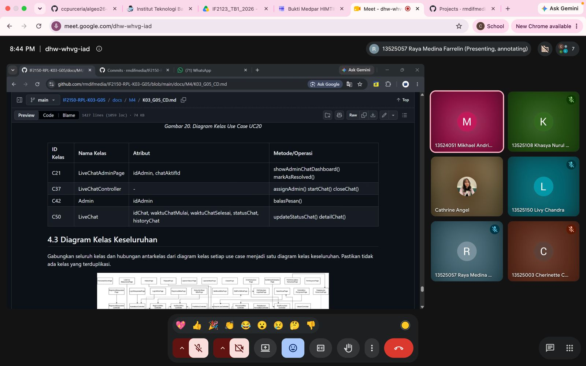

# Form Asistensi

## Tugas Besar IF2150 - Rekayasa Perangkat Lunak

| Informasi | Keterangan |
| --- | --- |
| **Hari** | Senin |
| **Tanggal** | 28/09/2026 |
| **Kelas** | K03 |
| **Nomor Kelompok** | G05  |
| **Nama Kelompok** | HEYSRIUSLAH  |
| **Nama Perangkat Lunak** | LawHub  |
| **Dokumen** | K03_G05_SKPL  |

### Anggota Kelompok

| NIM | Nama |
| --- | --- |
| 13525003 | Cherinette Corsane Khassyah Purceria |
| 13525057 | Raya Medina Farrelin |
| 13525108 | Khasya Nurul Amini |
| 13525138 | Cathrine Angel Siburian |
| 13525150 | Livy Chandra |

### Catatan

| Catatan |
| --- |
| 1. Jika memungkinkan, sebaiknya garis di diagram kelas tidak berpotongan |
| 2. ... |
| 3. ... |
| 4. ... |

## Dokumentasi

<!--  -->

  

  <i>Gambar 1. Dokumentasi kegiatan asistensi.</i>

