<h1>
IF2150 REKAYASA PERANGKAT LUNAK
 
TUGAS 5
 
SPESIFIKASI KEBUTUHAN PERANGKAT LUNAK (SKPL)
</h1>
 

## LawHub

### Untuk: Mikhael Andrian Yonatan

Dipersiapkan oleh:
| Informasi | Keterangan |
| --- | --- |
| Kelas | K03 |
| Kelompok | G05  |

| NIM | Nama |
|---|---|
| 13525057 | Raya Medina Farrelin |
| 13525003 | Cherinette Corsane Khassyah Purceria |
| 13525108 | Khasya Nurul Amini |
| 13525150 | Livy Chandra |
| 13525138 | Cathrine Angel Siburian |
---

## Daftar Perubahan

| Revisi | Deskripsi |
| :--- | :--- |
| - | -|

 

# BAB 1: Pendahuluan

## 1.1 Tujuan Penulisan Dokumen
Dokumen Spesifikasi Kebutuhan Perangkat Lunak (SKPL) ini disusun untuk mendefinisikan secara rinci dan terstruktur kebutuhan fungsional maupun non-fungsional dari perangkat lunak LawHub, sebuah platform konsultasi hukum digital dengan dua fitur utama, yaitu HaloLaw, fitur konsultasi hukum *on-demand* dengan mitra pengacara, dan SearchLaw, fitur *search engine* untuk mencari dasar hukum yang relevan dengan kasus atau masalah yang sedang dialami pengguna. Dokumen ini bertujuan menjadi acuan dalam pengembangan sistem kedepannya, sehingga kebutuhan dan alur sistem dapat dipahami secara konsisten dan diimplementasikan sesuai harapan.

Dokumen ini ditujukan bagi:
- **Tim pengembang**, sebagai acuan teknis dalam merancang, mengimplementasikan, dan menguji sistem agar sesuai dengan kebutuhan yang telah didefinisikan.
- **Dosen/asisten mata kuliah IF2150 Rekayasa Perangkat Lunak**, sebagai bahan evaluasi terhadap pemahaman kelompok dalam menyusun spesifikasi kebutuhan perangkat lunak.
- **Calon pengguna P/L** (Masyarakat, Mitra Pengacara, dan Admin), sebagai gambaran umum atas fitur dan batasan sistem yang akan mereka gunakan.

## 1.2 Lingkup Masalah
LawHub merupakan platform layanan konsultasi hukum digital yang dikembangkan untuk memperluas akses bantuan hukum bagi masyarakat Indonesia, di tengah tingginya angka sengketa dan konflik hukum yang belum terselesaikan serta terbatasnya kanal konsultasi hukum yang interaktif dan efisien. Berbeda dari laman bantuan hukum yang sudah ada dan umumnya berfokus pada forum tanya jawab terbuka, LawHub menghadirkan dua fitur utama, yaitu HaloLaw untuk konsultasi hukum on-demand secara langsung dengan mitra pengacara melalui chat, dan SearchLaw untuk membantu masyarakat menemukan dasar hukum yang relevan dengan kasus yang dihadapi, sehingga proses konsultasi hukum menjadi lebih cepat, transparan, dan mudah diakses oleh berbagai kalangan.

## 1.3 Definisi, Istilah, dan Singkatan

Tabel 1.3. Definisi Istilah dan Singkatan

| Singkatan, Akronim, atau Istilah | Penjelasan |
| :--- | :--- |
| P/L | Singkatan dari Perangkat Lunak, yaitu aplikasi yang memberikan perintah kepada komputer untuk menjalankan tugas tertentu. |
| SKPL | Singkatan dari Spesifikasi Kebutuhan Perangkat Lunak, yaitu dokumen yang merangkum kriteria-kriteria yang diperlukan untuk membangun aplikasi menjalankan tugasnya. |
| KF | Singkatan dari Kebutuhan Fungsional. |
| KNF | Singkatan dari Kebutuhan Non-Fungsional. |
| UC | Singkatan dari Use Case. |
| EARS | Easy Approach to Requirements Syntax, yaitu pola penulisan kebutuhan agar konsisten dan mudah diuji. |

## 1.4 Aturan Penomoran

Tabel 1.4. Aturan Penomoran

| Hal/Bagian | Penomoran | 
| :--- | :--- |
| Kebutuhan Fungsional | KFXX | 
| Kebutuhan Non-Fungsional | KNFXX | 
| Use Case | UCXX | 
| Kelas | CXX | 
| Kebutuhan | RXX | 

## 1.5 Referensi
Dokumen SKPL ini disusun dengan merujuk pada sumber-sumber berikut:
1. Dokumen M1, M2, M3, M4 IF2150-RPL-K03-G05
3. Materi kuliah IF2150 Rekayasa Perangkat Lunak, Program Studi Teknik Informatika, Institut Teknologi Bandung.

## 1.6 Deskripsi Umum Dokumen (Ikhtisar)
Dokumen SKPL ini disusun dengan sistematika sebagai berikut:
- **BAB 1 Pendahuluan** membahas tujuan penulisan dokumen, lingkup masalah, definisi/istilah/singkatan yang digunakan, aturan penomoran, referensi yang menjadi acuan, serta ikhtisar isi dokumen secara keseluruhan.
- **BAB 2 Deskripsi Perangkat Lunak** membahas gambaran umum sistem dan perangkat lunak LawHub, karakteristik serta kebutuhan pengguna, batasan perangkat lunak, dan lingkungan operasi tempat perangkat lunak dijalankan.
- **BAB 3 Deskripsi Kebutuhan Perangkat Lunak** membahas kebutuhan fungsional (KF) dan kebutuhan non-fungsional (KNF) dari perangkat lunak secara rinci.
- **BAB 4 Pemodelan Use Case** membahas identifikasi aktor dan use case, use case diagram, serta skenario dari setiap use case yang telah diidentifikasi.
- **BAB 5 Pemodelan Kelas** membahas identifikasi kelas, diagram kelas untuk masing-masing use case, dan diagram kelas keseluruhan yang menggambarkan struktur serta relasi antar kelas dalam sistem.
- **BAB 6 Traceability** membahas keterkaitan antara kebutuhan fungsional, use case, dan kelas yang telah didefinisikan pada bab-bab sebelumnya.

---

# BAB 2: Deskripsi Perangkat Lunak

## 2.1 Deskripsi Umum Sistem
Perangkat lunak **LawHub** merupakan sebuah platform layanan konsultasi hukum digital yang dirancang untuk memberikan akses bantuan hukum yang transparan, cepat, dan dapat diakses oleh berbagai kalangan. LawHub memiliki dua fitur utama. Dua fitur tersebut adalah HaloLaw dan SearchLaw. 

Pada fitur HaloLaw, pengguna dapat berkonsultasi dengan mitra praktisi hukum melalui chat dalam platform LawHub. Pertama pengguna dapat menuliskan kasus atau masalah yang dialaminya. Submisi ini berupa form yang selanjutnya LawHub akan merekomendasikan mitra praktisi hukum yang relevan dengan kasus yang dialami oleh pengguna. Selanjutnya, pengguna dapat berkonsultasi dengan mitra praktisi hukum yang dipilih melalui fitur HaloLaw. 

Pada fitur SearchLaw, pengguna dapat mencari dasar hukum apa saja yang relevan dengan kasus yang dimilikinya. Sama seperti pada fitur HaloLaw, pengguna mula-mula dapat menuliskan kasus atau masalah yang dialaminya dalam sebuah form. Selanjutnya, akan muncul beberapa dasar dasar hukum yang terkait dengan kasus yang dialami pengguna. Dengan begitu, pengguna dapat membaca dasar dasar hukum tersebut sebelum menangani kasusnya lebih lanjut. 

**Ekspektasi Masyarakat** : Masyarakat mengharapkan kemudahan dalam menyampaikan kasus hukum yang dihadapinya dengan bahasa yang tidak rumit, mengharapkan kecepatan dalam menemukan praktisi hukum yang sesuai, serta memahami dasar dasar hukum yang tepat dan sesuai sebelum melangkah lebih lanjut dalam menangani kasus hukumnya. 

**Ekspektasi Mitra Pengacara** : Mitra pengacara mengharapkan efisiensi dalam menjangkau klien dengan kasus hukum yang sesuai dengan keahliannya, serta fleksibilitas dalam memberikan konsultasi melalui platform digital.

**Ekspektasi Admin** : Admin mengharapkan efisiensi dalam memverifikasi dokumen legalitas mitra pengacara, kemudahan dalam mengelola serta meninjau bukti laporan pelanggaran, serta platform yang interaktif dan memudahkan admin dalam berinteraksi dengan pengguna lain melalui *live chat*.

Dari sisi masyarakat, alur kerja LawHub dimulai ketika masyarakat memiliki suatu kasus hukum yang ingin diselesaikan. Masyarakat dapat membuka platform LawHub lalu melakukan *Sign Up/Login* terlebih dahulu. Selanjutnya, masyarakat dapat mengisi form/mengajukan submisi untuk menceritakan kasus hukum yang dialaminya. Masyarakat dapat menambahkan beberapa tag kategori yang menggambarkan kasus hukum yang dialaminya. Lalu, masyarakat dapat memilih dua fitur yang berbeda, yaitu HaloLaw dan SearchLaw. Jika masyarakat memilih HaloLaw, masyarakat akan diarahkan untuk memilih rekomendasi mitra praktisi hukum yang sesuai dengan kasus yang dialaminya. Rekomendasi ini muncul berdasarkan tag kategori yang ada pada kasus yang di submit. Selanjutnya, masyarakat dapat memilih mitra praktisi hukum dan mulai melakukan konsultasi. Jika masyarakat memilih SearchLaw, akan disajikan beberapa sumber hukum yang terkait dengan kasus hukum yang dialami masyarakat. 

Dari sisi mitra pengacara, alur kerja LawHub dimulai dari pembuatan akun mitra pengacara. Selanjutnya, mitra pengacara akan diminta untuk mengunggah beberapa dokumen terkait untuk dilakukan verifikasi oleh admin. Kemudian, mitra pengacara dapat mengedit akun profilnya khususnya memilih beberapa tag kategori kasus yang menjadi keahliannya. Tag ini nantinya akan muncul dalam rekomendasi ketika ada kasus yang sesuai dengan keahliannya. Mitra pengacara juga dapat mengubah statusnya apakah ia available atau not available dalam menerima klien konsultasi. Jika telah menerima klien, mitra pengacara dapat melakukan konsultasi berdasarkan kasus yang diberikan klien dan berkomunikasi melalui fitur HaloLaw. 

Dari sisi admin, alur kerja LawHub dimulai dari *login* sebagai admin. Selanjutnya admin dapat menangani pengajuan verifikasi akun mitra pengacara dengan meninjau dokumen legalitas yang relevan dan aktif seperti Ijazah, Kartu Tanda Anggota (“KTA”), Surat Izin Praktik Advokat (SIPA), Berita Acara Sumpah (BAS) Advokat, dsb. Selain itu, admin juga dapat melakukan peninjauan laporan yang diberikan oleh pengguna serta menangani keluhan pengguna melalui *live chat*.

<i>Gambar 1. Gambar Diagram Pembuatan Akun</i>

<i>Gambar 2. Gambar Diagram Fitur SearchLaw</i>

<i>Gambar 3. Gambar Diagram Fitur HaloLaw</i>

<i>Gambar 4. Gambar Diagram Pengiriman Laporan</i>

<i>Gambar 5. Gambar Diagram Live Chat</i>

## 2.2 Deskripsi Umum Perangkat Lunak
LawHub merupakan aplikasi layanan konsultasi hukum digital berbasis web yang menghubungkan Masyarakat dengan Mitra Pengacara melalui dua fitur utama, yaitu HaloLaw untuk konsultasi hukum on-demand secara langsung melalui chat, dan SearchLaw untuk pencarian dasar hukum yang relevan dengan kasus yang dihadapi pengguna. Sistem menerima input dari Masyarakat dan Mitra Pengacara melalui antarmuka aplikasi, mengelola proses registrasi, verifikasi akun, penjadwalan sesi konsultasi, pencarian dasar hukum dan mitra pengacara, pelaksanaan sesi konsultasi melalui chat, hingga pengelolaan ulasan dan pelaporan, dengan Admin sebagai pengguna yang memverifikasi dan mengawasi jalannya sistem.

Untuk mendukung proses transaksi, LawHub berinteraksi dengan *Payment Gateway* pihak ketiga (dummy) untuk memproses otorisasi pembayaran setiap kali Masyarakat menyelesaikan pembayaran sesi konsultasi, serta untuk memproses pencairan dana setiap kali Mitra Pengacara mengajukan pencairan dana hasil konsultasi yang telah ditangani. Sistem mengirimkan permintaan transaksi ke *Payment Gateway* dan menerima status keberhasilan transaksi sebagai respons, yang selanjutnya digunakan untuk memperbarui status pembayaran atau pencairan dana pada sistem.

## 2.3 Pengguna dan Kebutuhan Pengguna Perangkat Lunak

| Pengguna | Kebutuhan |
| :--- | :--- |
| Mitra Pengacara | Praktisi hukum yang mendaftar sebagai pengacara HaloLaw untuk menerima dan menanggapi permintaan konsultasi dari klien. |
| Masyarakat | Pengguna umum yang secara aktif menggunakan fitur SearchLaw untuk mencari dasar hukum dan fitur HaloLaw untuk berkonsultasi langsung dengan pengacara. |
| Admin | Mengakses sistem untuk mengelola dan melayani pengguna. |

## 2.4 Batasan Perangkat Lunak
1. P/L hanya berperan sebagai media pengaduan, penyedia informasi, konsultasi awal, serta penghubung antara masyarakat dengan mitra pengacara. 
2. Informasi hukum yang dihasilkan atau disediakan oleh P/L tidak menggantikan nasihat, opini, atau pendampingan hukum resmi secara menyeluruh dari advokat/konsultan hukum.
3. P/L tidak menentukan hasil perkara, menjamin kasus akan ditangani oleh mitra pengacara, maupun menjamin keberhasilan kasus. 
4. Penggunaan P/L dibatasi oleh regulasi yang berlaku termasuk ketentuan terkait praktik hukum dan perlindungan data pribadi.
5. P/L dikembangkan berbasis *web* sehingga pengguna harus memiliki perangkat serta akses internet.

## 2.5 Lingkungan Operasi Perangkat Lunak
| Komponen | Spesifikasi |
| :--- | :--- |
| *Server* | Local |
| *Client* | Chromium Based Browser |
| *DBMS* | PostgreSQL  |
| *OS* | Cross-platform (Windows/Linux/MacOS) melalui browser |

---

# BAB 3: Deskripsi Kebutuhan Perangkat Lunak

## 3.1 Kebutuhan Fungsional (KF)

Tabel 3.1. Kebutuhan Fungsional

| ID KF | ID Kebutuhan | Penjelasan |
| :--- | :--- | :--- |
| KF01 | R01 | Perangkat lunak dapat menampilkan halaman login/registrasi akun bagi masyarakat. |
| KF02 | R01 | Perangkat lunak dapat menampilkan pilihan antarmuka SearchLaw dan HaloLaw setelah pengguna melakukan login. |
| KF03 | R02 | Perangkat lunak dapat menampilkan halaman login/registrasi akun mitra pengacara untuk diverifikasi. |
| KF04 | R02 | Perangkat lunak dapat menampilkan status verifikasi registrasi akun mitra pengacara. |
| KF05 | R03 | Perangkat lunak dapat menampilkan halaman verifikasi mitra pengacara untuk admin. |
| KF06 | R05 | Ketika mitra pengacara melakukan pengeditan pada halaman profil, sistem harus menyimpan dan memperbarui data profil mitra pengacara tersebut. |
| KF07 | R06 | Ketika mitra pengacara mengakses halaman edit dokumen legalitas, sistem harus menampilkan halaman tersebut beserta dokumen legalitas yang telah diunggah sebelumnya. |
| KF08 | R08 | Ketika pengguna memasukkan kata kunci atau menerapkan filter pada search bar, sistem harus menampilkan daftar mitra pengacara yang sesuai dengan kata kunci atau filter tersebut. |
| KF09 | R09 | Ketika pengguna melakukan pencarian, sistem harus menampilkan daftar profil mitra pengacara untuk dipilih sesuai dengan filter yang sudah diaturs. |
| KF10 | R10 | Ketika terdapat pengajuan konsultasi kasus dari pengguna, sistem harus menyediakan fitur bagi mitra pengacara untuk menerima atau menolaknya. |
| KF11 | R11 | Selama sesi konsultasi berlangsung dan masih berstatus aktif, sistem harus memfasilitasi pertukaran pesan (chat) antara pengguna dan mitra pengacara. |
| KF12 | R12 dan R13 | Setelah sesi kondultasi berakhir, sistem harus menyimpan ulasan, feedback, dan rating yang diberikan oleh pengguna kepada mitra pengacara. |
| KF13 | R14 | Ketika pengguna, mitra pengacara atau masyarakat, menemukan pelanggaran saat/setelah sesi konsultasi berlangsung, sistem harus menyediakan fitur untuk melaporkan akun yang melakukan pelanggaran. |
| KF14 | R15 | Ketika pengguna mengajukan laporan terhadap ulasan atau profil mitra pengacara secara umum, sistem harus memproses pelaporan ulasan/profil tersebut.P erangkat lunak dapat mewadahi pelaporan ulasan bagi pengguna dan/atau profil mitra pengacara secara umum. |
| KF15 | R16 | Ketika admin mengakses daftar pelaporan akun, sistem harus menyediakan fitur untuk melakukan verifikasi pelaporan tersebut. |
| KF16 | R17 | Ketika admin mengonfirmasi tindakan pemblokiran terhadap akun yang melanggar kebijakan, sistem harus memblokir akun tersebut dari segala akses sistem. |
| KF17 | R18 | Ketika mitra pengacara mengakses riwayat konsultasi, sistem harus menampilkan seluruh riwayat kasus yang pernah ditangani oleh mitra tersebut. |
| KF18 | R019 | Ketika pengguna memulai sesi live chat, sistem harus mewadahi live chat antara admin dan pengguna untuk membantu penanganan kendala. | 
| KF19 | R031 | Ketika pengguna mengonfirmasi pembayaran, sistem harus memproses pembayaran melalui payment gateway pihak ketiga. |
| KF20 | R032 | Ketika mitra pengacara mengajukan pencairan dana, sistem harus memproses pencairan dana mitra pengacara tersebut. | 

 ***Catatan***: *Kebutuhan ditulis mengikuti pola EARS. Pada contoh di bawah, sebagian besar KF dipicu oleh satu aksi pelanggan, sehingga memakai pola event-driven "Ketika ⟨pemicu⟩, sistem harus ⟨respons⟩".*

---

## 3.2 Kebutuhan Non-Fungsional (KNF)

Tabel 3.2. Kebutuhan Non-Fungsional

| ID KNF | ID Kebutuhan | Parameter | Deskripsi Kebutuhan |
| :--- | :--- | :--- | :--- |
| KNF01 | R01 | Response Time | Data dan riwayat penggunaan tersinkron dan tampil kembali tidak lebih dari 2 detik saat pengguna melakukan log in |
| KNF02 | R02 | Response Time | Proses verifikasi mitra pengacara berlangsung tidak lebih dari 3 hari oleh admin |
| KNF03 | R02 | Security | Dokumen penunjang pendaftaran yang diunggah mitra pengacara tersimpan dalam sistem dan dienkripsi menggunakan algoritma AES-256 untuk memastikan keamanan data sensitif |
| KNF04 | R04 | Response Time | Proses penyimpanan ataupun pengubahan profil tersimpan dan ditampilkan tidak lebih dari 3 detik di profil |
| KNF05 | R07 | Reliability | Mesin pencarian menyortir menggunakan algoritma peringkat relevansi teks dan menampilkan seluruh hasil pencarian yang terkait |
| KNF06 | R07 | Response Time | Proses eksekusi algoritma untuk menampilkan hasil pencarian tidak memakan waktu lebih dari 3 detik |
| KNF07 | R08 | Reliability | Proses sortir data mitra pengacara menggunakan algoritma quick sort atau merge sort untuk menampilkan seluruh mitra pengacara yang sesuai dengan filter pengguna |
| KNF08 | R08 | Reliability | Proses sortir data mitra pengacara tidak memakan waktu lebih dari 3 detik |
| KNF09 | R09 | Ergonomy | Pengguna dapat berkomunikasi dengan mitra pengacara melalui chat tanpa hambatan visualisasi |
| KNF10 | R09 | Security | Seluruh percakapan dienkripsi end-to-end sehingga hanya diketahui oleh pengguna dan mitra pengacara yang bersangkutan* |
| KNF11 | R09 | Availability | Pengguna dapat mengakses fitur HaloLaw dan berinteraksi dengan mitra pengacara selama 24 jam sesuai dengan ketersediaan mitra pengacara |
| KNF12 | R10 | Availability | Mitra pengacara dapat menerima atau menanggapi klien selama 24 jam |
| KNF13 | R11 | Availability | Pengajuan komunikasi lanjutan tersedia selama sesi konsultasi aktif |
| KNF14 | R12 | Reliability | Ulasan, feedback, dan/atau rating diperiksa menggunakan regex pattern matching untuk mendeteksi kata-kata tidak pantas |
| KNF15 | R14 | Security | Data pelapor pelanggaran hanya dapat diketahui oleh admin dan tidak diketahui oleh pihak terlapor |
| KNF16 | R14 | Response Time | Laporan pelanggaran diproses tidak lebih dari 3 hari secara manual oleh admin |
| KNF17 | R15 | Security | Data pelapor pelanggaran hanya diketahui oleh admin |
| KNF18 | R15 | Response Time | Tinjauan pelanggaran diproses tidak lebih dari 3 hari secara manual oleh admin|
| KNF19 | R18 | Security | Riwayat konsultasi yang tersimpan dienkripsi menggunakan algoritma AES-256 dan hanya bisa diakses oleh mitra pengacara |
| KNF20 | R19 | Response Time | Layanan live chat dapat diakses selama jam operasional dengan waktu respons tidak lebih dari 5 menit |
| KNF21 | R29 | Constraint | Dokumen yang diunggah wajib berstatus aktif atau tidak kadaluarsa |
| KNF22 | R30 | Constraint | Hasil pencarian disalin melalui sumber data tanpa sumber tambahan lain |

---

# BAB 4: Pemodelan Use Case

## 4.1 Identifikasi Aktor
Tabel 3.1. Daftar Aktor
| Aktor | Deskripsi |
| :--- | :--- |
| Mitra Pengacara | Praktisi hukum yang mendaftar sebagai pengacara HaloLaw untuk menerima dan menanggapi permintaan konsultasi dari klien. |
| Masyarakat | Pengguna umum yang secara aktif menggunakan fitur SearchLaw untuk mencari dasar hukum dan fitur HaloLaw untuk berkonsultasi langsung dengan pengacara. |
| Admin | Mengakses sistem untuk mengelola dan melayani pengguna. |

## 4.2 Identifikasi Use Case
Use case berfungsi untuk mendeskripsikan interaksi aktor-aktor yang terlibat dengan sistem. Isi daftar use case dan deskripsi singkatnya dalam tabel di bawah.

Pada bagian ini, Anda diperbolehkan untuk menyalin dari dokumen sebelumnya.

| ID UC | Nama Use Case | Deskripsi Singkat | Aktor Terlibat | ID KF Terkait |
| :--- | :--- | :--- | :--- | :--- |
| UC01 | Melakukan Registrasi Akun bagi Masyarakat | Masyarakat melakukan registrasi akun untuk membuat akun dan mengakses semua fitur LawHub. | Masyarakat | KF01 |
| UC02 | Melakukan Login bagi Masyarakat | Masyarakat melakukan login untuk mengakses semua fitur LawHub serta melihat histori kegiatan akun. | Masyarakat | KF01, KF02 |
| UC03 | Melakukan Registrasi Akun bagi Mitra Pengacara | Mitra pengacara dapat melakukan registrasi akun dengan mengunggah file yang diperlukan. | Mitra pengacara | KF03 |
| UC04 | Melakukan Login bagi Mitra Pengacara | Mitra pengacara dapat melakukan login dengan akun yang sudah diverifikasi. | Mitra pengacara | KF03 |
| UC05 | Melihat Status Registrasi Akun Mitra Pengacara | Mitra pengacara dapat melihat status registrasi akun yang baru dibuat. | Mitra pengacara | KF04 |
| UC06 | Memverifikasi Pendaftar Mitra Pengacara | Admin memeriksa dokumen dan menentukan legalitas mitra pengacara. | Admin | KF05 |
| UC07 | Verifikasi Akun Pengacara | Mitra pengacara mengunggah dokumen legalitas dan mengisi/mengedit identitas firma. | Mitra pengacara | KF06, KF07 |
| UC08 | Melakukan Pencarian Pasal | Masyarakat mencari pasal yang berkaitan dengan kasus yang sedang dialami menggunakan minimal satu kata kunci. | Masyarakat | KF08 |
| UC09 | Melihat Daftar Pengacara | Masyarakat mencari mitra pengacara sesuai masalah yang dihadapi dengan menggunakan filter. | Masyarakat | KF09 |
| UC10 | Memilih Mitra Pengacara untuk Sesi Konsultasi | Masyarakat memilih jadwal tersedia untuk sesi konsultasi dengan mitra pengacara yang dipilih.  | Masyarakat | KF09 |
| UC11 | Menanggapi Sesi Konsultasi | Mitra pengacara menerima dan melakukan konsultasi untuk masyarakat. | Mitra pengacara | KF10 |
| UC12 | Melakukan Sesi Konsultasi | Masyarakat melakukan sesi konsultasi dengan mitra pengacara via *chat*. | Masyarakat dan Mitra Pengacara | KF11 |
| UC13 | Memberi Ulasan, Feedback, dan/atau Rating | Masyarakat mengirim teks dan/atau foto sebagai bentuk ulasan, *feedback*, dan/saran setelah melakukan sesi konsultasi. | Masyarakat | KF12 |
| UC14 | Melaporkan Pelanggaran | Masyarakat melaporkan akun mitra pengacara yang melakukan pelanggaran saat/setelah sesi konsultasi berlangsung. | Masyarakat | KF13 |
| UC15 | Melaporkan Pelanggaran | Mitra pengacara melaporkan akun masyarakat yang melakukan pelanggaran saat/setelah sesi konsultasi berlangsung. | Mitra Pengacara | KF13 |
| UC16 | Melaporkan Ulasan | Mitra pengacara melaporkan ulasan yang tidak relevan. | Mitra Pengacara | KF14 |
| UC17 | Memblokir Akun | Admin melakukan ban kepada akun yang melanggar kebijakan sistem. | Admin | KF15, KF16 |
| UC18 | Melihat Riwayat Penanganan | Mitra pengacara dan masyarakat melihat riwayat kasus yang telah dilakukan masing-masing secara keseluruhan. | Mitra Pengacara dan Masyarakat | KF17 |
| UC19 | Menanyakan Masalah Teknis | Masyarakat bertanya kepada admin melalui fitur *live chat*. | Masyarakat dan Admin | KF18 |
| UC20 | Menjawab Pertanyaan | Admin menjawab pertanyaan masyarakat melalui *live chat*. | Admin | KF18 |
| UC21 | Membayar Biaya Sesi Konsultasi | Masyarakat melakukan transaksi pembayaran sesuai dengan pilihan metode pembayaran digital. | Masyarakat | KF19 |
| UC22 | Mencairkan Dana | Mitra pengacara mendapatkan pencairan dana ke rekening yang telah didaftarkan di profil akun. | Mitra pengacara | KF20 |

## 4.3 Use Case Diagram
 

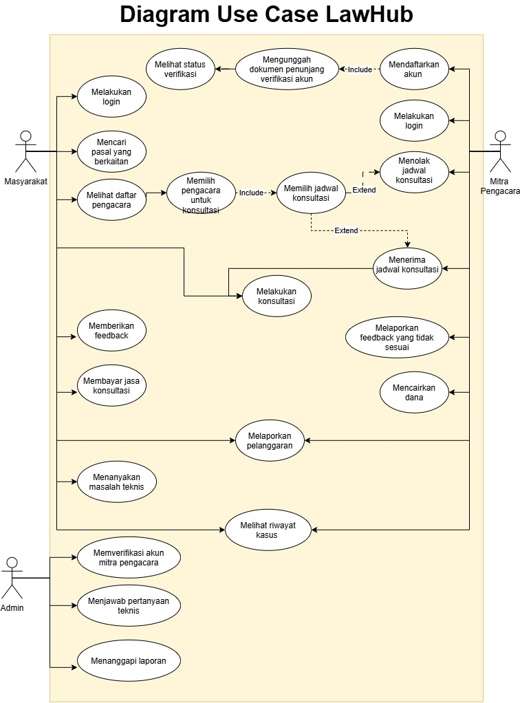

<i>Gambar 1. Use Case Diagram</i>

 

## 4.4 Skenario Use Case
### 4.4.1 Skenario UC01

**Nama Use Case:** *Daftar Akun bagi Masyarakat*

**Skenario Normal**

| No | Aksi Aktor | Reaksi Perangkat Lunak |
| :--- | :--- | :--- |
| 1 | Pengguna membuka laman registrasi dan memasukkan data yang diminta | Sistem menampilkan formulir registrasi dan memberikan ketentuan data diri yang diminta |
| 2 | Pengguna menekan tombol "Daftar" untuk melakukan finalisasi pendaftaran | Sistem melakukan pemeriksaan data yang diberikan jika sesuai ketentuan sistem akan mengarahkan ke laman pengguna |

**Skenario Alternatif 1: Registrasi gagal**

| No | Aksi Aktor | Reaksi Perangkat Lunak |
| :--- | :--- | :--- |
| 1 | Masyarakat menekan submit dengan email yang sudah terdaftar | Sistem menampilkan pesan error "email sudah terdaftar" dan meminta masyarakat memperbaiki input dengan kembali ke laman registrasi awal |
| 2 | Masyarakat memasukkan password yang tidak memenuhi kriteria keamanan (kurang kuat) lalu menampilkan pesan error "password terlalu lemah" lalu kembali ke laman awal untuk melakukan input ulang password |

 

### 4.4.2 Skenario UC02

**Nama Use Case:** *Login Akun bagi Masyarakat*

**Skenario Normal**

| No | Aksi Aktor | Reaksi Perangkat Lunak |
| :--- | :--- | :--- |
| 1 | Pengguna membuka laman login dan memasukkan username/email serta password, lalu menekan login | Sistem memvalidasi kredensial; jika cocok sistem mengarahkan pengguna ke halaman utama sesuai role khusus untuk mitra pengacara sistem akan menampilkan status akun yaitu *approved* |

 

**Skenario Alternatif 1: Kredensial salah**

| No | Aksi Aktor | Reaksi Perangkat Lunak |
| :--- | :--- | :--- |
| 1 | Pengguna memasukkan username/email yang terdaftar tetapi password salah | Sistem menampilkan pesan "kombinasi username/password salah" dan mengizinkan pengguna mengedit ulang input pada form yang sama |

 

**Skenario Alternatif 2: Akun tidak terdaftar**

| No | Aksi Aktor | Reaksi Perangkat Lunak |
| :--- | :--- | :--- |
| 1 | Pengguna memasukkan username/email yang belum pernah terdaftar | Sistem tidak menemukan akun dengan kredensial tersebut kemudian menampilkan pesan "akun tidak ditemukan" beserta dua opsi yaitu mengedit ulang input, atau menuju laman registrasi |
| 2 | Pengguna memilih salah satu opsi antara edit ulang input atau ke laman registrasi | Jika edit ulang: sistem kembali ke langkah 1 skenario normal. Jika ke registrasi: sistem mengarahkan ke UC02 (mitra) atau UC03 (masyarakat) sesuai role yang dipilih pengguna |

 

### 4.4.3 Skenario UC03

**Nama Use Case:** *Daftar Akun Mitra Pengacara*

**Skenario Normal**

| No | Aksi Aktor | Reaksi Perangkat Lunak |
| :--- | :--- | :--- |
| 1 | Mitra pengacara membuka laman registrasi mitra dan mengisi data diri/firma serta mengunggah dokumen legalitas yang diperlukan | Sistem menampilkan form registrasi mitra |
| 2 | Mitra pengacara mengirim semua data yang diminta dan menekan submit | Sistem memvalidasi kelengkapan dan format input; jika valid, sistem menyimpan data, membuat akun berstatus *pending*, dan menampilkan notifikasi bahwa pengajuan sedang menunggu persetujuan dari admin |

 

**Skenario Alternatif 1: Gagal submit**

| No | Aksi Aktor | Reaksi Perangkat Lunak |
| :--- | :--- | :--- |
| 1 | Mitra pengacara menekan submit dengan field wajib kosong atau format input regis tidak sesuai, dan/atau dokumen berformat tidak didukung | Sistem melakukan pemeriksaan sesuai dengan syarat yang dibuat kemudian menampilkan pesan error yang menunjukkan field/dokumen bermasalah dan meminta mitra pengacara memperbaiki input sebelum submit ulang |

 

### 4.4.4 Skenario UC04

**Nama Use Case:** *Login Akun Mitra Pengacara*

**Skenario Normal**

| No | Aksi Aktor | Reaksi Perangkat Lunak |
| :--- | :--- | :--- |
| 1 | Mitra pengacara membuka laman login dan mengisi email serta username yang sudah didaftarkan | Sistem menampilkan form login mitra |
| 2 | Mitra pengacara memasukan semua input login | Sistem memvalidasi input; jika valid, sistem mengarahkan ke laman mitra pengacara |

 

**Skenario Alternatif 1: Kredensial Salah**

| No | Aksi Aktor | Reaksi Perangkat Lunak |
| :--- | :--- | :--- |
| 1 | Mitra pengacara menginput data yang tidak sesaui dengan akun terdaftar | Sistem menampilkan pesan "kombinasi username/password salah" dan mengizinkan pengguna mengedit ulang input pada form yang sama. |

 

**Skenario Alternatif 2: Akun tidak terdaftar**

| No | Aksi Aktor | Reaksi Perangkat Lunak |
| :--- | :--- | :--- |
| 1 | Mitra memasukkan username/email yang belum pernah terdaftar | Sistem tidak menemukan akun dengan kredensial tersebut kemudian menampilkan pesan "akun tidak ditemukan" beserta dua opsi yaitu mengedit ulang input, atau menuju laman registrasi |
| 2 | Pengguna memilih salah satu opsi antara edit ulang input atau ke laman registrasi | Jika edit ulang: sistem kembali ke langkah 1 skenario normal. Jika ke registrasi: sistem mengarahkan ke UC02 (mitra) atau UC03 (masyarakat) sesuai role yang dipilih pengguna |

 

**Skenario Alternatif 3: Akun mitra belum/gagal terverifikasi**

| No | Aksi Aktor | Reaksi Perangkat Lunak |
| :--- | :--- | :--- |
| 1 | Mitra pengacara memasukkan kredensial yang benar, namun status akun masih *pending* atau *rejected* | Sistem menolak akses, menampilkan pesan bahwa akun belum/tidak terverifikasi, dan mengarahkan kembali ke laman login (dengan opsi menuju UC04 untuk cek status) |

### 4.4.5 Skenario UC05

**Nama Use Case:** *Melihat status verifikasi akun*

**Skenario Normal**

| No | Aksi Aktor | Reaksi Perangkat Lunak |
| :--- | :--- | :--- |
| 1 | Mitra pengacara memasukan nama akun yang sedang diproses pendaftarannya kemudian membuka laman status verifikasi untuk melihat status verifikasi pendaftaran akun mitra | Sistem menampilkan status verifikasi mitra yaitu pending (belum dicek, admin mengajukan edit atau tambah dokumen), approved, atau rejected |

 

**Skenario Alternatif 1: Belum pernah mengajukan pendaftaran**

| No | Aksi Aktor | Reaksi Perangkat Lunak |
| :--- | :--- | :--- |
| 1 | Mitra pengacara membuka laman status verifikasi tanpa pernah melakukan registrasi akun mitra | Sistem menampilkan pesan bahwa belum ada pengajuan registrasi, dan mengarahkan pengguna ke laman daftar akun mitra |

### 4.4.6 Skenario UC06

**Nama Use Case:** *Verifikasi akun mitra*

**Skenario Normal**

| No | Aksi Aktor | Reaksi Perangkat Lunak |
| :--- | :--- | :--- |
| 1 | Admin membuka daftar pengajuan registrasi mitra pengacara yang berstatus pending | Sistem menampilkan detail data dan dokumen yang diunggah mitra pengacara |
| 2 | Admin memeriksa dokumen dan menyatakan dokumen memenuhi syarat (aktif, lengkap, sesuai ketentuan) | Sistem mengubah status akun mitra menjadi *approved* dan mengirimkan notifikasi ke mitra pengacara |

 

**Skenario Alternatif 1: Admin meminta penambahan/revisi dokumen**

| No | Aksi Aktor | Reaksi Perangkat Lunak |
| :--- | :--- | :--- |
| 1 | Admin membuka daftar pengajuan registrasi mitra pengacara yang berstatus pending | Sistem menampilkan detail data dan dokumen yang diunggah mitra pengacara |
| 2 | Admin menilai dokumen kurang lengkap dan mengajukan permintaan revisi/tambahan dokumen disertai catatan | Sistem mengubah status akun mitra menjadi *wajib revisi sesuai ketentuan* dan mengirimkan notifikasi berisi catatan revisi ke mitra pengacara |

 

**Skenario Alternatif 2: Dokumen tidak memenuhi syarat atau terindikasi pelanggaran**

| No | Aksi Aktor | Reaksi Perangkat Lunak |
| :--- | :--- | :--- |
| 1 | Admin membuka daftar pengajuan registrasi mitra pengacara yang berstatus pending | Sistem menampilkan detail data dan dokumen yang diunggah mitra pengacara |
| 2 | Admin menemukan dokumen tidak sah, kedaluwarsa, atau terindikasi diedit/dipalsukan, lalu menolak pengajuan | Sistem mengubah status akun mitra menjadi *rejected* disertai alasan penolakan dan mengirimkan notifikasi ke mitra pengacara |

 

**Skenario Alternatif 3: Mitra pengacara menambahkan/memperbarui dokumen setelah diminta revisi**

| No | Aksi Aktor | Reaksi Perangkat Lunak |
| :--- | :--- | :--- |
| 1 | Mitra pengacara menerima notifikasi permintaan revisi dan mengunggah dokumen baru/perbaikan | Sistem menyimpan dokumen yang diperbarui dan mengubah status pengajuan kembali menjadi *pending* |
| 2 | — | Sistem menempatkan pengajuan kembali ke antrean pemeriksaan admin (kembali ke langkah 1 Skenario Normal) |

### 4.4.7 Skenario UC07

**Nama Use Case:** *Verifikasi Akun Pengacara (Edit Profil)*

**Skenario Normal**

| No | Aksi Aktor | Reaksi Perangkat Lunak |
| :--- | :--- | :--- |
| 1 | Mitra pengacara membuka laman edit profil firma | Sistem menampilkan formulir profil berisi data saat ini (tag, deskripsi, dokumen, dsb) |
| 2 | Mitra pengacara mengubah data profil (tag, deskripsi) dan/atau mengunggah dokumen baru, lalu menyimpan | Sistem memvalidasi input; jika hanya profil non-dokumen yang diubah, sistem langsung menyimpan dan menampilkan notifikasi berhasil. Jika ada dokumen yang ditambah/diperbarui, sistem menyimpan perubahan, mengubah status verifikasi dokumen menjadi *pending*, dan mengirim pengajuan ke admin untuk diverifikasi ulang |

### 4.4.8 Skenario UC08

**Nama Use Case:** *Melakukan Pencarian Pasal*

**Skenario Normal**

| No | Aksi Aktor | Reaksi Perangkat Lunak |
| :--- | :--- | :--- |
| 1 | Masyarakat membuka fitur pencarian pasal | Sistem menampilkan kolom pencarian |
| 2 | Masyarakat memasukkan minimal satu kata kunci terkait kasus yang dialami dan menekan cari | Sistem menampilkan daftar pasal yang relevan dengan kata kunci tersebut |

 

**Skenario Alternatif 1: Tidak ada pasal yang sesuai**

| No | Aksi Aktor | Reaksi Perangkat Lunak |
| :--- | :--- | :--- |
| 1 | Masyarakat membuka fitur pencarian pasal | Sistem menampilkan kolom pencarian |
| 2 | Masyarakat memasukkan kata kunci yang tidak cocok dengan pasal manapun dan menekan cari | Sistem menampilkan pesan "Tidak ditemukan pasal yang sesuai" dan menyarankan kata kunci lain |

### 4.4.9 Skenario UC09

**Nama Use Case:** *Mencari Mitra Pengacara*

**Skenario Normal**

| No | Aksi Aktor | Reaksi Perangkat Lunak |
| :--- | :--- | :--- |
| 1 | Masyarakat membuka laman daftar mitra pengacara | Sistem menampilkan daftar mitra pengacara yang tersedia |
| 2 | Masyarakat menerapkan filter (misal: bidang hukum, lokasi, rating) sesuai masalah yang dihadapi atau menggunakan filter search sesuai identitas mitra | Sistem menampilkan daftar mitra pengacara yang sesuai dengan filter atau keyword |

 

**Skenario Alternatif 1: Tidak ada mitra yang sesuai filter dan/atau keyword**

| No | Aksi Aktor | Reaksi Perangkat Lunak |
| :--- | :--- | :--- |
| 1 | Masyarakat membuka laman daftar mitra pengacara | Sistem menampilkan daftar mitra pengacara yang tersedia |
| 2 | Masyarakat menerapkan filter dan/atau mencari keyword yang yang tidak dipenuhi oleh mitra manapun | Sistem menampilkan pesan "Tidak ada mitra pengacara yang sesuai" dan menyarankan mengubah/menghapus filter atau menyarankan keyword lain |

### 4.4.10 Skenario UC10

**Nama Use Case:** *Memilih Mitra Pengacara untuk Sesi Konsultasi*

**Skenario Normal**

| No | Aksi Aktor | Reaksi Perangkat Lunak |
| :--- | :--- | :--- |
| 1 | Masyarakat memilih salah satu mitra pengacara dari daftar | Sistem menampilkan jadwal ketersediaan mitra pengacara tersebut |
| 2 | Masyarakat memilih jadwal yang kosong dan mengonfirmasi permintaan konsultasi | Sistem mengunci slot jadwal tersebut sementara, membuat permintaan sesi konsultasi berstatus *menunggu tanggapan mitra*, dan mengirim notifikasi ke mitra pengacara |

 

**Skenario Alternatif 1: Semua jadwal penuh atau tidak sesuai kebutuhan masyarakat**

| No | Aksi Aktor | Reaksi Perangkat Lunak |
| :--- | :--- | :--- |
| 1 | Masyarakat memilih salah satu mitra pengacara dari daftar | Sistem menampilkan jadwal ketersediaan mitra pengacara tersebut |
| 2 | Masyarakat mendapati seluruh jadwal mitra penuh atau tidak sesuai dengan waktu yang dibutuhkan | Sistem menampilkan pesan bahwa tidak ada jadwal tersedia dan menyarankan masyarakat memilih mitra lain |

### 4.4.11 Skenario UC11

**Nama Use Case:** *Menanggapi Sesi Konsultasi*

**Skenario Normal**

| No | Aksi Aktor | Reaksi Perangkat Lunak |
| :--- | :--- | :--- |
| 1 | Mitra pengacara membuka notifikasi permintaan sesi konsultasi | Sistem menampilkan detail permintaan (identitas masyarakat, jadwal, ringkasan masalah) |
| 2 | Mitra pengacara menerima (accept) permintaan konsultasi | Sistem mengubah status sesi menjadi *terjadwal*, mengunci slot jadwal secara permanen, dan mengirim notifikasi konfirmasi ke masyarakat |

 

**Skenario Alternatif 1: Mitra menolak permintaan konsultasi**

| No | Aksi Aktor | Reaksi Perangkat Lunak |
| :--- | :--- | :--- |
| 1 | Mitra pengacara membuka notifikasi permintaan sesi konsultasi | Sistem menampilkan detail permintaan |
| 2 | Mitra pengacara menolak (reject) permintaan konsultasi | Sistem membatalkan permintaan, melepas kembali slot jadwal, dan mengirim notifikasi penolakan ke masyarakat agar memilih mitra/jadwal lain (kembali ke UC08) |

 

**Skenario Alternatif 2: Mitra tidak merespon dalam waktu tertentu**

| No | Aksi Aktor | Reaksi Perangkat Lunak |
| :--- | :--- | :--- |
| 1 | Mitra pengacara tidak membuka/menanggapi notifikasi permintaan konsultasi hingga batas waktu terlampaui | Sistem otomatis membatalkan permintaan (auto-cancel) atau mengalihkan ke mitra lain yang tersedia (auto-reassign), melepas slot jadwal, dan mengirim notifikasi ke masyarakat |

### 4.4.12 Skenario UC12

**Nama Use Case:** *Melakukan Sesi Konsultasi*

**Skenario Normal**

| No | Aksi Aktor | Reaksi Perangkat Lunak |
| :--- | :--- | :--- |
| 1 | Masyarakat dan mitra pengacara membuka ruang chat pada jadwal yang telah disepakati | Sistem membuka sesi chat dan mencatat waktu mulai sesi |
| 2 | Masyarakat dan mitra pengacara saling bertukar pesan selama sesi berlangsung | Sistem mengirim dan menyimpan setiap pesan secara real-time |
| 3 | Salah satu pihak mengakhiri sesi konsultasi | Sistem menutup sesi, mencatat waktu selesai, dan mengubah status konsultasi menjadi *selesai* |

 

**Skenario Alternatif 1: Sesi terputus/salah satu pihak tidak merespon**

| No | Aksi Aktor | Reaksi Perangkat Lunak |
| :--- | :--- | :--- |
| 1 | Masyarakat dan mitra pengacara membuka ruang chat pada jadwal yang telah disepakati | Sistem membuka sesi chat dan mencatat waktu mulai sesi |
| 2 | Salah satu pihak mengalami gangguan koneksi atau tidak merespon hingga melewati batas waktu tertentu | Sistem menampilkan status sesi *tertunda/terputus* kepada pihak yang masih aktif, dan menutup otomatis sesi jika tidak ada aktivitas hingga batas waktu maksimum tercapai |

### 4.4.13 Skenario UC13

**Nama Use Case:** *Memberi Ulasan, Feedback, dan/atau Rating*

**Skenario Normal**

| No | Aksi Aktor | Reaksi Perangkat Lunak |
| :--- | :--- | :--- |
| 1 | Masyarakat membuka halaman ulasan setelah sesi konsultasi selesai | Sistem menampilkan formulir ulasan (rating, teks, dan unggah foto opsional) |
| 2 | Masyarakat mengisi rating, menulis ulasan/feedback, dan/atau melampirkan foto, lalu mengirim | Sistem menyimpan ulasan, menampilkannya pada profil mitra pengacara, dan menampilkan notifikasi berhasil dikirim |

 

**Skenario Alternatif 1: Gagal mengirim ulasan**

| No | Aksi Aktor | Reaksi Perangkat Lunak |
| :--- | :--- | :--- |
| 1 | Masyarakat membuka halaman ulasan setelah sesi konsultasi selesai | Sistem menampilkan formulir ulasan |
| 2 | Masyarakat mengirim formulir dengan rating kosong atau foto dengan format yang tidak sesuai | Sistem menampilkan pesan error yang menunjukkan field yang bermasalah dan meminta masyarakat memperbaiki input |

### 3.4.14 Skenario UC14 & UC15

**Nama Use Case:** *Melaporkan Pelanggaran*

**Skenario Normal**

| No | Aksi Aktor | Reaksi Perangkat Lunak |
| :--- | :--- | :--- |
| 1 | Masyarakat atau mitra pengacara membuka fitur lapor pelanggaran pada sesi konsultasi terkait | Sistem menampilkan formulir laporan (kategori pelanggaran, deskripsi, dan bukti pendukung) |
| 2 | Pelapor melengkapi formulir beserta bukti pelanggaran selama/setelah sesi konsultasi, lalu mengirim | Sistem menyimpan laporan dengan status *menunggu tinjauan admin*, dan menampilkan notifikasi laporan berhasil dikirim |

 

**Skenario Alternatif 1: Formulir laporan tidak lengkap**

| No | Aksi Aktor | Reaksi Perangkat Lunak |
| :--- | :--- | :--- |
| 1 | Masyarakat atau mitra pengacara membuka fitur lapor pelanggaran pada sesi konsultasi terkait | Sistem menampilkan formulir laporan |
| 2 | Pelapor mengirim formulir tanpa mengisi field wajib (misal: kategori atau deskripsi kosong) | Sistem menampilkan pesan error yang menunjukkan field yang belum terisi dan meminta pelapor melengkapi formulir |

### 4.4.15 Skenario UC16

**Nama Use Case:** *Melaporkan Ulasan*

**Skenario Normal**

| No | Aksi Aktor | Reaksi Perangkat Lunak |
| :--- | :--- | :--- |
| 1 | Mitra pengacara membuka ulasan yang dirasa tidak relevan/merugikan pada profilnya | Sistem menampilkan formulir laporan ulasan (alasan pelaporan dan keterangan tambahan) |
| 2 | Mitra pengacara melengkapi formulir dan mengirim laporan | Sistem menyimpan laporan dengan status *menunggu tinjauan admin* dan menampilkan notifikasi laporan berhasil dikirim |

 

**Skenario Alternatif 1: Formulir laporan tidak lengkap**

| No | Aksi Aktor | Reaksi Perangkat Lunak |
| :--- | :--- | :--- |
| 1 | Mitra pengacara membuka ulasan yang dirasa tidak relevan/merugikan pada profilnya | Sistem menampilkan formulir laporan ulasan |
| 2 | Mitra pengacara tidak mengisi formulir pelaporan dengan lengkap | Sistem menampilkan pesan error dan meminta mitra pengacara melengkapi formulir |

### 4.4.16 Skenario UC17

**Nama Use Case:** *Memblokir Akun*

**Skenario Normal**

| No | Aksi Aktor | Reaksi Perangkat Lunak |
| :--- | :--- | :--- |
| 1 | Admin membuka daftar laporan pelanggaran/ulasan yang masuk | Sistem menampilkan detail laporan beserta bukti yang disertakan |
| 2 | Admin meninjau laporan dan menyatakan laporan valid serta akun pelapor terlapor melanggar kebijakan sistem | Sistem memblokir (ban) akun yang dilaporkan, mengubah statusnya menjadi *diblokir*, dan mengirim notifikasi ke akun terkait |

 

**Skenario Alternatif 1: Laporan tidak disetujui admin**

| No | Aksi Aktor | Reaksi Perangkat Lunak |
| :--- | :--- | :--- |
| 1 | Admin membuka daftar laporan pelanggaran/ulasan yang masuk | Sistem menampilkan detail laporan beserta bukti yang disertakan |
| 2 | Admin meninjau laporan dan menyatakan laporan tidak cukup bukti atau tidak melanggar kebijakan sistem | Sistem menutup laporan dengan status *ditolak*, tidak memblokir akun terlapor, dan mengirim notifikasi hasil tinjauan ke pelapor |

### 4.4.17 Skenario UC18

**Nama Use Case:** *Melihat Riwayat Penanganan*

**Skenario Normal**

| No | Aksi Aktor | Reaksi Perangkat Lunak |
| :--- | :--- | :--- |
| 1 | Mitra pengacara membuka laman riwayat penanganan kasus | Sistem menampilkan daftar riwayat kasus yang telah ditangani secara keseluruhan |

 

**Skenario Alternatif 1: Riwayat kosong**

| No | Aksi Aktor | Reaksi Perangkat Lunak |
| :--- | :--- | :--- |
| 1 | Mitra pengacara membuka laman riwayat penanganan kasus tanpa pernah menangani kasus sebelumnya | Sistem menampilkan pesan bahwa belum ada riwayat penanganan kasus |

### 4.4.18 Skenario UC19 & UC20

**Nama Use Case:** *Live Chat dengan Admin*

**Skenario Normal**

| No | Aksi Aktor | Reaksi Perangkat Lunak |
| :--- | :--- | :--- |
| 1 | Masyarakat membuka fitur live chat dan mengirim pertanyaan terkait masalah teknis | Sistem meneruskan pertanyaan ke admin yang sedang standby |
| 2 | Admin membaca pertanyaan dan mengirim jawaban | Sistem menampilkan jawaban admin kepada masyarakat secara real-time |

 

**Skenario Alternatif 1: Tidak ada admin yang standby**

| No | Aksi Aktor | Reaksi Perangkat Lunak |
| :--- | :--- | :--- |
| 1 | Masyarakat membuka fitur live chat dan mengirim pertanyaan terkait masalah teknis | Sistem meneruskan pertanyaan ke antrean, namun tidak ada admin yang standby |
| 2 | Masyarakat menunggu tanpa respons hingga batas waktu tertentu | Sistem menampilkan pesan bahwa admin belum tersedia dan mengalihkan masyarakat ke halaman FAQ sebagai alternatif |

### 4.4.19 Skenario UC21

**Nama Use Case:** *Membayar Biaya Sesi Konsultasi*

**Skenario Normal**

| No | Aksi Aktor | Reaksi Perangkat Lunak |
| :--- | :--- | :--- |
| 1 | Masyarakat membuka ringkasan tagihan sesi konsultasi dan memilih metode pembayaran digital | Sistem mengarahkan masyarakat ke halaman konfirmasi pembayaran sesuai metode yang dipilih |
| 2 | Masyarakat mengkonfirmasi pembayaran | Sistem menerima respons pembayaran berhasil, mengubah status tagihan menjadi *lunas*, dan menampilkan notifikasi pembayaran berhasil |

 

**Skenario Alternatif 1: Pembayaran ditolak**

| No | Aksi Aktor | Reaksi Perangkat Lunak |
| :--- | :--- | :--- |
| 1 | Masyarakat membuka ringkasan tagihan sesi konsultasi dan memilih metode pembayaran digital | Sistem mengarahkan masyarakat ke halaman konfirmasi pembayaran sesuai metode yang dipilih |
| 2 | Masyarakat mengkonfirmasi pembayaran | Sistem menerima respons pembayaran gagal (misal: saldo tidak cukup, kartu ditolak, atau batas waktu transaksi habis). Sistem menampilkan pesan error dan meminta masyarakat kembali memilih metode pembayaran |
| 3 | Masyarakat memilih metode pembayaran lain | Sistem kembali ke langkah 1 Skenario Normal |

### 4.4.20 Skenario UC22

**Nama Use Case:** *Pencairan Dana yang diterima Mitra Pengacara*

**Skenario Normal**

| No | Aksi Aktor | Reaksi Perangkat Lunak |
| :--- | :--- | :--- |
| 1 | Mitra membuka laman dana yang diperoleh | Sistem mengarahkan mitra ke halaman riwayat pembayaran yang sudah diterima |
| 2 | Mitra mengkonfirmasi pencairan dana | Sistem menerima respons pencairan data, mengarahkan ke formulir jumlah dana yang ingin dicairkan, dan menampilkan notifikasi pencairan dana berhasil berhasil |

 

**Skenario Alternatif 1: Pencairan ditolak**

| No | Aksi Aktor | Reaksi Perangkat Lunak |
| :--- | :--- | :--- |
| 1 |Mitra memberikan input dana yang lebih besar dari jumlah pebayaran yang diterima | Sistem menampilkan pesan error "Dana yang ingin dicairkan melebihi saldo saat ini" kemudian mengarahkan kembali ke laman awal pencairan dana untuk kemablai memasukkan input |
---

# BAB 5: Pemodelan Kelas

## 5.1 Identifikasi Kelas
| ID Kelas | Nama Kelas | Deskripsi Kelas | ID Use Case |
| :--- | :--- | :--- | :--- |
| C01 | RegistrasiMasyarakatPage | Antarmuka pengisian data pendaftaran akun bagi masyarakat. | UC01 |
| C02 | LoginMasyarakatPage | Antarmuka input kredensial login bagi masyarakat. | UC02 |
| C03 | BerandaPage | Antarmuka pilihan fitur SearchLaw dan HaloLaw setelah masyarakat login. | UC02 |
| C04 | RegistrasiMitraPage | Antarmuka pengisian data pendaftaran akun dan unggah dokumen legalitas bagi mitra pengacara. | UC03 |
| C05 | LoginMitraPage | Antarmuka input kredensial login bagi mitra pengacara. | UC04 |
| C06 | StatusVerifikasiMitraPage | Antarmuka yang menampilkan status terkini verifikasi akun mitra pengacara. | UC05 |
| C07 | VerifikasiMitraPage | Antarmuka bagi admin untuk meninjau dan memverifikasi dokumen pendaftar mitra pengacara. | UC06 |
| C08 | EditProfilMitraPage | Antarmuka pengeditan profil dan identitas firma mitra pengacara. | UC07 |
| C09 | EditDokumenLegalitasPage | Antarmuka pengunggahan dan pengeditan dokumen legalitas mitra pengacara. | UC07 |
| C10 | SearchLawPage | Antarmuka pencarian pasal menggunakan kata kunci. | UC08 |
| C11 | DaftarMitraPengacaraPage | Antarmuka daftar mitra pengacara lengkap dengan filter pencarian. | UC09 |
| C12 | PemilihanJadwalKonsultasiPage | Antarmuka pemilihan mitra pengacara dan jadwal untuk sesi konsultasi. | UC10 |
| C13 | KonfirmasiKonsultasiPage | Antarmuka bagi mitra pengacara untuk menerima/menanggapi permintaan konsultasi. | UC11 |
| C14 | ChatKonsultasiPage | Antarmuka chat untuk sesi konsultasi antara masyarakat dan mitra pengacara. | UC12 |
| C15 | UlasanPage | Antarmuka pengisian ulasan, feedback, dan rating setelah sesi konsultasi. | UC13 |
| C16 | LaporanAkunPage | Antarmuka pelaporan pelanggaran akun, digunakan oleh masyarakat maupun mitra pengacara. | UC14, UC15 |
| C17 | LaporanUlasanPage | Antarmuka pelaporan ulasan yang dianggap tidak relevan oleh mitra pengacara. | UC16 |
| C18 | TinjauanPage | Antarmuka bagi admin untuk meninjau laporan dan memblokir akun yang melanggar kebijakan. | UC17 |
| C19 | HistoryPage | Antarmuka yang menampilkan riwayat kasus/konsultasi bagi masyarakat dan mitra pengacara. | UC18 |
| C20 | LiveChatMasyarakatPage | Antarmuka live chat bagi masyarakat untuk bertanya kepada admin. | UC19 |
| C21 | LiveChatAdminPage | Antarmuka live chat bagi admin untuk menjawab pertanyaan masyarakat. | UC20 |
| C22 | PembayaranPage | Antarmuka pemilihan metode dan konfirmasi pembayaran sesi konsultasi. | UC21 |
| C23 | PencairanDanaPage | Antarmuka pengajuan pencairan dana bagi mitra pengacara. | UC22 |
| C24 | RegistrasiMasyarakatController | Mengatur alur pendaftaran akun masyarakat, termasuk validasi data dan pembuatan akun baru. | UC01 |
| C25 | AutentikasiController | Mengelola proses login dan verifikasi kredensial, dipakai bersama oleh masyarakat maupun mitra pengacara. | UC02, UC04 |
| C26 | RegistrasiMitraController | Mengatur alur pendaftaran akun mitra pengacara beserta pengunggahan dokumen legalitas untuk diverifikasi. | UC03 |
| C27 | VerifikasiMitraController | Mengelola proses verifikasi mitra pengacara, mencakup penampilan status bagi mitra maupun peninjauan dan penentuan status oleh admin berdasarkan dokumen legalitas. | UC05, UC06 |
| C28 | ProfilMitraController | Mengelola pembaruan profil dan dokumen legalitas mitra pengacara. | UC07 |
| C29 | SearchLawController | Memproses permintaan pencarian pasal berdasarkan kata kunci pada basis data peraturan perundang-undangan dalam fitur SearchLaw. | UC08 |
| C30 | PencarianMitraController | Memproses pencarian dan filter daftar mitra pengacara berdasarkan kasus yang dimasukkan masyarakat dalam fitur HaloLaw. | UC09 |
| C31 | PenjadwalanKonsultasiController | Mengelola pemilihan mitra pengacara dan jadwal sesi konsultasi oleh masyarakat. | UC10 |
| C32 | SesiKonsultasiController | Mengatur alur penerimaan sesi oleh mitra pengacara dan berjalannya sesi konsultasi melalui chat (baru dapat dimulai setelah pembayaran lunas). | UC11, UC12 |
| C33 | UlasanController | Mengelola pengiriman ulasan, feedback, dan rating dari masyarakat kepada mitra pengacara. | UC13 |
| C34 | LaporanController | Mengatur alur pelaporan pelanggaran akun maupun ulasan, baik oleh masyarakat maupun mitra pengacara. | UC14, UC15, UC16 |
| C35 | ModerasiAkunController | Memproses tinjauan laporan dan mengeksekusi pemblokiran akun yang melanggar kebijakan sistem. | UC17 |
| C36 | RiwayatController | Mengambil dan menyusun data riwayat kasus/konsultasi yang telah dilakukan masyarakat maupun mitra pengacara. | UC18 |
| C37 | LiveChatController | Mengelola pengiriman dan penerimaan pesan live chat antara masyarakat dan admin. | UC19, UC20 |
| C38 | PembayaranController | Memproses transaksi pembayaran sesi konsultasi melalui payment gateway pihak ketiga; pembayaran harus lunas sebagai syarat sebelum sesi chat dibuka. | UC21 |
| C39 | PencairanDanaController | Memproses permintaan dan validasi pencairan dana mitra pengacara ke rekening terdaftar, secara terpisah dan tidak otomatis setelah pembayaran diterima sistem. | UC22 |
| C40 | Masyarakat | Menyimpan data akun masyarakat yang mengajukan kasus, mencari pasal dan mitra, berkonsultasi, membayar, memberi ulasan, dan melapor. | UC01, UC02, UC08, UC09, UC10, UC12, UC13, UC14, UC15, UC18, UC19, UC21 |
| C41 | MitraPengacara | Menyimpan data akun dan profil mitra pengacara, mencakup tag keahlian, status verifikasi, status ketersediaan, rating, saldo, dan rekening pencairan. | UC03, UC04, UC05, UC06, UC07, UC09, UC11, UC12, UC15, UC16, UC18, UC22 |
| C42 | Admin | Menyimpan data akun admin yang memverifikasi mitra, meninjau laporan, memblokir akun, dan melayani live chat. | UC06, UC17, UC19, UC20 |
| C43 | Kasus | Menyimpan data kasus/kondisi masyarakat yang menjadi dasar pencarian dan pemilihan mitra pengacara pada fitur HaloLaw, serta dikaitkan dengan sesi konsultasi dan riwayat penanganan. | UC10, UC12, UC18 |
| C44 | DasarHukum | Menyimpan data peraturan dan perundang-undangan (pasal) yang menjadi basis data pencarian pada fitur SearchLaw. | UC08 |
| C45 | DokumenLegalitas | Menyimpan berkas dan data legalitas yang diunggah mitra pengacara untuk keperluan verifikasi. | UC03, UC05, UC06, UC07 |
| C46 | SesiKonsultasi | Menyimpan data sesi konsultasi antara masyarakat dan mitra pengacara beserta status dan waktu mulai/selesai. | UC10, UC11, UC12, UC18, UC21 |
| C47 | Ulasan | Menyimpan data ulasan berupa teks, foto, dan/atau rating yang diberikan masyarakat setelah sesi konsultasi, dan ditampilkan pada profil mitra pengacara. | UC09, UC13, UC16 |
| C48 | Laporan | Menyimpan data laporan pelanggaran akun maupun ulasan beserta status peninjauannya oleh admin. | UC14, UC15, UC16, UC17 |
| C49 | Pembayaran | Menyimpan data transaksi pembayaran sesi konsultasi, termasuk metode, jumlah, status, dan waktu transaksi. | UC12, UC21 |
| C50 | LiveChat | Menyimpan data percakapan live chat antara masyarakat dan admin. | UC19, UC20 |
| C51 | PencairanDana | Menyimpan data transaksi pencairan dana mitra pengacara, termasuk jumlah, tanggal, status, dan rekening tujuan. | UC22 |

Pastikan setiap kelas memiliki tanggung jawab yang jelas dan memang diperlukan untuk merealisasikan fungsi yang dimodelkan. Hindari kelas yang tidak memiliki keterkaitan dengan KF atau use case manapun.

## 5.2 Diagram Kelas per Use Case
### 5.2.1 Use Case UC01

**Nama Use Case:** Melakukan Registrasi Akun bagi Masyarakat

#### Identifikasi Kelas

| ID Kelas | Nama Kelas | Deskripsi Kelas |
| :--- | :--- | :--- |
| C01 | RegistrasiMasyarakatPage | Antarmuka pengisian data pendaftaran akun bagi masyarakat. | UC01 |
| C24 | RegistrasiMasyarakatController | Mengatur alur pendaftaran akun masyarakat, termasuk validasi data dan pembuatan akun baru. | UC01 |
| C40 | Masyarakat | Menyimpan data akun masyarakat yang mengajukan kasus, mencari pasal dan mitra, berkonsultasi, membayar, memberi ulasan, dan melapor. |

#### Diagram Kelas

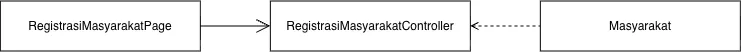

<i>Gambar 2. Diagram Kelas Use Case UC01</i>

 

| ID Kelas | Nama Kelas | Atribut | Metode/Operasi |
| :--- | :--- | :--- | :--- |
| C01 | RegistrasiMasyarakatPage | tombolRegistrasi | submitRegistrasi() |
| C24 | RegistrasiMasyarakatController | idRegistrasi, id | buatAkun() |
| C40 | Masyarakat | idMasyarakat, nama, nomorInduk, email, sandi | inputInfo() |

### 5.2.2 Use Case UC02

**Nama Use Case:** Melakukan Log In bagi Masyarakat

#### Identifikasi Kelas

| ID Kelas | Nama Kelas | Deskripsi Kelas |
| :--- | :--- | :--- |
| C02 | LoginMasyarakatPage | Antarmuka input kredensial login bagi masyarakat. | UC02 |
| C25 | AutentikasiController | Mengelola proses login dan verifikasi kredensial, dipakai bersama oleh masyarakat maupun mitra pengacara. | UC02, UC04 |
| C40 | Masyarakat | Menyimpan data akun masyarakat yang mengajukan kasus, mencari pasal dan mitra, berkonsultasi, membayar, memberi ulasan, dan melapor. | 

#### Diagram Kelas

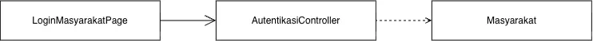

<i>Gambar 2. Diagram Kelas Use Case UC02</i>

 

| ID Kelas | Nama Kelas | Atribut | Metode/Operasi |
| :--- | :--- | :--- | :--- |
| C02 | LoginMasyarakatPage | tombolVerifikasi | submitVerifikasi() |
| C25 | AutentikasiController | tombolVerifikasi, inputKredensial, idMitra, passwordMitra | validasiData() |
| C40 | Masyarakat | idMasyarakat, nama, nomorInduk, email, sandi | inputInfo() |

### 5.2.3 Use Case UC03

**Nama Use Case:** Melakukan Registrasi Akun bagi Mitra Pengacara

#### Identifikasi Kelas

| ID Kelas | Nama Kelas | Deskripsi Kelas |
| :--- | :--- | :--- |
| C04 | RegistrasiMitraPage | Antarmuka pengisian data pendaftaran akun dan unggah dokumen legalitas bagi mitra pengacara. |
| C26 | RegistrasiMitraController | Mengatur alur pendaftaran akun mitra pengacara beserta pengunggahan dokumen legalitas untuk diverifikasi. |
| C45 | DokumenLegalitas | Menyimpan berkas dan data legalitas yang diunggah mitra pengacara untuk keperluan verifikasi. |
| C41 | MitraPengacara | Menyimpan data akun dan profil mitra pengacara, mencakup tag keahlian, status verifikasi, status ketersediaan, rating, saldo, dan rekening pencairan. |

#### Diagram Kelas

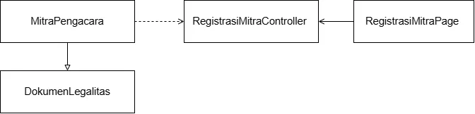

<i>Gambar 3. Diagram Kelas Use Case UC03</i>

 

| ID Kelas | Nama Kelas | Atribut | Metode/Operasi |
| :--- | :--- | :--- | :--- |
| C04 | RegistrasiMitraPage | tombolRegistrasi | submitRegistrasi() |
| C26 | RegistrasiMitraController | idRegistrasi, idDokumen, status, idMitra, passwordMitra | validasiData(), buatAkunBaru() |
| C45 | DokumenLegalitas | idDokumen, validitas | tambahDokumen() |
| C41 | MitraPengacara | idMitra, sandiMitra, validitas | inputInfo() |

### 5.2.4 Use Case UC04

**Nama Use Case:** Melakukan Login bagi Mitra Pengacara

#### Identifikasi Kelas

| ID Kelas | Nama Kelas | Deskripsi Kelas |
| :--- | :--- | :--- |
| C05 | LoginMitraPage | Antarmuka input kredensial login bagi mitra pengacara. |
| C25 | AutentikasiController | Mengelola proses login dan verifikasi kredensial, dipakai bersama oleh masyarakat maupun mitra pengacara. |
| C41 | MitraPengacara | Menyimpan data akun dan profil mitra pengacara, mencakup tag keahlian, status verifikasi, status ketersediaan, rating, saldo, dan rekening pencairan. |

#### Diagram Kelas

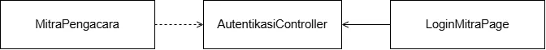

<i>Gambar 4. Diagram Kelas Use Case UC04</i>

 

| ID Kelas | Nama Kelas | Atribut | Metode/Operasi |
| :--- | :--- | :--- | :--- |
| C05 | LoginMitraPage | tombolVerifikasi, inputKredensial | submitVerifikasi() |
| C25 | AutentikasiController | tombolVerifikasi, inputKredensial, idMitra, passwordMitra | validasiData() |
| C41 | MitraPengacara | idMitra, sandiMitra | inputInfo() |

### 5.2.5 Use Case UC05

**Nama Use Case:** Melihat Status Registrasi Akun Mitra Pengacara

#### Identifikasi Kelas

| ID Kelas | Nama Kelas | Deskripsi Kelas |
| :--- | :--- | :--- |
| C06 | StatusVerifikasiMitraPage | Antarmuka yang menampilkan status terkini verifikasi akun mitra pengacara. |
| C27 | VerifikasiMitraController | Mengelola proses verifikasi mitra pengacara, mencakup penampilan status bagi mitra maupun peninjauan dan penentuan status oleh admin berdasarkan dokumen legalitas. | 
| C41 | MitraPengacara | Menyimpan data akun dan profil mitra pengacara, mencakup tag keahlian, status verifikasi, status ketersediaan, rating, saldo, dan rekening pencairan. |

#### Diagram Kelas

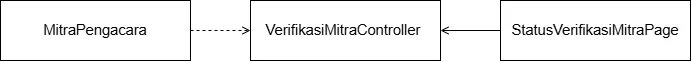

<i>Gambar 5. Diagram Kelas Use Case UC05</i>

 

| ID Kelas | Nama Kelas | Atribut | Metode/Operasi |
| :--- | :--- | :--- | :--- |
| C06 | StatusVerifikasiMitraPage | status | infoStatus() |
| C27 | VerifikasiMitraController | status, idMitra, passwordMitra | validasiData() |
| C41 | MitraPengacara | idMitra, passwordMitra | cekStatus(), verifikasiUlang() |

### 5.2.6 Use Case UC06

**Nama Use Case:** Memverifikasi Pendaftar Mitra Pengacara

#### Identifikasi Kelas

| ID Kelas | Nama Kelas | Deskripsi Kelas |
| :--- | :--- | :--- |
| C07 | VerifikasiMitraPage | Antarmuka bagi admin untuk meninjau dan memverifikasi dokumen pendaftar mitra pengacara. |
| C27 | VerifikasiMitraController | Mengelola proses verifikasi mitra pengacara, mencakup penampilan status bagi mitra maupun peninjauan dan penentuan status oleh admin berdasarkan dokumen legalitas. | 
| C42 | Admin | Menyimpan data akun admin yang memverifikasi mitra, meninjau laporan, memblokir akun, dan melayani live chat. |

#### Diagram Kelas

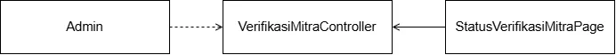

<i>Gambar 6. Diagram Kelas Use Case UC06</i>

 

| ID Kelas | Nama Kelas | Atribut | Metode/Operasi |
| :--- | :--- | :--- | :--- |
| C07 | VerifikasiMitraPage | status | ubahStatus() |
| C27 | VerifikasiMitraController | idMitra, dokumenMitra | validasiData() |
| C42 | Admin | verifikasi | verifikasiDokumen() |

### 5.2.7 Use Case UC07

**Nama Use Case:** Verifikasi Akun Pengacara

#### Identifikasi Kelas

| ID Kelas | Nama Kelas | Deskripsi Kelas |
| :--- | :--- | :--- |
| C08 | EditProfilMitraPage | Antarmuka pengeditan profil dan identitas firma mitra pengacara. |
| C09 | EditDokumenLegalitasPage | Antarmuka pengunggahan dan pengeditan dokumen legalitas mitra pengacara. |
| C41 | MitraPengacara | Menyimpan data akun dan profil mitra pengacara, mencakup tag keahlian, status verifikasi, status ketersediaan, rating, saldo, dan rekening pencairan. |

#### Diagram Kelas

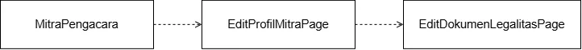

<i>Gambar 7. Diagram Kelas Use Case UC07</i>

 

| ID Kelas | Nama Kelas | Atribut | Metode/Operasi |
| :--- | :--- | :--- | :--- |
| C08 | EditProfilMitraPage | inputKredensial | validasiData() |
| C09 | EditDokumenLegalitasPage | inputDokumen | validasiData() |
| C41 | MitraPengacara | idMitra, passwordMitra, dokumenMitra | editDokumen() |

### 5.2.8 Use Case UC08

**Nama Use Case:** Melakukan Pencarian Pasal

#### Identifikasi Kelas

| ID Kelas | Nama Kelas | Deskripsi Kelas |
| :--- | :--- | :--- |
| C10 | SearchLawPage | Antarmuka pencarian pasal menggunakan kata kunci. |
| C29 | SearchLawController | Memproses permintaan pencarian pasal berdasarkan kata kunci pada basis data peraturan perundang-undangan dalam fitur SearchLaw. |
| C40 | Masyarakat | Menyimpan data akun masyarakat yang mengajukan kasus, mencari pasal dan mitra, berkonsultasi, membayar, memberi ulasan, dan melapor. |
| C44 | DasarHukum | Menyimpan data peraturan dan perundang-undangan (pasal) yang menjadi basis data pencarian pada fitur SearchLaw. |

#### Diagram Kelas

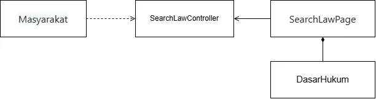

<i>Gambar 8. Diagram Kelas Use Case UC08</i>

 

| ID Kelas | Nama Kelas | Atribut | Metode/Operasi |
| :--- | :--- | :--- | :--- |
| C10 | SearchLawPage | tombolCari, infoPasal | cariPasal() |
| C29 | SearchLawController | tombolCari, infoPasal, kataKunci, idPasal | validasiData() |
| C40 | Masyarakat | kataKunci | cekPasal() |
| C44 | DasarHukum | idPasal | infoPasal(), updatePasal() |

### 5.2.9 Use Case UC09

**Nama Use Case:** Mencari Mitra Pengacara

#### Identifikasi Kelas

| ID Kelas | Nama Kelas | Deskripsi Kelas |
| :--- | :--- | :--- |
| C11 | DaftarMitraPengacaraPage | Antarmuka daftar mitra pengacara lengkap dengan filter pencarian. | 
| C30 | PencarianMitraController | Memproses pencarian dan filter daftar mitra berdasarkan kasus. |
| C40 | Masyarakat | Menyimpan data akun masyarakat yang melakukan pencarian mitra.|
| C41 | Mitra Pengacara | Menyimpan data akun dan profil mitra pengacara, mencakup tag keahlian, status verifikasi, status ketersediaan, rating, saldo, dan rekening pencairan. |
| C47 | Ulasan | Menyimpan data ulasan yang ditampilkan pada profil mitra saat dicari.|

#### Diagram Kelas

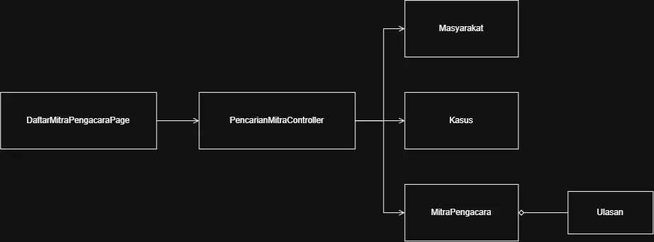

<i>Gambar 9. Diagram Kelas Use Case UC09</i>

 

| ID Kelas | Nama Kelas | Atribut | Metode/Operasi |
| :--- | :--- | :--- | :--- |
| C11 | DaftarMitraPengacaraPage | kataKunciKasus, filterKeahlian| inputPencarian(), tampilkanDaftarMitra() |
| C30 | PencarianMitraController | - | cariMitraSesuaiKasus(), terapkanFilter() |
| C40 | Masyarakat | idMasyarakat, nama, statusAkun | ajukanPencarian() |
| C41 | MitraPengacara | idMitra, nama, tagKeahlian, statusKetersediaan, rating | infoProfil(), cekKetersediaan() | 
| C43 | Kasus | idKasus, kategoriMasalah, deskripsi | infoKategoriKasus() |
| C47 | Ulasan | idUlasan, skorRating, teksUlasan | infoDataUlasan() |

### 5.2.10 Use Case UC10

**Nama Use Case:** Memilih Mitra Pengacara untuk Sesi Konsultasi

#### Identifikasi Kelas

| ID Kelas | Nama Kelas | Deskripsi Kelas |
| :--- | :--- | :--- |
| C12 | PemilihanJadwalKonsultasiPage | Antarmuka pemilihan mitra pengacara dan jadwal untuk sesi konsultasi. | 
| C31 | PenjadwalanKonsultasiController | Mengelola pemilihan mitra pengacara dan jadwal sesi konsultasi oleh masyarakat. |
| C40 | Masyarakat | Menyimpan data akun masyarakat yang melakukan pencarian mitra.|
| C41 | Mitra Pengacara | Menyimpan data akun dan profil mitra pengacara, mencakup tag keahlian, status verifikasi, status ketersediaan, rating, saldo, dan rekening pencairan. |
| C43 | Kasus | Menyimpan data kasus masyarakat yang menjadi dasar pemilihan jadwal.|
| C46 | SesiKonsultasi | Menyimpan data sesi konsultasi antara masyarakat dan mitra pengacara beserta status dan waktu mulai/selesai. |

#### Diagram Kelas

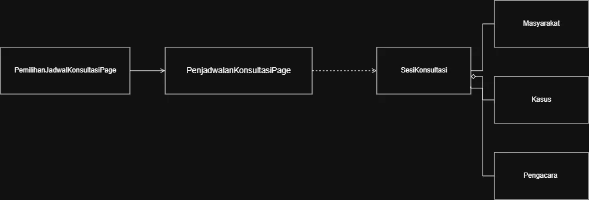

<i>Gambar 10. Diagram Kelas Use Case UC10</i>

 

| ID Kelas | Nama Kelas | Atribut | Metode/Operasi |
| :--- | :--- | :--- | :--- |
| C12 | PemilihanJadwalKonsultasiPage | pilihanMitra, pilihanTanggal, pilihanWaktu | pilihMitra(), pilihJadwal() |
| C31 | PenjadwalanKonsultasiController | - | buatSesiKonsultasi(), validasiJadwal() |
| C40 | Masyarakat | idMasyarakat, nama, statusAkun | ajukanJadwal() |
| C41 | MitraPengacara | idMitra, nama, statusKetersediaan | infoProfil(), cekKetersediaanJadwal() | 
| C43 | Kasus | idKasus, kategoriMasalah, deskripsi | infoDetailKasus() |
| C46 | SesiKonsultasi | idSesi, tanggalJadwal, waktuJadwal, statusSesi | simpanJadwalBaru() |

### 5.2.11 Use Case UC11

**Nama Use Case:**  Konfirmasi Jadwal Konsultasi

#### Identifikasi Kelas

| ID Kelas | Nama Kelas | Deskripsi Kelas |
| :--- | :--- | :--- |
| C13 | KonfirmasiKonsultasiPage | Antarmuka bagi mitra pengacara untuk menerima/menanggapi permintaan konsultasi. | 
| C32 | SesiKonsultasiController | Mengatur alur penerimaan sesi oleh mitra pengacara dan berjalannya sesi konsultasi melalui chat (baru dapat dimulai setelah pembayaran lunas). |
| C41 | MitraPengacara | Menyimpan data akun dan profil mitra pengacara, mencakup tag keahlian, status verifikasi, status ketersediaan, rating, saldo, dan rekening pencairan.|
| C46 | SesiKonsultasi | Menyimpan data sesi konsultasi antara masyarakat dan mitra pengacara beserta status dan waktu mulai/selesai. |

#### Diagram Kelas

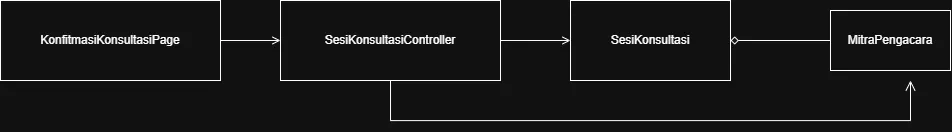

<i>Gambar 11. Diagram Kelas Use Case UC11</i>

 

| ID Kelas | Nama Kelas | Atribut | Metode/Operasi |
| :--- | :--- | :--- | :--- |
| C13 | KonfirmasiKonsultasiPage | pilihanKonfirmasi, catatanKonfirmasi | klikKonfirmasi(), tampilkanPermintaanJadwal() |
| C32 | SesiKonsultasiController | - | prosesKonfirmasiJadwal(), perbaruiStatusSesi() |
| C41 | MitraPengacara | idMitra, nama, statusKetersediaan | terimaJadwal(), tolakJadwal() |
| C46 | SesiKonsultasi | idSesi, tanggalJadwal, waktuJadwal, statusSesi | infoStatusSesi(), aturStatusSesi() |

### 5.2.12 Use Case UC12

**Nama Use Case:**  Melakukan Sesi Konsultasi

#### Identifikasi Kelas

| ID Kelas | Nama Kelas | Deskripsi Kelas |
| :--- | :--- | :--- |
| C14 | ChatKonsultasiPage | Antarmuka chat untuk sesi konsultasi antara masyarakat dan mitra pengacara. | 
| C32 | SesiKonsultasiController | Mengatur alur penerimaan sesi oleh mitra pengacara dan berjalannya sesi konsultasi melalui chat (baru dapat dimulai setelah pembayaran lunas). |
| C40 | Masyarakat | Menyimpan data akun masyarakat yang mengajukan kasus, mencari pasal dan mitra, berkonsultasi, membayar, memberi ulasan, dan melapor.
| C41 | MitraPengacara | Menyimpan data akun dan profil mitra pengacara, mencakup tag keahlian, status verifikasi, status ketersediaan, rating, saldo, dan rekening pencairan.|
| C43 | Kasus | Menyimpan data kasus/kondisi masyarakat yang menjadi dasar pencarian dan pemilihan mitra pengacara pada fitur HaloLaw, serta dikaitkan dengan sesi konsultasi dan riwayat penanganan. |
| C46 | SesiKonsultasi | Menyimpan data sesi konsultasi antara masyarakat dan mitra pengacara beserta status dan waktu mulai/selesai. |
| C49 | Pembayaran | Menyimpan data transaksi pembayaran sesi konsultasi, termasuk metode, jumlah, status, dan waktu transaksi. |

#### Diagram Kelas

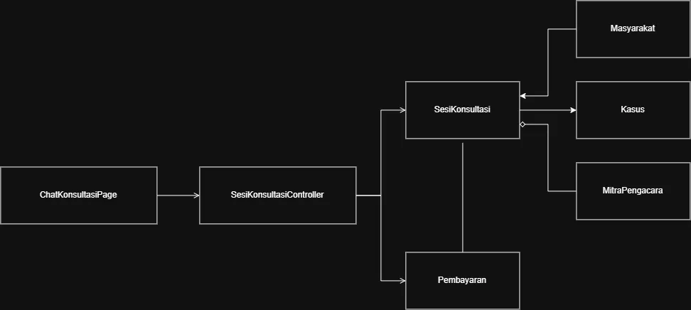

<i>Gambar 12. Diagram Kelas Use Case UC12</i>

 

| ID Kelas | Nama Kelas | Atribut | Metode/Operasi |
| :--- | :--- | :--- | :--- |
| C14 | ChatKonsultasiPage | pesanInput, lampiranFile | kirimPesan(), tampilkanPesanTerkini() |
| C32 | SesiKonsultasiController | - | kelolaPesanChat(), validasiStatusPembayaran(), akhiriSesiKonsultasi() |
| C40 | Masyarakat | idMasyarakat, nama, statusAkun | kirimPesan() |
| C41 | MitraPengacara | idMitra, nama, statusKetersediaan | balasPesan() |
| C43 | Kasus | idKasus, kategoriMasalah, deskripsi | infoDetailKasus() |
| C46 | SesiKonsultasi | idSesi, tanggalJadwal, waktuJadwal, statusSesi | infoStatusSesi(), catatWaktuMulaiSelesai() |
| C49 | Pembayaran | idPembayaran, nominal, statusPembayaran, metodeBayar | cekStatusLunas() |

### 5.2.13 Use Case UC13

**Nama Use Case:**  Memberi Ulasan, Feedback, dan/atau Rating

#### Identifikasi Kelas

| ID Kelas | Nama Kelas | Deskripsi Kelas |
| :--- | :--- | :--- |
| C15 | UlasanPage | Antarmuka pengisian ulasan, feedback, dan rating setelah sesi konsultasi. | 
| C33 | UlasanController | Mengelola pengiriman ulasan, feedback, dan rating dari masyarakat kepada mitra pengacara. |
| C40 | Masyarakat | Menyimpan data akun masyarakat yang mengajukan kasus, mencari pasal dan mitra, berkonsultasi, membayar, memberi ulasan, dan melapor.
| C47 | Ulasan |Menyimpan data ulasan berupa teks, foto, dan/atau rating yang diberikan masyarakat setelah sesi konsultasi, dan ditampilkan pada profil mitra pengacara.|

#### Diagram Kelas

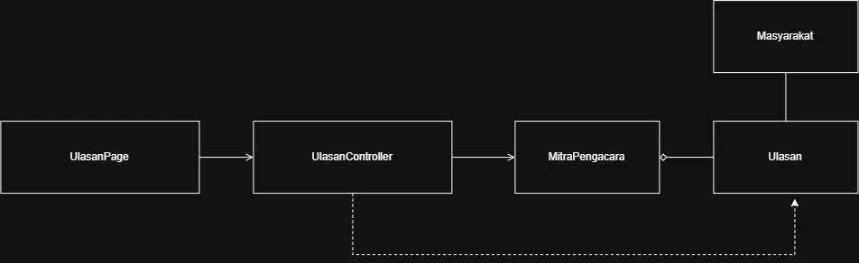

<i>Gambar 13. Diagram Kelas Use Case UC13</i>

 

| ID Kelas | Nama Kelas | Atribut | Metode/Operasi |
| :--- | :--- | :--- | :--- |
| C15 | UlasanPage | inputRating, inputTeksUlasan | isiFormUlasan(), kirimUlasan() |
| C33 | UlasanController | - | simpanUlasanBaru(), perbaruiRatingMitra() |
| C40 | Masyarakat | idMasyarakat, nama, statusAkun | berikanPenilaian() |
| C47 | Ulasan | idUlasan, skorRating, teksUlasan, tanggalUlasan | simpanDataUlasan(), ambilDataUlasan() |

### 5.2.14 Use Case UC14

**Nama Use Case:**  Melaporkan Pelanggaran Akun

#### Identifikasi Kelas

| ID Kelas | Nama Kelas | Deskripsi Kelas |
| :--- | :--- | :--- |
| C16 | LaporanAkunPage | Antarmuka pelaporan pelanggaran akun, digunakan oleh masyarakat maupun mitra pengacara. | 
| C34 | LaporanController | Mengatur alur pelaporan pelanggaran akun maupun ulasan, baik oleh masyarakat maupun mitra pengacara. |
| C40 | Masyarakat | Menyimpan data akun masyarakat yang mengajukan kasus, mencari pasal dan mitra, berkonsultasi, membayar, memberi ulasan, dan melapor.
| C48|Laporan | Menyimpan data laporan pelanggaran akun maupun ulasan beserta status peninjauannya oleh admin. |

#### Diagram Kelas

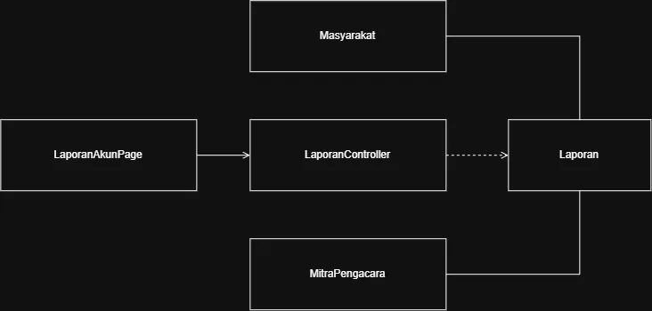

<i>Gambar 14. Diagram Kelas Use Case UC14</i>

 

| ID Kelas | Nama Kelas | Atribut | Metode/Operasi |
| :--- | :--- | :--- | :--- |
| C16 | LaporanAkunPage | kategoriPelanggaran, teksAlasan, buktiLampiran | isiFormLaporan(), kirimLaporan() |
| C34 | LaporanController | - | buatLaporanBaru(), validasiBuktiLaporan() |
| C40 | Masyarakat | idMasyarakat, nama, statusAkun | ajukanLaporanPelanggaran() |
| C47 | Laporan | idLaporan, jenisPelanggaran, deskripsi, statusLaporan | simpanDataLaporan(), infoStatusLaporan() |

### 5.2.15 Use Case UC15
**Nama Use Case:** Melaporkan Pelanggaran

#### Identifikasi Kelas

| ID Kelas | Nama Kelas | Deskripsi Kelas |
| :--- | :--- | :--- |
| C16 | LaporanAkunPage | Antarmuka pelaporan pelanggaran akun, digunakan oleh masyarakat maupun mitra pengacara. | 
| C34 | LaporanController | Mengatur alur pelaporan pelanggaran akun maupun ulasan, baik oleh masyarakat maupun mitra pengacara. |
| C40 | Masyarakat | Menyimpan data akun masyarakat yang dilaporkan. |
| C41 | Mitra Pengacara | Menyimpan data akun dan profil mitra pengacara yang mengajukan pelaporan, atau yang dilaporkan. |
| C48 | Laporan | Menyimpan data laporan pelanggaran akun maupun ulasan beserta status peninjauannya oleh admin. |

#### Diagram Kelas

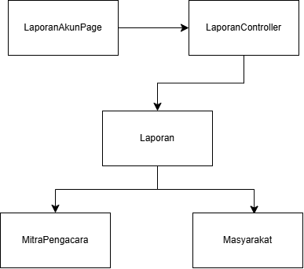

<i>Gambar 15. Diagram Kelas Use Case UC15</i>

 

| ID Kelas | Nama Kelas | Atribut | Metode/Operasi |
| :--- | :--- | :--- | :--- |
| C16 | LaporanAkunPage | idLaporan | buatFormLaporan() submitLaporan() |
| C34 | LaporanController | - | prosesLaporan() |
| C40 | Masyarakat | idMasyarakat, nama, email, statusAkun | getProfil() |
| C41 | Mitra Pengacara | idMitra, spesialisasi, ratingAkun | getProfil() |
| C48 | Laporan | idLaporan, idPelapor, idTerlapor, tanggalLaporan, statusLaporan | buatLaporan() statusLaporan() |

### 5.2.16 Use Case UC16
**Nama Use Case:** Melaporkan Ulasan

#### Identifikasi Kelas

| ID Kelas | Nama Kelas | Deskripsi Kelas |
| :--- | :--- | :--- |
| C17 | LaporanUlasanPage | Antarmuka pelaporan ulasan yang dianggap tidak relevan oleh mitra pengacara. | 
| C34 | LaporanController | Mengatur alur pelaporan pelanggaran akun maupun ulasan, baik oleh masyarakat maupun mitra pengacara. |
| C41 | Mitra Pengacara | Menyimpan data akun dan profil mitra pengacara selaku pelapor ulasan yang tidak relevan. |
| C47 | Ulasan | Menyimpan data ulasan berupa teks, foto, dan/atau rating yang diberikan masyarakat setelah sesi konsultasi, dan ditampilkan pada profil mitra pengacara. |
| C48 | Laporan | Menyimpan data laporan pelanggaran akun maupun ulasan beserta status peninjauannya oleh admin.|

#### Diagram Kelas

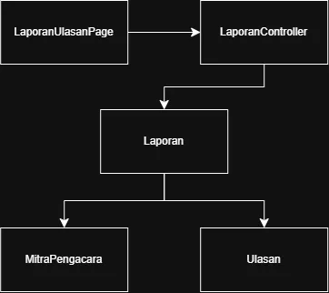

<i>Gambar 16. Diagram Kelas Use Case UC16</i>

 

| ID Kelas | Nama Kelas | Atribut | Metode/Operasi |
| :--- | :--- | :--- | :--- |
| C16 | LaporanUlasanPage | idUlasan, idMitra | buatFormLaporanUlasan() submitLaporanUlasan() statusUlasan() |
| C34 | LaporanController | - | prosesLaporan() detailLaporan() |
| C41 | Mitra Pengacara | idMitra, spesialisasi, ratingAkun | getProfil() lihatUlasan() |
| C47 | Ulasan | idUlasan, idMitra, foto, rating, tanggalUlasan | getUlasan() |
| C48 | Laporan | idLaporan, idPelapor, idTerlapor, tanggalLaporan, statusLaporan | buatLaporan() statusLaporan() |

### 5.2.17 Use Case UC17
**Nama Use Case:** Memblokir Akun

#### Identifikasi Kelas

| ID Kelas | Nama Kelas | Deskripsi Kelas |
| :--- | :--- | :--- |
| C18 | TinjauanPage | Antarmuka bagi admin untuk meninjau laporan dan memblokir akun yang melanggar kebijakan. | 
| C35 | ModerasiAkunController | Memproses tinjauan laporan dan mengeksekusi pemblokiran akun yang melanggar kebijakan sistem. |
| C42 | Admin | Menyimpan data akun admin yang memverifikasi mitra, meninjau laporan, memblokir akun, dan melayani live chat. |
| C48 | Laporan | Menyimpan data laporan pelanggaran akun maupun ulasan beserta status peninjauannya oleh admin.|

#### Diagram Kelas

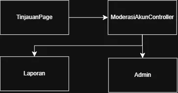

<i>Gambar 17. Diagram Kelas Use Case UC17</i>

 

| ID Kelas | Nama Kelas | Atribut | Metode/Operasi |
| :--- | :--- | :--- | :--- |
| C18 | TinjauanPage | idAdmin, pilihLaporan | submitHasil() tampilkanLaporan() tolakLaporan() |
| C35 | ModerasiAkunController | - | prosesTinjauan() prosesBlokirAkun() updateStatusLaporan()|
| C42 | Admin | idAdmin | login() |
| C48 | Laporan | idLaporan, idPelapor, idTerlapor, tanggalLaporan, statusLaporan | getDetailLaporan() |

### 5.2.18 Use Case UC18
**Nama Use Case:** Melihat Riwayat Penanganan

#### Identifikasi Kelas

| ID Kelas | Nama Kelas | Deskripsi Kelas |
| :--- | :--- | :--- |
| C19 | HistoryPage | Antarmuka yang menampilkan riwayat kasus/konsultasi bagi masyarakat dan mitra pengacara. | 
| C36 | RiwayatController | Mengambil dan menyusun data riwayat kasus/konsultasi yang telah dilakukan masyarakat maupun mitra pengacara. |
| C40 | Masyarakat | Menyimpan data akun masyarakat yang dapat melihat riwayat penanganan kasus. |
| C41 | MitraPengacara | Menyimpan data akun dan profil mitra pengacara, serta melihat riwayat penanganan kasus. |
| C43 | Kasus | Menyimpan data kasus/kondisi masyarakat yang menjadi dasar pencarian dan pemilihan mitra pengacara pada fitur HaloLaw, serta dikaitkan dengan sesi konsultasi dan riwayat penanganan. |
| C46 | SesiKonsultasi | Menyimpan data sesi konsultasi antara masyarakat dan mitra pengacara beserta status dan waktu mulai/selesai. |

#### Diagram Kelas

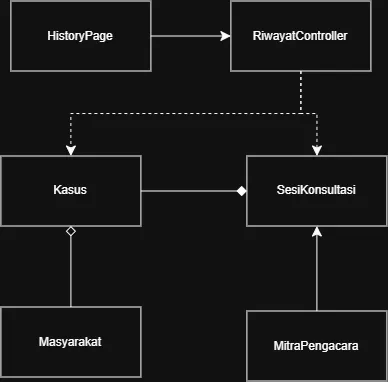

<i>Gambar 18. Diagram Kelas Use Case UC18</i>

 

| ID Kelas | Nama Kelas | Atribut | Metode/Operasi |
| :--- | :--- | :--- | :--- |
| C19 | HistoryPage | listRiwayat, idMasyarakat, idMitra | lihatHistory() |
| C36 | RiwayatController | - | getRiwayatPengacara() getRiwayatMasyarakat() detailRiwayat() |
| C40 | Masyarakat | nama, email, idMasyarakat  | lihatHistory() |
| C41 | MitraPengacara | idMitra, nama, spesialisasi, rating | lihatRiwayat() |
| C43 | Kasus | idKasus, judulKasus, kategoriKasus, statusKasus | detailKasus() getIdKasus() |
| C46 | SesiKonsultasi | idSesi, waktuStart, waktuEnd, statusKonsul, catatanKonsul | getDetailSesi()|

### 5.2.19 Use Case UC19
**Nama Use Case:** Menanyakan Masalah Teknis

#### Identifikasi Kelas

| ID Kelas | Nama Kelas | Deskripsi Kelas |
| :--- | :--- | :--- |
| C20 | LiveChatMasyarakatPage | Antarmuka live chat bagi masyarakat untuk bertanya kepada admin. | 
| C37 | LiveChatController | Mengelola pengiriman dan penerimaan pesan live chat antara masyarakat dan admin. |
| C40 | Masyarakat | Menyimpan data akun masyarakat yang mengajukan kasus, mencari pasal dan mitra, berkonsultasi, membayar, memberi ulasan, dan melapor. |
| C42 | Admin | Menyimpan data akun admin yang memverifikasi mitra, meninjau laporan, memblokir akun, dan melayani live chat. |
| C50 | LiveChat | Menyimpan data percakapan live chat antara masyarakat dan admin. |

#### Diagram Kelas

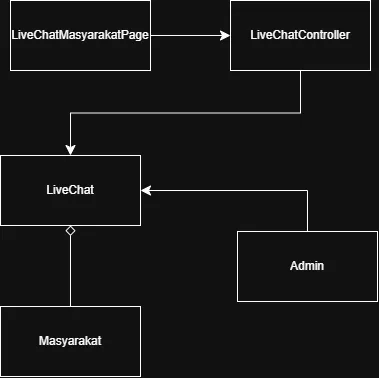

<i>Gambar 19. Diagram Kelas Use Case UC19</i>

 

| ID Kelas | Nama Kelas | Atribut | Metode/Operasi |
| :--- | :--- | :--- | :--- |
| C20 | LiveChatMasyarakatPage | idMasyarakat, chatAktifId | showChat() sendMessage() endChat() |
| C37 | LiveChatController | - | assignAdmin() startChat() closeChat() |
| C40 | Masyarakat | nama, email, idMasyarakat | kirimPesan() |
| C42 | Admin | idAdmin | balasPesan() |
| C50 | LiveChat | idChat, waktuChatMulai, waktuChatSelesai, statusChat, historyChat | updateStatusChat() detailChat() |
### 5.2.20 Use Case UC20
**Nama Use Case:** Menjawab Pertanyaan

#### Identifikasi Kelas

| ID Kelas | Nama Kelas | Deskripsi Kelas |
| :--- | :--- | :--- |
| C21 | LiveChatAdminPage | Antarmuka live chat bagi admin untuk menjawab pertanyaan masyarakat. | 
| C37 | LiveChatController | Mengelola pengiriman dan penerimaan pesan live chat antara masyarakat dan admin. |
| C42 | Admin | Menyimpan data akun admin yang memverifikasi mitra, meninjau laporan, memblokir akun, dan melayani live chat. |
| C50 | LiveChat | Menyimpan data percakapan live chat antara masyarakat dan admin. |

#### Diagram Kelas

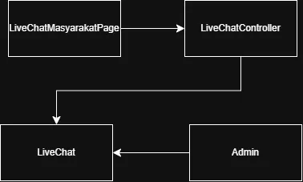

<i>Gambar 20. Diagram Kelas Use Case UC20</i>

 

| ID Kelas | Nama Kelas | Atribut | Metode/Operasi |
| :--- | :--- | :--- | :--- |
| C21 | LiveChatAdminPage | idAdmin, chatAktifId | showAdminChatDashboard() markAsResolved() | 
| C37 | LiveChatController | - | assignAdmin() startChat() closeChat() |
| C42 | Admin | idAdmin | balasPesan() |
| C50 | LiveChat | idChat, waktuChatMulai, waktuChatSelesai, statusChat, historyChat | updateStatusChat() detailChat() |

### 5.2.21 Use Case UC21

**Nama Use Case:** Membayar Biaya Sesi Konsultasi

#### Identifikasi Kelas

| ID Kelas | Nama Kelas | Deskripsi Kelas |
| :--- | :--- | :--- |
| C22 | PembayaranPage | Antarmuka pemilihan metode dan konfirmasi pembayaran sesi konsultasi. |
| C38 | PembayaranController | Memproses transaksi pembayaran sesi konsultasi melalui payment gateway pihak ketiga; pembayaran harus lunas sebagai syarat sebelum sesi chat dibuka. |
| C40 | Masyarakat | Menyimpan data akun masyarakat yang mengajukan kasus, mencari pasal dan mitra, berkonsultasi, membayar, memberi ulasan, dan melapor. | 
| C46 | SesiKonsultasi | Menyimpan data sesi konsultasi antara masyarakat dan mitra pengacara beserta status dan waktu mulai/selesai. |
| C49 | Pembayaran | Menyimpan data transaksi pembayaran sesi konsultasi, termasuk metode, jumlah, status, dan waktu transaksi. |

#### Diagram Kelas

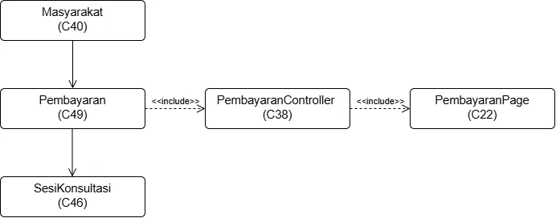

<i>Gambar 21. Diagram Kelas Use Case UC21</i>

 

| ID Kelas | Nama Kelas | Atribut | Metode/Operasi |
| :--- | :--- | :--- | :--- |
| C22 | PembayaranPage | metodePembayaran | pilihMetodePembayaran(), submitPembayaran() |
 | C38 | PembayaranController | idPembayaran, idSesi, totalPembayaran, statusPembayaran | prosesPembayaran(), bukaSesiChat() |
 | C49 | Pembayaran | idPembayaran, idSesi, metodePembayaran, totalPembayaran, statusPembayaran, waktuTransaksi | getStatus() |
 | C46 | SesiKonsultasi | idSesi, idMasyarakat, idMitra, statusPembayaran, waktuMulai, waktuSelesai | mulaiSesi(), akhiriSesi() |
 | C40 | Masyarakat | idMasyarakat, idKasus, idLaporan | ajukanKasus(), cariMitra(), beriUlasan(), buatLaporan() |

### 5.2.22 Use Case UC22

**Nama Use Case:** Mencairkan Dana

#### Identifikasi Kelas

| ID Kelas | Nama Kelas | Deskripsi Kelas |
| :--- | :--- | :--- |
| C23 | PencairanDanaPage | Antarmuka pengajuan pencairan dana bagi mitra pengacara. |
| C39 | PencairanDanaController | Memproses permintaan dan validasi pencairan dana mitra pengacara ke rekening terdaftar, secara terpisah dan tidak otomatis setelah pembayaran diterima sistem. |
| C41 | MitraPengacara | Menyimpan data akun dan profil mitra pengacara, mencakup tag keahlian, status verifikasi, status ketersediaan, rating, saldo, dan rekening pencairan. |
| C51 | PencairanDana | Menyimpan data transaksi pencairan dana mitra pengacara, termasuk jumlah, tanggal, status, dan rekening tujuan. |

#### Diagram Kelas

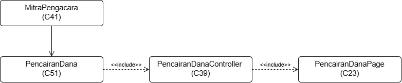

<i>Gambar 22. Diagram Kelas Use Case UC22</i>

 

| ID Kelas | Nama Kelas | Atribut | Metode/Operasi |
| :--- | :--- | :--- | :--- |
| C23 | PencairanDanaPage | idPencairan | submitPencairan() |
| C39 | PencairanDanaController | idPencairan, idMitra, totalPencairan, statusPencairan, rekeningTujuan | validasiSaldo(), prosesPencairan() |
| C51 | PencairanDana | idPencairan, totalPencairan, tanggalPengajuan, statusPencairan, rekeningTujuan | getStatus() |
| C41 | MitraPengacara | idMitra, rekeningPencairan | tambahSaldo() | 

## 5.3 Diagram Kelas Keseluruhan

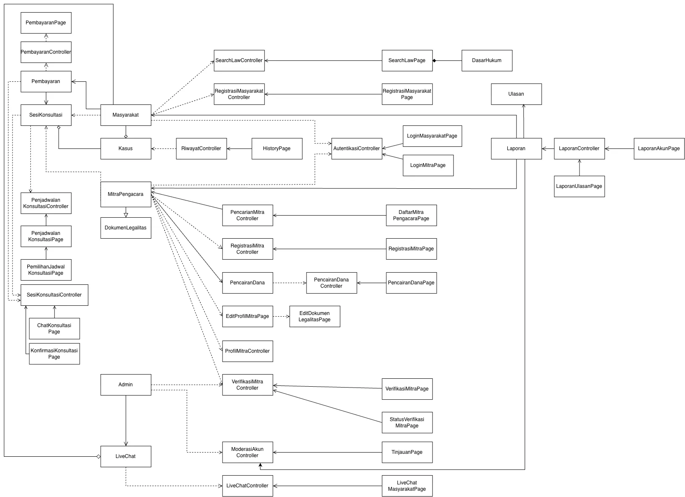

<i>Gambar 4. Contoh Diagram Kelas Keseluruhan</i>

| ID Kelas | Nama Kelas | Atribut | Metode/Operasi |
| :--- | :--- | :--- | :--- |
| *C01* | *Pelanggan* | *idPelanggan, nama, email* | *lihatRiwayatPesanan()* |
| *C02* | *Pesanan* | *idPesanan, total, status* | *hitungTotal(), perbaruiStatus()* |
| *...* | *...* | *...* | *...* |

---

# BAB 6: Traceability

| ID Kelas | ID Use Case | ID KF |
| :--- | :--- | :--- |
| C01 | UC01 | KF01 | 
| C02 | UC02 | KF01, KF02 |
| C03 | UC02 |  KF01, KF02 |
| C04 | UC03 | KF03 |
| C05 | UC04 | KF03 |
| C06 | UC05 | KF04 |
| C07 | UC06 | KF05 |
| C08 | UC07 | KF06, KF07 |
| C09 | UC07 | KF06, KF07 |
| C10 | UC08 | KF08 |
| C11 | UC09 | KF09 |
| C12 | UC10 | KF09 |
| C13 | UC11 | KF10 |
| C14 | UC12 | KF11 |
| C15 | UC13 | KF12 |
| C16 | UC14, UC15 | KF13 |
| C17 | UC16 | KF14 |
| C18 | UC17 | KF15, KF16 |
| C19 | UC18 | KF17 |
| C20 | UC19 | KF18 |
| C21 | UC20 | KF18 |
| C22 | UC21 | KF19 |
| C23 | UC22 | KF20 |
| C24 | UC01 | KF01 |
| C25 | UC02, UC04 | KF01, KF02, KF03 |
| C26 | UC03 | KF03 |
| C27 | UC05, UC06 | KF04, KF05 |
| C28 | UC07 | KF06, KF07 |
| C29 | UC08 | KF08 |
| C30 | UC09 | KF09 |
| C31 | UC10 | KF09 |  
| C32 | UC11, UC12 | KF10, KF11 |
| C33 | UC13 | KF12 |
| C34 | UC14, UC15, UC16 | KF13, KF14 | 
| C35 | UC17 | KF15, KF16 |
| C36 | UC18 | KF17 |
| C37 | UC19, UC20 | KF18 |
| C38 | UC21 | KF19 |
| C39 | UC22 | KF20 |
| C40 | UC01, UC02, UC08, UC09, UC10, UC12, UC13, UC14, UC18, UC19, UC21 | KF01, KF02, KF08, KF09, KF11, KF12, KF13, KF17, KF18, KF19 |
| C41 | UC03, UC04, UC05, UC06, UC07, UC09, UC11, UC12, UC15, UC16, UC18, UC22 | KF03, KF04, KF05, KF06, KF07, KF09, KF10, KF11, KF13, KF14, KF17, KF20 |
| C42 | UC06, UC17, UC19, UC20 | KF05, KF15, KF16, KF18 |
| C43 | UC10, UC12, UC18 | KF09, KF11, KF17 |
| C44 | UC08 | KF08 |
| C45 | UC03, UC05, UC06, UC07 | KF03, KF04, KF05, KF06, KF07 |
| C46 | UC10, UC11, UC12, UC18, UC21 | KF09, KF10, KF11, KF17, KF19 |
| C47 | UC09, UC13, UC16 | KF09, KF12, KF14 |
| C48 | UC14, UC15, UC16, UC17 | KF13, KF14, KF15, KF16 |
| C49 | UC12, UC21 | KF11, KF19 |
| C50 | UC19, UC20 | KF18 |
| C51 | UC22 | KF20 |

---

# Referensi
- Diagram UML: [https://www.drawio.com/](https://www.drawio.com/), [https://staruml.io/](https://staruml.io/)
