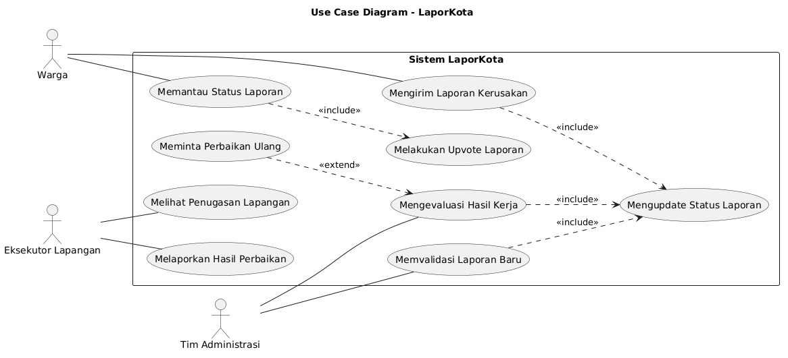
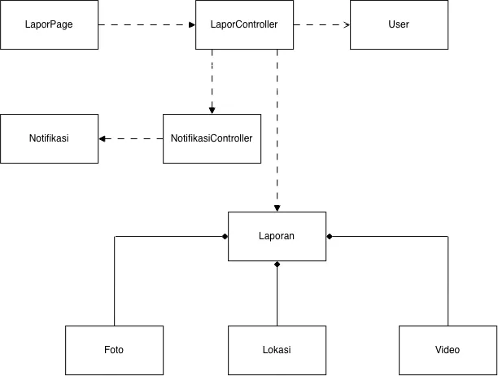
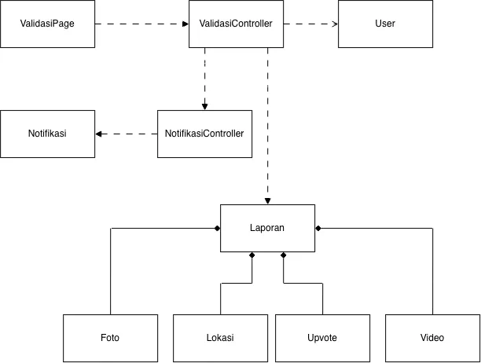
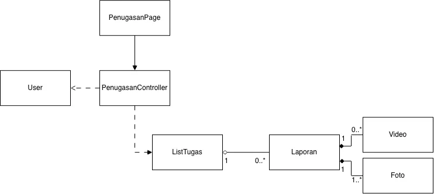
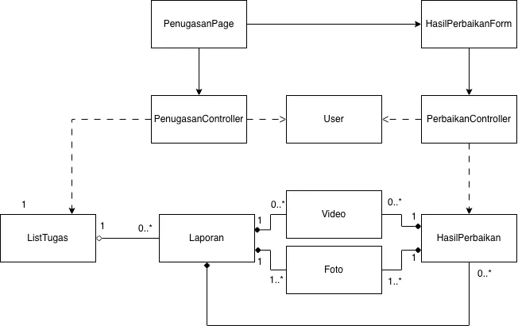
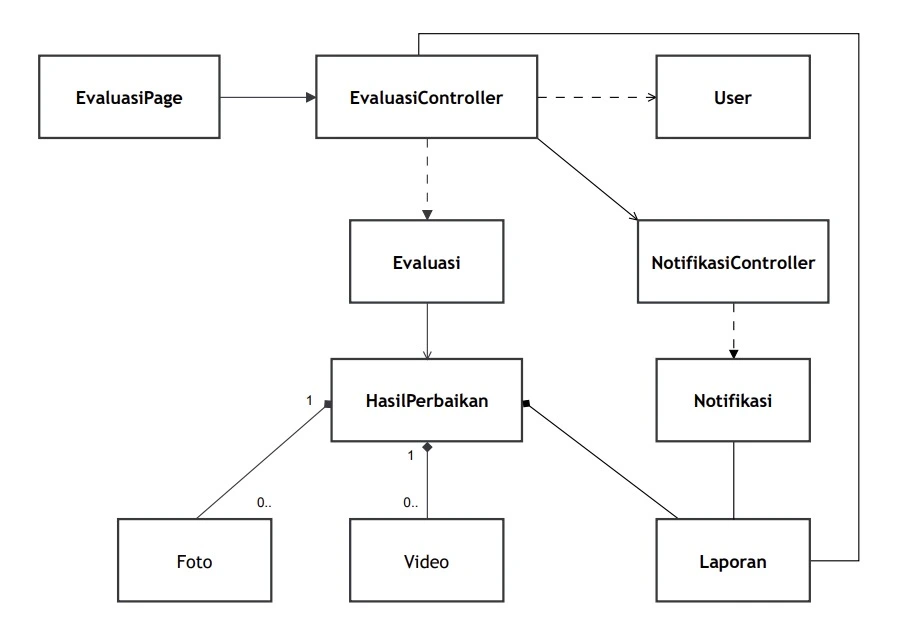
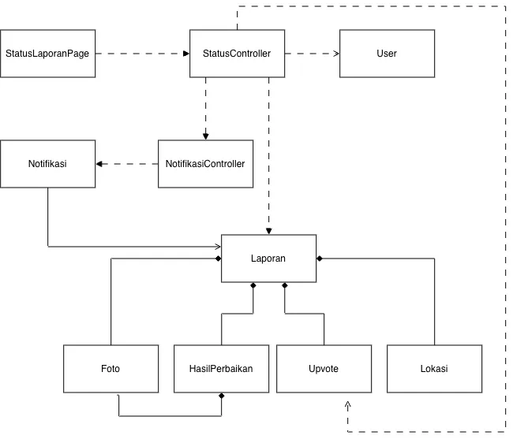
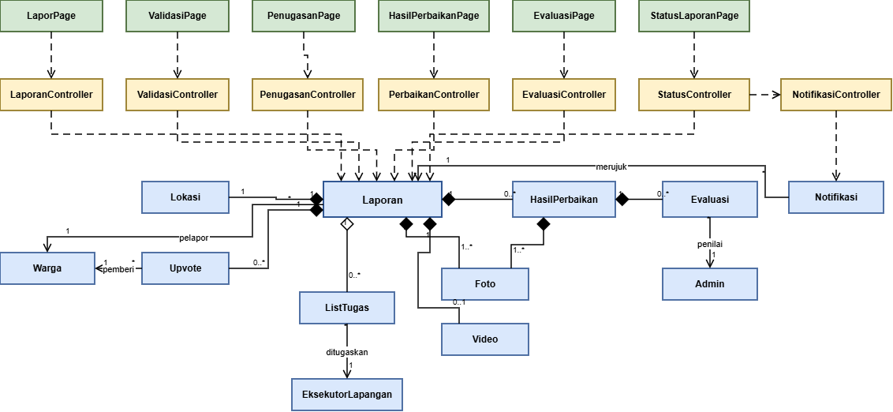

<h1>
IF2150 REKAYASA PERANGKAT LUNAK
 
TUGAS 5
 
SPESIFIKASI KEBUTUHAN PERANGKAT LUNAK (SKPL)
</h1>
 

## *LaporKota*

### Untuk: *Jordhy*

Dipersiapkan oleh:
| Informasi | Keterangan |
| --- | --- |
| Kelas | *K - 03* |
| Kelompok | *G07* |

| NIM | Nama |
| --- | --- |
| *13525051* | *Rafi Pradipta Andira Sulistyo* |
| *13525105* | *Pasaribu Fritz T.A.M.* |
| *13525075* | *Bagas Anugrah Putra* |
| *13525099* | *Gede Pranajayanta Suputra* |
| *13525015* | *Muhammad Atallah Ramadhan* |
---

## Daftar Perubahan

| Revisi | Deskripsi |
| :--- | :--- |
| *A* | *Perubahan identifikasi kelas, dimana kelas Warga, Eksekutor, dan Admin digeneralisasi menjadi kelas User. Sehingga Class Diagram juga berubah.* |
| *B* |  |
| *C* |  |
| ... |  |

 

# BAB 1: Pendahuluan

## 1.1 Tujuan Penulisan Dokumen
Dokumen Spesifikasi Kebutuhan Perangkat Lunak merupakan dokumen yang memberikan deskripsi yanglengkap dan presisi mengenai apa yang harus dilakukan oleh perangkat lunak. Dokumen ini dibuat sebagai landasan mengenai ruang lingkup, fungsi, dan batasan sistem untuk pengembangan Perangkat Lunak di kemudian hari. Selain itu, dokumen ini juga disusun untuk memandu alur perancangan dan implementasi arsitektur sistem dan penulisan kode program. Terakhir, dokumen ini juga disusun untuk bisa menjadi acuan dalam melakukan verifikasi apakah perangkat lunak yang diimplementasikan sudah sesuai dengan spesifikasi awal. 

Pihak-pihak yang akan menggunakan dokumen ini mencakup Tim Developer (kelompok) dan Tim Penilai (Asisten). Tim Developer menggunakan dokumen ini sebagai acuan dalam pengembangan perangkat lunak. Tim Penilai menggunakan dokumen ini untuk validasi apakah perangkat lunak yang telah dibuat telah sesuai dengan spesifikasi yang dirancang di awal.

## 1.2 Lingkup Masalah
Perangkat lunak yang akan dikembangkan adalah LaporKota, sebuah platform pelaporan kerusakan infrastruktur publik berbasis website yang dirancang untuk mempermudah warga dalam menyampaikan dan memantau aduannya. Sistem pelaporan ini memfasilitasi pengguna untuk melaporkan masalah fasilitas umum kapan saja dan di mana saja dengan menyertakan foto serta koordinat lokasi. Dengan adanya sistem ini diharapkan pengguna tidak lagi kesulitan mencari saluran pengaduan yang responsif dan proses perbaikan kerusakan fasilitas publik dapat berjalan dengan efisien.

## 1.3 Definisi, Istilah, dan Singkatan

Tabel 1.3. Definisi Istilah dan Singkatan

| Singkatan, Akronim, atau Istilah | Penjelasan |
| :--- | :--- |
| *P/L* | *Singkatan dari Perangkat Lunak, yaitu aplikasi yang memberikan perintah kepada komputer untuk menjalankan tugas tertentu.* |
| *SKPL* | *Singkatan dari Spesifikasi Kebutuhan Perangkat Lunak, yaitu dokumen yang merangkum kriteria-kriteria yang diperlukan untuk membangun aplikasi menjalankan tugasnya.* |
| *KF* | *Singkatan dari Kebutuhan Fungsional, yaitu fungsi atau perilaku yang dimiliki sistem.* |
| *KNF* | *Singkatan dari Kebutuhan Non-Fungsional, yaitu kualitas sistem seperti kecepatan, keamanan, dan ketersediaan.* |
| *UC* | *Singkatan dari Use Case, yaitu gambaran interaksi antara aktor dan sistem.* |
| *CD* | *Singkatan dari Class Diagram, Diagram yang menggambarkan struktur kelas beserta atribut, metode, dan hubungan antarkelas di dalam sistem.* |
| *RG* | *Singkatan dari Requirement Gathering, yaitu tahap awal pengembangan perangkat lunak untuk mengumpulkan dan menganalisis kebutuhan.* |
| *US* | *Singkatan dari User Story, yaitu deskripsi singkat kebutuhan dari sudut pandang pengguna.* |
| *EARS* | *Easy Approach to Requirements Syntax, yaitu pola penulisan kebutuhan agar konsisten dan mudah diuji.* |
| *GPS* | *Singkatan dari Global Positioning System, yaitu sistem navigasi berbasis satelit untuk menentukan posisi.* |
| *API* | *Singkatan dari Application Programming Interface, yaitu antarmuka yang memungkinkan program saling terhubung.* |
| *SOP* | *Singkatan dari Standard Operating Procedure, yaitu panduan langkah-langkah.* |
| *Latitude / Longitude* | *Garis lintang dan garis bujur, yaitu dua nilai koordinat posisi di bumi.* |

## 1.4 Aturan Penomoran

Tabel 1.4. Aturan Penomoran

| Hal/Bagian | Penomoran | Keterangan |
| :--- | :--- | :--- |
| *Kebutuhan Fungsional* | *KFXX* | |
| *Kebutuhan Non-Fungsional* | *KNFXX* | |
| *Aktivitas* | *AXX* | |
| *Use Case* | *UCXX* | |
| *Kelas* | *CXX* | |
| *Kebutuhan* | *RXX* |
| *User Story* | *USXX* |

## 1.5 Referensi

| Nomor | Judul Referensi | Sumber |
| :--- | :--- | :--- |
| 1 | Dokumen Topic Brainstorming LaporKota | Repository IF2150-RPL-K03-G07/docs/M1/K03_G07_TB.md |
| 2 | Dokumen Requirement Gathering LaporKota | Repository IF2150-RPL-K03-G07/docs/M2/K03_G07_RG.md |
| 3 | Dokumen Use Case & Scenario LaporKota | Repository IF2150-RPL-K03-G07/docs/M3/K03_G07_UC.md |
| 4 | Dokumen Class Diagram LaporKota | Repository IF2150-RPL-K03-G07/docs/M4/K03_G07_CD.md |
| 5 | Undang-Undang (UU) Nomor 14 Tahun 2008: Keterbukaan Informasi Publik | https://peraturan.bpk.go.id/Details/39047/uu-no-14-tahun-2008 |
| 6 | Undang-Undang (UU) Nomor 27 Tahun 2022: Pelindungan Data Pribadi | https://peraturan.bpk.go.id/Details/229798/uu-no-27-tahun-2022 |
| 7 | 17 Tujuan Pembangunan Berkelanjutan | https://sdgs.bappenas.go.id/17-goals |

## 1.6 Deskripsi Umum Dokumen (Ikhtisar)
Dokumen Spesifikasi Kebutuhan Perangkat Lunak (SKPL) ini disusun dengan sistematika pembahasan sebagai berikut:
* **BAB 1: Pendahuluan**, membahas tujuan penulisan dokumen SKPL beserta target pembacanya, ruang lingkup masalah yang diselesaikan sistem LaporKota, daftar definisi, istilah, dan singkatan, aturan penomoran identifikasi elemen, daftar dokumen referensi, serta ikhtisar sistematika dokumen.
* **BAB 2: Deskripsi Perangkat Lunak**, membahas deskripsi umum sistem dan alur proses bisnis, deskripsi umum perangkat lunak beserta keterkaitannya dengan sistem eksternal, karakteristik dan hak akses kelompok pengguna, batasan teknis dan operasional sistem, serta spesifikasi lingkungan operasinya.
* **BAB 3: Deskripsi Kebutuhan Perangkat Lunak**, menjabarkan seluruh spesifikasi Kebutuhan Fungsional (KF) dengan pola kalimat terstruktur untuk tiap skenario sistem, serta Kebutuhan Non-Fungsional (KNF) beserta parameter kualitas yang terukur.
* **BAB 4: Pemodelan Use Case**, menyajikan pemodelan kebutuhan fungsional sistem melalui identifikasi aktor, daftar use case, diagram use case global, serta skenario lengkap (alur normal dan alur alternatif) beserta pra-kondisi dan pasca-kondisinya.
* **BAB 5: Pemodelan Kelas**, memodelkan struktur perangkat lunak berbasis objek yang mencakup daftar identifikasi kelas entitas, antarmuka, dan pengendali logika, diagram kelas per use case beserta spesifikasi atribut dan operasinya, serta diagram kelas keseluruhan sistem.
* **BAB 6: Traceability**, menyajikan matriks keterlacakan dua arah yang memetakan relasi logis antara Kebutuhan Fungsional, Use Case, dan Kelas guna memastikan kelengkapan perancangan sistem.

---

# BAB 2: Deskripsi Perangkat Lunak

## 2.1 Deskripsi Umum Sistem
Kondisi infrastruktur publik di perkotaan kerap mengalami laju kerusakan yang lebih cepat dibanding siklus inspeksi rutin yang dilakukan dinas terkait. Selama ini proses pelaporan masih terpecah ke dalam beberapa saluran yang belum terintegrasi, seperti Media Sosial, Kanal Pengaduan Umum Pemerintah, dan Patroli Manual. Oleh karena itu, warga membutuhkan saluran terpusat yang mudah diakses dan mampu memberi kepastian tindak lanjut laporan kerusakan secara transparan, sementara pihak dinas kota membutuhkan sistem yang mampu menyaring laporan-laporan dari warga tanpa beban administratif manual yang berulang. LaporKota hadir sebagai sistem perangkat lunak terintegrasi yang menjembatani masyarakat, koordinator dinas/instansi terkait, dan petugas teknis lapangan dalam penanganan infrastruktur perkotaan yang transparan, terstruktur, dan akuntabel.

Secara alur kerja, sistem ini dimulai dengan Tahap Pelaporan yang dilakukan oleh warga ketika mereka menemukan kerusakan infrastruktur di lingkungan, dan menggunakan kamera dan modul GPS pada gawai mereka untuk mendokumentasikan bukti visual dan lokasi secara presisi melalui sistem LaporKota. Selain melaporkan secara pribadi, warga juga dapat melakukan Upvote terhadap laporan-laporan yang telah disampaikan warga lain untuk meningkatkan urgensi dari suatu laporan. Data yang dikirimkan warga akan diterima oleh perangkat komputer dasbor pihak Administrasi dan masuk ke Tahap Validasi untuk memastikan laporan yang masuk adalah laporan sungguhan, juga melakukan deduplikasi terhadap laporan yang serupa dan berada pada area yang berdekatan. Kemudian, laporan-laporan sudah dianggap valid akan diurutkan skala prioritasnya berdasarkan jumlah pelapor, tingkat kerusakan, dan dampaknya terhadap publik. Laporan kerusakan yang berada pada tingkat prioritas tertinggi nantinya akan dikirimkan kepada pihak Eksekutor Lapangan untuk memasuki Tahap Penanganan untuk melakukan perbaikan teknis. Jika sudah selesai, pihak Eksekutor akan mendokumentasikan dan melaporkan hasil kerjanya kepada pihak Administrasi untuk diperiksa. Jika hasil penangannya sudah dianggap berhasil, maka sistem akan memvalidasi penyelesaian tugas dan secara otomatis memperbarui status laporan hingga dinyatakan "Selesai".

Implementasi LaporKota diharapkan mampu mempermudah birokrasi penanganan fasilitas publik, meminimalkan waktu respon, dan memberikan transparansi serta kepastian layanan bagi masyarakat melalui pelacakan status penanganan secara real-time. Bagi pihak mengelola infrastruktur, sistem ini menyediakan basis data kerusakan yang akurat untuk mendukung pengambilan keputusan dalam pemeliharaan fasilitas publik yang lebih tepat sasaran dan andal.

<i>Gambar 1. Activity Diagram Proses Bisnis</i>

## 2.2 Deskripsi Umum Perangkat Lunak
LaporKota merupakan aplikasi berbasis web yang berfungsi sebagai platform terpadu untuk memfasilitasi pelaporan kerusakan fasilitas publik oleh warga, validasi dan penentuan skala prioritas oleh pengelola atau dinas terkait, serta penanganan fisik oleh petugas teknis di lapangan hingga proses evaluasi selesai. Dalam mendukung proses bisnis tersebut, perangkat lunak ini berinteraksi dengan beberapa layanan dan sistem pihak ketiga di luar aplikasi utama. Pada tahap pelaporan, sistem berinteraksi langsung dengan Geolocation API bawaan peramban (browser) pengguna untuk mendeteksi dan mengunci koordinat geospasial (latitude dan longitude) perangkat secara otomatis saat formulir dibuka. Sistem juga berinteraksi dengan layanan penyedia peta OpenStreetMap untuk menyajikan visualisasi peta digital interaktif pada antarmuka pelaporan warga, dasbor admin, dan peta sebaran publik. Selain itu, formulir pelaporan terhubung dengan sistem verifikasi keamanan pihak ketiga (anti-bot / CAPTCHA) untuk memastikan data dikirimkan oleh manusia dan mencegah pengiriman otomatis oleh bot.

Seluruh pengelolaan komputasi backend dan data LaporKota didelegasikan dengan berinteraksi langsung ke ekosistem layanan Supabase. Sistem mengirimkan permintaan ke Supabase Auth untuk memproses autentikasi identitas akun dan membatasi otorisasi hak akses peran (Warga, Tim Administrasi, dan Eksekutor Lapangan). Seluruh berkas foto dan video bukti kerusakan maupun hasil perbaikan diunggah langsung dari peramban klien ke Supabase Storage, sementara seluruh data tiket laporan, lokasi koordinat, riwayat status, dan akumulasi dukungan (upvote) dicatat serta dikelola dalam Supabase Database (PostgreSQL).

Secara operasional, sistem menerima input laporan dari Warga melalui formulir web, memvalidasi ambang batas toleransi radius duplikasi (20 meter) terhadap laporan aktif sejenis, lalu menerbitkan tiket unik berstatus "Diterima" ke basis data. Tim Administrasi mengakses antrean tiket melalui dasbor untuk mengevaluasi validitas laporan dan menentukan urutan prioritas penanganan. Ketika laporan dinyatakan valid dan statusnya diperbarui menjadi "Dikerjakan", laporan tersebut masuk ke antrean tugas Eksekutor Lapangan. Sistem mengintegrasikan titik koordinat kerusakan ke aplikasi navigasi eksternal (Google Maps) guna memandu rute perjalanan petugas menuju lokasi fisik fasilitas yang dilaporkan. Setelah penanganan selesai, Eksekutor Lapangan mengunggah foto bukti penyelesaian dan catatan hasil kerja untuk dievaluasi oleh Tim Administrasi hingga status laporan dinyatakan "Berhasil". Setiap peralihan status laporan dikirimkan secara langsung ke Fantarmuka pengguna melalui kanal WebSocket Supabase Realtime (in-app notification), sekaligus memperbarui linimasa pelacakan warga dan peta sebaran laporan publik secara real-time.

## 2.3 Pengguna dan Kebutuhan Pengguna Perangkat Lunak

| Aktor | Deskripsi |
| :--- | :--- |
| *Warga* | *Pengguna ini merupakan masyarakat umum yang bertindak sebagai pihak yang berhak melaporkan segala bentuk keluhan dan masalah yang ditemukan di lapangan. Pengguna ini juga dapat melihat informasi laporan dari pengguna lain (secara anonim) dan melakukan upvote terhadap laporan lain.* |
| *Tim Administrasi* | *Pengguna ini bertindak sebagai pihak yang bertanggung jawab untuk memverifikasi terlebih dahulu segala laporan yang diterima sistem (apakah valid/spam). Pihak ini juga bertanggung jawab untuk mengatur skala prioritas dari semua laporan berdasarkan berbagai faktor, dan nantinya meneruskan laporan dengan skala prioritas yang tinggi kepada petinggi dinas sembari melakukan update status secara berkala.* |
| *Eksekutor Lapangan* | *Pengguna ini bertindak sebagai pihak yang bertanggung jawab untuk turun langsung ke lapangan dalam menindak lanjuti instruksi dari Tim Administrasi . Pengguna ini juga bertanggung jawab untuk melakukan update progress kepada Tim Administrasi.* |

## 2.4 Batasan Perangkat Lunak
Batasan yang berlaku pada LaporKota adalah sebagai berikut.
1. P/L berbentuk aplikasi web dan hanya dapat diakses melalui *web browser*. Tidak tersedia aplikasi *native* untuk Android maupun iOS.
2. P/L harus menggunakan layanan Supabase sebagai *backend*, yaitu Supabase Auth untuk autentikasi akun Warga, Tim Administrasi, dan Eksekutor Lapangan, Supabase Database (PostgreSQL) untuk penyimpanan data laporan, Supabase Storage untuk penyimpanan berkas foto dan video, serta Supabase Realtime untuk penyampaian notifikasi. Ketersediaan P/L bergantung pada ketersediaan layanan tersebut.
3. P/L di-*deploy* pada platform Vercel sehingga mengikuti batasan platform tersebut, termasuk batas ukuran *request body* sebesar 4,5 MB pada *serverless function*. Oleh karena itu, berkas foto dan video diunggah langsung dari klien ke Supabase Storage tanpa melalui *server* aplikasi.
4. P/L hanya menerima berkas foto berformat JPG/PNG dan berkas video berformat MP4/MOV/MKV, masing-masing berukuran maksimal 10 MB.
5. Video berformat MKV  bergantung pada dukungan *browser* pengguna. Pada *browser* yang tidak mendukung format tersebut, video tetap tersimpan tetapi tidak dapat diputar langsung di dalam aplikasi.
6. Lokasi laporan diambil secara otomatis melalui *Geolocation API* pada *browser*. Fitur ini mensyaratkan koneksi HTTPS, izin akses lokasi dari pengguna, serta perangkat yang memiliki layanan lokasi. Akurasi koordinat bergantung pada perangkat pengguna, sehingga pemeriksaan duplikasi dalam radius 20 m dapat terpengaruh oleh akurasi tersebut.
7. P/L menampilkan peta menggunakan *tile* dari OpenStreetMap. Penggunaannya tunduk pada kebijakan penggunaan *tile* OpenStreetMap, termasuk kewajiban mencantumkan atribusi "© OpenStreetMap contributors" pada setiap tampilan peta. Ketersediaan layanan *tile* tidak dijamin oleh penyedianya.
8. Notifikasi perubahan status laporan hanya disampaikan di dalam aplikasi melalui Supabase Realtime. P/L tidak mengirimkan notifikasi melalui email maupun *push notification*, sehingga warga baru menerima pemberitahuan ketika membuka LaporKota.
9. Identitas pelapor tidak ditampilkan kepada pihak selain Tim Administrasi, dan data pribadi yang dikumpulkan dibatasi pada data yang diperlukan untuk pemrosesan laporan, sesuai dengan UU No. 27 Tahun 2022 tentang Pelindungan Data Pribadi.
10. P/L membutuhkan koneksi internet selama digunakan dan tidak menyediakan mode luring (*offline*).
11. Antarmuka P/L menggunakan Bahasa Indonesia.

## 2.5 Lingkungan Operasi Perangkat Lunak

| Komponen | Spesifikasi |
| :--- | :--- |
| *Server/Hosting* | Vercel dengan *runtime* Node.js 24 (LTS) |
| *Framework* | Next.js 16.3 dan React 19.3 |
| *Backend-as-a-Service* | Supabase (Auth, Database, Storage, Realtime) |
| *DBMS* | PostgreSQL 17 yang dikelola oleh Supabase |
| *Penyimpanan Berkas* | Supabase Storage |
| *Layanan Peta* | *Tile* OpenStreetMap yang ditampilkan dengan pustaka Leaflet |
| *Client* | *Web browser* modern versi terbaru (Google Chrome, Mozilla Firefox, Safari, Microsoft Edge) yang mendukung JavaScript, WebSocket, dan *Geolocation API* |
| *Perangkat Klien* | Warga dan Eksekutor Lapangan: *smartphone* atau laptop yang memiliki kamera dan layanan lokasi (GPS). Tim Administrasi: komputer atau laptop |
| *OS* | *Cross platform* melalui *browser* (Android, iOS, Windows, macOS, Linux, bisa banyak OS asal terhubung dengan jaringan internet) |
| *Jaringan* | Koneksi internet dengan protokol HTTPS |
---

# BAB 3: Deskripsi Kebutuhan Perangkat Lunak

## 3.1 Kebutuhan Fungsional (KF)

Tabel 3.1. Daftar Kebutuhan Fungsional

| ID KF | ID Kebutuhan | Penjelasan |
| :--- | :--- | :--- |
| **KF01** | R02 | Ketika Warga membuka formulir pelaporan, sistem harus mendeteksi dan mengunci koordinat geospasial (*latitude* dan *longitude*) perangkat secara otomatis melalui layanan geolokasi perangkat. |
| **KF02** | R02 | Ketika Warga mengakses formulir pelaporan, sistem harus memfasilitasi pemilihan kategori kerusakan infrastruktur publik serta pengisian uraian deskripsi keluhan. |
| **KF03** | R04 | Bila Warga mengunggah berkas foto yang tidak didukung atau berukuran melebihi 10 MB, maka sistem harus menolak berkas tersebut dan menampilkan pesan peringatan validasi. |
| **KF04** | R04 | Ketika formulir pelaporan yang valid dikirimkan, sistem harus menerbitkan ID tiket unik, menyimpan data laporan ke basis data, dan secara otomatis menetapkan status awal laporan sebagai 'Diterima'. |
| **KF05** | R05 | Ketika laporan baru dikirimkan, sistem harus menghitung jarak radius spasial terhadap laporan-laporan aktif lain berkategori sama untuk mendeteksi potensi duplikasi. |
| **KF06** | R05 | Bila laporan baru berada dalam radius toleransi (maksimal 20 meter) dari laporan aktif berkategori serupa, maka sistem harus menampilkan konfirmasi duplikasi dan mengalihkan aksi pelapor menjadi dukungan (*upvote*). |
| **KF07** | R06 | Ketika status penanganan suatu laporan diperbarui, sistem harus mengirimkan notifikasi pembaruan status secara otomatis kepada akun Warga pelapor. |
| **KF08** | R07 | Bila pengiriman formulir terindikasi berasal dari *bot* otomatis, maka sistem harus memicu verifikasi keamanan dan menahan penyimpanan data hingga verifikasi tuntas. |
| **KF09** | R08 | Ketika Tim Administrasi membuka dasbor penanganan, sistem harus menyajikan antrean daftar laporan yang dapat diurutkan berdasarkan waktu masuk serta difilter menurut kategori kerusakan. |
| **KF10** | R08 | Ketika Tim Administrasi memilih suatu tiket laporan, sistem harus menampilkan rincian laporan (foto bukti, deskripsi keluhan, waktu masuk, dan peta lokasi) untuk evaluasi validitas. |
| **KF11** | R10 | Bila Tim Administrasi menyatakan laporan tidak valid atau *spam*, maka sistem harus mewajibkan input alasan penolakan dan memperbarui status laporan menjadi "Ditolak". |
| **KF12** | R10 | Ketika Tim Administrasi mengonfirmasi validitas laporan, sistem harus memperbarui status laporan menjadi "Dikerjakan". |
| **KF13** | R11 | Ketika suatu laporan menerima tambahan *upvote*, sistem harus menghitung ulang dan memperbarui urutan prioritas penanganan laporan secara otomatis. |
| **KF14** | R13 | Ketika Eksekutor Lapangan mengakses aplikasi, sistem harus menampilkan daftar penugasan aktif lengkap dengan titik koordinat dan deskripsi kerusakan. |
| **KF15** | R13 | Ketika penanganan fisik selesai, sistem harus memfasilitasi Eksekutor Lapangan untuk mengunggah foto bukti penyelesaian dan mencatat ringkasan teknis hasil kerja. |
| **KF16** | R14 | Ketika berkas hasil eksekusi dikirimkan, sistem harus menyajikan rangkuman komparasi foto bukti serta catatan hasil kerja kepada Tim Administrasi untuk dievaluasi. |
| **KF17** | R14, R16 | Bila Tim Administrasi menolak hasil eksekusi lapangan, maka sistem harus memfasilitasi pengembalian tiket ke Eksekutor Lapangan disertai catatan evaluasi dan mencatat siklusnya ke log audit. |
| **KF18** | R16 | Ketika Tim Administrasi menyetujui penyelesaian penanganan, sistem harus memperbarui status laporan menjadi "Berhasil" dan merekam stempel waktu penyelesaian. |
| **KF19** | R17 | Ketika Warga membuka halaman pelacakan, sistem harus menyajikan linimasa riwayat status laporan beserta dokumentasi foto hasil perbaikan penanganan secara transparan. |
| **KF20** | R17, R18 | Ketika publik membuka peta sebaran, sistem harus visualisasi peta sebaran seluruh laporan secara real-time dengan menyembunyikan identitas pribadi pelapor (anonymity). |

## 3.2 Kebutuhan Non-Fungsional (KNF)

Tabel 3.2. Kebutuhan Non-Fungsional

| ID KNF | ID Kebutuhan | Parameter | Deskripsi Kebutuhan |
| :--- | :--- | :--- | :--- |
| KNF01 | R02 | Ergonomy | Proses pelaporan harus mudah dan nyaman agar dapat digunakan oleh orang awam tanpa memerlukan pelatihan dan pelaporan harus simpel dan  dapat diselesaikan dalam waktu kurang dari 3 menit |
| KNF02 | R02 | Availability | Aplikasi pelaporan warga harus tetap bisa diakses dan menerima laporan 24 jam penuh, meskipun seluruh tim admin sedang dalam status offline (di luar jam kerja). |
| KNF03 | R04 | Response Time | Sistem harus berhasil mendeteksi dan mengunci koordinat geospasial (latitude, longitude) pengguna dalam waktu maksimal 3 detik setelah formulir pelaporan dibuka|
| KNF04 | R06 | Security | Sistem harus dilengkapi dengan fitur verifikasi keamanan (seperti Google reCAPTCHA atau sejenisnya) pada formulir pelaporan warga untuk memastikan laporan dikirim oleh manusia dan mencegah pengiriman otomatis oleh bot. |
| KNF05 | R05 | Response Time | Proses pemeriksaan duplikasi berdasarkan radius harus menghasilkan hasil pemeriksaan dalam waktu maksimal 3 detik setelah laporan dikirimkan|
| KNF06 | R05 | Reliability | Setiap laporan yang berhasil diterbitkan memiliki tepat satu ID tiket unik dan tidak menghasilkan tiket ganda akibat lokasi laporan yang sama untuk menjaga konsistensi data laporan|
| KNF07 | R10 | Security | Hanya akun dengan peran *Tim Administrasi* yang dapat mengakses antrean verifikasi laporan, sistem harus menolak akses bagi peran lain yang mencoba mengakses endpoint tersebut |
| KNF08 | R08 | Ergonomy | Dashboard verifikasi harus memungkinkan Tim Administrasi menyortir dan memfilter antrean laporan (berdasarkan kategori, lokasi, status, atau waktu masuk) dalam maksimal 3 klik |
| KNF09 | R11 | Response time | Sistem harus menghitung ulang dan mengurutkan antrean tiket berdasarkan Priority Score dalam waktu maksimal 3 detik setiap kali ada laporan baru yang divalidasi |
| KNF10 | R12 | Ergonomy | Koordinat lokasi pada aplikasi eksekutor harus terintegrasi langsung dengan Google Maps, sehingga eksekutor tidak perlu mengetik ulang alamat saat mencari jalan menuju lokasi kerusakan.  |
| KNF11 | R08 | Memory | Dashboard harus menampilkan foto atau video bukti laporan dalam bentuk ukuran kecil (thumbnail) pada tabel , dan baru memuat gambar aslinya saat detail laporan diklik |
| KNF12 | R18 | Security | Sistem harus menyembunyikan identitas pribadi pelapor (nama, kontak) pada tampilan peta publik, sehingga laporan hanya ditampilkan secara anonim kepada pengguna lain. |
| KNF13 | R06 | Response time | Sistem harus mengirimkan notifikasi email kepada pelapor setiap kali terjadi perubahan status pada laporan mereka maksimal 2 menit setelah pengiriman laporan |

*Silakan pilih parameter yang relevan dengan P/L kalian (Availability, Reliability, Ergonomy, Portability, Memory, Response time, Safety, Security, dsb), tidak perlu semua parameter diisi. Lihat kembali dokumen Requirement Gathering untuk penjelasan tiap parameter.*

---

# BAB 4: Pemodelan Use Case

## 4.1 Identifikasi Aktor
Salin ulang daftar aktor final dari BAB 3.1 dokumen *Use Case & Scenario Use Case* atau *Class Diagram*. Tambahkan ID Aktor mengikuti Aturan Penomoran pada 1.4.

| ID Aktor | Aktor | Deskripsi |
| :--- | :--- | :--- |

| A01 | *Warga* | *Pengguna ini merupakan masyarakat umum yang bertindak sebagai pihak yang berhak melaporkan segala bentuk keluhan dan masalah yang ditemukan di lapangan. Pengguna ini juga dapat melihat informasi laporan dari pengguna lain (secara anonim) dan melakukan upvote terhadap laporan lain.* |
| A02 | *Tim Administrasi* | *Pengguna ini bertindak sebagai pihak yang bertanggung jawab untuk memverifikasi terlebih dahulu segala laporan yang diterima sistem (apakah valid/spam). Pihak ini juga bertanggung jawab untuk mengatur skala prioritas dari semua laporan berdasarkan berbagai faktor, dan nantinya meneruskan laporan dengan skala prioritas yang tinggi kepada petinggi dinas sembari melakukan update status secara berkala.* |
| A03 | *Eksekutor Lapangan* | *Pengguna ini bertindak sebagai pihak yang bertanggung jawab untuk turun langsung ke lapangan dalam menindak lanjuti instruksi dari Tim Administrasi . Pengguna ini juga bertanggung jawab untuk melakukan update progress kepada Tim Administrasi.* |

## 4.2 Identifikasi Use Case
Salin ulang daftar Use Case versi terbaru dari BAB 3.2 dokumen *Class Diagram*, pastikan seluruh ID KF yang dirujuk sudah sesuai dengan tabel pada 3.1.

| ID UC | Nama Use Case | Deskripsi Singkat | Aktor Terlibat | ID KF Terkait |
| :--- | :--- | :--- | :--- | :--- |
| *UC01* | *Mengirim Laporan Kerusakan* | *Warga mengisi formulir pelaporan yang mencakup lokasi, foto bukti, dan keterangan lainnya sampai terkirim kepada sistem.* | *Warga* | *KF01, KF02, KF03, KF04, KF05, KF06, KF07, KF08* |
| *UC02* | *Memvalidasi Laporan Baru* | *Tim Administrasi melakukan validasi terhadap setiap laporan yang baru apakah laporan diterima/ditolak, serta mengolah skala prioritasnya, sampai mengirimkan daftar laporan yang diterima kepada Eksekutor Lapangan.* | *Tim Administrasi* | *KF07, KF09, KF10, KF11, KF12, KF13* |
| *UC03* | *Melihat Penugasan Lapangan* | *Eksekutor Lapangan melihat daftar penugasan di lapangan yang sudah terurut berdasarkan skala prioritas untuk dikerjakan.* | *Eksekutor Lapangan* | *KF14* |
| *UC04* | *Melaporkan Hasil Perbaikan* | *Eksekutor Lapangan mengunggah foto dan deskripsi bukti hasil kerja sampai dikirimkan kepada Tim Administrasi.* | *Eksekutor Lapangan* | *KF15* |
| *UC05* | *Mengevaluasi Hasil Kerja* | *Tim Administrasi menerima laporan hasil kerja dari Eksekutor Lapangan untuk dinilai apakah perbaikan sudah selesai atau masih diperlukan tindakan lanjutan untuk mengupdate status laporan.* | *Tim Administrasi* | *KF07, KF16, KF17, KF18* |
| *UC06* | *Memantau Status Laporan* | *Warga memantau status laporan yang diajukan pribadi maupun diajukan orang lain, termasuk melakukan upvote terhadap laporan orang lain.* | *Warga* | *KF06, KF07, KF11, KF12, KF13, KF19, KF20* |

## 4.3 Use Case Diagram
Salin ulang Use Case Diagram dari BAB 3.3 dokumen *Use Case & Scenario Use Case* atau *Class Diagram* (gunakan versi paling akhir/terbaru apabila terdapat perubahan).

<i>Gambar 2. Use Case Diagram</i>

## 4.4 Skenario Use Case

### 4.4.1 Skenario UC01

**Nama Use Case:** *Mengirim Laporan Kerusakan*

**Pra-kondisi:** *Warga sudah masuk ke dalam aplikasi dan izin akses lokasi sudah diberikan.*

**Pasca-kondisi:** *Laporan baru tersimpan dengan ID tiket unik dan status "Diterima"; Warga pelapor menerima notifikasi.*

**Skenario Normal**

| No | Warga | Eksekutor | Admin | Reaksi Perangkat Lunak |
| :--- | :--- | :--- | :--- | :--- |
| 1 | *Warga memilih menu "Buat Laporan"* | - | - | - |
| 2 | - | - | - | *Sistem menampilkan formulir pelaporan dan secara otomatis mendeteksi serta mengunci koordinat GPS perangkat* |
| 3 | *Warga memilih kategori kerusakan, mengisi deskripsi, dan mengunggah foto atau video kerusakan, kemudian memilih opsi deteksi lokasi atau tandai lokasi secara manual pada peta.* | - | - | - |
| 4 | - | - | - | *Sistem memvalidasi format (JPG/PNG untuk foto, MP4/MOV/MKV untuk video) dan ukuran foto/video (maksimal 10 MB), lalu menampilkan pratinjau foto dan titik lokasi pada peta* |
| 5 | *Warga menekan tombol "Kirim"* | - | - | - |
| 6 | - | - | - | *Sistem melakukan verifikasi anti bot, memeriksa duplikasi terhadap laporan aktif berkategori sama dalam radius 20 meter dan tidak menemukan kecocokan, menerbitkan ID tiket unik, menyimpan laporan dengan status "Diterima", menampilkan konfirmasi beserta ID tiket, dan mengirim notifikasi kepada Warga pelapor* |

 

**Skenario Alternatif 1: Foto/Video Tidak Valid**

| No | Warga | Eksekutor | Admin | Reaksi Perangkat Lunak |
| :--- | :--- | :--- | :--- | :--- |
| 1 | *Warga memilih menu "Buat Laporan"* | - | - | - |
| 2 | - | - | - | *Sistem menampilkan formulir pelaporan dan secara otomatis mendeteksi serta mengunci koordinat GPS perangkat* |
| 3 | *Warga memilih kategori kerusakan, mengisi deskripsi, dan mengunggah foto berformat selain JPG/PNG, video selain MP4/MKV/MOV atau berukuran lebih dari 10 MB* | - | - | - |
| 4 | - | - | - | *Sistem menolak berkas, menampilkan pesan peringatan validasi berupa format dan ukuran yang diterima, dan tidak menyimpan foto atau video tersebut* |
| 5 | *Warga mengunggah foto/video lain yang valid* | - | - | - |
| 6 | - | - | - | *Sistem kembali ke langkah 2 skenario normal* |

 

**Skenario Alternatif 2: Lokasi Diluar Daerah Penanganan**

| No | Warga | Eksekutor | Admin | Reaksi Perangkat Lunak |
| :--- | :--- | :--- | :--- | :--- |
| 1 | *Warga memilih menu "Buat Laporan" dan mengisi lokasi atau terdeteksi secara otomatis di luar lingkup penanganan* | - | - | - |
| 2 | - | - | - | *Sistem menolak secara otomatis dan menampilkan pesan "Lokasi di luar daerah penanganan.* |
| 3 | *Warga membatalkan laporan atau memperbaiki lokasi* | - | - | - |
| 4 | - | - | - | *Sistem mengulang validasi lokasi. Jika berhasil, sistem kembali ke langkah 1 skenario normal* |

### 4.4.2 Skenario UC02

**Nama Use Case:** *Memvalidasi Laporan Baru*

**Pra-kondisi:** *Tim Administrasi sudah masuk ke akun dan terdapat minimal satu laporan berstatus "Diterima".*

**Pasca-kondisi:** *Status laporan berubah menjadi "Dikerjakan" (masuk antrean penugasan sesuai urutan prioritas) atau "Ditolak" beserta alasannya. Warga pelapor menerima notifikasi perubahan status.*

**Skenario Normal**

| No | Warga | Eksekutor | Admin | Reaksi Perangkat Lunak |
| :--- | :--- | :--- | :--- | :--- |
| 1 | - | - | *Tim Administrasi membuka dasbor penanganan* | - |
| 2 | - | - | - | *Sistem menampilkan antrean laporan berstatus "Diterima" yang terurut berdasarkan waktu masuk, dilengkapi kontrol filter kategori kerusakan* |
| 3 | - | - | *Tim Administrasi memilih satu tiket laporan* | - |
| 4 | - | - | - | *Sistem menampilkan rincian laporan berupa foto/video bukti, deskripsi keluhan, kategori, waktu masuk, peta lokasi, dan jumlah upvote* |
| 5 | - | - | *Tim Administrasi menekan tombol "Valid"* | - |
| 6 | - | - | - | *Sistem memperbarui status laporan menjadi "Dikerjakan", menempatkan laporan pada urutan prioritas berdasarkan jumlah upvote, mengirim notifikasi kepada Warga pelapor, menampilkan konfirmasi, dan kembali ke antrean laporan* |

 

**Skenario Alternatif 1: Menyaring Antrean Sebelum Meninjau**

| No | Warga | Eksekutor | Admin | Reaksi Perangkat Lunak |
| :--- | :--- | :--- | :--- | :--- |
| 1 | - | - | *Tim Administrasi membuka dasbor penanganan* | - |
| 2 | - | - | - | *Sistem menampilkan antrean laporan berstatus "Diterima" yang terurut berdasarkan waktu masuk, dilengkapi kontrol filter kategori kerusakan* |
| 3 | - | - | *Tim Administrasi memilih filter kategori tertentu dan/atau mengubah urutan waktu masuk* | - |
| 4 | - | - | - | *Sistem menampilkan ulang antrean laporan sesuai filter dan urutan yang dipilih* |
| 5 | - | - | *Tim Administrasi memilih satu tiket laporan dari hasil saringan* | - |
| 6 | - | - | - | *Sistem kembali ke langkah 2 skenario normal* |

 

**Skenario Alternatif 2: Laporan Dinyatakan Tidak Valid**

| No | Warga | Eksekutor | Admin | Reaksi Perangkat Lunak |
| :--- | :--- | :--- | :--- | :--- |
| 1 | - | - | *Tim Administrasi membuka dasbor penanganan* | - |
| 2 | - | - | - | *Sistem menampilkan antrean laporan berstatus "Diterima" yang terurut berdasarkan waktu masuk, dilengkapi kontrol filter kategori kerusakan* |
| 3 | - | - | *Tim Administrasi memilih satu tiket laporan* | - |
| 4 | - | - | - | *Sistem menampilkan rincian laporan: foto/video bukti, deskripsi keluhan, kategori, waktu masuk, peta lokasi, dan jumlah upvote* |
| 5 | - | - | *Tim Administrasi menekan tombol "Tolak"* | - |
| 6 | - | - | - | *Sistem menampilkan kolom alasan penolakan yang wajib diisi* |
| 7 | - | - | *Tim Administrasi mengisi alasan penolakan lalu mengonfirmasi* | - |
| 8 | - | - | - | *Sistem memperbarui status laporan menjadi "Ditolak" beserta alasannya, mengirim notifikasi kepada Warga pelapor, menampilkan konfirmasi, dan kembali ke antrean laporan* |

### 4.4.3 Skenario UC03

**Nama Use Case:** *Melihat Penugasan Lapangan*

**Pra-kondisi:** *Eksekutor lapangan mendapat surat penugasan dan sudah masuk menggunakan akun Eksekutor Lapangan dan terdapat minimal satu laporan yang berstatus "dikerjakan".*

**Pasca-kondisi:** *Eksekutor Lapangan mengetahui daftar dan rincian penugasan yang harus dikerjakan berdasarkan skala prioritas.*

**Skenario Normal**

| No | Warga | Eksekutor | Admin | Reaksi Perangkat Lunak |
| :--- | :--- | :--- | :--- | :--- |
| 1 | - | *Eksekutor Lapangan membuka dashboard penugasan* | - | - |
| 2 | - | - | - | *Sistem menampilkan daftar laporan berstatus "Dikerjakan" yang sudah terurut berdasarkan prioritas serta memiliki fitur filter berdasarkan kategori dan lokasi* |
| 3 | - | *Eksekutor Lapangan memilih salah satu laporan* | - | - |
| 4 | - | - | - | *Sistem menampilkan rincian penugasan berupa foto bukti, deskripsi keluhan, kategori, waktu masuk, peta lokasi, dan jumlah upvote* |

**Skenario Alternatif 1: Menyaring Daftar Penugasan Berdasarkan Kategori**

| No | Warga | Eksekutor | Admin | Reaksi Perangkat Lunak |
| :--- | :--- | :--- | :--- | :--- |
| 1 | - | *Eksekutor Lapangan membuka dashboard penugasan* | - | - |
| 2 | - | - | - | *Sistem menampilkan daftar laporan berstatus "Dikerjakan" yang sudah terurut berdasarkan prioritas serta memiliki fitur filter berdasarkan kategori dan lokasi* |
| 3 | - | *Eksekutor Lapangan memilih filter berdasarkan kategori* | - | - |
| 4 | - | - | - | *Sistem menampilkan ulang daftar penugasan sesuai kategori yang dipilih, tetap terurut berdasarkan skala prioritas* |
| 5 | - | *Eksekutor Lapangan memilih salah satu laporan* | - | - |
| 6 | - | - | - | *Sistem kembali ke langkah 2 skenario normal* |

**Skenario Alternatif 2: Belum Ada Penugasan yang Tersedia**

| No | Warga | Eksekutor | Admin | Reaksi Perangkat Lunak |
| :--- | :--- | :--- | :--- | :--- |
| 1 | - | *Eksekutor Lapangan membuka dashboard penugasan* | - | - |
| 2 | - | - | - | *Sistem menampilkan keterangan bahwa belum ada penugasan yang perlu dikerjakan saat ini* |

### 4.4.4 Skenario UC04

**Nama Use Case:** *Melaporkan Hasil Penugasan*

**Pra-kondisi:** *Eksekutor lapangan mendapat surat penugasan dan sudah masuk menggunakan akun Eksekutor Lapangan dan sudah menyelesaikan penugasan yang diberikan berdasarkan laporan.*

**Pasca-kondisi:** *Hasil penanganan penugasan tertera dengan detail seperti foto hasil penanganan dan deskripsi hasil perbaikan, kemudian dilanjutkan ke Tim Administrasi untuk dievaluasi.*

**Skenario Normal**

| No | Warga | Eksekutor | Admin | Reaksi Perangkat Lunak |
| :--- | :--- | :--- | :--- | :--- |
| 1 | - | *Eksekutor Lapangan membuka dashboard penugasan* | - | - |
| 2 | - | - | - | *Sistem menampilkan daftar laporan berstatus "Dikerjakan" yang tersedia* |
| 3 | - | *Eksekutor Lapangan memilih salah satu laporan* | - | - |
| 4 | - | - | - | *Sistem menampilkan rincian laporan, serta tertera kolom untuk mengunggah foto bukti prnanganan dan kolom untuk mengisi deskripsi hasil kerja* |
| 5 | - | *Eksekutor Lapangan mengunggah foto hasil penanganan dan mengisi deskripsi hasil kerja* | - | - |
| 6 | - | - | - | *Sistem menampilkan foto yang diunggah dan deskripsi yang telah diisi* |
| 7 | - | *Eksekutor Lapangan menekan tombol "Kirim Laporan"* | - | - |
| 8 | - | - | - | *Sistem menvalidasi kelengkapan laporan dan mengirimkannya ke Tim Administrasi* |

**Skenario Alternatif 1: Data Laporan Belum Lengkap**

| No | Warga | Eksekutor | Admin | Reaksi Perangkat Lunak |
| :--- | :--- | :--- | :--- | :--- |
| 1 | - | *Eksekutor Lapangan membuka dashboard penugasan* | - | - |
| 2 | - | - | - | *Sistem menampilkan daftar laporan berstatus "Dikerjakan" yang tersedia* |
| 3 | - | *Eksekutor Lapangan memilih salah satu laporan* | - | - |
| 4 | - | - | - | *Sistem menampilkan rincian laporan, serta tertera kolom untuk mengunggah foto bukti penanganan dan kolom untuk mengisi deskripsi hasil kerja* |
| 5 | - | *Eksekutor Lapangan menekan tombol "Kirim Laporan" tanpa mengunggah foto bukti penanganan dan/atau deskripsi hasil kerja* | - | - |
| 6 | - | - | - | *Sistem menampilkan pesan kesalahan bahwa foto bukti dan deskripsi wajib diisi, serta tetap menampilkan kolom* |
| 7 | - | *Eksekutor Lapangan melengkapi foto hasil penanganan dan/atau deskripsi hasil kerja yang belum lengkap* | - | - |
| 8 | - | - | - | *Sistem kembali ke langkah 3 skenario normal* |

### 4.4.5 Skenario UC05

**Nama Use Case:** *Mengevaluasi Hasil Kerja*

**Pra-kondisi:** *Tim Administrasi sudah masuk ke akun dan terdapat minimal satu pekerjaan yang telah diselesaikan eksekutor lapangan*

**Pasca-kondisi:** *Eksekutor lapangan mendapat informasi mengenai selesai atau tidaknya pekerjaan yang telah dilakukan*

**Skenario Normal**

| No | Warga | Eksekutor | Admin | Reaksi Perangkat Lunak |
| :--- | :--- | :--- | :--- | :--- |
| 1 | - | - | *Admin melihat seluruh pekerjaan untuk ditijau* | - |
| 2 | - | - | - | *Sistem menampilkan seluruh list pekerjaan yang diurutkan berdasarkan waktu* |
| 3 | - | - | *Admin meninjau detail hasil salah satu pekerjaan* | - |
| 4 | - | - | - | *Sistem mengarahkan pelanggan ke halaman detail pekerjaan, hasil pekerjaan berupa foto/video, tanggal pekerjaan selesai, dan keterangan dapat dilihat* |
| 5 | - | - | *Admin mengonfirmasi bahwa pekerjaan telah selesai* | - |
| 6 | - | - | - | *Sistem mengubah informasi pekerjaan menjadi selesai* |

 

**Skenario Alternatif 1: Pekerjaan belum selesai**

| No | Warga | Eksekutor | Admin | Reaksi Perangkat Lunak |
| :--- | :--- | :--- | :--- | :--- |
| 1 | - | - | *Admin melihat seluruh pekerjaan untuk ditijau* | - |
| 2 | - | - | - | *Sistem menampilkan seluruh list pekerjaan yang diurutkan berdasarkan waktu* |
| 3 | - | - | *Admin meninjau detail hasil salah satu pekerjaan* | - |
| 4 | - | - | - | *Sistem mengarahkan pelanggan ke halaman detail pekerjaan, hasil pekerjaan berupa foto/video, tanggal pekerjaan selesai, dan keterangan dapat dilihat* |
| 5 | - | - | *Admin mengonfirmasi hasil pekerjaan* | - |
| 6 | - | - | - | *Sistem mengubah informasi pekerjaan menjadi belum selesai* |

**Skenario Alternatif 2: Foto/video pekerjaan tidak ada atau tidak jelas**

| No | Warga | Eksekutor | Admin | Reaksi Perangkat Lunak |
| :--- | :--- | :--- | :--- | :--- |
| 1 | - | - | *Admin melihat seluruh pekerjaan untuk ditijau* | - |
| 2 | - | - | - | *Sistem menampilkan seluruh list pekerjaan yang diurutkan berdasarkan waktu* |
| 3 | - | - | *Admin meninjau detail hasil salah satu pekerjaan* | - |
| 4 | - | - | - | *Sistem mengarahkan admin ke halaman detail pekerjaan, hasil pekerjaan berupa foto/video, tanggal pekerjaan selesai, dan keterangan dapat dilihat* |
| 5 | - | - | *Admin meminta ulang foto/video pekerjaan serta menuliskan keterangan dari kesalahan foto atau video* | - |
| 6 | - | - | - | *Sistem mengubah informasi pekerjaan menjadi selesai serta menyimpan keterangan dari admin* |

 

### 4.4.6 Skenario UC06

**Nama Use Case:** *Memantau Status Laporan*

**Pra-kondisi:** 
* *Warga telah membuka aplikasi LaporKota (baik telah masuk ke akun terdaftar maupun sebagai publik).*
* *Terdapat minimal satu data laporan yang telah tersimpan di dalam sistem.*

**Pasca-kondisi:** 
* *Warga memperoleh transparansi linimasa dan status penanganan laporan (termasuk dokumentasi foto hasil perbaikan fisik jika laporan berstatus "Berhasil", atau catatan alasan penolakan jika laporan berstatus "Ditolak").*
* *Dukungan (upvote) Warga tercatat dan sistem menghitung ulang urutan prioritas penanganan laporan secara otomatis (bila melakukan upvote).*

 

**Skenario Normal: Memantau Linimasa Riwayat Laporan Pribadi**

| No | Warga | Eksekutor | Admin | Reaksi Perangkat Lunak |
| :--- | :--- | :--- | :--- | :--- |
| 1 | *Warga memilih menu "Riwayat Laporan" (atau mengakses melalui tautan notifikasi pembaruan status)* | - | - | - |
| 2 | - | - | - | *Sistem menyajikan daftar seluruh laporan yang pernah diajukan oleh Warga, lengkap dengan ID tiket unik, kategori kerusakan, tanggal pengiriman, dan status terkini ("Diterima", "Dikerjakan", atau "Berhasil")* |
| 3 | *Warga memilih salah satu tiket laporan* | - | - | - |
| 4 | - | - | - | *Sistem menyajikan halaman pelacakan detail yang menampilkan linimasa riwayat status penanganan secara transparan, mencakup waktu pembaruan status serta dokumentasi foto hasil perbaikan fisik oleh Eksekutor Lapangan bila laporan telah berstatus "Berhasil"* |

 

**Skenario Alternatif 1: Memantau Laporan Publik via Peta Sebaran dan Memberikan Dukungan (Upvote)**

| No | Warga | Eksekutor | Admin | Reaksi Perangkat Lunak |
| :--- | :--- | :--- | :--- | :--- |
| 1 | *Warga memilih menu "Peta Sebaran Laporan"* | - | - | - |
| 2 | - | - | - | *Sistem memvisualisasikan peta sebaran seluruh laporan kerusakan secara real-time dengan menyembunyikan identitas pribadi pelapor (anonymity)* |
| 3 | *Warga memilih salah satu penanda (marker) laporan pada peta* | - | - | - |
| 4 | - | - | - | *Sistem menyajikan kartu rincian laporan publik berupa foto bukti kerusakan, kategori, deskripsi keluhan, peta lokasi, status penanganan saat ini, dan jumlah upvote tanpa menampilkan identitas pribadi pelapor* |
| 5 | *Warga menekan tombol "Upvote" (Dukung Laporan)* | - | - | - |
| 6 | - | - | - | *Sistem menambahkan 1 upvote pada laporan tersebut, menghitung ulang dan memperbarui urutan prioritas penanganan secara otomatis, serta memperbarui jumlah upvote terkini pada tampilan antarmuka* |

 

**Skenario Alternatif 2: Memantau Laporan yang Berstatus "Ditolak"**

| No | Warga | Eksekutor | Admin | Reaksi Perangkat Lunak |
| :--- | :--- | :--- | :--- | :--- |
| 1 | *Warga memilih menu "Riwayat Laporan"* | - | - | - |
| 2 | - | - | - | *Sistem menyajikan antrean laporan pribadi, termasuk laporan yang memiliki status "Ditolak"* |
| 3 | *Warga memilih tiket laporan yang berstatus "Ditolak"* | - | - | - |
| 4 | - | - | - | *Sistem menampilkan detail pelacakan tiket dengan status "Ditolak" beserta catatan evaluasi dan alasan penolakan yang diinput oleh Tim Administrasi* |

---

# BAB 5: Pemodelan Kelas

## 5.1 Identifikasi Kelas
Salin ulang seluruh kelas yang telah diidentifikasi dari BAB 4.1 dokumen *Class Diagram*.

| ID Kelas | Nama Kelas | Deskripsi Kelas | ID Use Case |
| :--- | :--- | :--- | :--- |
| C01 | User | Menyimpan data akun seluruh pengguna beserta perannya, yaitu Warga sebagai pelapor kerusakan, TimAdministrasi sebagai pemvalidasi laporan dan penilai hasil perbaikan, serta EksekutorLapangan sebagai penindak laporan di lapangan. | UC01, UC02, UC03, UC04, UC05, UC06 |
| C02 | Laporan | Menyimpan data laporan kerusakan (ID tiket, kategori, deskripsi, status, waktu masuk, alasan penolakan, skor prioritas) dengan status bernilai Diterima, Ditolak, Dikerjakan, atau Berhasil. | UC01, UC02, UC03, UC04, UC05, UC06 |
| C03 | Lokasi | Menyimpan koordinat GPS tempat laporan kerusakan dibuat. | UC01, UC02 |
| C04 | Foto | Menyimpan berkas foto beserta format dan ukurannya, dengan ketentuan JPG/PNG maksimal 10 MB. | UC01, UC02, UC03, UC04, UC05 |
| C05 | Upvote | Merepresentasikan sebuah upvote yang terbentuk, ketika laporan yang diajukan warga merupakan radius 20m dengan kategori yang sama dengan laporan lainnya. | UC01, UC02 |
| C06 | HasilPerbaikan | Menyimpan bukti penanganan dari Eksekutor Lapangan berupa foto, catatan, dan waktu unggah, di mana satu laporan dapat memiliki lebih dari satu hasil bila dikembalikan untuk eksekusi ulang. | UC04, UC05 |
| C07 | Evaluasi | Menyimpan keputusan verifikasi ulang Tim Administrasi atas suatu hasil perbaikan (diterima atau dikembalikan) beserta catatannya. | UC05 |
| C08 | Notifikasi | Menyimpan pesan perubahan status laporan beserta penerima dan waktu pengirimannya. | UC01, UC02, UC05, UC06 |
| C09 | Video | Menyimpan berkas video beserta format dan ukurannya, dengan ketentuan MP4/MOV/MKV maksimal 10 MB. | UC01, UC02, UC03, UC04, UC05 |
| C10 | ListTugas | Menyimpan daftar laporan yang harus ditangani seorang pengguna berperan Eksekutor Lapangan beserta urutan prioritas dan kategori yang sedang diterapkan padanya. | UC03 |
| C11 | LaporPage | Antarmuka formulir pengiriman laporan kerusakan yang menampilkan isian kategori dan deskripsi, pratinjau foto dan video, penguncian lokasi otomatis, serta pesan validasi berkas. | UC01 |
| C12 | ValidasiPage | Antarmuka dasbor Tim Administrasi yang menampilkan antrean laporan berstatus Diterima yang dapat disaring per kategori, rincian tiket beserta foto, video, peta, dan jumlah upvote, serta isian alasan penolakan. | UC02 |
| C13 | PenugasanPage | Antarmuka daftar tugas Eksekutor Lapangan yang menampilkan laporan yang harus ditangani beserta lokasi dan kategorinya, dengan pilihan pengurutan dan penyaringan. | UC03 |
| C14 | HasilPerbaikanForm | Antarmuka unggah bukti perbaikan: menampilkan isian catatan, pratinjau foto dan video bukti, serta pesan validasi berkas. | UC04 |
| C15 | EvaluasiPage | Antarmuka peninjauan hasil kerja Eksekutor Lapangan: menampilkan bukti perbaikan beserta pilihan keputusan diterima atau dikembalikan. | UC05 |
| C16 | StatusLaporanPage | Antarmuka pemantauan laporan milik Warga: menampilkan daftar laporan beserta status terkini dan alasan penolakan bila ada. | UC06 |
| C17 | LaporanController | Memvalidasi format dan ukuran foto (JPG/PNG maks. 10 MB) serta video (MP4/MOV/MKV maks. 10 MB), memeriksa ketersediaan lokasi perangkat, mengecek duplikasi dalam radius 20 m dengan kategori sama, menerbitkan ID tiket, dan menyimpan laporan berstatus Diterima. | UC01 |
| C18 | ValidasiController | Menyusun dan menyaring antrean laporan berstatus Diterima, mengubah status menjadi Dikerjakan beserta urutan prioritasnya, serta menyimpan penolakan beserta alasannya. | UC02 |
| C19 | PenugasanController | Mengambil laporan berstatus Dikerjakan untuk menyusun ListTugas, serta menjalankan pengurutan berdasarkan prioritas dan penyaringan berdasarkan kategori atas daftar tersebut. | UC03 |
| C20 | PerbaikanController | Memvalidasi kelengkapan bukti beserta format dan ukuran berkas foto dan video, menyimpan hasil perbaikan, serta menandai laporan siap dievaluasi. | UC04 |
| C21 | EvaluasiController | Menyimpan keputusan verifikasi ulang, menetapkan status laporan menjadi Berhasil, atau mengembalikan laporan ke status Dikerjakan untuk eksekusi ulang. | UC05 |
| C22 | StatusController | Mengambil daftar laporan milik Warga beserta status dan riwayat perubahannya. | UC06 |
| C23 | NotifikasiController | Menyusun dan mengirimkan notifikasi perubahan status laporan kepada Warga pelapor pada setiap peralihan status. | UC01, UC02, UC05, UC06 |

## 5.2 Diagram Kelas per Use Case
Salin ulang diagram kelas untuk setiap use case dari BAB 4.2 dokumen *Class Diagram*, lengkap dengan tabel atribut dan metode/operasinya.

### 5.2.1 Use Case UC01

**Nama Use Case:** *Mengirim Laporan Kerusakan*

#### Identifikasi Kelas

| **C01** | `User` | Menyimpan profil warga yang sedang terautentikasi . |
| **C02** | `Laporan` | Menyimpan data utama laporan kerusakan yang baru diterbitkan. |
| **C03** | `Lokasi` | Menyimpan koordinat geospasial tempat laporan dibuat. |
| **C04** | `Foto` | Menyimpan berkas foto bukti kerusakan. |
| **C05** | `Video` | Menyimpan berkas video bukti kerusakan. |
| **C06** | `Upvote` | Mencatat dukungan jika laporan terdeteksi duplikat dalam radius 20 m. |
| **C10** | `Notifikasi` | Menyimpan pesan konfirmasi pengiriman laporan. |
| **C11** | `LaporPage` | Antarmuka formulir pengiriman laporan kerusakan. |
| **C17** | `LaporanController` | Mengendalikan alur validasi berkas, cek duplikasi, dan penerbitan tiket. |
| **C23** | `NotifikasiController` | Mengirim notifikasi penerimaan tiket kepada pelapor. |

#### Diagram Kelas

<i>Gambar 2. Diagram Kelas Use Case UC01</i>

 

| ID Kelas | Nama Kelas | Atribut | Metode/Operasi |
| :--- | :--- | :--- | :--- |
| **C01** | `User` | `idUser`, `nama`, `email`, `role` | `getRole()`, `getIdUser()` |
| **C02** | `Laporan` | `idTiket`, `kategori`, `deskripsi`, `status`, `waktuMasuk`, `skorPrioritas` | `buatTiket()`, `updateStatus()` |
| **C03** | `Lokasi` | `latitude`, `longitude` | `getKoordinat()`, `hitungJarak()` |
| **C04** | `Foto` | `url`, `format`, `ukuran` | `isFotoValid()` |
| **C05** | `Video` | `url`, `format`, `ukuran` | `isVideoValid()` |
| **C06** | `Upvote` | `idUpvote`, `waktuUpvote` | `catatUpvote()` |
| **C10** | `Notifikasi` | `idNotifikasi`, `isiPesan`, `waktuKirim` | `buatPesan()` |
| **C11** | `LaporPage` | `inputKategori`, `inputDeskripsi`, `berkasFoto`, `berkasVideo`, `pesanError` | `tampilkanFormulir()`, `pilihLokasi()`, `unggahBukti()`, `onSubmitClicked()` |
| **C17** | `LaporanController` | `idUserAktif` | `verifikasiAkses()`, `validasiBerkas()`, `periksaLokasiPerangkat()`, `cekDuplikasi()`, `simpanLaporan()` |
| **C23** | `NotifikasiController` | `idPenerima` | `susunPesanNotifikasi()`, `kirimNotifikasi()` |

### 5.2.2 Use Case UC02

**Nama Use Case:** *Memvalidasi Laporan Baru*

#### Identifikasi Kelas

| ID Kelas | Nama Kelas | Deskripsi Kelas |
| :--- | :--- | :--- |
| **C01** | `User` | Menyimpan profil warga yang sedang terautentikasi . |
| **C02** | `Laporan` | Menyimpan data utama laporan kerusakan yang baru diterbitkan. |
| **C03** | `Lokasi` | Menyimpan koordinat geospasial tempat laporan dibuat. |
| **C04** | `Foto` | Menyimpan berkas foto bukti kerusakan. |
| **C05** | `Video` | Menyimpan berkas video bukti kerusakan. |
| **C06** | `Upvote` | Mencatat dukungan jika laporan terdeteksi duplikat dalam radius 20 m. |
| **C10** | `Notifikasi` | Menyimpan pesan konfirmasi pengiriman laporan. |
| **C11** | `LaporPage` | Antarmuka formulir pengiriman laporan kerusakan. |
| **C17** | `LaporanController` | Mengendalikan alur validasi berkas, cek duplikasi, dan penerbitan tiket. |
| **C23** | `NotifikasiController` | Mengirim notifikasi penerimaan tiket kepada pelapor. |

#### Diagram Kelas

<i>Gambar 3. Diagram Kelas Use Case UC02</i>

 

| ID Kelas | Nama Kelas | Atribut | Metode/Operasi |
| :--- | :--- | :--- | :--- |
| **C01** | `User` | `idUser`, `nama`, `email`, `role` | `getRole()`, `isAdmin()` |
| **C02** | `Laporan` | `idTiket`, `kategori`, `deskripsi`, `status`, `jumlahUpvote`, `skorPrioritas`, `alasanPenolakan` | `getRincian()`, `hitungPrioritas()`, `updateStatus()` |
| **C03** | `Lokasi` | `latitude`, `longitude` | `getKoordinat()` |
| **C04** | `Foto` | `url`, `format`, `ukuran` | `isFotoValid()` |
| **C05** | `Video` | `url`, `format`, `ukuran` | `isVideoValid()` |
| **C06** | `Upvote` | `idUpvote`, `waktuUpvote` | `getJumlahUpvote()` |
| **C10** | `Notifikasi` | `idNotifikasi`, `isiPesan`, `waktuKirim` | `buatPesan()` |
| **C12** | `ValidasiPage` | `pilihanFilter`, `idTiketTerpilih`, `inputAlasanPenolakan` | `tampilkanAntrean()`, `pilihFilterKategori()`, `pilihLaporan()`, `onValidClicked()`, `onTolakClicked()` |
| **C18** | `ValidasiController` | `idUserAktif` | `verifikasiAkses()`, `susunAntrean()`, `saringAntrean()`, `setujuiLaporan()`, `tolakLaporan()` |
| **C23** | `NotifikasiController` | `idPenerima` | `susunPesanNotifikasi()`, `kirimNotifikasi()` |

### 5.2.3 Use Case UC03

**Nama Use Case:** *Melihat Penugasan Lapangan*

#### Identifikasi Kelas

| ID Kelas | Nama Kelas | Deskripsi Kelas |
| :--- | :--- | :--- |
| C01 | User | Menyimpan data akun seluruh pengguna beserta perannya, yaitu Warga sebagai pelapor kerusakan, TimAdministrasi sebagai pemvalidasi laporan dan penilai hasil perbaikan, serta EksekutorLapangan sebagai penindak laporan di lapangan. |
| C02 | Laporan | Menyimpan data laporan kerusakan (ID tiket, kategori, deskripsi, status, waktu masuk, alasan penolakan) dengan status bernilai Diterima, Ditolak, Dikerjakan, atau Berhasil; memutuskan apakah dirinya duplikat, menghitung skor prioritas, dan mengelola perubahan statusnya sendiri. |
| C04 | Foto | Menyimpan berkas foto beserta format dan ukurannya, serta memeriksa kevalidan dirinya (JPG/PNG, maksimal 10 MB). | UC01, UC02, UC03, UC04, UC05 |
| C09 | Video | Menyimpan berkas video beserta format dan ukurannya, dengan ketentuan MP4/MOV/MKV maksimal 10 MB. | UC01, UC02, UC03, UC04, UC05 |
| C10 | ListTugas | Menyimpan data daftar laporan yang harus ditangani seorang EksekutorLapangan, bisa diurutkan menurut prioritas & difilter berdasarkan kategori |
| C13 | PenugasanPage | Antarmuka daftar tugas Eksekutor Lapangan untuk melihat laporan, mengatur filter, dan membuka rincian. | UC03 |
| C19 | PenugasanController | Mengoordinasikan pengambilan data laporan berstatus “Dikerjakan”, serta mengoordinasi fitur sorting/filter untuk ListTugas. | UC03 |

#### Diagram Kelas

<i>Gambar 4. Diagram Kelas Use Case UC03</i>

 

| ID Kelas | Nama Kelas | Atribut | Metode/Operasi |
| :--- | :--- | :--- | :--- |
| C01 | User | idUser, nama, email, role | getRole(), getIdUser |
| C02 | Laporan | idTiket, kategori, deskripsi, waktuMasuk, fotoBukti, lokasi, jumlahUpvote, status, alasanPenolakan, skorPrioritas | getRincian(), hitungPrioritas(), updateStatus() |
| C04 | Foto | format, ukuran | isFotoValid() |
| C09 | Video | format, ukuran | isVideoValid() |
| C10 | ListTugas | jumlahLaporanAktif, daftarLaporan | urutPrioritas(), filterKategori() |
| C13 | PenugasanPage | pilihanKategori, statusTampilan | tampilkanPage(), pindahPage(), renderRincianLaporan(), renderListTugas() |
| C19 | PenugasanController | idUserAktif | doFilter(), doSorting(), verfikasiAkses(), |

### 5.2.4 Use Case UC04

**Nama Use Case:** *Melaporkan Hasil Penugasan*

#### Identifikasi Kelas

| ID Kelas | Nama Kelas | Deskripsi Kelas |
| :--- | :--- | :--- |
| C01 | User | Menyimpan data akun seluruh pengguna beserta perannya, yaitu Warga sebagai pelapor kerusakan, TimAdministrasi sebagai pemvalidasi laporan dan penilai hasil perbaikan, serta EksekutorLapangan sebagai penindak laporan di lapangan. |
| C02 | Laporan | Menyimpan data laporan kerusakan (ID tiket, kategori, deskripsi, status, waktu masuk, alasan penolakan) dengan status bernilai Diterima, Ditolak, Dikerjakan, atau Berhasil; memutuskan apakah dirinya duplikat, menghitung skor prioritas, dan mengelola perubahan statusnya sendiri. |
| C04 | Foto | Menyimpan berkas foto beserta format dan ukurannya, serta memeriksa kevalidan dirinya (JPG/PNG, maksimal 10 MB). | UC01, UC02, UC03, UC04, UC05 |
| C06 | HasilPerbaikan | Menyimpan bukti penanganan dari Eksekutor Lapangan berupa foto, catatan, dan waktu unggah, di mana satu laporan dapat memiliki lebih dari satu hasil bila dikembalikan untuk eksekusi ulang. | UC04, UC05 |
| C09 | Video | Menyimpan berkas video beserta format dan ukurannya, dengan ketentuan MP4/MOV/MKV maksimal 10 MB. | UC01, UC02, UC03, UC04, UC05 |
| C10 | ListTugas | Menyimpan data daftar laporan yang harus ditangani seorang EksekutorLapangan, bisa diurutkan menurut prioritas & difilter berdasarkan kategori |
| C13 | PenugasanPage | Antarmuka daftar tugas Eksekutor Lapangan untuk melihat laporan, mengatur filter, dan membuka rincian. | UC03 |
| C14 | HasilPerbaikanForm | Antarmuka unggah bukti perbaikan: menampilkan isian catatan, pratinjau foto dan video bukti, serta pesan validasi berkas. | UC04 |
| C19 | PenugasanController | Mengoordinasikan pengambilan data laporan berstatus “Dikerjakan”, serta mengoordinasi fitur sorting/filter untuk ListTugas. | UC03 |
| C20 | PerbaikanController | Memvalidasi kelengkapan bukti beserta format dan ukuran berkas foto dan video, menyimpan hasil perbaikan, serta menandai laporan siap dievaluasi. | UC04 |

#### Diagram Kelas

<i>Gambar 5. Diagram Kelas Use Case UC04</i>

 

| ID Kelas | Nama Kelas | Atribut | Metode/Operasi |
| :--- | :--- | :--- | :--- |
| C01 | User | idUser, nama, email, role | getRole(), getIdUser |
| C02 | Laporan | idTiket, kategori, deskripsi, waktuMasuk, fotoBukti, lokasi, jumlahUpvote, status, alasanPenolakan, skorPrioritas | getRincian(), hitungPrioritas(), updateStatus() |
| C04 | Foto | format, ukuran | isFotoValid() |
| C06 | HasilPerbaikan | idHasil, catatan, waktuUnggah, fotoBukti | simpanBukti() |
| C09 | Video | format, ukuran | isVideoValid() |
| C10 | ListTugas | jumlahLaporanAktif, daftarLaporan | urutPrioritas(), filterKategori() |
| C13 | PenugasanPage | pilihanKategori, statusTampilan | tampilkanPage(), pindahPage(), renderRincianLaporan(), renderListTugas() |
| C14 | HasilPerbaikanForm | statusTampilan, inputDeskripsi, berkasFoto, berkasVideo | tampilkanForm(), renderBerkas(), getInputUser() |
| C19 | PenugasanController | idUserAktif | doFilter(), doSorting(), verfikasiAkses(), |
| C20 | PerbaikanController | idLaporan, idUserAktif | validasiForm(), verifikasiAkses(), unggahHasil() |

### 5.2.5 Use Case UC05

**Nama Use Case:** *Mengevaluasi Hasil Kerja*

#### Identifikasi Kelas

| ID Kelas | Nama Kelas | Deskripsi Kelas |
| :--- | :--- | :--- |
| *C17* | *EvaluasiPage* | *Antarmuka peninjauan hasil kerja Eksekutor Lapangan: menampilkan bukti perbaikan beserta pilihan keputusan diterima atau dikembalikan.* |
| *C23* | *EvaluasiController* | *Menyimpan keputusan verifikasi ulang, menetapkan status laporan menjadi Berhasil, atau mengembalikan laporan ke status Dikerjakan untuk eksekusi ulang.* |
| *C25* | *NotifikasiController* | *Menyusun dan mengirimkan notifikasi perubahan status laporan kepada Warga pelapor pada setiap peralihan status.* |
| *C02* | *Admin* | *Menyimpan data akun anggota Tim Administrasi beserta perannya sebagai pemvalidasi laporan dan penilai hasil perbaikan.* |
| *C04* | *Laporan* | *Menyimpan data laporan kerusakan dengan status bernilai Diterima, Ditolak, Dikerjakan, atau Berhasil.* |
| *C06* | *Foto* | *Menyimpan berkas foto beserta format dan ukurannya.* |
| *C08* | *HasilPerbaikan* | *Menyimpan bukti penanganan dari Eksekutor Lapangan berupa foto, catatan, dan waktu unggah.    * |
| *C00* | *Evaluasi* | *Menyimpan keputusan verifikasi ulang Tim Administrasi atas suatu hasil perbaikan beserta catatannya.* |
| *C10* | *Notifikasi* | *Menyimpan pesan perubahan status laporan beserta penerima dan waktu pengirimannya.* |
| *C11* | *Video* | *Menyimpan berkas video beserta format dan ukurannya.* |
| *...* | *...* | *...* |

#### Diagram Kelas

<i>Gambar 2. Diagram Kelas Use Case UC05</i>

 

Pada diagram kelas, cukup tampilkan nama kelas saja. Atribut dan metode/operasi milik setiap kelas dapat dituliskan pada tabel di bawah ini. Pastikan hubungan antarkelas menggunakan jenis relasi yang sesuai (asosiasi, agregasi, komposisi, generalisasi, atau dependensi).

| ID Kelas | Nama Kelas | Atribut | Metode/Operasi |
| :--- | :--- | :--- | :--- |
| *C17* | *EvaluasiPage* | *-* | *tampilkanDetailPerbaikan(), pilihKeputusan(), submitEvaluasi()* |
| *C23* | *EvaluasiController* | *-* | *ambilDetailPerbaikan(), updateStatusLaporan()* |
| *C25* | *NotifikasiController* | *-* | *buatNotifikasi(), kirimNotifikasiStatus()* |
| *C02* | *Admin* | *idAdmin, nama, peran* | *getProfilAdmin()* |
| *C04* | *Laporan* | *idTiket, kategori, deskripsi, status, waktuMasuk, skorPrioritas* | *ubahStatus()* |
| *C06* | *Foto* | *idFoto, path, format, ukuran* | *getFotoData()* |
| *C08* | *HasilPerbaikan* | *idHasil, idTiket, idEksekutor, catatan, waktuUnggah* | *getCatatan(), getBukti()* |
| *C09* | *Evaluasi* | *idEvaluasi, idHasil, idAdmin, keputusan, catatan, waktuEvaluasi* | *simpanEvaluasi()* |
| *C10* | *Notifikasi* | *idNotifikasi, penerima, isiPesan, waktuKirim* | *kirimPesan()* |
| *C11* | *Video* | *idVideo, path, format, ukuran* | *getVideoData()* |

### 5.2.6 Use Case UC06

**Nama Use Case:** *Memantau Status Laporan*

#### Identifikasi Kelas

| ID Kelas | Nama Kelas | Deskripsi Kelas |
| :--- | :--- | :--- |
| **C01** | `User` | Menyimpan profil warga yang memantau laporan pribadi. |
| **C02** | `Laporan` | Menyimpan data laporan yang ditayangkan linimasa statusnya. |
| **C03** | `Lokasi` | Menyimpan koordinat laporan untuk ditampilkan pada peta sebaran publik. |
| **C04** | `Foto` | Menyimpan foto bukti kerusakan dan foto hasil perbaikan. |
| **C05** | `Video` | Menyimpan video bukti kerusakan dan video hasil perbaikan. |
| **C06** | `Upvote` | Menyimpan rekaman aksi dukungan warga pada peta sebaran. |
| **C08** | `HasilPerbaikan` | Menyimpan foto/catatan perbaikan fisik jika status "Berhasil". |
| **C10** | `Notifikasi` | Menyimpan riwayat pemberitahuan status laporan. |
| **C16** | `StatusLaporanPage` | Antarmuka pelacakan linimasa dan peta sebaran publik. |
| **C22** | `StatusController` | Mengambil data riwayat status pribadi dan peta sebaran publik. |
| **C23** | `NotifikasiController` | Membarui status keterbacaan notifikasi warga. |

#### Diagram Kelas

<i>Gambar 7. Diagram Kelas Use Case UC06</i>

 

Pada diagram kelas, cukup tampilkan nama kelas saja. Atribut dan metode/operasi milik setiap kelas dapat dituliskan pada tabel di bawah ini. Pastikan hubungan antarkelas menggunakan jenis relasi yang sesuai (asosiasi, agregasi, komposisi, generalisasi, atau dependensi).

| ID Kelas | Nama Kelas | Atribut | Metode/Operasi |
| :--- | :--- | :--- | :--- |
| **C01** | `User` | `idUser`, `nama`, `email`, `role` | `getRole()`, `getIdUser()` |
| **C02** | `Laporan` | `idTiket`, `kategori`, `deskripsi`, `status`, `jumlahUpvote`, `alasanPenolakan` | `getRincian()`, `getRincianPublik()`, `tambahUpvote()` |
| **C03** | `Lokasi` | `latitude`, `longitude` | `getKoordinat()` |
| **C04** | `Foto` | `url`, `format`, `ukuran` | `isFotoValid()` |
| **C05** | `Video` | `url`, `format`, `ukuran` | `isVideoValid()` |
| **C06** | `Upvote` | `idUpvote`, `waktuUpvote` | `catatUpvote()` |
| **C08** | `HasilPerbaikan` | `catatan`, `waktuUnggah` | `getBuktiLengkap()` |
| **C10** | `Notifikasi` | `idNotifikasi`, `isiPesan`, `statusBaca` | `tandaiDibaca()` |
| **C16** | `StatusLaporanPage` | `pilihanTiket`, `modeTampilan` | `tampilkanRiwayat()`, `tampilkanPetaSebaran()`, `tampilkanDetailTiket()`, `onUpvoteClicked()` |
| **C22** | `StatusController` | `idUserAktif` | `ambilRiwayatWarga()`, `ambilLaporanPublik()`, `ambilDetailStatus()`, `prosesUpvote()` |
| **C23** | `NotifikasiController` | `idPenerima` | `updateStatusBaca()` |

## 5.3 Diagram Kelas Keseluruhan

<i>Gambar 8. Diagram Kelas Keseluruhan LaporKota</i>

 

| ID Kelas | Nama Kelas | Atribut | Metode/Operasi |
| :--- | :--- | :--- | :--- |
| **C01** | `User` | `idUser`, `nama`, `email`, `role` | `getRole()`, `getIdUser()`, `isWarga()`, `isAdmin()`, `isEksekutor()` |
| **C02** | `Laporan` | `idTiket`, `kategori`, `deskripsi`, `status`, `waktuMasuk`, `jumlahUpvote`, `skorPrioritas`, `alasanPenolakan` | `buatTiket()`, `getRincian()`, `getRincianPublik()`, `tambahUpvote()`, `hitungPrioritas()`, `updateStatus()`, `tambahHasilPerbaikan()` |
| **C03** | `Lokasi` | `latitude`, `longitude` | `getKoordinat()`, `hitungJarak()` |
| **C04** | `Foto` | `url`, `format`, `ukuran` | `isFotoValid()` |
| **C05** | `Video` | `url`, `format`, `ukuran` | `isVideoValid()` |
| **C06** | `Upvote` | `idUpvote`, `waktuUpvote` | `catatUpvote()`, `getJumlahUpvote()` |
| **C07** | `ListTugas` | `jumlahLaporanAktif`, `daftarLaporan` | `urutPrioritas()`, `filterKategori()`, `getLaporanById()` |
| **C08** | `HasilPerbaikan` | `idHasil`, `catatan`, `waktuUnggah`, `diunggahOleh` | `getBuktiLengkap()`, `simpanBukti()` |
| **C09** | `Evaluasi` | `idEvaluasi`, `keputusan`, `catatanEvaluasi`, `waktuEvaluasi` | `simpanEvaluasi()` |
| **C10** | `Notifikasi` | `idNotifikasi`, `isiPesan`, `waktuKirim`, `statusBaca` | `buatPesan()`, `tandaiDibaca()` |
| **C11** | `LaporPage` | `inputKategori`, `inputDeskripsi`, `berkasFoto`, `berkasVideo`, `pesanError` | `tampilkanFormulir()`, `pilihLokasi()`, `unggahBukti()`, `onSubmitClicked()` |
| **C12** | `ValidasiPage` | `pilihanFilter`, `idTiketTerpilih`, `inputAlasanPenolakan` | `tampilkanAntrean()`, `pilihFilterKategori()`, `pilihLaporan()`, `onValidClicked()`, `onTolakClicked()` |
| **C13** | `PenugasanPage` | `pilihanKategori`, `kriteriaUrutan`, `statusTampilan` | `tampilkanPage()`, `renderDaftarTugas()`, `renderRincianLaporan()`, `onFilterChanged()`, `onPilihLaporan()` |
| **C14** | `HasilPerbaikanForm` | `inputDeskripsi`, `berkasFoto`, `berkasVideo`, `pesanError` | `tampilkanForm()`, `renderPratinjauMedia()`, `getInputUser()`, `onSubmitClicked()` |
| **C15** | `EvaluasiPage` | `pilihanKeputusan`, `inputCatatanEvaluasi` | `tampilkanDetailPekerjaan()`, `onConfirmClicked()` |
| **C16** | `StatusLaporanPage` | `pilihanTiket`, `modeTampilan` | `tampilkanRiwayat()`, `tampilkanPetaSebaran()`, `tampilkanDetailTiket()`, `onUpvoteClicked()` |
| **C17** | `LaporanController` | `idUserAktif` | `verifikasiAkses()`, `validasiBerkas()`, `periksaLokasiPerangkat()`, `cekDuplikasi()`, `simpanLaporan()` |
| **C18** | `ValidasiController` | `idUserAktif` | `verifikasiAkses()`, `susunAntrean()`, `saringAntrean()`, `setujuiLaporan()`, `tolakLaporan()` |
| **C19** | `PenugasanController` | `idUserAktif` | `verifikasiHakAkses()`, `muatDaftarPenugasan()`, `doFilter()`, `doSorting()`, `dapatkanRincianLaporan()` |
| **C20** | `PerbaikanController` | `idLaporanAktif`, `idUserAktif` | `verifikasiAkses()`, `validasiForm()`, `prosesUnggahHasil()`, `tandaiSiapEvaluasi()` |
| **C21** | `EvaluasiController` | `idUserAktif` | `verifikasiAkses()`, `simpanKeputusan()`, `setujuiPekerjaan()`, `kembalikanKeDikerjakan()` |
| **C22** | `StatusController` | `idUserAktif` | `ambilRiwayatWarga()`, `ambilLaporanPublik()`, `ambilDetailStatus()`, `prosesUpvote()` |
| **C23** | `NotifikasiController` | `idPenerima` | `susunPesanNotifikasi()`, `kirimNotifikasi()`, `updateStatusBaca()` |

---

# BAB 6: Traceability
Salin ulang tabel Traceability dari BAB 5 dokumen *Class Diagram*, cocokkan setiap Kebutuhan Fungsional, Use Case, dan Kelas yang saling terkait.

| ID Kelas | ID Use Case | ID KF |
| :--- | :--- | :--- |
| **C01** | UC01, UC02, UC03, UC04, UC05, UC06 | KF01, KF02, KF04, KF07, KF09, KF10, KF11, KF12, KF14, KF15, KF16, KF17, KF18, KF19, KF20 |
| **C02** | UC01, UC02, UC03, UC04, UC05, UC06 | KF02, KF04, KF05, KF06, KF09, KF10, KF11, KF12, KF13, KF14, KF15, KF16, KF17, KF18, KF19, KF20 |
| **C03** | UC01, UC02, UC06 | KF01, KF05, KF10, KF20 |
| **C04** | UC01, UC02, UC03, UC04, UC05, UC06 | KF03, KF10, KF15, KF16, KF19 |
| **C05** | UC01, UC02, UC03, UC04, UC05, UC06 | KF03, KF10, KF15, KF16 |
| **C06** | UC01, UC02, UC06 | KF06, KF10, KF13, KF20 |
| **C07** | UC03, UC04 | KF14, KF15 |
| **C08** | UC04, UC05, UC06 | KF15, KF16, KF17, KF19 |
| **C09** | UC05 | KF17, KF18 |
| **C10** | UC01, UC02, UC05, UC06 | KF07, KF19 |
| **C11** | UC01 | KF01, KF02, KF03, KF08 |
| **C12** | UC02 | KF09, KF10, KF11, KF12 |
| **C13** | UC03, UC04 | KF14, KF15 |
| **C14** | UC04 | KF15 |
| **C15** | UC05 | KF16, KF17, KF18 |
| **C16** | UC06 | KF06, KF11, KF19, KF20 |
| **C17** | UC01 | KF01, KF02, KF03, KF04, KF05, KF06, KF08 |
| **C18** | UC02 | KF09, KF10, KF11, KF12, KF13 |
| **C19** | UC03, UC04 | KF14, KF15 |
| **C20** | UC04 | KF15 |
| **C21** | UC05 | KF16, KF17, KF18 |
| **C22** | UC06 | KF06, KF11, KF13, KF19, KF20 |
| **C23** | UC01, UC02, UC05, UC06 | KF07 |

---

# Referensi
- Diagram UML: [https://www.drawio.com/](https://www.drawio.com/), [https://staruml.io/](https://staruml.io/)
