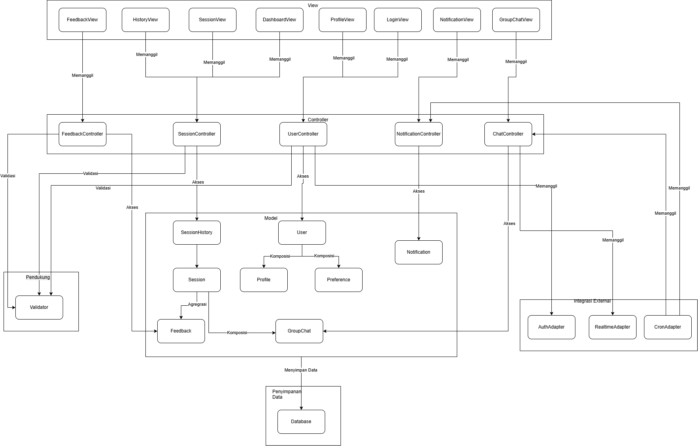

<h1>
IF2150 REKAYASA PERANGKAT LUNAK
 
TUGAS 6
 
ARSITEKTUR PERANGKAT LUNAK (APL)
</h1>
 

## PeerUP

### Untuk: Mikhael Andrian Yonatan

Dipersiapkan oleh:

| Informasi | Keterangan |
| --- | --- |
| Kelas | *K01* |
| Kelompok | *G09* |

| NIM | Nama |
|---|---|
| *13525049* | *Hugo Daniel Johansen Napitupulu* |
| *13525001* | *Matthew Allen Reynaldo* |
| *13525010* | *Fabian Amzar Susanto* |
| *13525025* | *David Christian* |
| *13525028* | *Markus Christiano Simanjutak* |

---

 
 

# BAB 1: Style/Pattern Arsitektur Acuan

## 1.1 Pattern Stye Yang Dipilih
Kelompok kami memutuskan untuk memilih Model-View-Controler (MVC) dengan rincian sebagai berikut:
1. **View:**
* Bertanggug jawab dengan hal-hal yang berkaitan dengan *user interface*, baik menampilkan informasi data atau menerima input dari pengguna.
* Pada PeerUP, komponen *View* mencakup `LoginView`, `ProfileView`, `DashboardView`, `SessionView`, `FeedbackView`, `GroupChatView`, `HistoryView`, dan `NotificationView`.

2. **Controller:**
* Bertanggung jawab sebagai jembatan antara *View* dengan *Model* yang mengeksekusi logika bisnis.
* Pada PeerUP, komponen *Controller* mencakup `UserController`, `SessionController`, `FeedbackController`, `ChatController`, dan `NotificationController`.

3. **Model:**
* Bertanggung jawab sebagai entitas struktur data dengan atribut dan logika khusus *Model* sendiri
* Pada PeerUP, komponen *Model* mencakup `User`, `Profile`, `Preference`, `Session`, `SessionHistory`, `GroupChat`, `Feedback`, dan `Notification`. Peran Mentor dan Mentee dimodelkan sebagai subkelas dari `User`, sedangkan pesan obrolan dimodelkan sebagai bagian dari `GroupChat`.

Alasan pemutusan arsitektur ini adalah:
1. Penyesuaian dengan pemodelan kelas pada SKPL dengan BCE design pattern.
2. MVC memisahkan logika antarmuka dengan logika pemrosesan sehingga perubahan pada komponen pada suatu domain tidak mengaruhi komponen domain lain.

<i>Gambar 1. Contoh Arsitektur MVC</i>

## 1.3 Penerapan Pattern MVC pada Perangkat Lunak PeerUP

<i>Gambar 2. Arsitektur MVC pada PeerUP</i>

## 1.4 Lingkungan Operasi Perangkat Lunak

| Komponen | Spesifikasi |
| :--- | :--- |
| *Client* | *Web browser modern seperti Google Chrome, Mozilla Firefox, Microsoft Edge, atau Safari yang mendukung JavaScript dan koneksi WebSocket.* |
| *Frontend* | *Next.js dengan TypeScript dan Tailwind CSS.* |
| *Backend* | *Next.js Server-Side menggunakan Server Actions / API Routes yang terintegrasi dengan Supabase Client SDK.* |
| *DBMS* | *PostgreSQL yang dikelola melalui layanan Supabase.* |
| *Server & Hosting* | *Lingkungan lokal (Node.js) untuk pengembangan/pengujian serta Vercel sebagai layanan cloud hosting aplikasi Next.js jika diperlukan* |
| *Authentication* | *Supabase Auth untuk registrasi dan autentikasi pengguna serta pengelolaan password secara aman. Validasi domain email institusi universitas dilakukan pada sisi aplikasi.* |
| *Real-time Communication* | *Supabase Realtime berbasis WebSocket untuk mendukung komunikasi group chat sementara secara real-time.* |
| *Scheduled Task* | *Supabase Cron untuk menjalankan pemeriksaan jadwal sesi, memproses pengingat sesi, dan melakukan pembersihan data group chat yang telah melewati batas waktu penyimpanan.* |
| *OS* | *Cross-platform, yaitu Windows, Linux, macOS, Android, dan iOS selama perangkat memiliki web browser modern dan koneksi internet aktif.* |
| *Deployment* | *Aplikasi di-deploy melalui local (dapat di-deploy dari vercel jika diperlukan), sedangkan basis data, autentikasi, komunikasi real-time, dan scheduled task dikelola melalui Supabase.* |

## 1.5 Kaitan Teknologi Lingkungan Operasi dengan MVC
1. **Frontend (Next.js client components & Tailwind CSS):**
   Komponen antarmuka yang berjalan di sisi *Client* (*web browser*) dan mengimplementasikan seluruh komponen *View*, yaitu `LoginView`, `ProfileView`, `DashboardView`, `SessionView`, `FeedbackView`, `GroupChatView`, `HistoryView`, dan `NotificationView`. Frontend menangani tampilan visual, pengisian formulir, dan penangkapan aksi input pengguna.
2. **Backend (Next.js Server Actions & API Routes):**
   Server Actions dan API Routes pada Next.js bertindak sebagai *Controller* (`UserController`, `SessionController`, `FeedbackController`, `ChatController`, dan `NotificationController`). Logika bisnis dieksekusi di sisi server untuk menangani pemeriksaan tabrakan jadwal, *matchmaking* rekomendasi sesi, validasi batas peserta 1–20 orang, dan verifikasi email institusi sebelum data diteruskan ke basis data.
3. **DBMS (Supabase PostgreSQL):**
   Layanan PostgreSQL pada Supabase menjadi tempat penyimpanan persisten untuk seluruh entitas *Model* (`User`, `Profile`, `Preference`, `Session`, `SessionHistory`, `GroupChat`, `Feedback`, dan `Notification`) melalui komponen `Database`. Aturan integritas relasional dan struktur tabel mewakili keadaan (*state*) dari data *Model*.
4. **Integrasi Eksternal:**
   * **Supabase Auth:** Terhubung dengan `UserController` melalui `AuthAdapter` untuk registrasi, *login*, serta validasi token dan sesi pengguna.
   * **Supabase Realtime:** Terhubung dengan `ChatController` melalui `RealtimeAdapter` via WebSocket, sehingga pesan di `GroupChatView` tampil secara instan.
   * **Supabase Cron:** Terhubung melalui `CronAdapter`. Menonaktifkan `GroupChat` yang melewati batas simpan 48 jam dan memicu `NotificationController` untuk membuat `Notification` pengingat 15 menit sebelum sesi dimulai.
   * **Vercel:** Berperan sebagai infrastruktur pengoperasian (*hosting platform*) untuk mendistribusikan aplikasi Next.js.

---

# BAB 2: Identifikasi Komponen / Modul / Subsistem

Tabel 2.1. Identifikasi Komponen/Modul/Subsistem

| Nama Komponen/Modul/Subsistem | Jenis | Penjelasan |
| :--- | :--- | :--- |
| LoginView | View | Menampilkan formulir registrasi dan login, lalu meneruskan input ke UserController (UC01). |
| ProfileView | View | Menampilkan profil pengguna (milik sendiri atau orang lain) serta formulir edit tag materi, ketersediaan waktu, dan preferensi format sesi, lalu meneruskan aksi ke UserController (UC02, UC15). |
| DashboardView | View | Menampilkan Beranda berisi sesi aktif terdekat dan rekomendasi matchmaking, serta halaman Cari Sesi; meneruskan permintaan bergabung ke SessionController (UC04, UC14). |
| SessionView | View | Menampilkan detail sesi sesuai peran: tampilan Host (buat, edit, hapus, lihat feedback) dan tampilan Participant (gabung, batalkan), beserta tombol konfirmasi keterlaksanaan. Meneruskan aksi ke SessionController dan FeedbackController (UC03, UC04, UC05, UC10, UC11, UC12, UC13). |
| FeedbackView | View | Menampilkan formulir rating dan ulasan setelah sesi selesai beserta opsi Skip, lalu meneruskannya ke FeedbackController (UC07). |
| GroupChatView | View | Menampilkan kotak pesan dan riwayat obrolan grup sesi, lalu meneruskan pesan baru ke ChatController (UC08). |
| HistoryView | View | Menampilkan daftar riwayat sesi berstatus Selesai, Tidak Terlaksana, atau Dibatalkan, serta pesan "Belum ada sesi" jika kosong (UC06). |
| NotificationView | View | Menampilkan notifikasi pop-up pengingat sesi dan mengarahkan pengguna ke detail sesi saat ditekan (UC09). |
| UserController | Controller | Memproses registrasi, login, pembaruan profil dan preferensi, serta pengambilan data profil. Memakai Validator dan AuthAdapter. |
| SessionController | Controller | Memproses pembuatan, pengeditan, dan penghapusan sesi; pengecekan tabrakan jadwal dan kapasitas; matchmaking rekomendasi; pendaftaran dan pembatalan keikutsertaan; konfirmasi keterlaksanaan; serta pengambilan sesi terdekat dan riwayat. |
| FeedbackController | Controller | Memvalidasi dan menyimpan feedback, serta mengambil daftar feedback per sesi untuk Mentor. |
| ChatController | Controller | Memproses pengiriman pesan grup sesi, memastikan pengirim adalah peserta sesi dan grup masih aktif, serta membuat dan menonaktifkan GroupChat bersama RealtimeAdapter. |
| NotificationController | Controller | Membuat Notification pengingat 15 menit sebelum sesi dan meneruskannya ke NotificationView. Dipicu oleh CronAdapter. |
| User | Model | Merepresentasikan akun pengguna beserta subkelas Mentor dan Mentee dan hak masing-masing, serta metode untuk mengakses dan mengubah data akun. |
| Profile | Model | Merepresentasikan data identitas pengguna (nama, universitas, program studi, bio) serta metode untuk mengakses dan mengubahnya. |
| Preference | Model | Menyimpan tag materi, ketersediaan waktu, dan preferensi format sesi pengguna sebagai dasar matchmaking. |
| Session | Model | Merepresentasikan sesi belajar (topik, jadwal, format, kapasitas, daftar peserta, status) serta metode untuk mengakses dan mengubahnya. |
| SessionHistory | Model | Menyimpan arsip sesi milik pengguna yang dikelompokkan menurut status. |
| GroupChat | Model | Merepresentasikan ruang obrolan sementara beserta kumpulan pesan di dalamnya (ChatMessage). |
| Feedback | Model | Merepresentasikan rating dan ulasan yang diberikan pengguna terhadap sebuah sesi. |
| Notification | Model | Merepresentasikan pesan pengingat beserta isi, waktu, dan status terbaca. |
| Validator | Pendukung | Memvalidasi input sebelum diproses controller: domain email universitas, kelengkapan preferensi, kapasitas sesi 1–20 peserta, tabrakan jadwal, dan kelengkapan feedback. |
| AuthAdapter | Integrasi Eksternal | Menghubungkan UserController dengan Supabase Auth untuk registrasi, login, dan hashing kata sandi. |
| RealtimeAdapter | Integrasi Eksternal | Menghubungkan ChatController dengan Supabase Realtime (WebSocket) untuk menyalurkan pesan secara real-time. |
| CronAdapter | Integrasi Eksternal | Menerima pemicu terjadwal dari Supabase Cron, lalu meneruskannya ke NotificationController (pengingat 15 menit) dan ChatController (penonaktifan chat 48 jam setelah sesi berakhir). |
| Database | Penyimpanan Data | Menyimpan seluruh data Model secara persisten pada PostgreSQL yang dikelola Supabase. |

---

# BAB 3: Model Arsitektur Perangkat Lunak

Model arsitektur yang dipilih untuk PeerUP adalah Logical View. View ini menggambarkan pembagian tanggung jawab antarkomponen secara logis, yaitu komponen mana yang memanggil, mengakses, dan memvalidasi komponen lain, tanpa memperhatikan letak penempatannya secara fisik. Pembagian tersebut selaras dengan pattern MVC yang dipilih pada BAB 1, sehingga lapisan View, Controller, dan Model terlihat jelas. Logical View juga cocok untuk PeerUP karena seluruh 26 komponen pada Tabel 2.1 dapat ditampilkan sekaligus dalam satu diagram, termasuk adapter yang menghubungkan aplikasi dengan layanan Supabase.

## 3.1 Logical View

<i>Gambar 3. Logical View PeerUP</i>

# Referensi

- Sommerville, I. (2016). *Software Engineering* (10th ed.). Pearson. Chapter 6: *Architectural Design*: [https://software-engineering-book.com/slides/](https://software-engineering-book.com/slides/)
- Diagram arsitektur: [https://www.drawio.com/](https://www.drawio.com/), [https://staruml.io/](https://staruml.io/)
