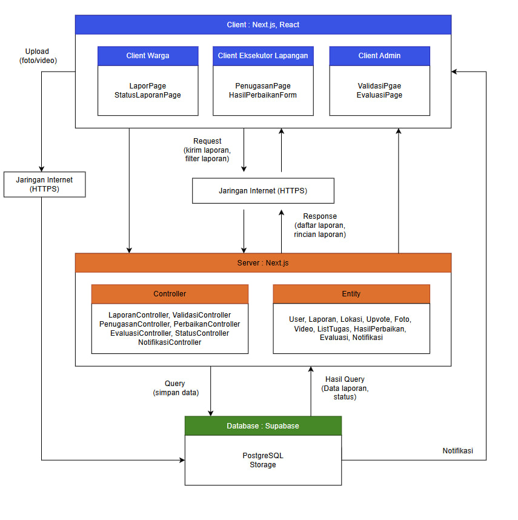
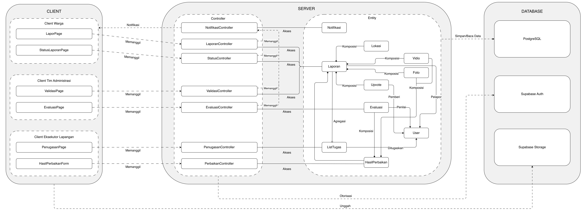

<h1>
IF2150 REKAYASA PERANGKAT LUNAK
 
TUGAS 6
 
ARSITEKTUR PERANGKAT LUNAK (APL)
</h1>
 

## *LaporKota*

### Untuk: *Jordhy*

Dipersiapkan oleh:

| Informasi | Keterangan |
| --- | --- |
| Kelas | *K - 03* |
| Kelompok | *G07* |

| NIM | Nama |
| --- | --- |
| *13525051* | *Rafi Pradipta Andira Sulistyo* |
| *13525105* | *Pasaribu Fritz T.A.M.* |
| *13525075* | *Bagas Anugrah Putra* |
| *13525099* | *Gede Pranajayanta Suputra* |
| *13525015* | *Muhammad Atallah Ramadhan* |

---

 
 

# BAB 1: Style/Pattern Arsitektur Acuan

LaporKota menggunakan pola arsitektur *client-server*. Pemilihan pola arsitektur *client-server* didasarkan pada karakteristik LaporKota yang telah ditetapkan pada dokumen SKPL sebelumnya. 

<i>Gambar 1. Arsitektur client-server</i>

## Style Arsitektur yang Dipilih

Pada pola *client-server*, fungsionalitas sistem disusun sebagai sekumpulan layanan yang disediakan oleh *server*, sedangkan *client* mengakses layanan tersebut melalui jaringan. Pola ini terdiri atas tiga bagian sebagai berikut: 

1. ***Client*** adalah antarmuka yang digunakan oleh pengguna. *Client* bertugas menampilkan data, menerima masukan pengguna, memanfaatkan fitur perangkat seperti kamera dan GPS, serta meneruskan permintaan ke *server*. *Client* tidak menyimpan data laporan secara permanen dan tidak menjalankan aturan bisnis. LaporKota memiliki tiga jenis *client* sesuai dengan aktornya, yaitu *client* Warga, *client* Eksekutor Lapangan, dan *client* Tim Administrasi.
2. ***Server*** menyediakan layanan yang dipakai bersama oleh seluruh *client*. *Server* menjalankan *logic* aplikasi melalui kelas-kelas *controller*, misalnya validasi berkas, pengecekan laporan duplikat, peralihan status laporan, dan pengiriman notifikasi. *Server* juga memuat kelas-kelas *entity* yang merepresentasikan data yang diolah oleh *controller*, seperti laporan, pengguna, dan hasil perbaikan.
3. ***Database*** menyimpan seluruh data *entity* serta berkas foto dan video secara terpusat dan persisten. Data laporan dicatat ke *database* melalui *server*, sedangkan berkas foto dan video diunggah langsung dari *client* ke penyimpanan berkas karena batas ukuran *request* pada *server* (batasan vercel). Dengan penyimpanan terpusat ini, seluruh *client* selalu memperoleh data yangg sama dan *updated*.
4. **Jaringan** menghubungkan *client* dengan *server* melalui koneksi internet dengan protokol HTTPS.

## Alasan Pemilihan

Pola *client-server* dipilih karena LaporKota memiliki tiga aktor dengan perangkat dan kebutuhan antarmuka yang berbeda, tetapi seluruhnya mengolah data laporan yang sama. Warga dan Eksekutor Lapangan membutuhkan *client* yang dapat mengakses kamera dan GPS perangkat, sedangkan Tim Administrasi membutuhkan *client* untuk mengelola antrean laporan. Karena satu laporan berpindah tangan dari Warga ke Tim Administrasi, Eksekutor Lapangan, lalu kembali ke Tim Administrasi untuk diverifikasi ulang, setiap aktor harus melihat status laporan yang sama dan mutakhir sehingga data perlu dikelola oleh satu *server* dan disimpan pada sarana yang terpusat di *database*. Selain itu, beberapa kebutuhan fungsional hanya dapat dijalankan di *server* karena membutuhkan akses ke seluruh data laporan, yaitu pemeriksaan duplikasi dalam radius 20 meter (KF05, KF06) dan perhitungan ulang urutan prioritas (KF13), sedangkan penguncian koordinat GPS (KF01) dijalankan di *client*. Pengumpulan layanan di *server* juga mendukung kebutuhan nonfungsional, yaitu setiap laporan memiliki tepat satu ID tiket unik karena ID diterbitkan secara terpusat (KNF06), dan hak akses antrean verifikasi dapat dibatasi hanya untuk Tim Administrasi (KNF07).

Isi bab ini dengan hal-hal berikut:
1. **Style/pattern yang dipilih** 
2. **Alasan pemilihan** berdasarkan karakteristik P/L Anda, misalnya jenis pengguna, alur proses bisnis, serta KF dan KNF pada dokumen SKPL.
3. **Gambar style/pattern yang diterapkan pada P/L Anda.** Jangan hanya menyalin Gambar 1. Isi setiap bagian pattern dengan komponen milik P/L Anda. Misalnya, kotak *Controller* berisi daftar *controller* yang ada di aplikasi dan kotak *Model* berisi daftar *model* yang ada di aplikasi.

Selain *style/pattern*, tuliskan juga lingkungan operasi P/L. Tabel berikut **disalin dari subbab 2.5 *Lingkungan Operasi Perangkat Lunak* pada dokumen SKPL** tanpa perubahan. Setelah tabel, jelaskan kaitan teknologi yang dipakai dengan *style/pattern* yang dipilih. Contohnya, Django (Python) secara bawaan mengikuti pola MVT (*Model-View-Template*), yaitu varian dari MVC.

Tabel 1.1. Lingkungan Operasi Perangkat Lunak

| Komponen | Spesifikasi |
| :--- | :--- |
| *Server/Hosting* | Vercel dengan *runtime* Node.js 24 (LTS) |
| *Framework* | Next.js 16.3 dan React 19.3 |
| *Backend-as-a-Service* | Supabase (Auth, Database, Storage, Realtime) |
| *DBMS* | PostgreSQL 17 yang dikelola oleh Supabase |
| *Penyimpanan Berkas* | Supabase Storage |
| *Layanan Peta* | *Tile* OpenStreetMap yang ditampilkan dengan pustaka Leaflet |
| *Client* | *Web browser* modern versi terbaru (Google Chrome, Mozilla Firefox, Safari, Microsoft Edge) yang mendukung JavaScript, WebSocket, dan *Geolocation API* |
| *Perangkat Klien* | Warga dan Eksekutor Lapangan: *smartphone* atau laptop yang memiliki kamera dan layanan lokasi (GPS). Tim Administrasi: komputer atau laptop |
| *OS* | *Cross platform* melalui *browser* (Android, iOS, Windows, macOS, Linux, bisa banyak OS asal terhubung dengan jaringan internet) |
| *Jaringan* | Koneksi internet dengan protokol HTTPS |

Pada bagian ini, tentukan *architectural style* atau *pattern* yang menjadi acuan untuk aplikasi yang Anda kembangkan. Misalnya *layered architecture*, *client-server*, *repository*, *pipe and filter architecture*, atau MVC (*Model-View-Controller*).

<b><i>Catatan</i></b>: <i>Style/pattern yang dipilih di bab ini menjadi acuan untuk BAB 2 (pengelompokan komponen) dan BAB 3 (model arsitektur). Contoh pada dokumen ini memakai MVC secara konsisten dari BAB 1 sampai BAB 3. Kelompok boleh memakai pattern lain selama alasannya dijelaskan dan BAB 2 serta BAB 3 disesuaikan. Tabel 1.1 harus sama persis dengan subbab 2.5 dokumen SKPL; jangan menambah atau mengubah isinya karena SKPL sudah final.</i>

---

# BAB 2: Identifikasi Komponen / Modul / Subsistem

Pada bagian ini, lakukan identifikasi terhadap komponen, modul, atau subsistem yang menyusun aplikasi berdasarkan *pattern* arsitektur yang telah ditetapkan sebelumnya. Setiap komponen memiliki tanggung jawab tertentu dalam mendukung fungsionalitas sistem.

Setiap komponen memiliki tanggung jawab tertentu dalam mendukung fungsionalitas sistem secara keseluruhan. Komponen dapat dikelompokkan berdasarkan lapisan arsitektur (misalnya *Model*, *View*, dan *Controller* pada pattern MVC), atau berdasarkan fungsi atau peran komponen di dalam sistem (misalnya modul autentikasi, manajemen data, dan integrasi eksternal).

Tabel 2.1. Identifikasi Komponen/Modul/Subsistem

| Nama Komponen/Modul/Subsistem | Jenis                 | Penjelasan                                                                                                                                                                                                |
| :---------------------------- | :-------------------- | :-------------------------------------------------------------------------------------------------------------------------------------------------------------------------------------------------------- |
| LaporPage                     | Client                | Menampilkan formulir pelaporan Warga, mengunci koordinat GPS, menandai lokasi di OpenStreetMap, mengunggah foto atau video, dan mengirim data ke LaporanController                                        |
| ValidasiPage                  | Client                | Menampilkan antrean laporan Diterima bagi Admin, menyediakan filter kategori dan waktu, menampilkan rincian tiket, serta mengirim aksi persetujuan atau penolakan                                         |
| PenugasanPage                 | Client                | Menampilkan daftar tugas Dikerjakan bagi Eksekutor sesuai prioritas, menyediakan filter kategori dan lokasi, tautan rute Google Maps, serta akses HasilPerbaikanForm                                      |
| HasilPerbaikanForm            | Client                | Menampilkan formulir bukti penanganan bagi Eksekutor untuk mengisi catatan teknis perbaikan, mengunggah berkas foto atau video bukti, dan mengirim data hasil kerja                                       |
| EvaluasiPage                  | Client                | Menampilkan antarmuka evaluasi bagi Admin untuk membandingkan bukti kerusakan awal dan hasil perbaikan eksekutor, serta menetapkan status Berhasil atau Dikerjakan                                        |
| StatusLaporanPage             | Client                | Menampilkan linimasa riwayat laporan pribadi warga, memvisualisasikan peta sebaran laporan publik secara anonim, dan memfasilitasi aksi pemberian dukungan upvote                                         |
| LaporanController             | Server                | Memvalidasi berkas, memeriksa lokasi, mengecek duplikasi dalam radius 20 meter, mengalihkan duplikat menjadi upvote, menerbitkan ID tiket, dan menyimpan data laporan                                     |
| ValidasiController            | Server                | Menyusun dan menyaring antrean laporan Diterima, menyimpan penolakan beserta alasan, mengubah status menjadi Dikerjakan, dan menghitung skor prioritas penanganan                                         |
| PenugasanController           | Server                | Mengambil laporan Dikerjakan dari basis data untuk menyusun ListTugas, serta mengoordinasikan fitur pengurutan prioritas dan penyaringan kategori atau lokasi tugas                                       |
| PerbaikanController           | Server                | Memvalidasi kelengkapan catatan kerja dan berkas bukti perbaikan, menyimpan data HasilPerbaikan ke basis data, serta menandai laporan siap dievaluasi oleh Admin                                          | 
| EvaluasiController            | Server                | Mencatat Evaluasi admin, memperbarui status tiket menjadi Berhasil atau mengembalikan ke status Dikerjakan untuk eksekusi ulang, serta memicu pengiriman notifikasi                                       |
| StatusController              | Server                | Mengambil linimasa status tiket warga, menyajikan data laporan publik secara anonim, memproses upvote, dan memicu kalkulasi ulang prioritas penanganan otomatis                                           |
| NotifikasiController          | Server                | Menyusun pesan perubahan status tiket laporan, mengirimkan notifikasi waktu nyata ke akun pelapor melalui Supabase Realtime, dan memperbarui status baca pesan                                            |
| User                          | Server                | Merepresentasikan data akun pengguna (idUser, nama, email, role) serta menyediakan metode pengecekan dan validasi hak akses peran Warga, Admin, dan Eksekutor                                             |
| Laporan                       | Server                | Merepresentasikan tiket laporan kerusakan publik yang menyimpan atribut tiket, status, skor prioritas, dan alasan penolakan, serta mengelola mutasi statusnya                                             |
| Lokasi                        | Server                | Merepresentasikan titik koordinat latitude dan longitude lokasi kerusakan, serta menyediakan metode hitungJarak untuk kalkulasi radius deteksi duplikasi laporan                                          |
| Foto                          | Server                | Merepresentasikan berkas gambar bukti kerusakan dan hasil perbaikan dengan format JPG atau PNG maksimal 10 MB, serta memvalidasi keabsahan spesifikasi berkas                                             |
| Video                         | Server                | Merepresentasikan berkas video bukti kerusakan dan hasil perbaikan dengan format MP4, MOV, atau MKV maksimal 10 MB, serta memvalidasi keabsahan spesifikasi berkas                                        |
| Upvote                        | Server                | Merepresentasikan pencatatan dukungan warga pada laporan aktif melalui idUpvote dan waktuUpvote guna meningkatkan tingkat urgensi dan prioritas penanganan laporan                                        |
| ListTugas                     | Server                | Merepresentasikan koleksi tugas aktif Eksekutor yang memuat daftar laporan yang harus ditangani beserta metode pengurutan prioritas dan penyaringan kategori tugas                                        | 
| HasilPerbaikan                | Server                | Merepresentasikan dokumentasi penanganan fisik fasilitas yang menyimpan idHasil, catatan teknis, waktu unggah, identitas eksekutor, dan relasi berkas media bukti                                         |
| Evaluasi                      | Server                | Merepresentasikan hasil verifikasi ulang Admin atas pekerjaan lapangan yang memuat idEvaluasi, keputusan persetujuan, uraian evaluasi, dan waktu evaluasi kerja                                           |
| Notifikasi                    | Server                | Merepresentasikan pesan perubahan status laporan yang menyimpan idNotifikasi, isi pesan, waktu kirim, dan status baca, serta metode pembuatan pesan notifikasi                                            |
| Supabase Database             | Penyimpanan Data      | Menyimpan seluruh data entitas model secara terpusat dan persisten pada PostgreSQL 17, menjaga integritas relasional data, dan menjamin keunikan ID tiket laporan                                         |
| Supabase Storage              | Penyimpanan Data      | Menyimpan seluruh berkas foto dan video bukti laporan serta bukti perbaikan fisik yang diunggah langsung dari klien guna mengatasi batas muatan request serverless                                        |
| Supabase Auth                 | Integrasi Eksternal   | Mengelola autentikasi akun pengguna dan menerapkan otorisasi hak akses berbasis peran untuk Warga, Tim Administrasi, dan Eksekutor Lapangan pada seluruh use case                                         | 
| Supabase Realtime             | Integrasi Eksternal   | Menyalurkan pembaruan status laporan secara seketika melalui WebSocket ke antarmuka pengguna tanpa membebani mekanisme polling berkala pada peramban klien                                                |
| OpenStreetMap dan Leaflet     | Integrasi Eksternal   | Menyediakan visualisasi peta digital interaktif menggunakan tile OpenStreetMap via Leaflet untuk penandaan lokasi pelaporan, dasbor admin, dan peta publik                                                |
| Browser Geolocation API       | Integrasi Eksternal   | Membaca sensor lokasi pada perangkat klien untuk mendeteksi dan mengunci koordinat latitude dan longitude secara otomatis saat formulir pelaporan dibuka warga                                            |
| Google Maps Navigation        | Integrasi Eksternal   | Menerima titik koordinat lokasi kerusakan melalui tautan dari antarmuka penugasan eksekutor untuk memandu rute perjalanan fisik petugas menuju lokasi fasilitas                                           |
| Anti-Bot Verifier             | Integrasi Eksternal   | Modul verifikasi keamanan pihak ketiga untuk memvalidasi bahwa pengiriman formulir pelaporan dilakukan oleh manusia guna mencegah spam dan otomatisasi bot                                                |

Ketentuan pengisian Tabel 2.1:
1. Kolom **Jenis** mengikuti pengelompokan pada *style/pattern* di BAB 1. Untuk MVC, jenisnya adalah *Model*, *View*, dan *Controller*. Jenis lain boleh ditambahkan, misalnya *Pendukung* untuk komponen bantu yang dipakai bersama, atau *Integrasi Eksternal* untuk penghubung ke sistem di luar P/L yang disebutkan pada subbab 2.2 dokumen SKPL. Kolom ini juga boleh diisi dengan *Subsistem*, *Modul*, atau *Komponen* apabila komponen dikelompokkan berdasarkan fungsinya. Tuliskan subsistem terlebih dahulu, lalu komponen penyusunnya di baris-baris berikutnya.
2. Komponen **tidak sama dengan** kelas. Satu komponen boleh mewadahi beberapa kelas dari diagram kelas pada dokumen SKPL. Pastikan seluruh kelas tercakup oleh setidaknya satu komponen.
3. Pastikan seluruh use case pada dokumen SKPL dapat dijalankan oleh komponen-komponen yang didaftarkan di tabel ini. Jangan menambahkan komponen untuk fitur yang tidak ada di SKPL.

<b><i>Catatan</i></b>: <i>Nama komponen pada Tabel 2.1 harus dipakai sama persis pada gambar di BAB 1 dan setiap view di BAB 3. Jika saat membuat view ternyata dibutuhkan komponen baru, tambahkan komponen tersebut ke Tabel 2.1 terlebih dahulu.</i>

---

# BAB 3: Model Arsitektur Perangkat Lunak

*Architectural View* adalah bagaimana cara kita melihat/mendeskripsikan arsitektur sebuah sistem dari sudut pandang tertentu. Dalam perancangan arsitektur aplikasi, dibutuhkan *Architectural View* yang dapat mempermudah pemahaman dari proses aplikasi yang akan dikembangkan. Tujuan dari *Architectural View* adalah menjadi bahan komunikasi, pemisahan masalah, mempermudah analisis, dan pemandu saat eksekusi pengembangan sistem tersebut.

Buatlah model arsitektur dari aplikasi yang akan dirancang dalam bentuk *view*. Model arsitektur ini berfungsi untuk memperlihatkan bagaimana setiap komponen, modul, dan subsistem saling berinteraksi serta berkolaborasi dalam menjalankan fungsi utama sistem secara keseluruhan. Anda dapat membuat satu atau lebih *view* tergantung kebutuhan dalam bentuk gambar. Pilihlah notasi yang sesuai. Contoh *view* yang dapat digunakan antara lain ***Logical View***, ***Process View***, ***Development View***, serta ***Physical View***.

Ketentuan pengisian BAB 3:
1. Setiap view menggambarkan **keseluruhan sistem**, bukan satu use case atau satu fitur saja.
2. Buat **minimal satu view**. Setiap view dituliskan dalam subbab tersendiri (3.1, 3.2, dan seterusnya). Tidak perlu membuat keempat view, pilih yang paling membantu menjelaskan P/L Anda, lalu jelaskan alasan pemilihannya.
3. Setiap view harus **konsisten dengan BAB 2**. Seluruh komponen pada Tabel 2.1 harus muncul dengan nama yang sama, dan tidak boleh ada komponen pada view yang tidak terdaftar di Tabel 2.1.
4. Setiap view harus **mencerminkan style/pattern pada BAB 1**. Misalnya, jika memilih MVC, pembagian *Model*, *View*, dan *Controller* harus terlihat jelas pada diagram.
5. Jika membuat lebih dari satu view, setiap view harus menggambarkan sistem yang sama dari sudut pandang berbeda. View tambahan melengkapi view pertama, bukan mengulanginya.
6. Beri label pada setiap garis atau panah yang menghubungkan komponen agar hubungan antarkomponen dapat dipahami tanpa penjelasan tambahan.
7. Jika membuat *Physical View*, gambarkan lingkungan operasi pada Tabel 1.1.

## 3.1 Logical View

<i>Gambar 2. Logical View pada LaporKota</i>

Gambar 2 menunjukkan model arsitektur Client-Server dari sistem LaporKota dalam perspektif Logical View dengan menggunakan Block Diagram. Seluruh komponen pada Tabel 2.1 digambarkan dan dikelompokkan sesuai pola Client-Server (*Client*, *Server*, *Database*). Setiap garis antar komponen diberi label yang merincikan bentuk hubungan pada masing-masing komponen.

Model Logical View ini dipilih karena *LaporKota* memiliki tiga peran dengan hak akses yang berbeda (berdasarkan SKPL 2.3) dan enam use case yang masing-masing dilayani halaman dan controller sendiri, sehingga pembagian tanggung jawab antarkomponen perlu terlihat lebih jelas dalam satu gambar. Selain itu, beberapa KNF hanya dapat dibuktikan lewat letak tanggung jawab komponen: seperti pembatasan akses (KNF07, KNF12), serta tiket unik dan pemeriksaan duplikasi laporan (KNF05, KNF06).

---

## 3.X XXX View

Tuliskan secara singkat mengenai model arsitektur perangkat lunak yang Anda pilih dan sertakan alasan mengapa model arsitektur tersebut cocok untuk aplikasi Anda.

<i>Gambar 2. Contoh Logical View pada P/L E-Commerce</i>

Gambar 2 adalah contoh *Logical View* dalam bentuk *block diagram*. Seluruh komponen pada Tabel 2.1 digambarkan dan dikelompokkan sesuai pola MVC (*View*, *Controller*, *Model*), ditambah komponen pendukung dan basis data. Sistem di luar P/L, seperti *Payment Gateway (dummy)*, digambarkan dengan garis putus-putus dan tidak perlu dimasukkan ke Tabel 2.1. Setiap garis diberi label: "Memanggil" untuk *View* yang memanggil *Controller*, "akses" untuk *Controller* yang mengakses *Model*, serta agregasi dan komposisi untuk hubungan antar-*Model*.

<b><i>Catatan</i></b>: <i>Ganti XXX dengan nama view yang dibuat, misalnya Logical View. Gambar 2 hanya contoh untuk P/L e-commerce, ganti dengan view milik kelompok Anda yang memuat seluruh komponen pada Tabel 2.1. Jenis view dan notasinya boleh berbeda dari contoh. Jika membuat view tambahan, lanjutkan pola 3.x ini (3.2, 3.3, dan seterusnya).</i>

---

# Referensi

- Sommerville, I. (2016). *Software Engineering* (10th ed.). Pearson. Chapter 6: *Architectural Design*: [https://software-engineering-book.com/slides/](https://software-engineering-book.com/slides/)
- Diagram arsitektur: [https://www.drawio.com/](https://www.drawio.com/), [https://staruml.io/](https://staruml.io/)
