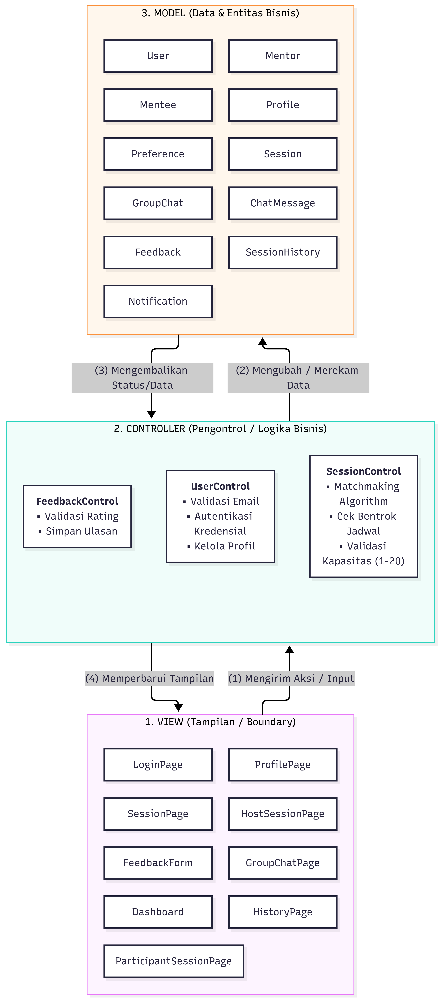

<h1>
IF2150 REKAYASA PERANGKAT LUNAK
 
TUGAS 6
 
ARSITEKTUR PERANGKAT LUNAK (APL)
</h1>
 

## PeerUP

### Untuk: Mikhael Andrian Yonatan

Dipersiapkan oleh:

| Informasi | Keterangan |
| --- | --- |
| Kelas | *K01* |
| Kelompok | *G09* |

| NIM | Nama |
|---|---|
| *13525049* | *Hugo Daniel Johansen Napitupulu* |
| *13525001* | *Matthew Allen Reynaldo* |
| *13525010* | *Fabian Amzar Susanto* |
| *13525025* | *David Christian* |
| *13525028* | *Markus Christiano Simanjutak* |

---

 
 

# BAB 1: Style/Pattern Arsitektur Acuan

## 1.1 Pattern Stye Yang Dipilih
Kelompok kami memutuskan untuk memilih Model-View-Controler (MVC) dengan rincian sebagai berikut:
1. **View:**
* Bertanggug jawab dengan hal-hal yang berkaitan dengan *user interface*, baik menampilkan informasi data atau menerima input dari pengguna.
* Pada PeerUP, komponen *View* mencakup `LoginPage`, `ProfilePage`, `SessionPage`, `HostSessionPage`, `ParticipantSessionPage`, `FeedbackForm`, `GroupChatPage`, `Dashboard`, dan `HistoryPage`.

2. **Controller:**
* Bertanggung jawab sebagai jembatan antara *View* dengan *Model* yang mengeksekusi logika bisnis.
* Pada PeerUP, komponen *Controller* mencakup komponen seperti `UserControl`, `SessionControl`, dan `FeedbackControl`.

3. **Model:**
* Bertanggung jawab sebagai entitas struktur data dengan atribut dan logika khusus *Model* sendiri
* Pada PeerUP, komponen *Model* mencakup komponen `User`, `Mentor`, `Mentee`, `Session`, `GroupChat`, `Feedback`, `SessionHistory`, `ChatMessage`, `Preference`, `Profile`, dan `Notification`.

Alasan pemutusan arsitektur ini adalah:
1. Penyesuaian dengan pemodelan kelas pada SKPL dengan BCE design pattern.
2. MVC memisahkan logika antarmuka dengan logika pemrosesan sehingga perubahan pada komponen pada suatu domain tidak mengaruhi komponen domain lain.

<i>Gambar 1. Contoh Arsitektur MVC</i>

## 1.3 Penerapan Pattern MVC pada Perangkat Lunak PeerUP

<i>Gambar 2. Arsitektur MVC pada PeerUP</i>

## 1.4 Lingkungan Operasi Perangkat Lunak

| Komponen | Spesifikasi |
| :--- | :--- |
| *Client* | *Web browser modern seperti Google Chrome, Mozilla Firefox, Microsoft Edge, atau Safari yang mendukung JavaScript dan koneksi WebSocket.* |
| *Frontend* | *Next.js dengan TypeScript dan Tailwind CSS.* |
| *Backend* | *Next.js Server-Side menggunakan Server Actions / API Routes yang terintegrasi dengan Supabase Client SDK.* |
| *DBMS* | *PostgreSQL yang dikelola melalui layanan Supabase.* |
| *Server & Hosting* | *Lingkungan lokal (Node.js) untuk pengembangan/pengujian serta Vercel sebagai layanan cloud hosting aplikasi Next.js jika diperlukan* |
| *Authentication* | *Supabase Auth untuk registrasi dan autentikasi pengguna serta pengelolaan password secara aman. Validasi domain email institusi universitas dilakukan pada sisi aplikasi.* |
| *Real-time Communication* | *Supabase Realtime berbasis WebSocket untuk mendukung komunikasi group chat sementara secara real-time.* |
| *Scheduled Task* | *Supabase Cron untuk menjalankan pemeriksaan jadwal sesi, memproses pengingat sesi, dan melakukan pembersihan data group chat yang telah melewati batas waktu penyimpanan.* |
| *OS* | *Cross-platform, yaitu Windows, Linux, macOS, Android, dan iOS selama perangkat memiliki web browser modern dan koneksi internet aktif.* |
| *Deployment* | *Aplikasi di-deploy melalui local (dapat di-deploy dari vercel jika diperlukan), sedangkan basis data, autentikasi, komunikasi real-time, dan scheduled task dikelola melalui Supabase.* |

## 1.5 Kaitan Teknologi Lingkungan Operasi dengan MVC
1. **Frontend (Next.js client components & Tailwind CSS):**
Komponen antarmuka yang berjalan di sisi Client (Web Browser) dan mengimplementasikan seluruh kelas Boundary/View. Menangani tampilan visual, pengisian formulir, dan penangkapan aksi input pengguna.

2. **Backend (Next.js Server Actions & API Route):**
Server Actions dan API Routes pada Next.js bertindak sebagai Controller. Fungsi-fungsi logika bisnis dieksekusi di sisi server untuk menangani pemeriksaan tabrakan jadwal, kalkulasi skor matchmaking, validasi batas peserta 1–20 orang, dan verifikasi email institusi sebelum data diteruskan ke basis data.

3. **DBMS (Supabase PostgreSQL):**
Layanan PostgreSQL pada Supabase menjadi tempat penyimpanan persisten untuk seluruh entitas Model (User, Session, GroupChat, Feedback, dll.). Aturan integritas relasional dan struktur tabel mewakili keadaan (state) dari data model.

4. **Integrasi Eksternal:**
* Supabase Auth: Terhubung dengan UserControl untuk memvalidasi token dan sesi login pengguna.
* Supabase Realtime: Terhubung dengan GroupChatPage dan ChatMessage via WebSocket untuk memfasilitasi pesan obrolan grup secara instan.
* Supabase Cron: Menjalankan pembersihan data GroupChat yang melewati batas simpan 48 jam dan memicu pengiriman Notification pengingat 15 menit sebelum sesi dimulai.
* Vercel: Berperan sebagai infrastruktur pengoperasian (hosting platform) untuk mendistribusikan aplikasi Next.js.

---

# BAB 2: Identifikasi Komponen / Modul / Subsistem

Pada bagian ini, lakukan identifikasi terhadap komponen, modul, atau subsistem yang menyusun aplikasi berdasarkan *pattern* arsitektur yang telah ditetapkan sebelumnya. Setiap komponen memiliki tanggung jawab tertentu dalam mendukung fungsionalitas sistem.

Setiap komponen memiliki tanggung jawab tertentu dalam mendukung fungsionalitas sistem secara keseluruhan. Komponen dapat dikelompokkan berdasarkan lapisan arsitektur (misalnya *Model*, *View*, dan *Controller* pada pattern MVC), atau berdasarkan fungsi atau peran komponen di dalam sistem (misalnya modul autentikasi, manajemen data, dan integrasi eksternal).

Tabel 2.1. Identifikasi Komponen/Modul/Subsistem

| Nama Komponen/Modul/Subsistem | Jenis                 | Penjelasan                                                                                                           |
| :---------------------------- | :-------------------- | :------------------------------------------------------------------------------------------------------------------- |
| *KatalogView*                 | *View*                | *Menampilkan daftar produk dan meneruskan aksi pelanggan (misalnya "Tambah ke Keranjang") ke KatalogController.*     |
| *KeranjangView*               | *View*                | *Menampilkan isi keranjang pelanggan beserta tombol checkout.*                                                       |
| *CheckoutView*                | *View*                | *Menampilkan ringkasan pesanan dan pilihan metode pembayaran kepada pelanggan.*                                      |
| *RiwayatPesananView*          | *View*                | *Menampilkan daftar pesanan yang pernah dibuat pelanggan beserta statusnya.*                                         |
| *KatalogController*           | *Controller*          | *Memproses permintaan daftar produk dan penambahan produk ke keranjang.*                                             |
| *KeranjangController*         | *Controller*          | *Memproses perubahan isi keranjang dan membuat pesanan baru saat checkout.*                                          |
| *PembayaranController*        | *Controller*          | *Memproses pemilihan metode pembayaran dan meneruskan permintaan otorisasi ke PaymentGatewayAdapter.*                |
| *PesananController*           | *Controller*          | *Memproses permintaan riwayat pesanan milik pelanggan.*                                                              |
| *Produk*                      | *Model*               | *Merepresentasikan data produk beserta stoknya serta metode untuk mengakses dan mengubahnya.*                        |
| *Keranjang*                   | *Model*               | *Merepresentasikan item yang dipilih pelanggan sebelum checkout serta metode untuk mengakses dan mengubahnya.*       |
| *Pesanan*                     | *Model*               | *Merepresentasikan data pesanan beserta status pembayarannya serta metode untuk mengakses dan mengubahnya.*          |
| *Pelanggan*                   | *Model*               | *Merepresentasikan data akun pelanggan serta metode untuk mengakses dan mengubahnya.*                                |
| *Validasi*                    | *Pendukung*           | *Memvalidasi input pelanggan sebelum diproses oleh controller.*                                                      |
| *PaymentGatewayAdapter*       | *Integrasi Eksternal* | *Mengirim permintaan otorisasi ke payment gateway (dummy) dan meneruskan status pembayaran ke PembayaranController.* |
| *Database*                    | *Penyimpanan Data*    | *Menyimpan seluruh data model secara persisten, baik lokal (misalnya SQLite) maupun terpusat (misalnya Supabase).*   |
| *...*                         | *...*                 | *...*                                                                                                                |

Ketentuan pengisian Tabel 2.1:
1. Kolom **Jenis** mengikuti pengelompokan pada *style/pattern* di BAB 1. Untuk MVC, jenisnya adalah *Model*, *View*, dan *Controller*. Jenis lain boleh ditambahkan, misalnya *Pendukung* untuk komponen bantu yang dipakai bersama, atau *Integrasi Eksternal* untuk penghubung ke sistem di luar P/L yang disebutkan pada subbab 2.2 dokumen SKPL. Kolom ini juga boleh diisi dengan *Subsistem*, *Modul*, atau *Komponen* apabila komponen dikelompokkan berdasarkan fungsinya. Tuliskan subsistem terlebih dahulu, lalu komponen penyusunnya di baris-baris berikutnya.
2. Komponen **tidak sama dengan** kelas. Satu komponen boleh mewadahi beberapa kelas dari diagram kelas pada dokumen SKPL. Pastikan seluruh kelas tercakup oleh setidaknya satu komponen.
3. Pastikan seluruh use case pada dokumen SKPL dapat dijalankan oleh komponen-komponen yang didaftarkan di tabel ini. Jangan menambahkan komponen untuk fitur yang tidak ada di SKPL.

<b><i>Catatan</i></b>: <i>Nama komponen pada Tabel 2.1 harus dipakai sama persis pada gambar di BAB 1 dan setiap view di BAB 3. Jika saat membuat view ternyata dibutuhkan komponen baru, tambahkan komponen tersebut ke Tabel 2.1 terlebih dahulu.</i>

---

# BAB 3: Model Arsitektur Perangkat Lunak

*Architectural View* adalah bagaimana cara kita melihat/mendeskripsikan arsitektur sebuah sistem dari sudut pandang tertentu. Dalam perancangan arsitektur aplikasi, dibutuhkan *Architectural View* yang dapat mempermudah pemahaman dari proses aplikasi yang akan dikembangkan. Tujuan dari *Architectural View* adalah menjadi bahan komunikasi, pemisahan masalah, mempermudah analisis, dan pemandu saat eksekusi pengembangan sistem tersebut.

Buatlah model arsitektur dari aplikasi yang akan dirancang dalam bentuk *view*. Model arsitektur ini berfungsi untuk memperlihatkan bagaimana setiap komponen, modul, dan subsistem saling berinteraksi serta berkolaborasi dalam menjalankan fungsi utama sistem secara keseluruhan. Anda dapat membuat satu atau lebih *view* tergantung kebutuhan dalam bentuk gambar. Pilihlah notasi yang sesuai. Contoh *view* yang dapat digunakan antara lain ***Logical View***, ***Process View***, ***Development View***, serta ***Physical View***.

Ketentuan pengisian BAB 3:
1. Setiap view menggambarkan **keseluruhan sistem**, bukan satu use case atau satu fitur saja.
2. Buat **minimal satu view**. Setiap view dituliskan dalam subbab tersendiri (3.1, 3.2, dan seterusnya). Tidak perlu membuat keempat view, pilih yang paling membantu menjelaskan P/L Anda, lalu jelaskan alasan pemilihannya.
3. Setiap view harus **konsisten dengan BAB 2**. Seluruh komponen pada Tabel 2.1 harus muncul dengan nama yang sama, dan tidak boleh ada komponen pada view yang tidak terdaftar di Tabel 2.1.
4. Setiap view harus **mencerminkan style/pattern pada BAB 1**. Misalnya, jika memilih MVC, pembagian *Model*, *View*, dan *Controller* harus terlihat jelas pada diagram.
5. Jika membuat lebih dari satu view, setiap view harus menggambarkan sistem yang sama dari sudut pandang berbeda. View tambahan melengkapi view pertama, bukan mengulanginya.
6. Beri label pada setiap garis atau panah yang menghubungkan komponen agar hubungan antarkomponen dapat dipahami tanpa penjelasan tambahan.
7. Jika membuat *Physical View*, gambarkan lingkungan operasi pada Tabel 1.1.

## 3.1 XXX View

Tuliskan secara singkat mengenai model arsitektur perangkat lunak yang Anda pilih dan sertakan alasan mengapa model arsitektur tersebut cocok untuk aplikasi Anda.

<i>Gambar 2. Contoh Logical View pada P/L E-Commerce</i>

Gambar 2 adalah contoh *Logical View* dalam bentuk *block diagram*. Seluruh komponen pada Tabel 2.1 digambarkan dan dikelompokkan sesuai pola MVC (*View*, *Controller*, *Model*), ditambah komponen pendukung dan basis data. Sistem di luar P/L, seperti *Payment Gateway (dummy)*, digambarkan dengan garis putus-putus dan tidak perlu dimasukkan ke Tabel 2.1. Setiap garis diberi label: "Memanggil" untuk *View* yang memanggil *Controller*, "akses" untuk *Controller* yang mengakses *Model*, serta agregasi dan komposisi untuk hubungan antar-*Model*.

<b><i>Catatan</i></b>: <i>Ganti XXX dengan nama view yang dibuat, misalnya Logical View. Gambar 2 hanya contoh untuk P/L e-commerce, ganti dengan view milik kelompok Anda yang memuat seluruh komponen pada Tabel 2.1. Jenis view dan notasinya boleh berbeda dari contoh. Jika membuat view tambahan, lanjutkan pola 3.x ini (3.2, 3.3, dan seterusnya).</i>

---

# Referensi

- Sommerville, I. (2016). *Software Engineering* (10th ed.). Pearson. Chapter 6: *Architectural Design*: [https://software-engineering-book.com/slides/](https://software-engineering-book.com/slides/)
- Diagram arsitektur: [https://www.drawio.com/](https://www.drawio.com/), [https://staruml.io/](https://staruml.io/)
